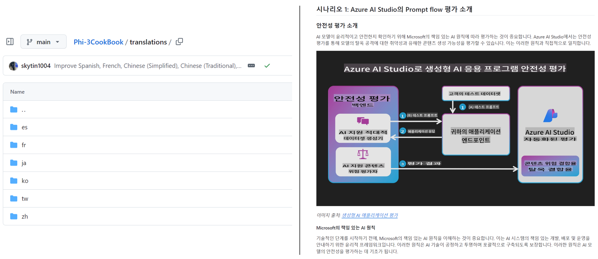
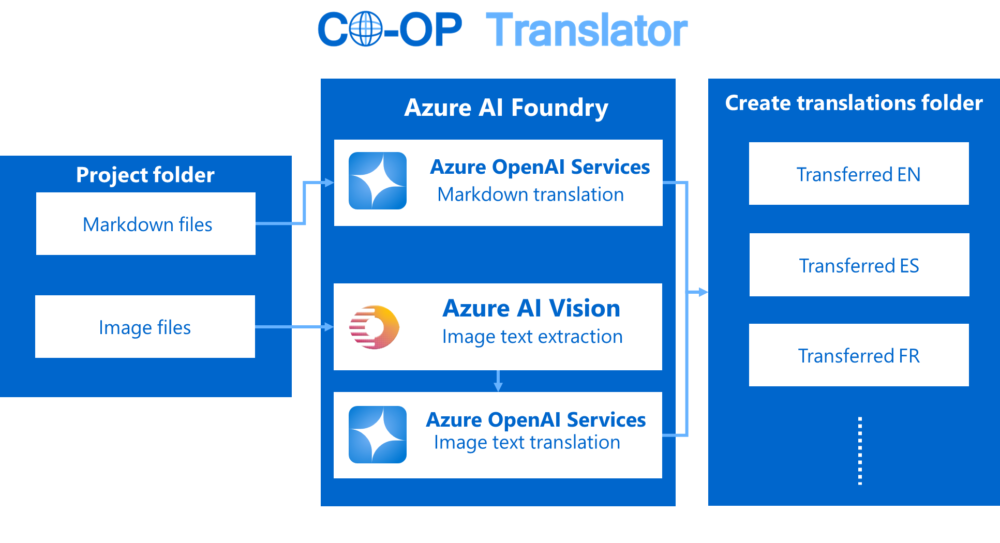

# Co-op Translator: Automate the Translation of Educational Documentation Effortlessly

_Easily automate the translation of your documentation into multiple languages to reach a global audience._

[](https://pypi.org/project/co-op-translator/)
[](https://github.com/azure/co-op-translator/blob/main/LICENSE)
[](https://pepy.tech/project/co-op-translator)
[](https://pepy.tech/project/co-op-translator)
[](https://github.com/psf/black)

[](https://GitHub.com/azure/co-op-translator/graphs/contributors/)
[](https://GitHub.com/azure/co-op-translator/issues/)
[](https://GitHub.com/azure/co-op-translator/pulls/)
[](http://makeapullrequest.com)

### Language Support Powered by Co-op Translator

[Korean](./translations/ko/README.md) | [Japanese](./translations/ja/README.md) | [Chinese (Simplified)](./translations/zh/README.md) | [Chinese (Traditional, Taiwan)](./translations/tw/README.md) | [Spanish](./translations/es/README.md) | [French](./translations/fr/README.md) | [German](./translations/de/README.md) | [Portuguese (Brazil)](./translations/br/README.md) | [Hindi](./translations/hi/README.md) | [Russian](./translations/ru/README.md) | [Turkish](./translations/tr/README.md) | [Arabic](./translations/ar/README.md) | [Indonesian](./translations/id/README.md) | [Vietnamese](./translations/vi/README.md)

[](https://GitHub.com/azure/co-op-translator/watchers/)
[](https://GitHub.com/azure/co-op-translator/network/)
[](https://GitHub.com/azure/co-op-translator/stargazers/)

[](https://discord.com/invite/ByRwuEEgH4)

[](https://codespaces.new/azure/co-op-translator)
[](https://vscode.dev/redirect?url=vscode://ms-vscode-remote.remote-containers/cloneInVolume?url=https://github.com/azure/co-op-translator)

> [!TIP]
>
> **Powerful Automation**: Now with GitHub Actions support! Automatically translate your documentation when changes are made to your repository, keeping everything up-to-date effortlessly. [Learn more](#-getting-started-with-co-op-translator).

## Supported Models and Services

| Type                  | Name                           |
|-----------------------|--------------------------------|
| Language Model        |   |
| Computer Vision       |  |

> [!NOTE]
> If a computer vision service is not available, the co-op translator will switch to [Markdown-only mode](./getting_started/markdown-only-mode.md).

## Overview: Streamline Your Educational Content Translation

Language barriers significantly hinder access to valuable educational resources and technical knowledge for learners and developers worldwide. This limits participation and slows down the pace of global innovation and learning.

**Co-op Translator** was born from the need to address the inefficient manual translation process for Microsoft's own large-scale educational series (like the "For Beginners" guides). It has evolved into an easy-to-use, powerful tool designed to break down these barriers for everyone. By providing high-quality automated translations via CLI and GitHub Actions, Co-op Translator empowers educators, students, researchers, and developers globally to share and access knowledge without language constraints.

See how Co-op Translator organizes translated educational content:



Markdown files and image text are automatically translated and neatly organized into language-specific folders.

**Unlock global access to your educational content with Co-op Translator today!**

## Supporting Global Access for Microsoft's Learning Resources

Co-op Translator helps bridge the language gap for key Microsoft educational initiatives, automating the translation process for repositories that serve a global developer community. Examples currently using Co-op Translator include:

[](https://github.com/microsoft/ML-For-Beginners)
[](https://github.com/microsoft/Generative-AI-for-beginners-dotnet)
[](https://github.com/microsoft/AI-For-Beginners)
[](https://github.com/microsoft/ai-agents-for-beginners)
[](https://github.com/microsoft/PhiCookBook)

## Key Features

- **Automated Translations**: Translate text into multiple languages effortlessly.
- **GitHub Actions Integration**: Automate translations as part of your CI/CD pipeline.
- **Markdown Preservation**: Maintain correct Markdown syntax during translation.
- **Image Text Translation**: Extract and translate text within images.
- **Advanced LLM Technology**: Use cutting-edge language models for high-quality translations.
- **Easy Integration**: Seamlessly integrate with your existing project setup.
- **Simplify Localization**: Streamline the process of localizing your project for international markets.

## How It Works



Co-op Translator takes Markdown files and images from your project folder and processes them as follows:

1. **Text Extraction**: Extracts text from Markdown files and, if configured (e.g., with Azure Computer Vision), text embedded within images.
1. **AI Translation**: Sends the extracted text to the configured LLM (Azure OpenAI, OpenAI, etc.) for translation.
1. **Result Saving**: Saves the translated Markdown files and images (with translated text) into language-specific folders, preserving the original formatting.

## Getting Started

> [!NOTE]
> While this tutorial focuses on Azure resources, you can use any supported language model from the [supported models and services](#-supported-models-and-services) list.


Get started quickly with the CLI or set up full automation with GitHub Actions.

### Initial Setup

- [Set up Azure AI](./getting_started/set-up-azure-ai.md)

### Quick Start: Command Line

For a fast start using the command line:

1. Install the package:
    ```bash
    pip install co-op-translator
    ```
2. Configure Credentials:
  - Create a `.env` file in your project's root directory.
  - Copy the contents from the [.env.template](./.env.template) file into your new `.env` file.
  - Fill in the required API keys and endpoint information in your `.env` file.
3. Run Translation:
  - Navigate to your project's root directory in your terminal.
  - Execute the translate command, specifying target languages with the `-l` flag:
    ```bash
    translate -l "ko ja fr"
    ```
    *(Replace `"ko ja fr"` with your desired space-separated language codes)*

### Detailed Usage Guides

Choose the approach that best fits your workflow:

#### 1. Using the Command Line (CLI)

- Best for: One-time translations, manual control, or integration into custom scripts.
- Requires: Local installation of Python and the `co-op-translator` package.
- Guide: [Command Line Guide](./getting_started/command-line-guide/command-line-guide.md)

#### 2. Using GitHub Actions (Automation)

- Best for: Automatically translating content whenever changes are pushed to your repository. Keeps translations consistently up-to-date.
- Requires: Setting up a workflow file (`.github/workflows`) in your repository. No local installation needed.
- Guides:
  - [GitHub Actions Guide (Public Repositories & Standard Secrets)](./getting_started/github-actions-guide/github-actions-guide-public.md) - Use this for most public or personal repositories relying on standard repository secrets.
  - [GitHub Actions Guide (Microsoft Organization Repos & Org-Level Setups)](./getting_started/github-actions-guide/github-actions-guide-org.md) - Use this guide if you are working within the Microsoft GitHub organization or need to leverage organization-level secrets or runners.

### Troubleshooting and Tips

- [Troubleshooting Guide](./getting_started/troubleshooting.md)

### Additional Resources

- [Command Reference](./getting_started/command-reference.md): Detailed guide to all available commands and options.
- [Multi-language Support Setup](./getting_started/multi-language-support.md): How to add a table linking to translated versions in your README.
- [Supported Languages](./getting_started/supported-languages.md): Check the list of supported languages and instructions for adding new ones.
- [Markdown-Only Mode](./getting_started/markdown-only-mode.md): How to translate text only, without image translation.

## Video Presentations

Learn more about Co-op Translator through our presentations _(Click the image below to watch on YouTube.)_:

- **Open at Microsoft**: A brief 18-minute introduction and quick guide on how to use Co-op Translator.

  [](https://www.youtube.com/watch?v=jX_swfH_KNU)

- **Microsoft Reactor**: A one-hour detailed step-by-step guide covering everything from understanding what Co-op Translator is, setting up the tool, and using it effectively, to a live demo showcasing its capabilities in action.

  [](https://www.youtube.com/watch?v=boTtKVPBLAc)

## Support Us and Foster Global Learning

Join us in revolutionizing how educational content is shared globally! Give [Co-op Translator](https://github.com/azure/co-op-translator) a ⭐ on GitHub and support our mission to break down language barriers in learning and technology. Your interest and contributions make a significant impact! Code contributions and feature suggestions are always welcome.


## Contributing

This project welcomes contributions and suggestions. Interested in contributing to Azure Co-op Translator? Please see our [CONTRIBUTING.md](./CONTRIBUTING.md) for guidelines on how you can help make Co-op Translator more accessible.

## Contributors

[](https://github.com/Azure/co-op-translator/graphs/contributors)

## Code of Conduct

This project has adopted the [Microsoft Open Source Code of Conduct](https://opensource.microsoft.com/codeofconduct/).
For more information see the [Code of Conduct FAQ](https://opensource.microsoft.com/codeofconduct/faq/) or
contact [opencode@microsoft.com](mailto:opencode@microsoft.com) with any additional questions or comments.

## Responsible AI

Microsoft is committed to helping our customers use our AI products responsibly, sharing our learnings, and building trust-based partnerships through tools like Transparency Notes and Impact Assessments. Many of these resources can be found at [https://aka.ms/RAI](https://aka.ms/RAI).
Microsoft’s approach to responsible AI is grounded in our AI principles of fairness, reliability and safety, privacy and security, inclusiveness, transparency, and accountability.

Large-scale natural language, image, and speech models - like the ones used in this sample - can potentially behave in ways that are unfair, unreliable, or offensive, in turn causing harms. Please consult the [Azure OpenAI service Transparency note](https://learn.microsoft.com/legal/cognitive-services/openai/transparency-note?tabs=text) to be informed about risks and limitations.

The recommended approach to mitigating these risks is to include a safety system in your architecture that can detect and prevent harmful behavior. [Azure AI Content Safety](https://learn.microsoft.com/azure/ai-services/content-safety/overview) provides an independent layer of protection, able to detect harmful user-generated and AI-generated content in applications and services. Azure AI Content Safety includes text and image APIs that allow you to detect material that is harmful. We also have an interactive Content Safety Studio that allows you to view, explore and try out sample code for detecting harmful content across different modalities. The following [quickstart documentation](https://learn.microsoft.com/azure/ai-services/content-safety/quickstart-text?tabs=visual-studio%2Clinux&pivots=programming-language-rest) guides you through making requests to the service.

Another aspect to take into account is the overall application performance. With multi-modal and multi-models applications, we consider performance to mean that the system performs as you and your users expect, including not generating harmful outputs. It's important to assess the performance of your overall application using [generation quality and risk and safety metrics](https://learn.microsoft.com/azure/ai-studio/concepts/evaluation-metrics-built-in).

You can evaluate your AI application in your development environment using the [prompt flow SDK](https://microsoft.github.io/promptflow/index.html). Given either a test dataset or a target, your generative AI application generations are quantitatively measured with built-in evaluators or custom evaluators of your choice. To get started with the prompt flow sdk to evaluate your system, you can follow the [quickstart guide](https://learn.microsoft.com/azure/ai-studio/how-to/develop/flow-evaluate-sdk). Once you execute an evaluation run, you can [visualize the results in Azure AI Studio](https://learn.microsoft.com/azure/ai-studio/how-to/evaluate-flow-results).

## Trademarks

This project may contain trademarks or logos for projects, products, or services. Authorized use of Microsoft
trademarks or logos is subject to and must follow
[Microsoft's Trademark & Brand Guidelines](https://www.microsoft.com/en-us/legal/intellectualproperty/trademarks/usage/general).
Use of Microsoft trademarks or logos in modified versions of this project must not cause confusion or imply Microsoft sponsorship.
Any use of third-party trademarks or logos are subject to those third-party's policies.
