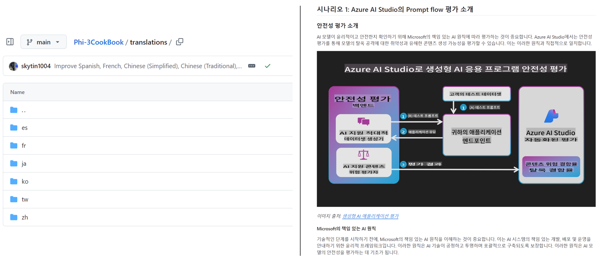

# Co-op Translator

Keep multilingual GitHub documentation current as your source evolves.

Co-op Translator detects changed source content, updates stale translations, and preserves the links and structure of Markdown, Jupyter notebooks, and images.


[](https://pypi.org/project/co-op-translator/)
[](https://github.com/azure/co-op-translator/pkgs/container/co-op-translator)
[](https://github.com/azure/co-op-translator/blob/main/LICENSE)
[](https://pepy.tech/project/co-op-translator)

**[Get started](#get-started)** · **[See real repositories](#see-co-op-translator-in-real-repositories)** · **[Read the documentation](https://azure.github.io/co-op-translator/)**

> Translating one file is easy. Keeping an entire documentation repository translated, linked, and up to date is the hard part.

## Why Co-op Translator?

Translation is not finished when a model returns text. Repository-scale documentation needs to stay complete, navigable, and synchronized after every source change.

| Problem | How Co-op Translator helps |
| --- | --- |
| Source content keeps changing | Source hashes and language-scoped metadata identify stale files and skip unchanged translations. |
| Long documents do not fit one reliable model response | Markdown is split into manageable chunks, with retry and re-chunking for failed sections. |
| Models can alter Markdown structure or destinations | Structure checks and parser-based protection preserve Markdown URLs, code, and Markdown structure. |
| Links must follow the translated repository tree | Relative links for Markdown, notebooks, images, and README files are rewritten for `translations/<lang>/...`. |
| A repository contains more than prose | One workflow can handle Markdown, Jupyter notebooks, image text, and repository-level review. |

## See Co-op Translator in real repositories

Co-op Translator has been used in Microsoft open-source learning repositories that combine lessons, code samples, links, notebooks, and supporting assets.

### [AI Agents for Beginners](https://github.com/microsoft/ai-agents-for-beginners)

A lesson-based repository with code samples and supporting documentation organized into language-specific versions.

**[View repository](https://github.com/microsoft/ai-agents-for-beginners)** · **[Browse translations](https://github.com/microsoft/ai-agents-for-beginners/tree/main/translations)**

### [Generative AI for Beginners](https://github.com/microsoft/generative-ai-for-beginners)

A large curriculum containing lessons, code, images, and links across a multilingual documentation tree.

**[View repository](https://github.com/microsoft/generative-ai-for-beginners)** · **[Browse translations](https://github.com/microsoft/generative-ai-for-beginners/tree/main/translations)**

### [MCP for Beginners](https://github.com/microsoft/mcp-for-beginners)

Technical learning content covering Model Context Protocol concepts, examples, and language-scoped documentation.

**[View repository](https://github.com/microsoft/mcp-for-beginners)** · **[Browse translations](https://github.com/microsoft/mcp-for-beginners/tree/main/translations)**

<details>
<summary>Explore more multilingual Microsoft learning repositories</summary>

- [LangChain4j for Beginners](https://github.com/microsoft/LangChain4j-for-Beginners)
- [AZD for Beginners](https://github.com/microsoft/AZD-for-beginners)
- [Edge AI for Beginners](https://github.com/microsoft/edgeai-for-beginners)
- [Generative AI for Beginners using .NET](https://github.com/microsoft/Generative-AI-for-beginners-dotnet)
- [Generative AI for Beginners using Java](https://github.com/microsoft/generative-ai-for-beginners-java)
- [ML for Beginners](https://aka.ms/ml-beginners)
- [Data Science for Beginners](https://aka.ms/datascience-beginners)
- [AI for Beginners](https://aka.ms/ai-beginners)
- [Cybersecurity for Beginners](https://github.com/microsoft/Security-101)
- [Web Dev for Beginners](https://aka.ms/webdev-beginners)
- [IoT for Beginners](https://aka.ms/iot-beginners)
- [PhiCookBook](https://github.com/microsoft/PhiCookBook)

</details>

## Get started

Install Co-op Translator and preview the work without configuring provider credentials:

```bash
pip install co-op-translator
translate -l "ko" -md --dry-run
```

Configure [Azure OpenAI or OpenAI credentials](./docs/configuration.md), then run the translation and deterministic review:

```bash
translate -l "ko" -md
co-op-review -l "ko"
```

For a first run, start with [Choose your workflow](./docs/workflows.md). It compares local translation, Python automation, GitHub Actions, containers, and agent or editor integration.

## How it works

1. **Plan:** scan the repository, normalize language codes, and identify new or outdated source content.
2. **Translate:** process Markdown, notebook cells, and image text with configured providers. MCP host agents can translate Markdown and notebook chunks.
3. **Preserve structure:** protect code and URL destinations, then rewrite relative paths for the translated repository tree.
4. **Track and review:** save language-scoped metadata so later runs can skip unchanged files and report missing, stale, or structurally incomplete translations.

Translated content remains in the repository, where it can be reviewed, versioned, and updated with the source:



## Translation state is managed like a software artifact

Co-op Translator manages translations as **versioned software artifacts**, not as disconnected static files. Language-scoped metadata records the source state for translated Markdown, images, and notebooks.

This design lets repository owners:

- Detect outdated translations without retranslating unchanged files
- Apply the same maintenance model to Markdown, images, and notebooks
- Review translation completeness and repository structure in CI
- Scale translation maintenance across large, fast-moving repositories

[Read how translation state is managed](https://techcommunity.microsoft.com/blog/azuredevcommunityblog/rethinking-documentation-translation-treating-translations-as-versioned-software/4491755)

## Core capabilities

- Incremental translation based on source changes and language-scoped metadata
- Markdown chunking, recovery, structural validation, and URL protection
- Translation of Markdown, Jupyter notebooks, and text embedded in images
- Relative-link rewriting for translated repository layouts
- Credential-free, write-free dry runs across the CLI, Python API, and MCP
- Deterministic review of translation freshness, structure, and local links
- Azure OpenAI and OpenAI support for provider-backed translation
- Azure AI Vision support for image text extraction
- Host-agent translation of Markdown and notebook chunks through MCP

## Choose your interface

| Interface | Best for | Guide |
| --- | --- | --- |
| CLI | Local repository work and scripts | [CLI reference](./docs/cli.md) |
| Python API | Applications and custom automation | [Python API](./docs/api.md) |
| MCP server | Agent and editor workflows | [MCP server](./docs/mcp.md) |
| GitHub Actions | Repository translation in CI | [GitHub Actions](./docs/github-actions.md) |
| Container | Isolated or repeatable CLI runs | [Quick run](#container) |

### Container

Container quick run with Bash or Zsh:

```bash
docker run --rm -it --env-file .env -v "${PWD}:/work" ghcr.io/azure/co-op-translator:latest -l "ko" -md
```

Container quick run with PowerShell:

```powershell
docker run --rm -it --env-file .env -v ${PWD}:/work ghcr.io/azure/co-op-translator:latest -l "ko" -md
```

## Featured by Microsoft

- **Microsoft's The Future of AI series:** [Unlock Global Collaboration with Co-op Translator: Automate Markdown and Image Translations Using Azure AI Foundry](https://techcommunity.microsoft.com/blog/azure-ai-foundry-blog/the-future-of-ai-unleashing-the-potential-of-ai-translation/4394200)
- **Open at Microsoft:** [Unlocking Multilingual Accessibility with Co-op Translator: A Case Study on Phi-3 Cookbook](https://www.youtube.com/watch?v=jX_swfH_KNU)
- **Microsoft Reactor:** [Unlocking Multilingual Mastery: Dive into Co-op Translator with Azure](https://www.youtube.com/watch?v=boTtKVPBLAc)

[](https://www.youtube.com/watch?v=jX_swfH_KNU)

## Case studies and engineering deep dives

### Case studies

- [Automate Markdown and Image Translations Using Co-op Translator: Phi-3 Cookbook Case Study](https://techcommunity.microsoft.com/blog/educatordeveloperblog/automate-markdown-and-image-translations-using-co-op-translator-phi-3-cookbook-c/4263474)
- [Translating AI and ML for Beginners Curriculums in Less Than a Day](https://techcommunity.microsoft.com/blog/azuredevcommunityblog/translating-ai-and-ml-for-beginners-curriculums-in-less-than-a-day/4381854)

### Engineering deep dives

- [Rethinking Documentation Translation: Treating Translations as Versioned Software Assets](https://techcommunity.microsoft.com/blog/azuredevcommunityblog/rethinking-documentation-translation-treating-translations-as-versioned-software/4491755)
- [Fixing Broken Markdown in AI Translation: Hardening a Production Pipeline](https://techcommunity.microsoft.com/blog/azuredevcommunityblog/fixing-broken-markdown-in-ai-translation-hardening-a-production-pipeline/4511378)

## Documentation

- [Documentation site](https://azure.github.io/co-op-translator/)
- [Choose your workflow](./docs/workflows.md)
- [Configuration](./docs/configuration.md)
- [Azure AI setup](./docs/azure-ai-setup.md)
- [CLI reference](./docs/cli.md)
- [Python API](./docs/api.md)
- [MCP server](./docs/mcp.md)
- [GitHub Actions](./docs/github-actions.md)
- [README languages template](./docs/readme-languages-template.md)
- [Supported languages](./docs/supported-languages.md)
- [Troubleshooting](./docs/troubleshooting.md)

### Microsoft-specific guide

> [!NOTE]
> For maintainers of the Microsoft “For Beginners” repositories only.

- [Updating the “other courses” list](./docs/microsoft-beginners.md)

## Supported languages and cloning

Co-op Translator supports 50+ language and locale codes. Expand this section to browse translated README files and see how to clone the repository without translation assets.

<details>
<summary>View supported languages and sparse-checkout instructions</summary>

<!-- CO-OP TRANSLATOR LANGUAGES TABLE START -->
[Arabic](./translations/ar/README.md) | [Bengali](./translations/bn/README.md) | [Bulgarian](./translations/bg/README.md) | [Burmese (Myanmar)](./translations/my/README.md) | [Chinese (Simplified)](./translations/zh-CN/README.md) | [Chinese (Traditional, Hong Kong)](./translations/zh-HK/README.md) | [Chinese (Traditional, Macau)](./translations/zh-MO/README.md) | [Chinese (Traditional, Taiwan)](./translations/zh-TW/README.md) | [Croatian](./translations/hr/README.md) | [Czech](./translations/cs/README.md) | [Danish](./translations/da/README.md) | [Dutch](./translations/nl/README.md) | [Estonian](./translations/et/README.md) | [Finnish](./translations/fi/README.md) | [French](./translations/fr/README.md) | [German](./translations/de/README.md) | [Greek](./translations/el/README.md) | [Hebrew](./translations/he/README.md) | [Hindi](./translations/hi/README.md) | [Hungarian](./translations/hu/README.md) | [Indonesian](./translations/id/README.md) | [Italian](./translations/it/README.md) | [Japanese](./translations/ja/README.md) | [Kannada](./translations/kn/README.md) | [Khmer](./translations/km/README.md) | [Korean](./translations/ko/README.md) | [Lithuanian](./translations/lt/README.md) | [Malay](./translations/ms/README.md) | [Malayalam](./translations/ml/README.md) | [Marathi](./translations/mr/README.md) | [Nepali](./translations/ne/README.md) | [Nigerian Pidgin](./translations/pcm/README.md) | [Norwegian](./translations/no/README.md) | [Persian (Farsi)](./translations/fa/README.md) | [Polish](./translations/pl/README.md) | [Portuguese (Brazil)](./translations/pt-BR/README.md) | [Portuguese (Portugal)](./translations/pt-PT/README.md) | [Punjabi (Gurmukhi)](./translations/pa/README.md) | [Romanian](./translations/ro/README.md) | [Russian](./translations/ru/README.md) | [Serbian (Cyrillic)](./translations/sr/README.md) | [Slovak](./translations/sk/README.md) | [Slovenian](./translations/sl/README.md) | [Spanish](./translations/es/README.md) | [Swahili](./translations/sw/README.md) | [Swedish](./translations/sv/README.md) | [Tagalog (Filipino)](./translations/tl/README.md) | [Tamil](./translations/ta/README.md) | [Telugu](./translations/te/README.md) | [Thai](./translations/th/README.md) | [Turkish](./translations/tr/README.md) | [Ukrainian](./translations/uk/README.md) | [Urdu](./translations/ur/README.md) | [Vietnamese](./translations/vi/README.md)

> **Prefer to Clone Locally?**
>
> This repository includes 50+ language translations which significantly increases the download size. To clone without translations, use sparse checkout:
>
> **Bash / macOS / Linux:**
> ```bash
> git clone --filter=blob:none --sparse https://github.com/Azure/co-op-translator.git
> cd co-op-translator
> git sparse-checkout set --no-cone '/*' '!translations' '!translated_images'
> ```
>
> **CMD (Windows):**
> ```cmd
> git clone --filter=blob:none --sparse https://github.com/Azure/co-op-translator.git
> cd co-op-translator
> git sparse-checkout set --no-cone "/*" "!translations" "!translated_images"
> ```
>
> This gives you everything you need to complete the course with a much faster download.
<!-- CO-OP TRANSLATOR LANGUAGES TABLE END -->

</details>

## Contributing

Contributions and suggestions are welcome. See [CONTRIBUTING.md](./CONTRIBUTING.md) for development setup, coding conventions, and pull request guidance.

[](https://github.com/Azure/co-op-translator/graphs/contributors)

## Code of Conduct

This project has adopted the [Microsoft Open Source Code of Conduct](https://opensource.microsoft.com/codeofconduct/).
For more information, see the [Code of Conduct FAQ](https://opensource.microsoft.com/codeofconduct/faq/) or contact [opencode@microsoft.com](mailto:opencode@microsoft.com) with additional questions or comments.

## Responsible AI

Microsoft is committed to helping our customers use our AI products responsibly, sharing our learnings, and building trust-based partnerships through tools like Transparency Notes and Impact Assessments. Many of these resources can be found at [https://aka.ms/RAI](https://aka.ms/RAI).
Microsoft's approach to responsible AI is grounded in our AI principles of fairness, reliability and safety, privacy and security, inclusiveness, transparency, and accountability.

Large-scale natural language, image, and speech models - like the ones used in this sample - can potentially behave in ways that are unfair, unreliable, or offensive, in turn causing harms. Please consult the [Azure OpenAI service Transparency note](https://learn.microsoft.com/legal/cognitive-services/openai/transparency-note?tabs=text) to be informed about risks and limitations.

The recommended approach to mitigating these risks is to include a safety system in your architecture that can detect and prevent harmful behavior. [Azure AI Content Safety](https://learn.microsoft.com/azure/ai-services/content-safety/overview) provides an independent layer of protection, able to detect harmful user-generated and AI-generated content in applications and services. Azure AI Content Safety includes text and image APIs that allow you to detect material that is harmful. We also have an interactive Content Safety Studio that allows you to view, explore and try out sample code for detecting harmful content across different modalities. The following [quickstart documentation](https://learn.microsoft.com/azure/ai-services/content-safety/quickstart-text?tabs=visual-studio%2Clinux&pivots=programming-language-rest) guides you through making requests to the service.

Another aspect to take into account is the overall application performance. With multi-modal and multi-models applications, we consider performance to mean that the system performs as you and your users expect, including not generating harmful outputs. It's important to assess the performance of your overall application using [generation quality and risk and safety metrics](https://learn.microsoft.com/azure/ai-studio/concepts/evaluation-metrics-built-in).

You can evaluate your AI application in your development environment using the [prompt flow SDK](https://microsoft.github.io/promptflow/index.html). Given either a test dataset or a target, your generative AI application generations are quantitatively measured with built-in evaluators or custom evaluators of your choice. To get started with the prompt flow sdk to evaluate your system, you can follow the [quickstart guide](https://learn.microsoft.com/azure/ai-studio/how-to/develop/flow-evaluate-sdk). Once you execute an evaluation run, you can [visualize the results in Azure AI Studio](https://learn.microsoft.com/azure/ai-studio/how-to/evaluate-flow-results).

## Trademarks

This project may contain trademarks or logos for projects, products, or services. Authorized use of Microsoft
trademarks or logos is subject to and must follow
[Microsoft's Trademark & Brand Guidelines](https://www.microsoft.com/en-us/legal/intellectualproperty/trademarks/usage/general).
Use of Microsoft trademarks or logos in modified versions of this project must not cause confusion or imply Microsoft sponsorship.
Any use of third-party trademarks or logos are subject to those third-party's policies.

## Getting help

For project problems, open a [GitHub issue](https://github.com/Azure/co-op-translator/issues). For questions about building AI applications, use the Microsoft Foundry community channels:

[](https://discord.gg/nTYy5BXMWG)

[](https://aka.ms/foundry/forum)
