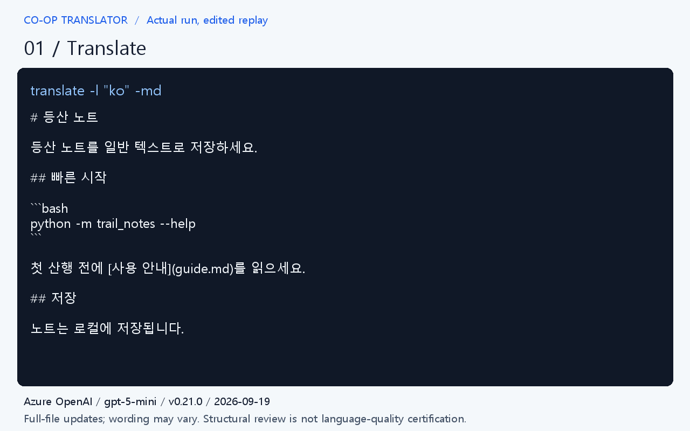

# Translate, edit, and review a small project

Start with two short Markdown files and one target language. You will see where translations are written, what happens when the source changes, and how to check the result.



[Watch the 40-second edited replay](assets/demo/demo.gif). This replays captured results from a real run; it is not a live terminal recording. The complete text results below are available without animation.

## Recorded results

The example was run on September 19, 2026 with Co-op Translator 0.21.0 and Azure OpenAI (`gpt-5-mini`). The unmodified CLI commands were invoked through Click's `CliRunner` using the built wheel and existing Python dependencies.

| Step | Result |
| --- | --- |
| Preview | Exit 0; no model translation requested |
| Initial translation | Exit 0; 27.36 seconds |
| Initial review | Exit 0 |
| Edit README and review | Exit 1; stale translation detected |
| Update translation | Exit 0; 22.17 seconds |
| Review after update | Exit 0; no errors or warnings |
| Unchanged guide | Identical bytes before and after README update |
| Run again | Exit 0; identical hashes for all translation files |

These are individual run measurements, not performance guarantees. Setup time is excluded; provider billing was not measured. An unchanged run can still perform a provider health check.

Inspect the [initial translation](assets/demo/before.txt), [updated translation](assets/demo/after.txt), [complete translation diff](assets/demo/update.diff), [stale review](assets/demo/review-stale.txt), [final review](assets/demo/review-after.txt), and [run details](assets/demo/results.json). Full-file translation may change other wording, as the captured diff shows. The demo omits the generated disclaimer from the image for space; both text artifacts retain it.

Human review still matters: the captured update uses `[사용 가이드](guide.md)을`; the Korean particle should be `[사용 가이드](guide.md)를`. The recording keeps this output intact rather than presenting an edited translation as model output. The structural review passes despite this wording issue.

The [rendering script](assets/demo/render.py) creates the static preview and GIF from these files. With Pillow installed, run it with `--font` pointing to a Korean-capable TrueType font. It does not call a model or simulate new results.

For an existing public example, compare the [English README](https://github.com/microsoft/generative-ai-for-beginners/blob/main/README.md) and [Korean README](https://github.com/microsoft/generative-ai-for-beginners/blob/main/translations/ko/README.md) in Generative AI for Beginners. These documents demonstrate repository usage, not a measured output from this tutorial.

## 1. Prepare a small folder

Use Python 3.11–3.14 and the [virtual environment setup](configuration.md#local-runtime-setup). Install the version used for this example:

```bash
python -m pip install co-op-translator==0.21.0
mkdir translation-demo
cd translation-demo
git init
```

Download [README.txt](assets/demo/README.txt) and [guide.txt](assets/demo/guide.txt) into this folder, saving them as `README.md` and `guide.md`. They are small fictional project documents; no application installation is needed.

The README includes a code block and a link to `guide.md`. Its final sentence is:

```text
Notes are saved locally.
```

Keep only these two source documents in this folder. All following commands run inside `translation-demo` and work in Bash and PowerShell.

## 2. Preview without credentials

```bash
translate -l "ko" -md --dry-run
```

The preview estimates translation work without calling a model or writing translations. Token estimates are not a billing quote. The first run should identify both Markdown files as new work.

## 3. Choose a provider and translate

Configure one provider using the [configuration guide](configuration.md): Azure OpenAI, OpenAI, or Anthropic. OpenAI and Anthropic text translation do not require an Azure account. Image services are not needed for this example.

If you use a local `.env` file, add `.env` to this folder's `.gitignore`. Translation calls use your provider account and may incur charges.

```bash
translate -l "ko" -md
co-op-review -l "ko"
```

Open `translations/ko/README.md` and `translations/ko/guide.md`. Check the Korean wording, the code block, and the link from the translated README to the translated guide. Output wording varies by model.

`co-op-review` checks freshness, structure, and local links. A passing result does not certify linguistic accuracy. Resolve any reported errors before continuing.

Record the successful baseline with Git (configure your Git identity first if needed):

```bash
git add README.md guide.md translations
git commit -m "Record initial Korean translation"
```

## 4. Change the source

In `README.md`, replace `Notes are saved locally.` with:

```text
Notes are saved locally as Markdown files.
```

Leave `guide.md` unchanged. Then run:

```bash
co-op-review -l "ko"
translate -l "ko" -md --dry-run
```

The review should report the README translation as stale and exit unsuccessfully. This is the expected intermediate state. The preview should identify work for the changed README.

## 5. Update and inspect the diff

```bash
translate -l "ko" -md
git diff -- README.md translations/ko/README.md
git diff -- translations/ko/guide.md
co-op-review -l "ko"
```

Inspect the real diff: the default CLI retranslates the changed file, so the model can also revise other wording in that file. The unchanged guide should have no diff. The review should no longer report the README as stale; investigate any other findings rather than ignoring them.

Block-level preservation of human Markdown edits requires an optional translation state provider in the [Python API](api.md). It is not enabled by these CLI commands.

## 6. Run again without changes

Commit the updated source and translation:

```bash
git add README.md translations
git commit -m "Update Korean translation after source edit"
translate -l "ko" -md
git diff --exit-code -- translations
```

With current translations and unchanged configuration, the translator skips the files. The final Git command should produce no diff and exit successfully.

## Next steps

- [Translate only a README and open a pull request](github-actions.md#your-first-readme-translation-pr).
- [Choose CLI, Python API, or MCP](workflows.md).
- [Report a translation problem without coding](https://github.com/Azure/co-op-translator/issues/new?template=translation_feedback.yml).

When sharing a recording, include the package version, provider/model, and run date. Keep installation and credential setup separate from edited playback time. Show actual output and disclose cuts or accelerated playback; report cost only when measured from provider usage.
