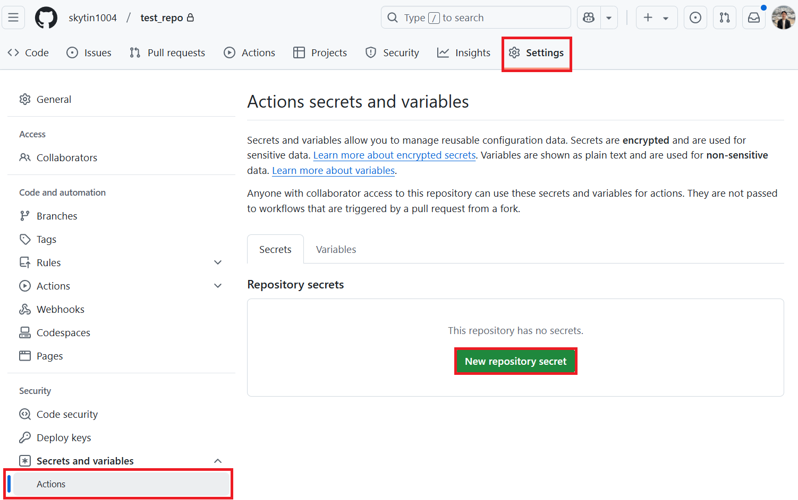
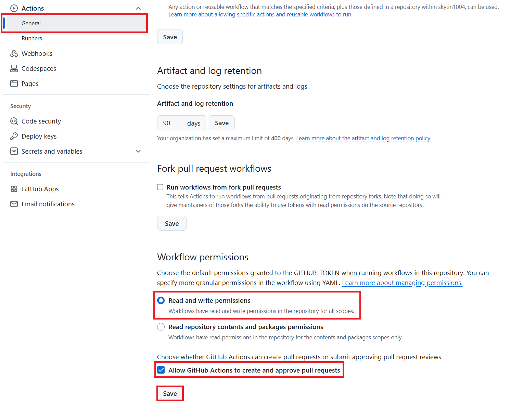

# GitHub Actions

Use GitHub Actions when you want a repository to translate changed documentation automatically and open a pull request with the generated outputs.

Start with the standard `GITHUB_TOKEN` setup, including for organization repositories where policy allows it. See [GitHub App Setup](#github-app-setup) when your organization requires an App identity or you need automatic downstream workflow runs.

## Your first README translation PR

Start with one root `README.md` and one target language. This workflow translates Markdown only, so Azure AI Vision is not required.

1. Copy [translate-readme.yml](assets/workflows/translate-readme.yml) to `.github/workflows/translate-readme.yml` in the repository you want to translate, and commit it to that repository's default branch. The template uses the root Action in `Azure/co-op-translator@main`, which installs the CLI from the same source ref. Pin a reviewed commit for reproducible runs. When testing this feature before it is merged, use the fork and branch containing both the Action and `co-op-review --readme-only`.
2. Open **Actions > Translate README > Run workflow**, choose a language, and leave **Preview only** checked. Review the token estimate in the preview step. Preview does not call model providers, write translations, or create a PR.
3. Add the secrets for one [text provider](#prerequisites), and enable **Allow GitHub Actions to create and approve pull requests** under **Settings > Actions > General**. The template requests `contents: write` and `pull-requests: write` for its job; you do not need to change the default permissions for every workflow. If organization policy blocks these permissions or this setting, ask an administrator about an approved [GitHub App](#github-app-setup).
4. Run the workflow again with **Preview only** unchecked. It previews, translates, runs `co-op-review --readme-only`, and creates or updates a translation PR only after translation and review succeed. The workflow summary links to the PR.
5. Review the wording and file changes in the PR, then merge when ready. The workflow does not merge automatically.

The PR contains only `translations/<language>/README.md` and its language metadata file. The source README stays unchanged, and links to other documents continue to point at the source documents. The PR body lists changed files and structural review results. If translation or review fails, inspect the workflow summary and failed step logs; no PR is created. If there are no changes, no new PR is needed.

**Organization and CI note:** A GitHub App is optional, not a requirement of organization ownership. With `GITHUB_TOKEN`, pull-request workflows for opening, updating, or reopening a PR require a user with write access to select **Approve workflows to run**. Push workflows are not triggered by this token. For unattended downstream CI, see [GitHub App Setup](#github-app-setup) and GitHub's [workflow triggering rules](https://docs.github.com/en/actions/how-tos/writing-workflows/choosing-when-your-workflow-runs/triggering-a-workflow).

## Prerequisites

Before creating the workflow, configure the AI service secrets your translation run needs.

Text translation requires one language model provider:

- Azure OpenAI: `AZURE_OPENAI_API_KEY`, `AZURE_OPENAI_ENDPOINT`, `AZURE_OPENAI_MODEL_NAME`, `AZURE_OPENAI_CHAT_DEPLOYMENT_NAME`, `AZURE_OPENAI_API_VERSION`
- OpenAI: `OPENAI_API_KEY`, `OPENAI_CHAT_MODEL_ID`, plus optional `OPENAI_ORG_ID` and `OPENAI_BASE_URL`

Image translation additionally requires Azure AI Vision:

- `AZURE_AI_SERVICE_API_KEY`
- `AZURE_AI_SERVICE_ENDPOINT`

See [Configuration](configuration.md) and [Azure AI Setup](azure-ai-setup.md) for local configuration details.

## Standard Setup

Use this setup for most public and private repositories.

### Step 1: Add Repository Secrets

In your target repository, open **Settings** > **Secrets and variables** > **Actions**, then add the provider secrets your workflow will use.



### Step 2: Enable Workflow Permissions

Open **Settings** > **Actions** > **General**.

Under **Workflow permissions**:

1. Select **Read and write permissions**.
2. Enable **Allow GitHub Actions to create and approve pull requests**.
3. Save the setting.



### Step 3: Add the Workflow

Create `.github/workflows/co-op-translator.yml`:

```yaml
name: Co-op Translator

on:
  push:
    branches:
      - main

jobs:
  co-op-translator:
    runs-on: ubuntu-latest

    permissions:
      contents: write
      pull-requests: write

    steps:
      - name: Checkout repository
        uses: actions/checkout@v4
        with:
          fetch-depth: 0

      - name: Set up Python
        uses: actions/setup-python@v7
        with:
          python-version: "3.11"

      - name: Install Co-op Translator
        run: |
          python -m pip install --upgrade pip
          pip install co-op-translator

      - name: Run Co-op Translator
        env:
          PYTHONIOENCODING: utf-8
          AZURE_AI_SERVICE_API_KEY: ${{ secrets.AZURE_AI_SERVICE_API_KEY }}
          AZURE_AI_SERVICE_ENDPOINT: ${{ secrets.AZURE_AI_SERVICE_ENDPOINT }}
          AZURE_OPENAI_API_KEY: ${{ secrets.AZURE_OPENAI_API_KEY }}
          AZURE_OPENAI_ENDPOINT: ${{ secrets.AZURE_OPENAI_ENDPOINT }}
          AZURE_OPENAI_MODEL_NAME: ${{ secrets.AZURE_OPENAI_MODEL_NAME }}
          AZURE_OPENAI_CHAT_DEPLOYMENT_NAME: ${{ secrets.AZURE_OPENAI_CHAT_DEPLOYMENT_NAME }}
          AZURE_OPENAI_API_VERSION: ${{ secrets.AZURE_OPENAI_API_VERSION }}
          OPENAI_API_KEY: ${{ secrets.OPENAI_API_KEY }}
          OPENAI_ORG_ID: ${{ secrets.OPENAI_ORG_ID }}
          OPENAI_CHAT_MODEL_ID: ${{ secrets.OPENAI_CHAT_MODEL_ID }}
          OPENAI_BASE_URL: ${{ secrets.OPENAI_BASE_URL }}
        run: |
          translate -l "es fr de" -y

      - name: Create Pull Request with translations
        uses: peter-evans/create-pull-request@v5
        with:
          token: ${{ secrets.GITHUB_TOKEN }}
          commit-message: "Update translations via Co-op Translator"
          title: "Update translations via Co-op Translator"
          body: |
            This PR updates translations for recent changes to the main branch.

            Generated by Co-op Translator.
          branch: update-translations
          base: main
          labels: translation, automated-pr
          delete-branch: true
          add-paths: |
            translations/
            translated_images/
```

Change `translate -l "es fr de" -y` to the target languages and content flags your project needs. For large repositories, add a `paths:` filter under `on:` so the workflow only runs when documentation changes.

## GitHub App Setup

Use an approved GitHub App when your organization requires an App identity, or when the generated PR needs to trigger downstream CI without the `GITHUB_TOKEN` approval step. An App does not bypass organization policy; administrators still control its installation and permissions.

### Step 1: Create or Install a GitHub App

Use an existing organization-provided App when available, or create one with read/write access to **Contents** and **Pull requests**. Install it on the target repository with any required organization approval.

Record:

- App ID
- Private key contents

Store them as repository secrets:

- `GH_APP_ID`
- `GH_APP_PRIVATE_KEY`

### Step 2: Generate an App Token

Add this step immediately before the existing pull request step. For the README template, use the same success condition so previews and failed translations do not request an App token:

```yaml
      - name: Authenticate GitHub App
        id: generate_token
        if: ${{ !inputs.preview && steps.translate.outcome == 'success' && steps.review.outcome == 'success' }}
        uses: actions/create-github-app-token@v2
        with:
          app-id: ${{ secrets.GH_APP_ID }}
          private-key: ${{ secrets.GH_APP_PRIVATE_KEY }}
          permission-contents: write
          permission-pull-requests: write
```

Then change only the existing pull request step's `token` input to `${{ steps.generate_token.outputs.token }}`. Keep its success condition, branch, PR body, and `add-paths` unchanged. The token is scoped to the current repository by default. When adapting the standard setup instead of the README template, omit the `if` above because that workflow has no preview or review step IDs.

See the official [create-github-app-token Action](https://github.com/actions/create-github-app-token/tree/v2) for installation and token permissions.

## Runner Limits

GitHub-hosted runners have a maximum job duration. Large repositories or many target languages can exceed that limit.

For large translation workloads:

- Translate fewer languages per run.
- Use content flags such as `-md`, `-nb`, or `-img`.
- Use a self-hosted runner when repository size or model latency makes hosted runners unreliable.

## Review in CI

Use `co-op-review` when a pull request should validate generated translations without calling LLM or Vision providers.

```yaml
      - name: Review translated outputs
        run: |
          co-op-review --changed-from "origin/${{ github.base_ref }}" --format github
```

`co-op-review` is a beta deterministic review command. Its checks and output schema may evolve, but it is designed to be safe for CI because it does not write files or call model providers.
