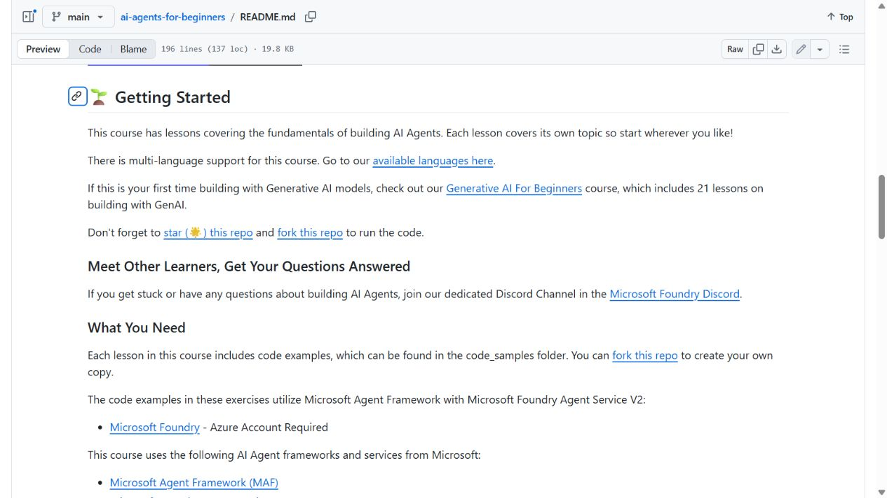
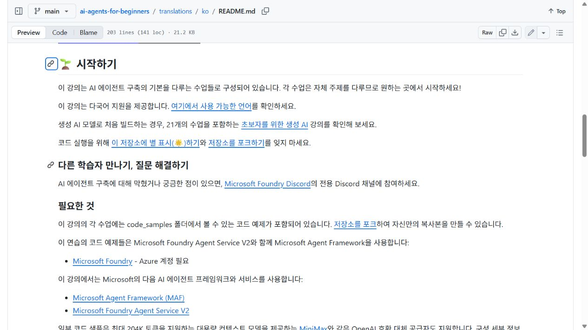

<section class="home-hero">
  
Prise en main

  <h1>Documentation de Co-op Translator</h1>
  

    Maintenez les traductions de votre dépôt à jour. Traduisez les fichiers Markdown et
    les notebooks avec Azure OpenAI, OpenAI ou Anthropic, puis vérifiez la fraîcheur,
    la structure et les liens locaux. Azure est optionnel pour la traduction de texte.
  

  <a class="home-link" href="first-translation/">Essayez un petit exemple de traduction -></a>
</section>

La traduction de texte d'image nécessite également Azure AI Vision.
Vous connaissez déjà votre configuration ? [Choisissez votre flux de travail](workflows.md).

Voir Co-op Translator en action dans **AI Agents for Beginners** : la même section README en anglais et en coréen.

| Anglais | Coréen |
| --- | --- |
|  |  |

[Source anglais](https://github.com/microsoft/ai-agents-for-beginners/blob/main/README.md#-getting-started) · [Traduction coréenne](https://github.com/microsoft/ai-agents-for-beginners/blob/main/translations/ko/README.md#-%EC%8B%9C%EC%9E%91%ED%95%98%EA%B8%B0)

[Essayez un petit projet de traduction](first-translation.md) : fichiers source, sorties réelles et un diff de traduction que vous pouvez inspecter.

## Lisez la documentation dans votre langue

  <a class="language-button" href="/co-op-translator/" hreflang="en">Anglais<code>en</code></a>
  <a class="language-button" href="/co-op-translator/i18n/ko/" hreflang="ko">Coréen<code>ko</code></a>
  <a class="language-button" href="/co-op-translator/i18n/ja/" hreflang="ja">Japonais<code>ja</code></a>
  <a class="language-button" href="/co-op-translator/i18n/zh-CN/" hreflang="zh-CN">Chinois (simplifié)<code>zh-CN</code></a>
  <a class="language-button" href="/co-op-translator/i18n/es/" hreflang="es">Espagnol<code>es</code></a>
  <a class="language-button" href="/co-op-translator/i18n/fr/" hreflang="fr">Français<code>fr</code></a>
  <a class="language-button" href="/co-op-translator/i18n/de/" hreflang="de">Allemand<code>de</code></a>
  <a class="language-button" href="/co-op-translator/i18n/pt-BR/" hreflang="pt-BR">Portugais (Brésil)<code>pt-BR</code></a>

  

    Afficher toutes les langues
    <code>47 de plus</code>
  

  

  <a class="language-button" href="/co-op-translator/i18n/ru/" hreflang="ru">Russe<code>ru</code></a>
  <a class="language-button" href="/co-op-translator/i18n/ar/" hreflang="ar">Arabe<code>ar</code></a>
  <a class="language-button" href="/co-op-translator/i18n/fa/" hreflang="fa">Persan (farsi)<code>fa</code></a>
  <a class="language-button" href="/co-op-translator/i18n/ur/" hreflang="ur">Ourdou<code>ur</code></a>
  <a class="language-button" href="/co-op-translator/i18n/zh-MO/" hreflang="zh-MO">Chinois (traditionnel, Macao)<code>zh-MO</code></a>
  <a class="language-button" href="/co-op-translator/i18n/zh-HK/" hreflang="zh-HK">Chinois (traditionnel, Hong Kong)<code>zh-HK</code></a>
  <a class="language-button" href="/co-op-translator/i18n/zh-TW/" hreflang="zh-TW">Chinois (traditionnel, Taïwan)<code>zh-TW</code></a>
  <a class="language-button" href="/co-op-translator/i18n/hi/" hreflang="hi">Hindi<code>hi</code></a>
  <a class="language-button" href="/co-op-translator/i18n/bn/" hreflang="bn">Bengali<code>bn</code></a>
  <a class="language-button" href="/co-op-translator/i18n/mr/" hreflang="mr">Marathi<code>mr</code></a>
  <a class="language-button" href="/co-op-translator/i18n/ne/" hreflang="ne">Népalais<code>ne</code></a>
  <a class="language-button" href="/co-op-translator/i18n/pa/" hreflang="pa">Pendjabi (Gurmukhi)<code>pa</code></a>
  <a class="language-button" href="/co-op-translator/i18n/pt-PT/" hreflang="pt-PT">Portugais (Portugal)<code>pt-PT</code></a>
  <a class="language-button" href="/co-op-translator/i18n/it/" hreflang="it">Italien<code>it</code></a>
  <a class="language-button" href="/co-op-translator/i18n/pl/" hreflang="pl">Polonais<code>pl</code></a>
  <a class="language-button" href="/co-op-translator/i18n/tr/" hreflang="tr">Turc<code>tr</code></a>
  <a class="language-button" href="/co-op-translator/i18n/el/" hreflang="el">Grec<code>el</code></a>
  <a class="language-button" href="/co-op-translator/i18n/th/" hreflang="th">Thaï<code>th</code></a>
  <a class="language-button" href="/co-op-translator/i18n/sv/" hreflang="sv">Suédois<code>sv</code></a>
  <a class="language-button" href="/co-op-translator/i18n/da/" hreflang="da">Danois<code>da</code></a>
  <a class="language-button" href="/co-op-translator/i18n/no/" hreflang="no">Norvégien<code>no</code></a>
  <a class="language-button" href="/co-op-translator/i18n/fi/" hreflang="fi">Finnois<code>fi</code></a>
  <a class="language-button" href="/co-op-translator/i18n/nl/" hreflang="nl">Néerlandais<code>nl</code></a>
  <a class="language-button" href="/co-op-translator/i18n/he/" hreflang="he">Hébreu<code>he</code></a>
  <a class="language-button" href="/co-op-translator/i18n/vi/" hreflang="vi">Vietnamien<code>vi</code></a>
  <a class="language-button" href="/co-op-translator/i18n/id/" hreflang="id">Indonésien<code>id</code></a>
  <a class="language-button" href="/co-op-translator/i18n/ms/" hreflang="ms">Malais<code>ms</code></a>
  <a class="language-button" href="/co-op-translator/i18n/tl/" hreflang="tl">Tagalog (philippin)<code>tl</code></a>
  <a class="language-button" href="/co-op-translator/i18n/sw/" hreflang="sw">Swahili<code>sw</code></a>
  <a class="language-button" href="/co-op-translator/i18n/hu/" hreflang="hu">Hongrois<code>hu</code></a>
  <a class="language-button" href="/co-op-translator/i18n/cs/" hreflang="cs">Tchèque<code>cs</code></a>
  <a class="language-button" href="/co-op-translator/i18n/sk/" hreflang="sk">Slovaque<code>sk</code></a>
  <a class="language-button" href="/co-op-translator/i18n/ro/" hreflang="ro">Roumain<code>ro</code></a>
  <a class="language-button" href="/co-op-translator/i18n/bg/" hreflang="bg">Bulgare<code>bg</code></a>
  <a class="language-button" href="/co-op-translator/i18n/sr/" hreflang="sr">Serbe (cyrillique)<code>sr</code></a>
  <a class="language-button" href="/co-op-translator/i18n/hr/" hreflang="hr">Croate<code>hr</code></a>
  <a class="language-button" href="/co-op-translator/i18n/sl/" hreflang="sl">Slovène<code>sl</code></a>
  <a class="language-button" href="/co-op-translator/i18n/my/" hreflang="my">Birman (Myanmar)<code>my</code></a>
  <a class="language-button" href="/co-op-translator/i18n/uk/" hreflang="uk">Ukrainien<code>uk</code></a>
  <a class="language-button" href="/co-op-translator/i18n/lt/" hreflang="lt">Lituanien<code>lt</code></a>
  <a class="language-button" href="/co-op-translator/i18n/ta/" hreflang="ta">Tamoul<code>ta</code></a>
  <a class="language-button" href="/co-op-translator/i18n/et/" hreflang="et">Estonien<code>et</code></a>
  <a class="language-button" href="/co-op-translator/i18n/pcm/" hreflang="pcm">Pidgin nigérian<code>pcm</code></a>
  <a class="language-button" href="/co-op-translator/i18n/te/" hreflang="te">Télougou<code>te</code></a>
  <a class="language-button" href="/co-op-translator/i18n/ml/" hreflang="ml">Malayalam<code>ml</code></a>
  <a class="language-button" href="/co-op-translator/i18n/kn/" hreflang="kn">Kannada<code>kn</code></a>
  <a class="language-button" href="/co-op-translator/i18n/km/" hreflang="km">Khmer<code>km</code></a>
  

## Démarrage rapide

Configurez un fournisseur, puis choisissez l'interface qui convient à votre travail. CLI, API Python et MCP sont des alternatives ; vous n'avez pas besoin de compléter les trois.

  <a class="quickstart-card" href="configuration/">
    Configuration
    <strong>Configurez votre projet</strong>
    Configurez les fournisseurs, les identifiants, les langues cibles et les répertoires de sortie.
    <em>Lire le guide -></em>
  </a>

  <a class="quickstart-card" href="cli/">
    Terminal
    <strong>Traduire avec le CLI</strong>
    Exécutez les commandes de traduction, d'évaluation, de relecture et de migration de liens.
    <em>Lire le guide -></em>
  </a>

  <a class="quickstart-card" href="api/">
    Python
    <strong>Automatisez avec l'API Python</strong>
    Utilisez Co-op Translator dans des scripts et des flux d'automatisation.
    <em>Lire le guide -></em>
  </a>

  <a class="quickstart-card" href="mcp/">
    Agent ou éditeur
    <strong>Se connecter au serveur MCP</strong>
    Exposez les outils Co-op Translator aux agents, éditeurs et clients compatibles MCP.
    <em>Lire le guide -></em>
  </a>

