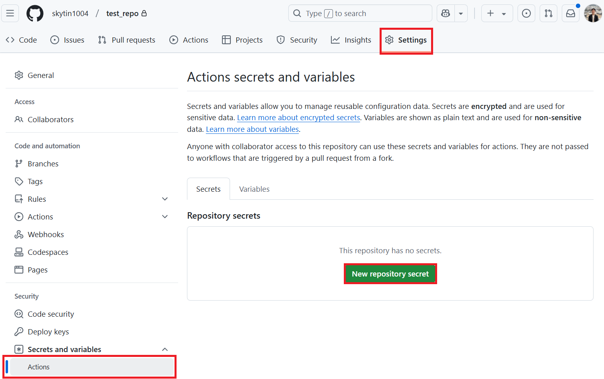
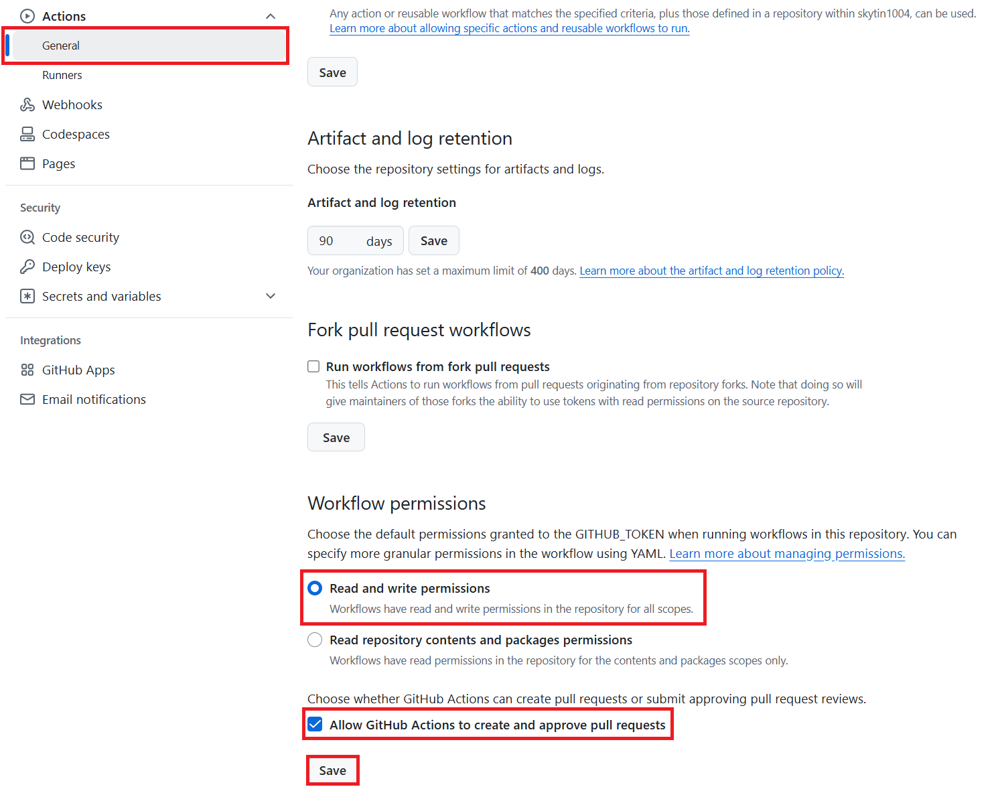

# GitHub Actions

जब आप चाहते हैं कि कोई रिपॉज़िटरी बदले गए दस्तावेज़ों का स्वतः अनुवाद करे और उत्पन्न आउटपुट के साथ एक पुल अनुरोध खोले, तो GitHub Actions का उपयोग करें।

अधिकांश रिपॉज़िटरीज़ को मानक `GITHUB_TOKEN` सेटअप का उपयोग करना चाहिए। अपने संगठन द्वारा डिफ़ॉल्ट टोकन अनुमतियों को प्रतिबंधित करने या ऐप-आधारित प्रमाणीकरण की आवश्यकता होने पर केवल GitHub App सेटअप का उपयोग करें।

## आवश्यकताएँ

वर्कफ़्लो बनाने से पहले, उस अनुवाद रन के लिए आवश्यक AI सेवा सीक्रेट्स कॉन्फ़िगर करें।

टेक्स्ट अनुवाद के लिए एक भाषा मॉडल प्रदाता आवश्यक है:

- Azure OpenAI: `AZURE_OPENAI_API_KEY`, `AZURE_OPENAI_ENDPOINT`, `AZURE_OPENAI_MODEL_NAME`, `AZURE_OPENAI_CHAT_DEPLOYMENT_NAME`, `AZURE_OPENAI_API_VERSION`
- OpenAI: `OPENAI_API_KEY`, `OPENAI_CHAT_MODEL_ID`, साथ ही वैकल्पिक `OPENAI_ORG_ID` और `OPENAI_BASE_URL`

छवि अनुवाद के लिए अतिरिक्त रूप से Azure AI Vision की आवश्यकता होती है:

- `AZURE_AI_SERVICE_API_KEY`
- `AZURE_AI_SERVICE_ENDPOINT`

स्थानीय कॉन्फ़िगरेशन विवरणों के लिए [कॉन्फ़िगरेशन](configuration.md) और [Azure AI सेटअप](azure-ai-setup.md) देखें।

## मानक सेटअप

अधिकांश सार्वजनिक और निजी रिपॉज़िटरीज़ के लिए इस सेटअप का उपयोग करें।

### चरण 1: रिपॉज़िटरी सीक्रेट्स जोड़ें

अपने लक्षित रिपॉज़िटरी में, **Settings** > **Secrets and variables** > **Actions** खोलें, फिर उन प्रदाता सीक्रेट्स को जोड़ें जिनका आपका वर्कफ़्लो उपयोग करेगा।



### चरण 2: वर्कफ़्लो अनुमतियाँ सक्षम करें

**Settings** > **Actions** > **General** खोलें।

**Workflow permissions** के अंतर्गत:

1. **Read and write permissions** चुनें।
2. **Allow GitHub Actions to create and approve pull requests** सक्षम करें।
3. सेटिंग सहेजें।



### चरण 3: वर्कफ़्लो जोड़ें

Create `.github/workflows/co-op-translator.yml`:

```yaml
name: Co-op Translator

on:
  push:
    branches:
      - main

jobs:
  co-op-translator:
    runs-on: ubuntu-latest

    permissions:
      contents: write
      pull-requests: write

    steps:
      - name: Checkout repository
        uses: actions/checkout@v4
        with:
          fetch-depth: 0

      - name: Set up Python
        uses: actions/setup-python@v4
        with:
          python-version: "3.10"

      - name: Install Co-op Translator
        run: |
          python -m pip install --upgrade pip
          pip install co-op-translator

      - name: Run Co-op Translator
        env:
          PYTHONIOENCODING: utf-8
          AZURE_AI_SERVICE_API_KEY: ${{ secrets.AZURE_AI_SERVICE_API_KEY }}
          AZURE_AI_SERVICE_ENDPOINT: ${{ secrets.AZURE_AI_SERVICE_ENDPOINT }}
          AZURE_OPENAI_API_KEY: ${{ secrets.AZURE_OPENAI_API_KEY }}
          AZURE_OPENAI_ENDPOINT: ${{ secrets.AZURE_OPENAI_ENDPOINT }}
          AZURE_OPENAI_MODEL_NAME: ${{ secrets.AZURE_OPENAI_MODEL_NAME }}
          AZURE_OPENAI_CHAT_DEPLOYMENT_NAME: ${{ secrets.AZURE_OPENAI_CHAT_DEPLOYMENT_NAME }}
          AZURE_OPENAI_API_VERSION: ${{ secrets.AZURE_OPENAI_API_VERSION }}
          OPENAI_API_KEY: ${{ secrets.OPENAI_API_KEY }}
          OPENAI_ORG_ID: ${{ secrets.OPENAI_ORG_ID }}
          OPENAI_CHAT_MODEL_ID: ${{ secrets.OPENAI_CHAT_MODEL_ID }}
          OPENAI_BASE_URL: ${{ secrets.OPENAI_BASE_URL }}
        run: |
          translate -l "es fr de" -y

      - name: Create Pull Request with translations
        uses: peter-evans/create-pull-request@v5
        with:
          token: ${{ secrets.GITHUB_TOKEN }}
          commit-message: "Update translations via Co-op Translator"
          title: "Update translations via Co-op Translator"
          body: |
            This PR updates translations for recent changes to the main branch.

            Generated by Co-op Translator.
          branch: update-translations
          base: main
          labels: translation, automated-pr
          delete-branch: true
          add-paths: |
            translations/
            translated_images/
```

अपने प्रोजेक्ट को आवश्यक लक्ष्य भाषाएँ और सामग्री फ्लैग्स देने के लिए `translate -l "es fr de" -y` को बदलें। बड़े रिपॉज़िटरीज़ के लिए, `on:` के अंतर्गत `paths:` फ़िल्टर जोड़ें ताकि वर्कफ़्लो केवल तब चले जब दस्तावेज़ों में परिवर्तन हों।

## GitHub App सेटअप

जब आपके संगठन में `GITHUB_TOKEN` कमिट या पुल अनुरोध नहीं बना सकता, तब इस सेटअप का उपयोग करें।

### चरण 1: GitHub App बनाएं या इंस्टॉल करें

रेड/राइट एक्सेस के साथ एक GitHub App बनाएं जो **Contents** और **Pull requests** तक पहुँच रखता हो, या यदि आपका संगठन पहले से कोई ऐप रखता है तो वह इंस्टॉल करें।

नोट करें:

- App ID
- Private key contents

इन्हें रिपॉज़िटरी सीक्रेट्स के रूप में संग्रहीत करें:

- `GH_APP_ID`
- `GH_APP_PRIVATE_KEY`

### चरण 2: एक App टोकन जनरेट करें

मानक सेटअप जैसा ही वर्कफ़्लो उपयोग करें, लेकिन पुल अनुरोध चरण से पहले एक app-token चरण जोड़ें:

```yaml
      - name: Authenticate GitHub App
        id: generate_token
        uses: tibdex/github-app-token@v1
        with:
          app_id: ${{ secrets.GH_APP_ID }}
          private_key: ${{ secrets.GH_APP_PRIVATE_KEY }}

      - name: Create Pull Request with translations
        uses: peter-evans/create-pull-request@v5
        with:
          token: ${{ steps.generate_token.outputs.token }}
          commit-message: "Update translations via Co-op Translator"
          title: "Update translations via Co-op Translator"
          branch: update-translations
          base: main
          delete-branch: true
          add-paths: |
            translations/
            translated_images/
```

## रनर सीमाएँ

GitHub-होस्टेड रनर्स की एक अधिकतम जॉब अवधि होती है। बड़े रिपॉज़िटरीज़ या कई लक्ष्य भाषाएँ उस सीमा से अधिक हो सकती हैं।

बड़े अनुवाद कार्यभार के लिए:

- प्रति रन कम भाषाएँ अनुवादित करें।
- `-md`, `-nb`, या `-img` जैसे सामग्री फ्लैग्स का उपयोग करें।
- जब रिपॉज़िटरी का आकार या मॉडल विलंब होस्टेड रनर्स को अस्थिर बना दे, तब self-hosted runner का उपयोग करें।

## CI में समीक्षा

जब किसी पुल अनुरोध को उत्पन्न अनुवादों को सत्यापित करना चाहिए बिना LLM या Vision प्रदाताओं को कॉल किए, तो `co-op-review` का उपयोग करें।

```yaml
      - name: Review translated outputs
        run: |
          co-op-review --changed-from "origin/${{ github.base_ref }}" --format github
```

`co-op-review` एक बीटा निर्धार deterministic समीक्षा कमांड है। उसके चेक और आउटपुट स्कीमा विकसित हो सकते हैं, लेकिन यह CI के लिए सुरक्षित होने के लिए डिज़ाइन किया गया है क्योंकि यह फ़ाइलें नहीं लिखता या मॉडल प्रदाताओं को कॉल नहीं करता।