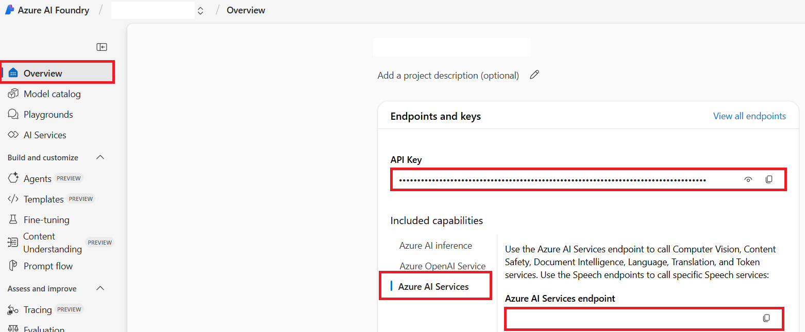

# Azure AI စတင်ပြင်ဆင်ခြင်း

စာသားဘာသာပြန်ရန် Azure OpenAI ကို ဖွဲ့စည်းရန်နှင့် ပုံများမှ စာသားထုတ်ယူရန် Azure AI Vision ကို ပြင်ဆင်ရန်လိုသောအခါ ဒီလမ်းညွှန်ကို အသုံးပြုပါ။

## Prerequisites

- An Azure subscription.
- Azure AI အရင်းအမြစ်များနှင့် မော်ဒယ် တပ်ဆင်မှုများကို ဖန်တီးသုံးရန် ခွင့်ပြုချက်။
- Azure AI Foundry ထဲတွင် စီမံကိန်းတစ်ခု သို့မဟုတ် Azure OpenAI နှင့် Azure AI Vision အရင်းအမြစ်များသို့ ညီမျှသော ဝင်ရောက်ခွင့်။

## Azure AI စီမံကိန်း တည်ဆောက်ခြင်း

1. [Azure AI Foundry](https://ai.azure.com) ကို ဖွင့်ပါ။
2. ပရောဂျက် အသစ် တစ်ခု ဖန်တီးရန် သို့မဟုတ် ရွေးချယ်ပါ။
3. ပရောဂျက်အတွက် AI hub တစ်ခု ဖန်တီးရန် သို့မဟုတ် ရွေးချယ်ပါ။
4. ဖန်တီးပြီးနောက် ပရောဂျက် အကျဉ်းချုံး ကို ဖွင့်ပါ။

## Azure OpenAI မော်ဒယ် တပ်ဆင်ခြင်း

1. ပရောဂျက်တွင် **Models + endpoints** ကို ဖွင့်ပါ။
2. **Deploy model** ကို ရွေးပါ။
3. ဥပမာ `gpt-4o` အဖြစ် GPT မော်ဒယ် တစ်ခု ရွေးချယ်ပါ။
4. မော်ဒယ်ကို တပ်ဆင်ပါ။
5. endpoint, deployment name, model name, API key, နှင့် API version များကို မှတ်ထားပါ။

!!! note
    Azure OpenAI API version သည် Azure AI Foundry တွင် ပြသထားသော model version နှင့် သီးခြားပါသည်။ သင့် deployment အတွက် ထောက်ပံ့ထားသော API version ကို ရွေးချယ်ပါ။

## Azure AI Vision ကို ဖွဲ့စည်းခြင်း

ပုံဘာသာပြန်ရာတွင် စာသားကို ဘာသာပြန်ရန်မပြုမီ ပုံအရင်းမြစ်များမှ စာသားများကို ထုတ်ယူရန် Azure AI Vision ကို အသုံးပြုသည်။

သင်၏ Azure AI စီမံကိန်းတွင် Azure AI Services key နှင့် endpoint ကို ရှာဖွေပါ။



Record:

- Azure AI Service endpoint
- Azure AI Service API key

## ပတ်ဝန်းကျင် အပြောင်းအလဲများ

Add the credentials to your `.env` file or CI secrets.

```bash
# Azure AI Vision, ပုံဘာသာပြန်ခြင်းအတွက် လိုအပ်သည်
AZURE_AI_SERVICE_API_KEY="..."
AZURE_AI_SERVICE_ENDPOINT="https://<resource>.cognitiveservices.azure.com/"

# Azure OpenAI, စာသားဘာသာပြန်ခြင်းအတွက် လိုအပ်သည်
AZURE_OPENAI_API_KEY="..."
AZURE_OPENAI_ENDPOINT="https://<resource>.openai.azure.com/"
AZURE_OPENAI_MODEL_NAME="gpt-4o"
AZURE_OPENAI_CHAT_DEPLOYMENT_NAME="<deployment>"
AZURE_OPENAI_API_VERSION="2024-12-01-preview"
```

Co-op Translator သည် ရွေးချယ်စရာ fallback credential စုံများကိုလည်း ထောက်ပံ့သည်။ `_1` သို့မဟုတ် `_2` ကဲ့သို့သော suffix များဖြင့် provider စုံတစ်ခုလုံးကို မိတ္တူယူပါ; fallback စုံအတွင်းရှိ အပြည့်အစုံ variable များအားလုံးသည် တစ်ခုတည်းသော suffix ကို မျှဝေထားရမည်။

```bash
AZURE_OPENAI_API_KEY_1="..."
AZURE_OPENAI_ENDPOINT_1="https://<resource-1>.openai.azure.com/"
AZURE_OPENAI_MODEL_NAME_1="gpt-4o"
AZURE_OPENAI_CHAT_DEPLOYMENT_NAME_1="<deployment-1>"
AZURE_OPENAI_API_VERSION_1="2024-12-01-preview"
```

## နောက်ဆက်တွဲ အဆင့်များ

- [ဆက်တင်](configuration.md) သို့ ပြန်သွား၍ local သို့မဟုတ် CI ပတ်ဝန်းကျင်အတွက် environment variables များ သတ်မှတ်ပါ။
- Use [CLI Reference](cli.md) for translation commands.
- Use [GitHub Actions](github-actions.md) to automate translation pull requests.