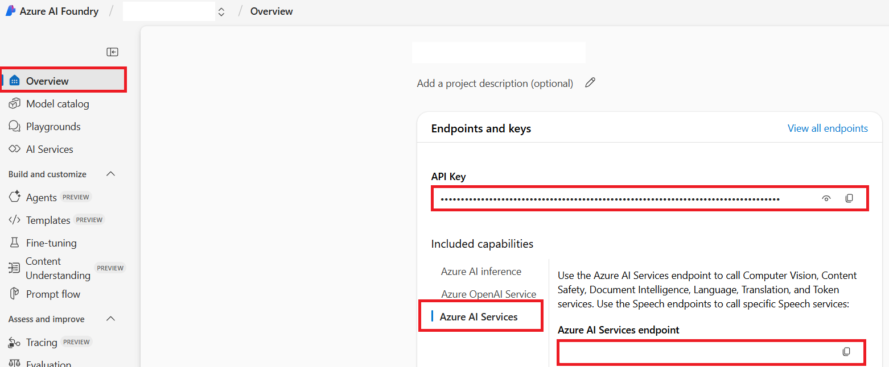

# Azure AI-installation

Använd den här guiden när du vill konfigurera Azure OpenAI för textöversättning och Azure AI Vision för att extrahera text från bilder.

## Förutsättningar

- En Azure-prenumeration.
- Behörighet att skapa eller använda Azure AI-resurser och modelldistributioner.
- Ett projekt i Azure AI Foundry eller motsvarande åtkomst till Azure OpenAI och Azure AI Vision-resurser.

## Skapa ett Azure AI-projekt

1. Öppna [Azure AI Foundry](https://ai.azure.com).
2. Skapa eller välj ett projekt.
3. Skapa eller välj en AI-hubb för projektet.
4. Öppna projektöversikten efter skapandet.

## Distribuera en Azure OpenAI-modell

1. I projektet, öppna **Modeller + slutpunkter**.
2. Välj **Distribuera modell**.
3. Välj en GPT-modell som `gpt-4o`.
4. Distribuera modellen.
5. Anteckna slutpunkten, distributionsnamnet, modellnamnet, API-nyckeln och API-versionen.

!!! note
    Azure OpenAI API-versionen är separat från modellversionen som visas i Azure AI Foundry. Välj en API-version som stöds för din distribution.

## Konfigurera Azure AI Vision

Bildöversättning använder Azure AI Vision för att extrahera text från källbilder innan texten översätts.

I ditt Azure AI-projekt, hitta Azure AI Services-nyckeln och slutpunkten.



Anteckna:

- Azure AI Service-slutpunkt
- Azure AI Service API-nyckel

## Miljövariabler

Lägg till autentiseringsuppgifterna i din `.env`-fil eller CI-hemligheter.

```bash
# Azure AI Vision, nödvändig för bildöversättning
AZURE_AI_SERVICE_API_KEY="..."
AZURE_AI_SERVICE_ENDPOINT="https://<resource>.cognitiveservices.azure.com/"

# Azure OpenAI, nödvändig för textöversättning
AZURE_OPENAI_API_KEY="..."
AZURE_OPENAI_ENDPOINT="https://<resource>.openai.azure.com/"
AZURE_OPENAI_MODEL_NAME="gpt-4o"
AZURE_OPENAI_CHAT_DEPLOYMENT_NAME="<deployment>"
AZURE_OPENAI_API_VERSION="2024-12-01-preview"
```

Co-op Translator stöder också valfria reservuppsättningar med autentiseringsuppgifter. Duplicera en fullständig leverantörsuppsättning med suffix som `_1` eller `_2`; alla variabler i en reservuppsättning måste ha samma suffix.

```bash
AZURE_OPENAI_API_KEY_1="..."
AZURE_OPENAI_ENDPOINT_1="https://<resource-1>.openai.azure.com/"
AZURE_OPENAI_MODEL_NAME_1="gpt-4o"
AZURE_OPENAI_CHAT_DEPLOYMENT_NAME_1="<deployment-1>"
AZURE_OPENAI_API_VERSION_1="2024-12-01-preview"
```

## Nästa steg

- Gå tillbaka till [Configuration](configuration.md) för att ställa in lokala eller CI-miljövariabler.
- Använd [CLI Reference](cli.md) för översättningskommandon.
- Använd [GitHub Actions](github-actions.md) för att automatisera pull requests för översättningar.