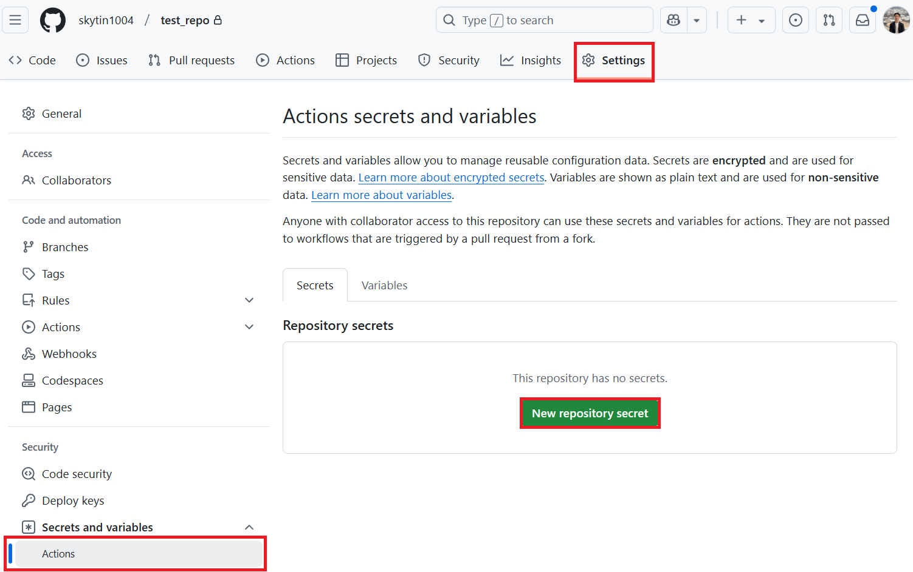

# GitHub Actions

جب آپ چاہتے ہیں کہ ایک ریپوزٹری تبدیل شدہ دستاویزات کو خودکار طور پر ترجمہ کرے اور تیار شدہ نتائج کے ساتھ ایک پل ریکویسٹ کھولے تو GitHub Actions استعمال کریں۔

معیاری `GITHUB_TOKEN` سیٹ اپ سے شروع کریں، اس میں وہ آرگنائزیشن ریپوزٹریز بھی شامل ہیں جہاں پالیسی اس کی اجازت دیتی ہو۔ جب آپ کی آرگنائزیشن کو ایک App شناخت درکار ہو یا آپ کو خودکار ڈاون سٹریم ورک فلو رنز کی ضرورت ہو تو [GitHub App Setup](#github-app-setup) دیکھیں۔

**انسانی ترمیمات:** یہ ورک فلو تبدیل شدہ سورس فائلوں کا مکمل طور پر دوبارہ ترجمہ کرتے ہیں اور اپنی ترجمہ شدہ فائلوں میں کی گئی الفاظ کی ترمیمات کو اوور رائٹ کر سکتے ہیں۔ مرج کرنے سے پہلے ہر PR کا جائزہ لیں۔ Markdown بلاک لیول میں قبول شدہ ترامیم کی حفاظت کے لیے [Python API translation state provider](api.md#preserve-accepted-human-edits-with-a-translation-state-provider) کے ساتھ ایک کسٹم انٹیگریشن درکار ہے۔

## آپ کی پہلی README ترجمہ PR

ایک روٹ `README.md` اور ایک ہدف زبان کے ساتھ شروع کریں۔ یہ ورک فلو صرف مارک ڈاؤن کا ترجمہ کرتا ہے، اس لیے Azure AI Vision ضروری نہیں ہے۔

1. ریپوزٹری میں جسے آپ ترجمہ کرنا چاہتے ہیں، `.github/workflows/translate-readme.yml` میں [translate-readme.yml](../../assets/workflows/translate-readme.yml) کو کاپی کریں ([view the template on GitHub](https://github.com/Azure/co-op-translator/blob/main/docs/assets/workflows/translate-readme.yml))، اور اسے اس ریپوزٹری کی ڈیفالٹ شاخ میں کمیٹ کریں۔ ٹیمپلیٹ روٹ ایکشن `Azure/co-op-translator@main` استعمال کرتا ہے، جو اسی سورس ریف سے CLI انسٹال کرتا ہے۔ قابل تکرار رنز کے لیے ایک جائزہ شدہ کمیٹ کو پن کریں۔
2. **Actions > Translate README > Run workflow** کھولیں، ایک زبان منتخب کریں، اور **Preview only** کو چیک شدہ ہی رہنے دیں۔ پریویو قدم میں ٹوکن کا تخمینہ دیکھیں۔ پریویو ماڈل فراہم کنندگان کو کال نہیں کرتا، ترجمے نہیں لکھتا، اور PR نہیں بناتا۔
3. ایک [متن فراہم کنندہ](#prerequisites) کے لیے سیکرٹس شامل کریں، اور **Settings > Actions > General** کے تحت **GitHub Actions کو پل ریکویسٹ بنانے اور منظوری دینے کی اجازت دیں** کو فعال کریں۔ ٹیمپلیٹ اپنے جاب کے لیے `contents: write` اور `pull-requests: write` کی درخواست کرتا ہے؛ آپ کو ہر ورک فلو کے لیے ڈیفالٹ اجازتیں تبدیل کرنے کی ضرورت نہیں ہے۔ اگر آرگنائزیشن کی پالیسی ان اجازتوں یا اس سیٹنگ کو روک دیتی ہے، تو منظور شدہ [GitHub App](#github-app-setup) کے بارے میں کسی ایڈمنسٹریٹر سے پوچھیں۔
4. ورک فلو کو دوبارہ **Preview only** کو ان چیک کر کے چلائیں۔ یہ پریویو کرتا ہے، ترجمہ کرتا ہے، `co-op-review --readme-only` چلاتا ہے، اور صرف جب ترجمہ اور جائزہ کامیاب ہوں تو ہی ایک ترجمہ PR بناتا یا اپ ڈیٹ کرتا ہے۔ ورک فلو سمری PR کے لنک فراہم کرتی ہے۔
5. PR میں الفاظ اور فائلوں میں تبدیلیوں کا جائزہ لیں، پھر جب تیار ہوں مرج کریں۔ ورک فلو خودکار طریقے سے مرج نہیں کرتا۔

PR میں صرف `translations/<language>/README.md` اور اس کی زبان میٹا ڈیٹا فائل شامل ہوتی ہے۔ ماخذ README تبدیل نہیں ہوتا، اور دیگر دستاویزات کے لنکس ماخذ دستاویزات کی طرف رہتے ہیں۔ PR باڈی میں تبدیل شدہ فائلیں اور ساختی جائزے کے نتائج درج ہوتے ہیں۔ اگر ترجمہ یا جائزہ ناکام ہوتا ہے تو ورک فلو سمری اور ناکام قدم کے لاگز کا معائنہ کریں؛ کوئی PR نہیں بنایا جاتا۔ اگر کوئی تبدیلی نہیں ہے تو نیا PR ضروری نہیں ہے۔

**تنظیم اور CI نوٹ:** ایک GitHub App اختیاری ہے، آرگنائزیشن کے مالک ہونے کی شرط نہیں۔ `GITHUB_TOKEN` کے ساتھ، PR کھولنے، اپ ڈیٹ کرنے، یا دوبارہ کھولنے کے لیے پل-ریکویسٹ ورک فلو کو چلانے کے لیے ایک ایسے صارف کی ضرورت ہوتی ہے جس کے پاس write رسائی ہو تاکہ وہ **Approve workflows to run** منتخب کرے۔ پش ورک فلو اس ٹوکن سے متحرک نہیں ہوتے۔ غیر نگرانی شدہ ڈاون اسٹریم CI کے لیے، [GitHub App Setup](#github-app-setup) اور GitHub کے [workflow triggering rules](https://docs.github.com/en/actions/how-tos/writing-workflows/choosing-when-your-workflow-runs/triggering-a-workflow) دیکھیں۔

## پیشگی تقاضے

ورک فلو بنانے سے پہلے، AI سروس کے وہ سیکرٹس ترتیب دیں جن کی آپ کے ترجمہ رن کو ضرورت ہے۔

متنی ترجمے کے لیے ایک زبان ماڈل فراہم کنندہ درکار ہے:

- Azure OpenAI: `AZURE_OPENAI_API_KEY`, `AZURE_OPENAI_ENDPOINT`, `AZURE_OPENAI_MODEL_NAME`, `AZURE_OPENAI_CHAT_DEPLOYMENT_NAME`, `AZURE_OPENAI_API_VERSION`
- OpenAI: `OPENAI_API_KEY`, `OPENAI_CHAT_MODEL_ID`, اور اختیاری طور پر `OPENAI_ORG_ID` اور `OPENAI_BASE_URL`
- Anthropic: `ANTHROPIC_API_KEY`, `ANTHROPIC_MODEL`, اور اختیاری طور پر `ANTHROPIC_BASE_URL`

تصویری ترجمے کے لیے اضافی طور پر Azure AI Vision درکار ہے:

- `AZURE_AI_SERVICE_API_KEY`
- `AZURE_AI_SERVICE_ENDPOINT`

مقامی ترتیب کی تفصیلات کے لیے [Configuration](configuration.md) اور [Azure AI Setup](azure-ai-setup.md) دیکھیں۔

## معیاری سیٹ اپ

README ورک فلو آزمانے کے بعد، اس سیٹ اپ کو استعمال کریں تاکہ ایک ریپوزٹری کی مارک ڈاؤن فائلوں کو متعدد زبانوں میں ترجمہ کیا جا سکے۔ یہ PR کھولنے سے پہلے ایک مارک ڈاؤن جائزہ چلائے گا اور Azure AI Vision کی ضرورت نہیں ہے۔

### مرحلہ 1: ریپوزٹری سیکرٹس شامل کریں

اپنی ہدف ریپوزٹری میں **Settings** > **Secrets and variables** > **Actions** کھولیں، پھر وہ پرووائیڈر سیکرٹس شامل کریں جو آپ کا ورک فلو استعمال کرے گا۔



### مرحلہ 2: ورک فلو اجازتیں فعال کریں

**Settings** > **Actions** > **General** کھولیں۔

**Workflow permissions** کے تحت:

1. **GitHub Actions کو پل ریکویسٹ بنانے اور منظوری دینے کی اجازت دیں** کو فعال کریں۔
2. سیٹنگ کو محفوظ کریں۔

نیچے دیا گیا جاب واضح طور پر `contents: write` اور `pull-requests: write` کی درخواست کرتا ہے۔ ریپوزٹری کی ڈیفالٹ ورک فلو اجازتیں تبدیل نہ کریں۔ اگر آرگنائزیشن پالیسی PR بنانے کو روکتی ہے، تو منظور شدہ [GitHub App](#github-app-setup) کے بارے میں کسی ایڈمنسٹریٹر سے پوچھیں۔

### مرحلہ 3: ورک فلو شامل کریں

`.github/workflows/co-op-translator.yml` بنائیں:

```yaml
name: Co-op Translator

on:
  push:
    branches:
      - main

jobs:
  co-op-translator:
    runs-on: ubuntu-latest
    env:
      TARGET_LANGUAGES: "es fr de"

    permissions:
      contents: write
      pull-requests: write

    steps:
      - name: Checkout repository
        uses: actions/checkout@v4
        with:
          fetch-depth: 0

      - name: Set up Python
        uses: actions/setup-python@v7
        with:
          python-version: "3.11"

      - name: Install Co-op Translator
        run: |
          python -m pip install --upgrade pip
          pip install co-op-translator

      - name: Run Co-op Translator
        env:
          PYTHONIOENCODING: utf-8
          AZURE_OPENAI_API_KEY: ${{ secrets.AZURE_OPENAI_API_KEY }}
          AZURE_OPENAI_ENDPOINT: ${{ secrets.AZURE_OPENAI_ENDPOINT }}
          AZURE_OPENAI_MODEL_NAME: ${{ secrets.AZURE_OPENAI_MODEL_NAME }}
          AZURE_OPENAI_CHAT_DEPLOYMENT_NAME: ${{ secrets.AZURE_OPENAI_CHAT_DEPLOYMENT_NAME }}
          AZURE_OPENAI_API_VERSION: ${{ secrets.AZURE_OPENAI_API_VERSION }}
          OPENAI_API_KEY: ${{ secrets.OPENAI_API_KEY }}
          OPENAI_ORG_ID: ${{ secrets.OPENAI_ORG_ID }}
          OPENAI_CHAT_MODEL_ID: ${{ secrets.OPENAI_CHAT_MODEL_ID }}
          OPENAI_BASE_URL: ${{ secrets.OPENAI_BASE_URL }}
          ANTHROPIC_API_KEY: ${{ secrets.ANTHROPIC_API_KEY }}
          ANTHROPIC_MODEL: ${{ secrets.ANTHROPIC_MODEL }}
          ANTHROPIC_BASE_URL: ${{ secrets.ANTHROPIC_BASE_URL }}
        run: |
          translate -l "$TARGET_LANGUAGES" -md -y

      - name: Review Markdown translations
        run: |
          python - <<'PY'
          import os
          from co_op_translator.api import run_review

          run_review(
              language_codes=os.environ["TARGET_LANGUAGES"].split(),
              markdown=True,
              notebook=False,
              output_format="github",
          )
          PY

      - name: Create Pull Request with translations
        uses: peter-evans/create-pull-request@v5
        with:
          token: ${{ secrets.GITHUB_TOKEN }}
          commit-message: "Update translations via Co-op Translator"
          title: "Update translations via Co-op Translator"
          body: |
            This PR updates translations for recent changes to the main branch.
            Markdown structure, freshness, and local links were reviewed.
            Review translation wording before merging.

            Generated by Co-op Translator.
          branch: update-translations
          base: main
          labels: translation, automated-pr
          delete-branch: true
          add-paths: |
            translations/
```

`TARGET_LANGUAGES` کو اپنی پروجیکٹ کی ضرورت کے مطابق زبانوں پر سیٹ کریں۔ جائزہ صرف مارک ڈاؤن کو چیک کرنے کے لیے Python API استعمال کرتا ہے، جو ترجمہ مرحلے سے میل کھاتا ہے۔ ترجمہ یا جائزے کی خرابی جاب کو PR بنانے سے پہلے روک دیتی ہے۔ ورک فلو PR کو خودکار طور پر مرج نہیں کرتا۔ بڑی ریپوزٹریز کے لیے، `on.push` کے تحت `paths:` فلٹر شامل کریں تاکہ ورک فلو صرف تبھی چلے جب دستاویزات میں تبدیلی ہو۔

### اختیاری: نوٹ بکس اور تصاویر

نوٹ بکس کے لیے، ترجمہ کمانڈ میں `-nb` شامل کریں اور جائزہ مرحلے میں `notebook=True` سیٹ کریں۔ تصویر کے متن کے لیے، دو [Azure AI Vision secrets](#prerequisites) کو ترتیب دیں، انہیں ترجمہ مرحلے کے `env` میں پاس کریں، کمانڈ میں `-img` شامل کریں، اور PR مرحلے کے `add-paths` میں `translated_images/` شامل کریں۔ ترجمہ شدہ تصاویر کو بصری طور پر جائزہ لیں؛ ڈیٹرمنِسٹک جائزہ امیج متن یا لسانی درستگی کی تصدیق نہیں کرتا۔

## GitHub ایپ کی ترتیب

جب آپ کی آرگنائزیشن کو App شناخت درکار ہو، یا جب تیار شدہ PR کو `GITHUB_TOKEN` کی منظوری کے بغیر ڈاؤن اسٹریم CI کو ٹرگر کرنے کی ضرورت ہو تو منظور شدہ GitHub App استعمال کریں۔ ایک App آرگنائزیشن پالیسی کو عبور نہیں کرتا؛ ایڈمنسٹریٹرز اب بھی اس کی انسٹالیشن اور اجازتوں کو کنٹرول کرتے ہیں۔

### مرحلہ 1: GitHub App بنائیں یا انسٹال کریں

جب دستیاب ہو تو موجودہ آرگنائزیشن فراہم کردہ App استعمال کریں، یا **Contents** اور **Pull requests** تک read/write رسائی کے ساتھ ایک بنائیں۔ اسے ہدف ریپوزٹری پر کسی بھی ضروری آرگنائزیشن منظوری کے ساتھ انسٹال کریں۔

درج کریں:

- App ID
- نجی کلید کا مواد

انہیں ریپوزٹری سیکرٹس کے طور پر محفوظ کریں:

- `GH_APP_ID`
- `GH_APP_PRIVATE_KEY`

### مرحلہ 2: App ٹوکن جنریٹ کریں

اس مرحلے کو موجودہ پل ریکویسٹ مرحلے سے فوراً پہلے شامل کریں۔ README ٹیمپلیٹ کے لیے، وہی کامیابی کی شرط استعمال کریں تاکہ پریویوز اور ناکام ترجمے App ٹوکن کی درخواست نہ کریں:

```yaml
      - name: Authenticate GitHub App
        id: generate_token
        if: ${{ !inputs.preview && steps.translate.outcome == 'success' && steps.review.outcome == 'success' }}
        uses: actions/create-github-app-token@v2
        with:
          app-id: ${{ secrets.GH_APP_ID }}
          private-key: ${{ secrets.GH_APP_PRIVATE_KEY }}
          permission-contents: write
          permission-pull-requests: write
```

پھر موجودہ پل ریکویسٹ مرحلے کے `token` ان پٹ کو صرف `${{ steps.generate_token.outputs.token }}` میں تبدیل کریں۔ اس کی کامیابی کی شرط، برانچ، PR باڈی، اور `add-paths` کو بغیر بدلے رکھیں۔ ٹوکن بذاتِ خود ڈیفالٹ طور پر موجودہ ریپوزٹری تک محدود ہوتا ہے۔ جب README ٹیمپلیٹ کی بجائے معیاری سیٹ اپ کو ڈھالتے ہیں تو اوپر والا `if` ہٹا دیں: وہ ورک فلو ڈیفالٹ کامیابی کی شرط استعمال کرتا ہے، لہٰذا ٹوکن کی تخلیق اور PR کی تخلیق صرف تب ہی چلتی ہے جب ترجمہ اور جائزہ کامیاب ہوں۔

انسٹالیشن اور ٹوکن اجازتوں کے لیے سرکاری [create-github-app-token Action](https://github.com/actions/create-github-app-token/tree/v2) دیکھیں۔

## رنر حدود

GitHub-میزبان رنرز کے لیے جاب کی زیادہ سے زیادہ مدت ہوتی ہے۔ بڑی ریپوزٹریز یا بہت سی ہدفی زبانیں اس حد کو پار کر سکتی ہیں۔

بڑے ترجمہ کے ورک لوڈز کے لیے:

- فی رن کم زبانیں ترجمہ کریں۔
- مواد کے فلگ استعمال کریں جیسے `-md`, `-nb`، یا `-img`۔
- جب ریپوزٹری کا سائز یا ماڈل کی لیٹنسی ہوسٹڈ رنرز کو غیر قابلِ اعتماد بنائے تو self-hosted رنر استعمال کریں۔

## CI میں جائزہ

جب کسی پل ریکویسٹ کو بغیر LLM یا Vision فراہم کنندگان کو کال کیے تیار کردہ ترجموں کی توثیق کرنی ہو تو `co-op-review` استعمال کریں۔

```yaml
      - name: Review translated outputs
        run: |
          co-op-review --changed-from "origin/${{ github.base_ref }}" --format github
```

`co-op-review` ایک بیٹا ڈیٹرمنِسٹک جائزہ کمانڈ ہے۔ اس کے چیکس اور آؤٹ پٹ اسکیمہ میں تبدیلی آ سکتی ہے، مگر یہ CI کے لیے محفوظ رہنے کے لیے ڈیزائن کیا گیا ہے کیونکہ یہ فائلیں نہیں لکھتا اور نہ ہی ماڈل فراہم کنندگان کو کال کرتا ہے۔