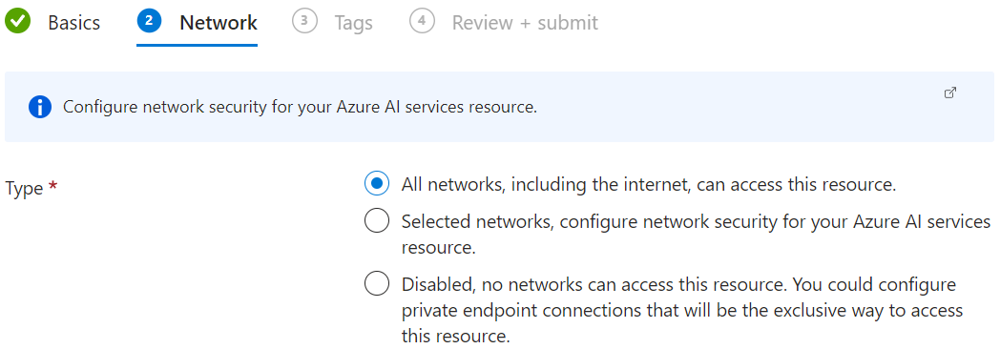

# Set up Azure resources before starting

This guide will walk you through the steps to set up the necessary Azure resources for using Co Op Translator. You'll create an Azure Computer Vision resource and Azure OpenAI resource which provides the translation capabilities required by the package.

### Create an Azure Account

If you don't already have an Azure account, you'll need to create one.

1. **Navigate to the [Azure Sign Up](https://azure.microsoft.com/free/) page.**
2. Select **Try Azure for free** or **Pay as you go**.
3. **Follow the on-screen instructions** to create your account.
   - Provide your personal details and contact information.
   - **Verification:** You'll need to verify your identity using a credit card or phone number.

### Create an Azure Computer Vision resource

1. Sign in to the [Azure Portal](https://portal.azure.com/).

1. Type *computer vision* in the **search bar** at the top of the portal page and select **Computer vision** from the options that appear.

    

1. Select **+ Create** from the navigation menu.

    

1. Perform the following tasks:

    - Select your Azure **Subscription**.
    - Select the **Resource group** to use (create a new one if needed).
    - Select the **Region** you'd like to use.
    - Enter **Name**. It must be a unique value.
    - Select the **Pricing tier** you'd like to use.

    

1. Select **Review + Create**.

1. Select **Create**.

### Create an Azure OpenAI resource

1. Type *azure openai* in the **search bar** at the top of the portal page and select **Azure OpenAI** from the options that appear.

    

1. Select **+ Create** from the navigation menu.

    

1. Perform the following tasks:

    - Select your Azure **Subscription**.
    - Select the **Resource group** to use (create a new one if needed).
    - Select the **Region** you'd like to use.
    - Enter **Name**. It must be a unique value.
    - Select the **Pricing tier** you'd like to use.

    

1. Select **Next** to move to the **Network** page.

1. Select a network security **Type** you'd like to use.

    

1. Select **Next** to move to the **Tags** page.

1. Select **Next** to move to the **Review + submit** page.

1. Select **Create**.

    

### Deploy Azure OpenAI models

1. Navigate to the Azure OpenAI resource that you created.

1. Select **Go to Azure OpenAI Studio** from the navigation menu.

    

1. Inside Azure OpenAI Studio, select **Deployments** from the left side tab.

    

1. Select **+ Create new deployment** from the navigation menu to create a new **gpt-4o** deployment.

    

1. Perform the following tasks:

    - For the model, select **gpt-4o**.
    - For the **Model version**, select the version you'd like to use.
    - For the **Deployment name**, add a name that's unique to this cloud instance. For example, **gpt-4o**.

1. Select **Create**.
