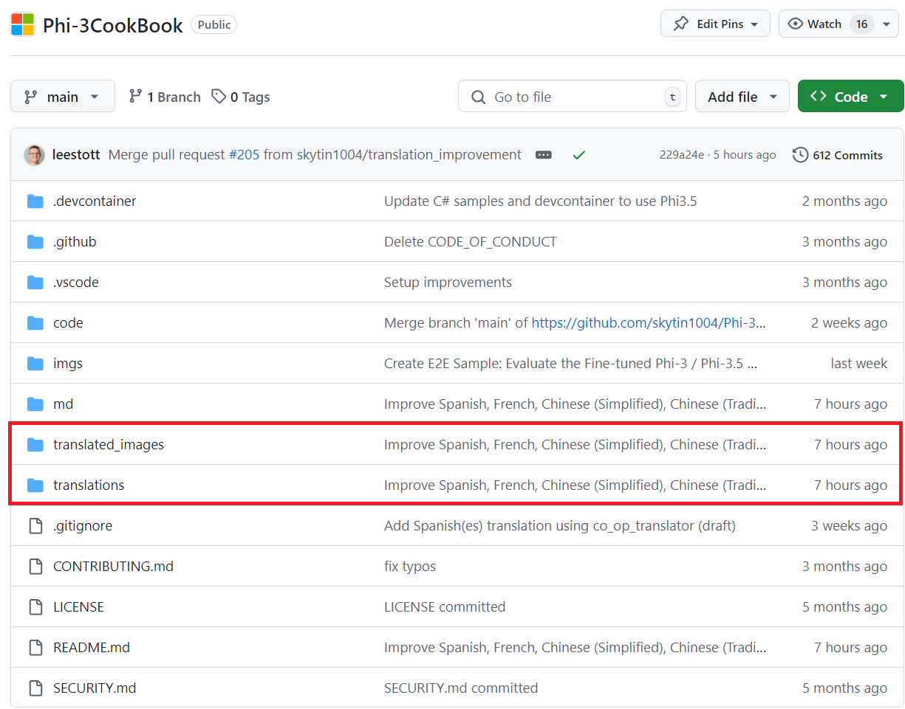
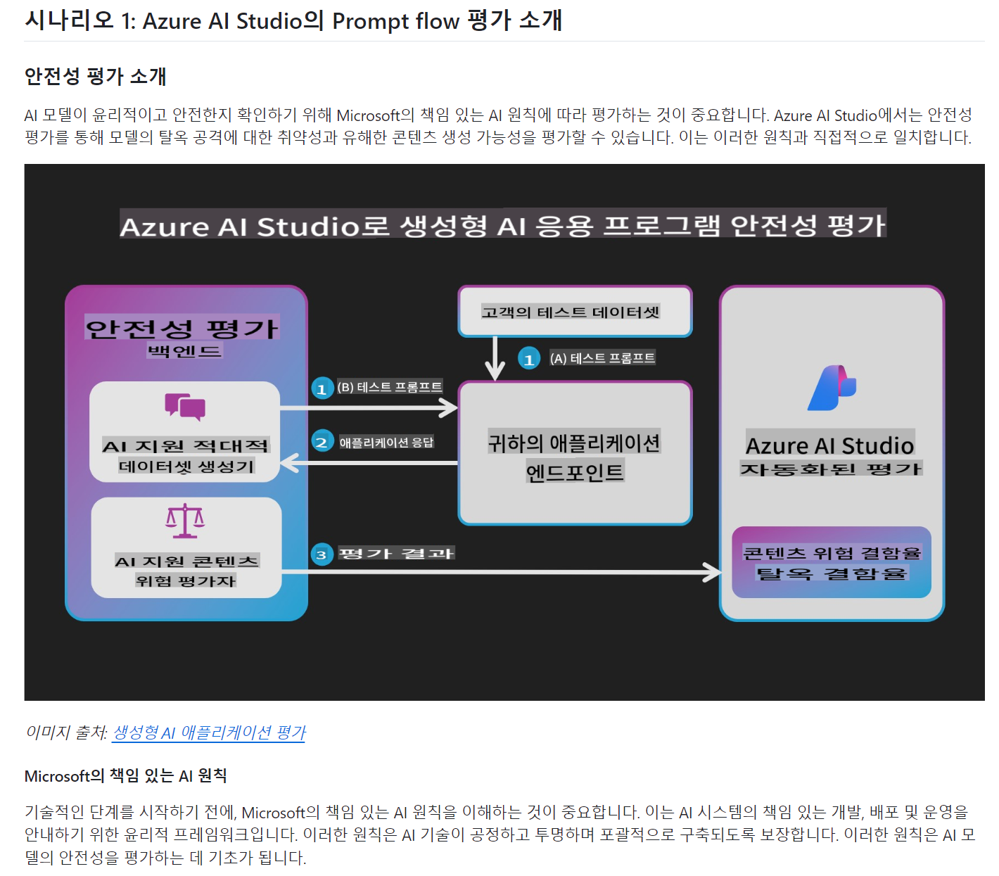

# Phi-3 Cookbook translation: A case study

The **Phi-3 Cookbook** is an official open source guide that provides detailed instructions on Phi-3 and Phi-3.5 small language models. Given its technical nature and importance to the global AI community, translating it into multiple languages was a crucial step toward making this valuable resource accessible to non-English-speaking developers and researchers.

By using **Co-op Translator**, I was able to streamline the translation process, automating the conversion of both Markdown files and images containing embedded text into several languages. This case study explains how the tool was applied to the **Phi-3 Cookbook**, the challenges encountered, and the solutions implemented.

## The Translation Process

1. **Preparation**: The first step was to organize the markdown files and image assets from the **Phi-3 Cookbook**. I removed the previously manually translated files to ensure a clean slate for the automated process, as leaving them would result in repeated translations. I also created an .env file in the root directory to securely store the necessary Azure API keys and configuration settings.

1. **Azure Setup**: I configured **Azure OpenAI** to handle the markdown text translations and **Azure Computer Vision** for extracting and translating text from images. This setup allowed the tool to automatically detect and process both types of content seamlessly.

1. **Installing Co-op Translator**: I installed the **Co-op Translator** package using `Poetry` to manage the dependencies. After installing, I ran the `translate` command with appropriate language codes to initiate the translation process.

1. **Execution with Co-op Translator**: Using **Co-op Translator**, I initiated the translation process:
   - The markdown files were processed through **Azure OpenAI** for translation.
   - **Azure Computer Vision** was used to extract text from images, followed by **Azure OpenAI** for translating the extracted text.
   - The translated markdown and image files were saved in dedicated language-specific folders.

1. **Review**: After the translations were completed, I reviewed the output for accuracy. The automated process produced high-quality translations, significantly reducing the need for manual adjustments.

> [!NOTE]
> Once the translations are done, you'll find the `translations` and `translated_images` folders in the root directory. You can see an example of the folder structure in the **Phi-3 Cookbook**:
> 

## Challenges and Solutions

While the process was mostly smooth, a few challenges arose:

- **Handling files with many code blocks**: Some markdown files contained many code blocks. During translation, the tool splits the content into chunks, and if a split occurred within a code block, the translated output would sometimes break. To resolve this, we implemented a solution where code blocks are temporarily replaced with placeholders and skipped during translation, ensuring the integrity of both the code and the translation. In future versions, we plan to enhance this feature by translating comments within code blocks. This will involve separating code blocks from the rest of the markdown, accurately translating each part, and then reintegrating them into the final translated file.

- **Text from images**: Extracting and translating text from complex images was challenging, especially when the images had a lot of text in small areas. This often led to the translated text in image being either overly stretched or compressed, affecting readability. While we managed to mitigate some of these issues, further improvements are needed in this area to ensure higher accuracy.

## Results

The translation of the **Phi-3 Cookbook** has been successful. You can now view the translated version in multiple languages. If you're interested in viewing the translated **Phi-3 Cookbook**, you can visit the **[Phi-3CookBook](https://github.com/microsoft/Phi-3CookBook?tab=readme-ov-file#-multi-language-support)**. This link will navigate you to the multilingual versions of the **Phi-3 Cookbook**.

Below is a markdown example from **Phi-3 Cookbook**, translated into Korean using the **Co-op Translator**:

