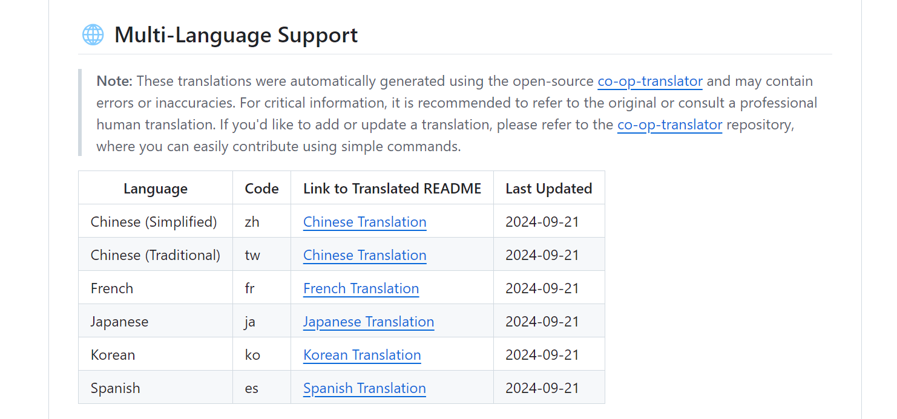

# Phi-3 Cookbook translation: A case study

The **Phi-3 Cookbook** is an official open source guide that provides detailed instructions on Phi-3 and Phi-3.5 small language models. Given its technical nature and importance to the global AI community, translating it into multiple languages was a crucial step toward making this valuable resource accessible to non-English-speaking developers and researchers.

By using **Co-op Translator**, I was able to streamline the translation process, automating the conversion of both Markdown files and images containing embedded text into several languages. This case study explains how the tool was applied to the **Phi-3 Cookbook**, the challenges encountered, and the solutions implemented.

## The Translation Process

1. **Preparation**: First, I organized the markdown files and image assets from the **Phi-3 Cookbook**. I removed any manually translated files from previous versions to ensure the automation process started from a clean slate. Leaving those files would have resulted in unnecessary duplicates. Additionally, I created an *.env* file in the root directory to securely store the Azure API keys and configuration settings required for the translation.

1. **Azure setup**: I configured **Azure OpenAI** to handle the translation of the Markdown content and **Azure Computer Vision** to extract and translate text from images. This setup enabled Co-op Translator to automatically detect and process both text-based and image-based content seamlessly.

1. **Installing Co-op Translator**: I installed the **Co-op Translator** package using `Poetry` to manage dependencies.

1. **Multi-language support setup**: Before starting the translation process, I created a table in the README linking to the translated versions of the document. During translation, Co-op Translator automatically adjusted the links, allowing users to switch between different language versions seamlessly. For example, if a user navigates to the Korean README, they can easily switch to other translations like Spanish or Japanese without leaving the translated page.

    ```dotnetcli
    ## 🌐 Multi-Language Support
    
    > **Note:**
    > These translations were automatically generated using the open-source [co-op-translator](https://github.com/Azure/co-op-translator) and may contain errors or inaccuracies. For critical information, it is recommended to refer to the original or consult a professional human translation. If you'd like to add or update a translation, please refer to the [co-op-translator](https://github.com/Azure/co-op-translator) repository, where you can easily contribute using simple commands.
    
    | Language             | Code | Link to Translated README                               | Last Updated |
    |----------------------|------|---------------------------------------------------------|--------------|
    | Chinese (Simplified) | zh   | [Chinese Translation](./translations/zh/README.md)      | 2024-10-04   |
    | Chinese (Traditional)| tw   | [Chinese Translation](./translations/tw/README.md)      | 2024-10-04   |
    | French               | fr   | [French Translation](./translations/fr/README.md)       | 2024-10-04   |
    | Japanese             | ja   | [Japanese Translation](./translations/ja/README.md)     | 2024-10-04   |
    | Korean               | ko   | [Korean Translation](./translations/ko/README.md)       | 2024-10-04   |
    | Spanish              | es   | [Spanish Translation](./translations/es/README.md)      | 2024-10-04   |
    ```

    

1. **Execution with Co-op Translator**: Using **Co-op Translator**, I initiated the translation process by running the `translate` command with the appropriate language codes, such as Spanish (`es`), French (`fr`), Korean (`ko`), and others.

   - The Markdown files were translated using **Azure OpenAI**.
   - **Azure Computer Vision** was utilized to extract text from images, and **Azure OpenAI** handled the translation of the extracted text.
   - The translated Markdown and image files were saved in dedicated, language-specific folders.
   - Below is an example of how the Korean translation was generated for the Phi-3 Cookbook:

    ```bash
    (.venv) C:\Users\sms79\dev\Phi-3CookBook>translate -l "ko"
    Translating images: 100%|███████████████████████████████████████████████████| 276/276 [1:09:56<00:00, 15.37s/it]
    Translating markdown files: 100%|███████████████████████████████████████████| 153/153 [1:43:07<00:00, 241.31s/it]
    ```

   - In this example, **Co-op Translator** processed 276 images and 153 Markdown files for the Korean translation, automatically saving the results in the appropriate language folder.

1. **Review**: After the translations were completed, I reviewed the output for accuracy. The automated process produced high-quality translations, significantly reducing the need for manual adjustments.

> [!NOTE]
> Once the translations are done, you'll find the `translations` and `translated_images` folders in the root directory. You can see an example of the folder structure in the **Phi-3 Cookbook**:
> 

## Challenges and Solutions

While the process was mostly smooth, a few challenges arose:

- **Handling files with many code blocks**: Some markdown files contained many code blocks. During translation, the tool splits the content into chunks, and if a split occurred within a code block, the translated output would sometimes break. To resolve this, we implemented a solution where code blocks are temporarily replaced with placeholders and skipped during translation, ensuring the integrity of both the code and the translation. In future versions, we plan to enhance this feature by translating comments within code blocks. This will involve separating code blocks from the rest of the markdown, accurately translating each part, and then reintegrating them into the final translated file.

- **Text from images**: Extracting and translating text from complex images was challenging, especially when the images had a lot of text in small areas. This often led to the translated text in image being either overly stretched or compressed, affecting readability. While we managed to mitigate some of these issues, further improvements are needed in this area to ensure higher accuracy.

## Results

The translation of the **Phi-3 Cookbook** has been successful. You can now view the translated version in multiple languages. If you're interested in viewing the translated **Phi-3 Cookbook**, you can visit the **[Phi-3CookBook](https://github.com/microsoft/Phi-3CookBook?tab=readme-ov-file#-multi-language-support)**. This link will navigate you to the multilingual versions of the **Phi-3 Cookbook**.

Below is a markdown example from **Phi-3 Cookbook**, translated into Korean using the **Co-op Translator**:


