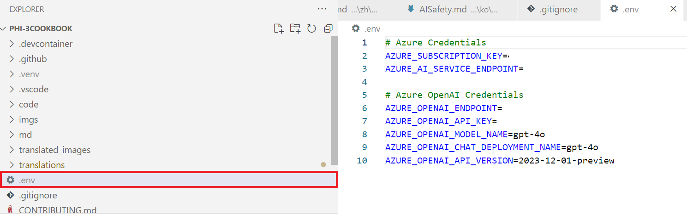
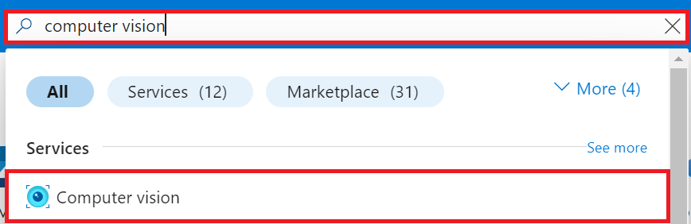
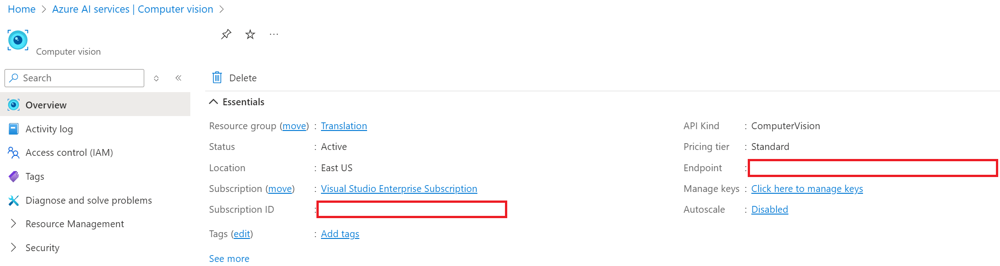
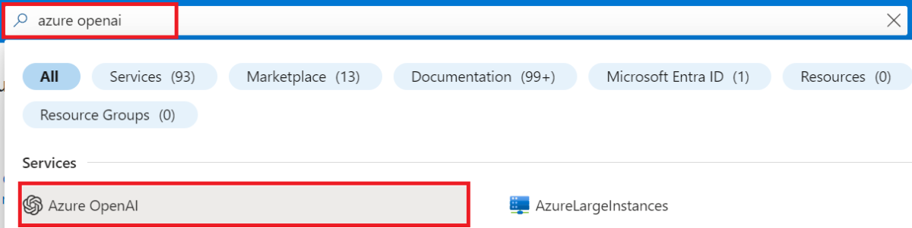
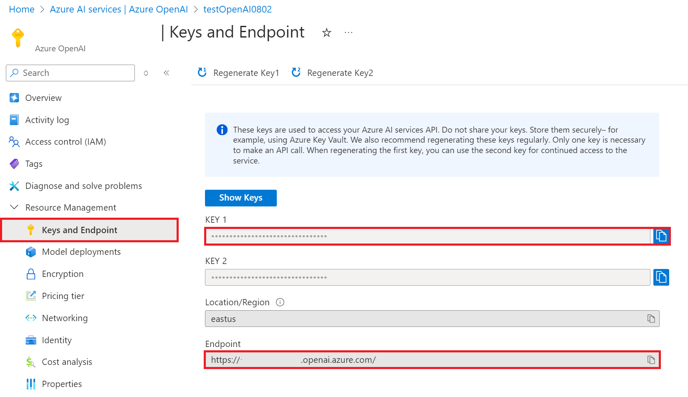
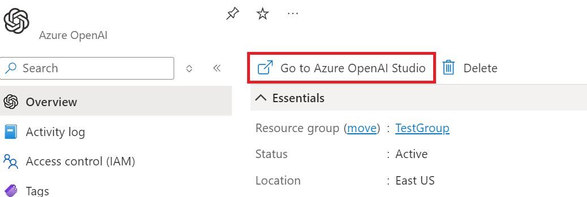
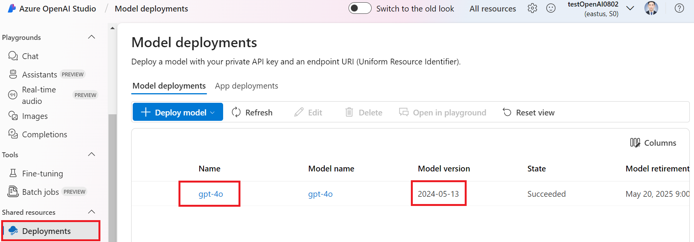

# Create the *.env* file in the root directory

In this tutorial, we will guide you through setting up your environment variables for Azure services using an *.env* file. Environment variables allow you to securely manage sensitive credentials, such as API keys, without hard-coding them into your codebase.

## Create the *.env* file

In the root directory of your project, create a file named *.env*. This file will store all your environment variables in a simple format.

> [!WARNING]
> Do not commit your *.env* file to version control systems like Git. Add *.env* to your .gitignore file to prevent accidental commits.

1. Navigate to the root directory of your project.

1. Create an *.env* file in the root directory of your project.

    

1. Open the *.env* file and paste the following template:

    ```plaintext
    # Azure Credentials
    AZURE_SUBSCRIPTION_KEY="your_azure_subscription_key"
    AZURE_AI_SERVICE_ENDPOINT="https://your_azure_ai_service_endpoint"
    
    # Azure OpenAI Credentials
    AZURE_OPENAI_API_KEY="your_azure_openai_api_key"
    AZURE_OPENAI_ENDPOINT="https://your_azure_openai_endpoint"
    AZURE_OPENAI_MODEL_NAME="your_model_name"
    AZURE_OPENAI_CHAT_DEPLOYMENT_NAME="your_deployment_name"
    AZURE_OPENAI_API_VERSION="your_api_version"
    ```

## Gather your Azure credentials

You will need the following Azure credentials on hand to configure the environment:

1. For Azure AI Service:

    - Azure Subscription Key: Your Azure subscription key, which allows you to access the Azure AI services.
    - Azure AI Service Endpoint: The endpoint URL for your specific Azure AI service.

1. For Azure OpenAI Service:

    - Azure OpenAI API Key: The API key for accessing Azure OpenAI services.
    - Azure OpenAI Endpoint: The endpoint URL for your Azure OpenAI service.
    - Azure OpenAI Model Name: The name of the model you will be interacting with.
    - Azure OpenAI Deployment Name: The name of your deployment for Azure OpenAI models.
    - Azure OpenAI API Version: The version of the Azure OpenAI API you are using.

### Add Azure environment variables

1. Perform the following tasks to add the  Azure Subscription key and Azure AI Services Endpoint:

    - Type *computer vision* in the **search bar** at the top of the portal page and select **Computer vision** from the options that appear.
        
    - Navigate the Azure Computer Vision resource that you are currently using.
    - Copy and paste your Subscription key and Endpoint into the *.env* file.
        

1. Perform the following tasks to add the Azure OpenAI API Key and Endpoint:

    - Type *azure openai* in the **search bar** at the top of the portal page and select **Azure OpenAI** from the options that appear.
        
    - Navigate the Azure OpenAI resource that you are currently using.
    - Select **Keys and Endpoint** from the left side tab.
    - Copy and paste your Azure OpenAI API Key and Endpoint into the *.env* file.
        

1. Perform the following tasks to add the Azure OpenAI Deployment Name and Version:
    - Navigate to the Azure OpenAI resource that you created.
    - Select **Go to Azure OpenAI Studio** from the navigation menu.
        

    - Inside Azure OpenAI Studio, select **Deployments** from the left side tab.
    - Copy and paste your Azure OpenAI **Name** and model **Version** into the *.env* file.

        

1. Save the *.env* file.

1. Now, you can access these environment variables to use **Co-op Translator** with your Azure services.
