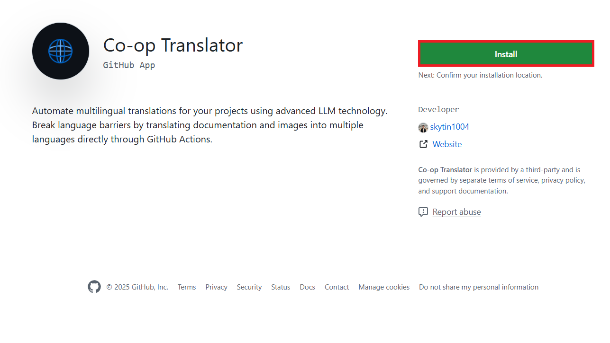
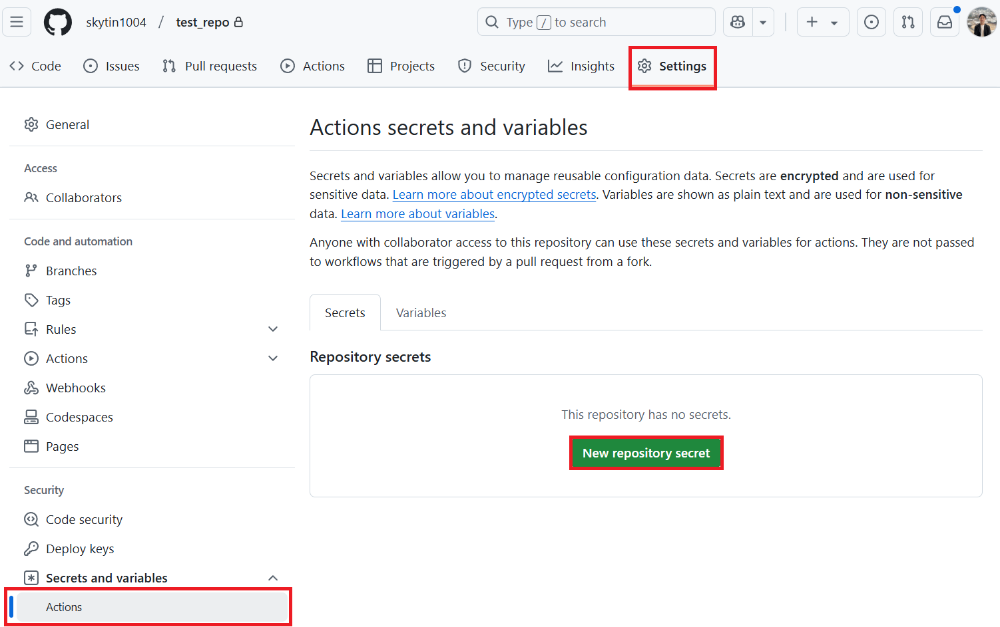
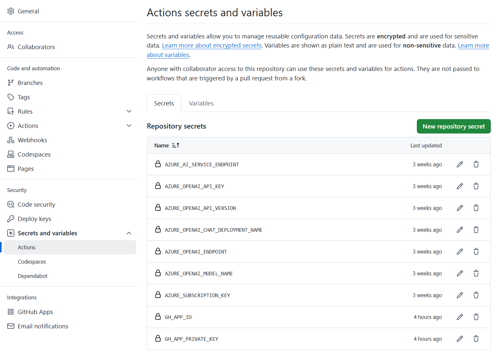
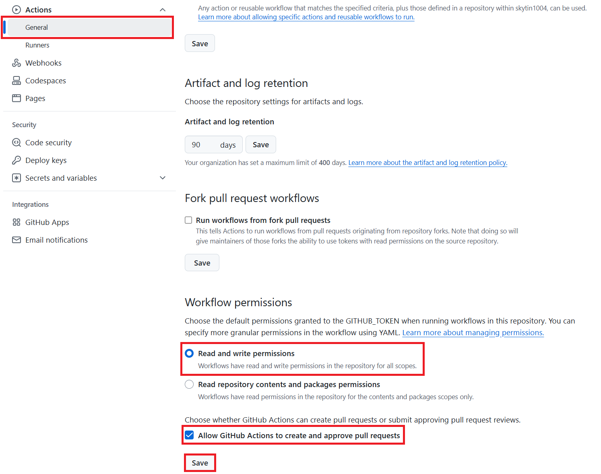

# Using the Co-op Translator GitHub Action

Automate the translation of your repository's documentation effortlessly using the Co-op Translator GitHub Action. This guide walks you through setting up the action to automatically create pull requests with updated translations whenever your source Markdown files or images change.

## Prerequisites

Before configuring the GitHub Action, ensure you have the necessary AI service credentials ready.

**1. Required: AI Language Model Credentials**
You need credentials for at least one supported Language Model:

- **Azure OpenAI**: Requires Endpoint, API Key, Model/Deployment Names, API Version.
- **OpenAI**: Requires API Key, (Optional: Org ID, Base URL, Model ID).
- See [Supported Models and Services](../../README.md/#-supported-models-and-services) for details.
- Setup Guide: [Set up Azure OpenAI](../set-up-resources/set-up-azure-openai.md).

**2. Optional: Computer Vision Credentials (for Image Translation)**

- Required only if you need to translate text within images.
- **Azure Computer Vision**: Requires Endpoint and Subscription Key.
- If not provided, the action defaults to [Markdown-only mode](../markdown-only-mode.md).
- Setup Guide: [Set up Azure Computer Vision](../set-up-resources/set-up-azure-computer-vision.md).

## Setup and Configuration

Follow these steps to configure the Co-op Translator GitHub Action in your repository:

### Step 1: Install and Configure GitHub App Authentication

The workflow uses GitHub App authentication to securely interact with your repository (e.g., create pull requests) on your behalf.

#### **Option A: Install the Pre-built Co-op Translator GitHub App (Recommended)**

1. Navigate to the [Co-op Translator GitHub App](https://github.com/apps/co-op-translator) page.

1. Click **Install** and select the account or organization where your target repository resides. Choose to install it on **All repositories** or **Only select repositories**.

    

3.  **Obtain App Credentials:** To allow the workflow to authenticate as the app, you need two pieces of information provided by the Co-op Translator team:
    *   **App ID:** The unique identifier for the Co-op Translator app. The App ID is: `[ 여기에 실제 App ID를 명시적으로 적어주세요 ]`. You can also usually find it on the [App's public page](https://github.com/apps/co-op-translator).
    *   **Private Key:** You need a private key generated specifically for the Co-op Translator app. **Important:** You cannot generate this key yourself after installation. You must obtain the **entire content** of the `.pem` private key file from the [Provide source, e.g., documentation link, maintainer contact, secure portal where the key can be downloaded]. **Treat this key like a password and keep it secure.**

1. Proceed to Step 2.

#### **Option B: Use Your Own Custom GitHub App**

- If you prefer, you can create and configure your own GitHub App. Ensure it has Read & write access to Contents and Pull requests. You will need its App ID and a generated Private Key.

### Step 2: Configure Repository Secrets

You need to add the GitHub App credentials and your AI service credentials as encrypted secrets in your repository settings. This prevents exposing sensitive keys directly in your workflow file.

1. Navigate to your target GitHub repository.

1. Go to **Settings** > **Secrets and variables** > **Actions**.

1. Under **Repository secrets**, click **New repository secret** for each secret listed below.

   

**Required Secrets:**

| Secret Name          | Description                                      | Value Source                                     |
| :------------------- | :----------------------------------------------- | :----------------------------------------------- |
| `GH_APP_ID`          | The App ID of the GitHub App (from Step 1).      | GitHub App Settings                              |
| `GH_APP_PRIVATE_KEY` | The **entire content** of the downloaded `.pem` file. | `.pem` file (from Step 1)                      |

**AI Service Secrets (Add ALL that apply based on your Prerequisites):**

| Secret Name                         | Description                               | Value Source                     |
| :---------------------------------- | :---------------------------------------- | :------------------------------- |
| `AZURE_SUBSCRIPTION_KEY`            | Key for Azure AI Service (Computer Vision)  | Azure AI Foundry                    |
| `AZURE_AI_SERVICE_ENDPOINT`         | Endpoint for Azure AI Service (Comp. Vision) | Azure AI Foundry                     |
| `AZURE_OPENAI_API_KEY`              | Key for Azure OpenAI service              | Azure AI Foundry                     |
| `AZURE_OPENAI_ENDPOINT`             | Endpoint for Azure OpenAI service         | Azure AI Foundry                     |
| `AZURE_OPENAI_MODEL_NAME`           | Your Azure OpenAI Model Name              | Azure AI Foundry                     |
| `AZURE_OPENAI_CHAT_DEPLOYMENT_NAME` | Your Azure OpenAI Deployment Name         | Azure AI Foundry                     |
| `AZURE_OPENAI_API_VERSION`          | API Version for Azure OpenAI              | Azure AI Foundry                     |
| `OPENAI_API_KEY`                    | API Key for OpenAI                        | OpenAI Platform                  |
| `OPENAI_ORG_ID`                     | OpenAI Organization ID                    | OpenAI Platform                  |
| `OPENAI_CHAT_MODEL_ID`              | Specific OpenAI model ID                  | OpenAI Platform                    |
| `OPENAI_BASE_URL`                   | Custom OpenAI API Base URL                | OpenAI Platform                    |




### Step 3: Configure Workflow Permissions

The GitHub Action needs permissions to check out code and create pull requests.

1. In your repository, go to **Settings** > **Actions** > **General**.

1. Scroll down to the **Workflow permissions** section.

1. Select **Read and write permissions**.

1. Ensure the checkbox for **Allow GitHub Actions to create and approve pull requests** is **checked**.

1. Select **Save**.



### Step 4: Create the Workflow File

Finally, create the YAML file that defines the automated workflow.

1. In the root directory of your repository, create the `.github/workflows/` directory if it doesn't exist.

1. Inside `.github/workflows/`, create a file named `co-op-translator.yml`.

1. Paste the following content into co-op-translator.yml. You can also start from the example file [co-op-translator.yml](../../examples/github-actions/co-op-translator.yml).

```
name: Co-op Translator

on:
  push:
    branches:
      - main

jobs:
  co-op-translator:
    runs-on: windows-latest

    permissions:
      contents: write
      pull-requests: write

    steps:
      - name: Checkout repository
        uses: actions/checkout@v4
        with:
          fetch-depth: 0

      - name: Set up Python
        uses: actions/setup-python@v4
        with:
          python-version: '3.10'

      - name: Install Co-op Translator
        run: |
          python -m pip install --upgrade pip
          pip install co-op-translator

      - name: Run Co-op Translator
        env:
          PYTHONIOENCODING: utf-8
          # Azure AI Service Credentials
          AZURE_SUBSCRIPTION_KEY: ${{ secrets.AZURE_SUBSCRIPTION_KEY }}
          AZURE_AI_SERVICE_ENDPOINT: ${{ secrets.AZURE_AI_SERVICE_ENDPOINT }}

          # Azure OpenAI Credentials
          AZURE_OPENAI_API_KEY: ${{ secrets.AZURE_OPENAI_API_KEY }}
          AZURE_OPENAI_ENDPOINT: ${{ secrets.AZURE_OPENAI_ENDPOINT }}
          AZURE_OPENAI_MODEL_NAME: ${{ secrets.AZURE_OPENAI_MODEL_NAME }}
          AZURE_OPENAI_CHAT_DEPLOYMENT_NAME: ${{ secrets.AZURE_OPENAI_CHAT_DEPLOYMENT_NAME }}
          AZURE_OPENAI_API_VERSION: ${{ secrets.AZURE_OPENAI_API_VERSION }}

          # OpenAI Credentials
          OPENAI_API_KEY: ${{ secrets.OPENAI_API_KEY }}
          OPENAI_ORG_ID: ${{ secrets.OPENAI_ORG_ID }}
          OPENAI_CHAT_MODEL_ID: ${{ secrets.OPENAI_CHAT_MODEL_ID }}
          OPENAI_BASE_URL: ${{ secrets.OPENAI_BASE_URL }}
        run: |
          # =====================================================================
          # IMPORTANT: Set your target languages here (REQUIRED CONFIGURATION)
          # =====================================================================

          translate -l "ar de es fa fr ru ur zh mo hk ja tw ko hi" -y  # <--- MODIFY THIS LINE with your desired languages

      - name: Authenticate GitHub App
        id: generate_token
        uses: tibdex/github-app-token@v1
        with:
          app_id: ${{ secrets.GH_APP_ID }}
          private_key: ${{ secrets.GH_APP_PRIVATE_KEY }}

      - name: Create Pull Request with translations
        uses: peter-evans/create-pull-request@v5
        with:
          token: ${{ steps.generate_token.outputs.token }}
          commit-message: "🌐 Update translations via Co-op Translator"
          title: "🌐 Update translations via Co-op Translator"
          body: |
            This PR updates translations for recent changes to the main branch.

            ### 📋 Changes included
            - Translated contents are available in the `translations/` directory
            - Translated images are available in the `translated_images/` directory

            ---
            🌐 Automatically generated by the [Co-op Translator](https://github.com/Azure/co-op-translator) GitHub Action.
          branch: update-translations
          base: main
          labels: translation, automated-pr
          delete-branch: true
          add-paths: |
            translations/
            translated_images/

```

4.  **Customize the Workflow:**
  - **[!IMPORTANT] Target Languages:** In the `Run Co-op Translator` step, you **MUST review and modify the list of language codes** within the `translate -l "..." -y` command to match your project's requirements. The example list (`ar de es...`) needs to be replaced or adjusted. The `-y` flag automatically confirms actions during the translation process; understand its implications or remove it if manual confirmation is desired via logs (though that's difficult in Actions).
  - **Trigger (`on:`):** The current trigger runs on every push to `main`. For large repositories, consider adding a `paths:` filter (see commented example in the YAML) to run the workflow only when relevant files (e.g., source documentation) change, saving runner minutes.
  - **PR Details:** Customize the `commit-message`, `title`, `body`, `branch` name, and `labels` in the `Create Pull Request` step if needed.

## Credential Management and Renewal

- **Security:** Always store sensitive credentials (API keys, private keys) as GitHub Actions secrets. Never expose them in your workflow file or repository code.
- **[!IMPORTANT] Key Renewal (Internal Microsoft Users):** Be aware that Azure service principals or keys used within Microsoft might have a mandatory renewal policy (e.g., every 6 months). Ensure you update the corresponding GitHub secrets (`AZURE_...` keys) **before they expire** to prevent workflow failures. Check your internal team or Azure subscription policies for specific renewal requirements. Regularly rotating external keys (like OpenAI) is also a good security practice.

## Running the Workflow

Once the `co-op-translator.yml` file is merged into your main branch (or the branch specified in the `on:` trigger), the workflow will automatically run whenever changes are pushed to that branch (and match the `paths` filter, if configured).

If translations are generated or updated, the action will automatically create a Pull Request containing the changes, ready for your review and merging.
