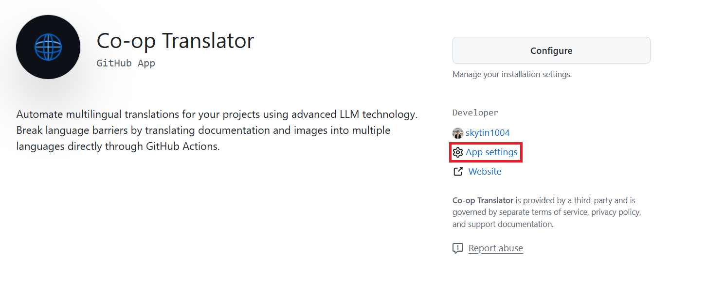
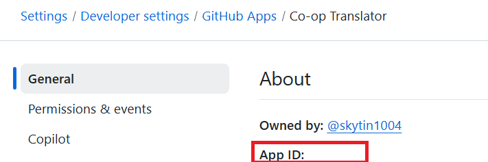
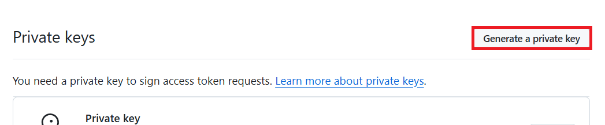

# How to use Co-op Translator github actions

## Prerequisites

- **Language Model Resource**: 
  - **Azure OpenAI** or other LLMs. Details can be found in the [supported models and services](../../README.md/#-supported-models-and-services).
- **Computer Vision Resource** (optional):
  - For image translation. If unavailable, the translator defaults to [Markdown-only mode](../markdown-only-mode.md).
  - **Azure Computer Vision**

### Initial Setup

Before you begin, make sure to set up the following resources:

- [Set up Azure OpenAI](../set-up-resources/set-up-azure-openai.md)
- [Set up Azure Computer Vision](../set-up-resources/set-up-azure-computer-vision.md) (optional)

## Quick Start

> [!NOTE]
> Co-op Translator uses a **GitHub App-based authentication** method for secure and automated workflows.
> You can either install the pre-built app or create your own GitHub App.

### Install Co-op Translator GitHub App

1. Navigate to the [Co-op Translator GitHub App](https://github.com/apps/co-op-translator) and install it in your GitHub account.

1. Select **App Settings**.

    

1. Inside **App Settings**, retrieve the **App ID**.

    

1. Inside **App Settings**, select **Generate a private key** to download the **private key pem file**.

    

1. After installation, retrieve and register the following credentials as GitHub Actions secrets:

| Secret Name               | Description                     |
|---------------------------|---------------------------------|
| `GH_APP_ID`               | The App ID                      |
| `GH_APP_PRIVATE_KEY`      | Content of private key pem file   |

> Prefer to use your own GitHub App?  
> You can create a custom GitHub App instead.  

### Setup environment variables

1. Navigate to the GitHub repository you want to use Co-op Translator.

1. Perform the following tasks:

    - Select **Settings** from the top menu.
    - Select **Secrets and variables** from the left side menu.
    - Select **Actions** inside the **Secrets and variables** menu.
    - Select **New repository secret**.

   

1. Enter the environment variables to need to use Co-op Translator

   

### Setup permissions for the workflow

1. Select **Actions** from the left side menu.

1. Select **General** inside the **Actions** menu.

1. Perform the following tasks:

    - Select **Read and write permissions**.
    - Select **Allow GitHub Actions to create and approve pull requests**.
    - Select **Save**.

   

### Create a workflow file

1. Navigate to the root directory of the repository where you want to use Co-op Translator.

2. Create a file named `co-op-translator.yml` in the `.github/workflows/` directory with the following content [co-op-translator.yml](../../examples/github-actions/co-op-translator.yml).

```
name: Co-op Translator

on:
  push:
    branches:
      - main
    paths:
      - '**.md'
      - '**.png'
      - '**.jpg'
      - '**.jpeg'

jobs:
  co-op-translate:
    runs-on: ubuntu-latest

    permissions:
      contents: write
      pull-requests: write

    steps:
      - name: Checkout repository
        uses: actions/checkout@v4
        with:
          fetch-depth: 0

      - name: Set up Python
        uses: actions/setup-python@v4
        with:
          python-version: '3.10'

      - name: Install Co-op Translator
        run: |
          python -m pip install --upgrade pip
          pip install co-op-translator==0.8.0

      - name: Run Co-op Translator
        env:
          # Azure AI Service Credentials
          AZURE_SUBSCRIPTION_KEY: ${{ secrets.AZURE_SUBSCRIPTION_KEY }}
          AZURE_AI_SERVICE_ENDPOINT: ${{ secrets.AZURE_AI_SERVICE_ENDPOINT }}

          # Azure OpenAI Credentials
          AZURE_OPENAI_API_KEY: ${{ secrets.AZURE_OPENAI_API_KEY }}
          AZURE_OPENAI_ENDPOINT: ${{ secrets.AZURE_OPENAI_ENDPOINT }}
          AZURE_OPENAI_MODEL_NAME: ${{ secrets.AZURE_OPENAI_MODEL_NAME }}
          AZURE_OPENAI_CHAT_DEPLOYMENT_NAME: ${{ secrets.AZURE_OPENAI_CHAT_DEPLOYMENT_NAME }}
          AZURE_OPENAI_API_VERSION: ${{ secrets.AZURE_OPENAI_API_VERSION }}

          # OpenAI Credentials
          OPENAI_API_KEY: ${{ secrets.OPENAI_API_KEY }}
          OPENAI_ORG_ID: ${{ secrets.OPENAI_ORG_ID }}
          OPENAI_CHAT_MODEL_ID: ${{ secrets.OPENAI_CHAT_MODEL_ID }}
          OPENAI_BASE_URL: ${{ secrets.OPENAI_BASE_URL }}
        run: |
          # =====================================================================
          # IMPORTANT: Set your target languages here (REQUIRED CONFIGURATION)
          # =====================================================================
          LANGUAGES="es fr de"  # <--- MODIFY THIS LINE with your desired languages
          echo "Translating to languages: $LANGUAGES"
          translate -l "$LANGUAGES"

      - name: Authenticate GitHub App
        id: generate_token
        uses: tibdex/github-app-token@v1
        with:
          app_id: ${{ secrets.GH_APP_ID }}
          private_key: ${{ secrets.GH_APP_PRIVATE_KEY }}

      - name: Create Pull Request with translations
        uses: peter-evans/create-pull-request@v5
        with:
          token: ${{ steps.generate_token.outputs.token }}
          commit-message: "🌐 Update translations via Co-op Translator"
          title: "🌐 Update translations via Co-op Translator"
          body: |
            This PR updates translations for recent changes to the main branch.

            ### 📋 Changes included
            - Translated contents are available in the `translations/` directory
            - Translated images are available in the `translated_images/` directory

            ---
            🌐 Automatically generated by the [Co-op Translator](https://github.com/Azure/co-op-translator) GitHub Action.
          branch: update-translations
          base: main
          labels: translation, automated-pr
          delete-branch: true
          add-paths: |
            translations/
            translated_images/

```