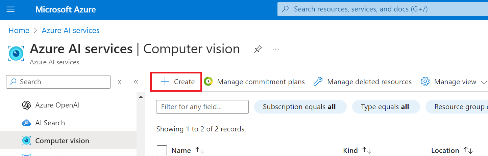
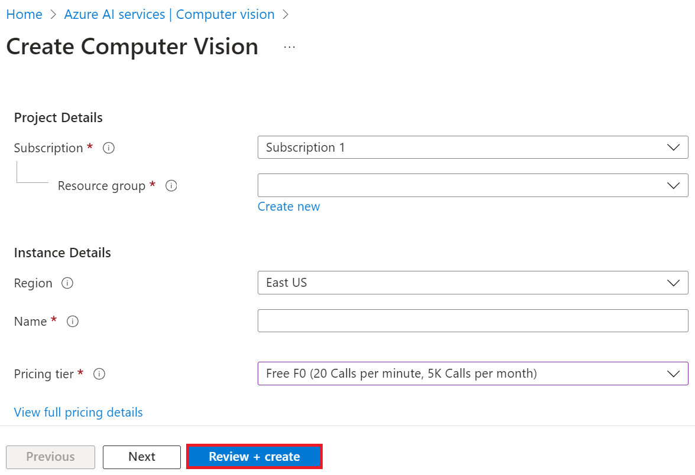

# Set up Azure Computer Vision for image translation

### Create an Azure Computer Vision resource

1. Sign in to the [Azure Portal](https://portal.azure.com/).

1. Type *computer vision* in the **search bar** at the top of the portal page and select **Computer vision** from the options that appear.

    

1. Select **+ Create** from the navigation menu.

    

1. Perform the following tasks:

    - Select your Azure **Subscription**.
    - Select the **Resource group** to use (create a new one if needed).
    - Select the **Region** you'd like to use.
    - Enter **Name**. It must be a unique value.
    - Select the **Pricing tier** you'd like to use.

    

1. Select **Review + Create**.

1. Select **Create**.
