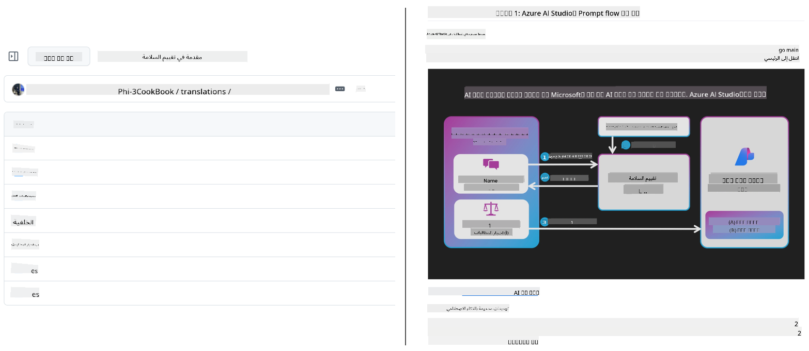
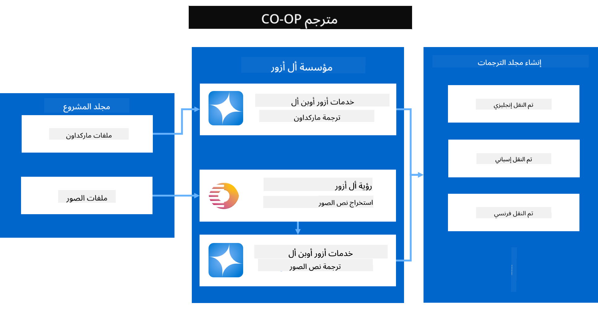
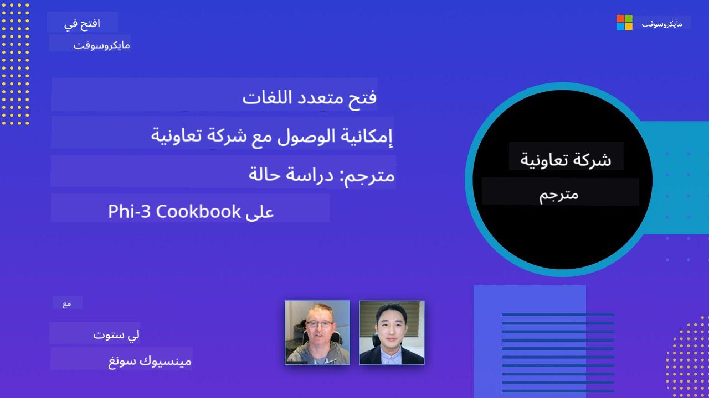

<!--
CO_OP_TRANSLATOR_METADATA:
{
  "original_hash": "044724537b57868117aadae8e7728c7c",
  "translation_date": "2025-06-12T09:53:42+00:00",
  "source_file": "README.md",
  "language_code": "ar"
}
-->


# مترجم التعاون: أتمتة ترجمة الوثائق التعليمية بسهولة

_قم بأتمتة ترجمة وثائقك إلى عدة لغات بسهولة للوصول إلى جمهور عالمي._

[](https://pypi.org/project/co-op-translator/)
[](https://github.com/azure/co-op-translator/blob/main/LICENSE)
[](https://pepy.tech/project/co-op-translator)
[](https://pepy.tech/project/co-op-translator)
[](https://github.com/psf/black)

[](https://GitHub.com/azure/co-op-translator/graphs/contributors/)
[](https://GitHub.com/azure/co-op-translator/issues/)
[](https://GitHub.com/azure/co-op-translator/pulls/)
[](http://makeapullrequest.com)

### دعم اللغات مدعوم بواسطة Co-op Translator
[الفرنسية](../fr/README.md) | [الإسبانية](../es/README.md) | [الألمانية](../de/README.md) | [الروسية](../ru/README.md) | [العربية](./README.md) | [الفارسية (الفارسية)](../fa/README.md) | [الأردية](../ur/README.md) | [الصينية (المبسطة)](../zh/README.md) | [الصينية (التقليدية، ماكاو)](../mo/README.md) | [الصينية (التقليدية، هونغ كونغ)](../hk/README.md) | [الصينية (التقليدية، تايوان)](../tw/README.md) | [اليابانية](../ja/README.md) | [الكورية](../ko/README.md) | [الهندية](../hi/README.md) | [البنغالية](../bn/README.md) | [الماراثية](../mr/README.md) | [النيبالية](../ne/README.md) | [البنجابية (جورموخي)](../pa/README.md) | [البرتغالية (البرتغال)](../pt/README.md) | [البرتغالية (البرازيل)](../br/README.md) | [الإيطالية](../it/README.md) | [البولندية](../pl/README.md) | [التركية](../tr/README.md) | [اليونانية](../el/README.md) | [التايلاندية](../th/README.md) | [السويدية](../sv/README.md) | [الدنماركية](../da/README.md) | [النرويجية](../no/README.md) | [الفنلندية](../fi/README.md) | [الهولندية](../nl/README.md) | [العبرية](../he/README.md) | [الفيتنامية](../vi/README.md) | [الإندونيسية](../id/README.md) | [الماليزية](../ms/README.md) | [التاغالوغ (الفلبينية)](../tl/README.md) | [السواحيلية](../sw/README.md) | [الهنغارية](../hu/README.md) | [التشيكية](../cs/README.md) | [السلوفاكية](../sk/README.md) | [الرومانية](../ro/README.md) | [البلغارية](../bg/README.md) | [الصربية (السيريلية)](../sr/README.md) | [الكرواتية](../hr/README.md) | [السلوفينية](../sl/README.md) | [الأوكرانية](../uk/README.md) | [البورمية (ميانمار)](../my/README.md) الرجاء كتابة المخرجات من اليمين إلى اليسار، مع احترام أن هذه لغة تُكتب من اليمين إلى اليسار.
> [!NOTE]
> هذه هي الترجمات الحالية لمحتوى هذا المستودع. للحصول على قائمة كاملة باللغات المدعومة من Co-op Translator، يرجى الاطلاع على قسم [Language Support](../..).

[](https://GitHub.com/azure/co-op-translator/watchers/)
[](https://GitHub.com/azure/co-op-translator/network/)
[](https://GitHub.com/azure/co-op-translator/stargazers/)

[](https://discord.com/invite/ByRwuEEgH4)

[](https://codespaces.new/azure/co-op-translator)
[](https://vscode.dev/redirect?url=vscode://ms-vscode-remote.remote-containers/cloneInVolume?url=https://github.com/azure/co-op-translator)

## نظرة عامة: تبسيط ترجمة المحتوى التعليمي الخاص بك

تشكل حواجز اللغة عائقًا كبيرًا أمام الوصول إلى الموارد التعليمية القيمة والمعرفة التقنية للمتعلمين والمطورين حول العالم. هذا يحد من المشاركة ويبطئ من وتيرة الابتكار والتعلم على الصعيد العالمي.

وُلد **Co-op Translator** من الحاجة إلى معالجة عملية الترجمة اليدوية غير الفعالة لسلسلة تعليمية كبيرة خاصة بمايكروسوفت (مثل أدلة "للمبتدئين"). تطور ليصبح أداة سهلة الاستخدام وقوية تهدف إلى إزالة هذه الحواجز للجميع. من خلال توفير ترجمات آلية عالية الجودة عبر واجهة الأوامر وGitHub Actions، يمكن لـ Co-op Translator تمكين المعلمين والطلاب والباحثين والمطورين عالميًا من مشاركة والوصول إلى المعرفة دون قيود لغوية.

شاهد كيف ينظم Co-op Translator المحتوى التعليمي المترجم:



يتم ترجمة ملفات Markdown ونصوص الصور تلقائيًا وتنظيمها بشكل مرتب في مجلدات خاصة بكل لغة.

**افتح الوصول العالمي لمحتواك التعليمي مع Co-op Translator اليوم!**

## دعم الوصول العالمي لموارد التعلم الخاصة بمايكروسوفت

يساعد Co-op Translator في سد فجوة اللغة للمبادرات التعليمية الرئيسية لمايكروسوفت، من خلال أتمتة عملية الترجمة لمستودعات تخدم مجتمع مطورين عالمي. من الأمثلة الحالية التي تستخدم Co-op Translator:

[](https://github.com/microsoft/Generative-AI-for-beginners)
[](https://github.com/microsoft/ML-For-Beginners)
[](https://github.com/microsoft/AI-For-Beginners)
[](https://github.com/microsoft/ai-agents-for-beginners)
[](https://github.com/microsoft/PhiCookBook)
[](https://github.com/microsoft/Generative-AI-for-beginners-dotnet)

## الميزات الرئيسية

- **ترجمات آلية**: ترجم النصوص إلى لغات متعددة بسهولة.
- **تكامل مع GitHub Actions**: أتمتة الترجمات كجزء من خط أنابيب CI/CD الخاص بك.
- **الحفاظ على تنسيق Markdown**: الحفاظ على صيغة Markdown الصحيحة أثناء الترجمة.
- **ترجمة نصوص الصور**: استخراج وترجمة النصوص داخل الصور.
- **تقنية LLM المتقدمة**: استخدام نماذج لغوية متطورة لترجمات عالية الجودة.
- **تكامل سهل**: دمج سلس مع إعداد مشروعك الحالي.
- **تبسيط التوطين**: تسهيل عملية توطين مشروعك للأسواق الدولية.

## كيف يعمل



يأخذ Co-op Translator ملفات Markdown والصور من مجلد مشروعك ويعالجها كما يلي:

1. **استخراج النصوص**: استخراج النصوص من ملفات Markdown، وإذا تم التكوين (مثل Azure AI Vision)، استخراج النصوص المضمنة داخل الصور.
1. **الترجمة باستخدام الذكاء الاصطناعي**: إرسال النص المستخرج إلى نموذج اللغة المكون (Azure OpenAI، OpenAI، إلخ) للترجمة.
1. **حفظ النتائج**: حفظ ملفات Markdown والصور المترجمة (مع النصوص المترجمة) في مجلدات خاصة بكل لغة مع الحفاظ على التنسيق الأصلي.

## البدء

ابدأ بسرعة باستخدام CLI أو قم بإعداد الأتمتة الكاملة باستخدام GitHub Actions. اختر الطريقة التي تناسب سير عملك:

1. **سطر الأوامر (CLI)** - للترجمات لمرة واحدة أو التحكم اليدوي
2. **GitHub Actions** - للترجمات الآلية عند كل دفع

> [!NOTE]
> بينما يركز هذا الدليل على موارد Azure، يمكنك استخدام أي نموذج لغة مدعوم.

### دعم اللغات

يدعم Co-op Translator مجموعة واسعة من اللغات لمساعدتك في الوصول إلى جمهور عالمي. إليك ما تحتاج معرفته:

#### مرجع سريع

| اللغة | الرمز | اللغة | الرمز | اللغة | الرمز |
|----------|------|----------|------|----------|------|
| العربية | ar | البنغالية | bn | البلغارية | bg |
| البورمية (ميانمار) | my | الصينية (المبسطة) | zh | الصينية (التقليدية، هونغ كونغ) | hk |
| الصينية (التقليدية، ماكاو) | mo | الصينية (التقليدية، تايوان) | tw | الكرواتية | hr |
| التشيكية | cs | الدنماركية | da | الهولندية | nl |
| الفنلندية | fi | الفرنسية | fr | الألمانية | de |
| اليونانية | el | العبرية | he | الهندية | hi |
| الهنغارية | hu | الإندونيسية | id | الإيطالية | it |
| اليابانية | ja | الكورية | ko | الملايوية | ms |
| الماراثية | mr | النيبالية | ne | النرويجية | no |
| الفارسية (الفارسية) | fa | البولندية | pl | البرتغالية (البرازيل) | br |
| البرتغالية (البرتغال) | pt | البنجابية (غورموخي) | pa | الرومانية | ro |
| الروسية | ru | الصربية (السيريلية) | sr | السلوفاكية | sk |
| السلوفينية | sl | الإسبانية | es | السواحيلية | sw |
| السويدية | sv | التاغالوغ (الفلبينية) | tl | التايلاندية | th |
| التركية | tr | الأوكرانية | uk | الأردية | ur |
| الفيتنامية | vi | — | — | — | — |

#### استخدام رموز اللغات

عند استخدام Co-op Translator، ستحتاج إلى تحديد اللغات باستخدام رموزها. على سبيل المثال:

```bash
# Translate to French, Spanish, and German
translate -l "fr es de"

# Translate to Chinese (Simplified) and Japanese
translate -l "zh ja"
```

> [!NOTE]
> لمعلومات تقنية مفصلة حول دعم اللغات، بما في ذلك:
>
> - مواصفات الخط لكل لغة
> - المشكلات المعروفة
> - كيفية إضافة لغات جديدة
>
> راجع [وثائق اللغات المدعومة](./getting_started/supported-languages.md).

### النماذج والخدمات المدعومة

| النوع                  | الاسم                           |
|-----------------------|--------------------------------|
| نموذج اللغة           |   |
| AI Vision       |  |

> [!NOTE]
> إذا لم تكن خدمة AI Vision متاحة، سيتحول co-op translator تلقائيًا إلى [وضع Markdown فقط](./getting_started/markdown-only-mode.md).

### الإعداد الأولي

قبل البدء، ستحتاج إلى إعداد الموارد التالية:

1. مورد نموذج اللغة (مطلوب):
   - Azure OpenAI (موصى به) - يوفر ترجمات عالية الجودة مع موثوقية على مستوى المؤسسات
   - OpenAI - خيار بديل إذا لم يكن لديك وصول إلى Azure
   - لمعلومات مفصلة عن النماذج المدعومة، راجع [النماذج والخدمات المدعومة](../..)

1. مورد AI Vision (اختياري):
   - Azure AI Vision - يتيح ترجمة النصوص داخل الصور
   - إذا لم يتم التكوين، سيستخدم المترجم تلقائيًا [وضع Markdown فقط](./getting_started/markdown-only-mode.md)
   - موصى به للمشاريع التي تحتوي على صور بها نصوص بحاجة للترجمة

1. خطوات التكوين:
   - اتبع دليلنا [إعداد Azure AI](./getting_started/set-up-azure-ai.md) للحصول على تعليمات مفصلة
   - أنشئ ملف `.env` يحتوي على مفاتيح API ونقاط النهاية الخاصة بك (راجع قسم [البدء السريع](../..))
   - تأكد من أن لديك الأذونات والحصص اللازمة للخدمات التي اخترتها

### إعداد المشروع قبل الترجمة

قبل بدء عملية الترجمة، اتبع هذه الخطوات لتحضير مشروعك:

1. جهز ملف README الخاص بك:
   - أضف جدول الترجمات إلى README.md لربط الإصدارات المترجمة
   - مثال على التنسيق:

     ```markdown

     ### 🌐 Multi-Language Support
     
     [French](../fr/README.md) | [Spanish](../es/README.md) | [German](../de/README.md) | [Russian](../ru/README.md) | [Arabic](./README.md) | [Persian (Farsi)](../fa/README.md) | [Urdu](../ur/README.md) | [Chinese (Simplified)](../zh/README.md) | [Chinese (Traditional, Macau)](../mo/README.md) | [Chinese (Traditional, Hong Kong)](../hk/README.md) | [Chinese (Traditional, Taiwan)](../tw/README.md) | [Japanese](../ja/README.md) | [Korean](../ko/README.md) | [Hindi](../hi/README.md) | [Bengali](../bn/README.md) | [Marathi](../mr/README.md) | [Nepali](../ne/README.md) | [Punjabi (Gurmukhi)](../pa/README.md) | [Portuguese (Portugal)](../pt/README.md) | [Portuguese (Brazil)](../br/README.md) | [Italian](../it/README.md) | [Polish](../pl/README.md) | [Turkish](../tr/README.md) | [Greek](../el/README.md) | [Thai](../th/README.md) | [Swedish](../sv/README.md) | [Danish](../da/README.md) | [Norwegian](../no/README.md) | [Finnish](../fi/README.md) | [Dutch](../nl/README.md) | [Hebrew](../he/README.md) | [Vietnamese](../vi/README.md) | [Indonesian](../id/README.md) | [Malay](../ms/README.md) | [Tagalog (Filipino)](../tl/README.md) | [Swahili](../sw/README.md) | [Hungarian](../hu/README.md) | [Czech](../cs/README.md) | [Slovak](../sk/README.md) | [Romanian](../ro/README.md) | [Bulgarian](../bg/README.md) | [Serbian (Cyrillic)](../sr/README.md) | [Croatian](../hr/README.md) | [Slovenian](../sl/README.md) | [Ukrainian](../uk/README.md) | [Burmese (Myanmar)](../my/README.md) 
    
     ```

1. نظف الترجمات الحالية (إذا لزم الأمر):
   - احذف أي مجلدات ترجمة موجودة (مثل `translations/`)
   - امسح أي ملفات ترجمة قديمة للبدء من جديد
   - هذا يضمن عدم وجود تعارضات مع عملية الترجمة الجديدة

### البدء السريع: سطر الأوامر

لبداية سريعة باستخدام سطر الأوامر:

1. أنشئ بيئة افتراضية:

    ```bash
    python -m venv .venv
    ```

1. فعّل البيئة الافتراضية:

    - على ويندوز:

    ```bash
    .venv\scripts\activate
    ```

    - على لينكس/ماك:

    ```bash
    source .venv/bin/activate
    ```

1. ثبّت الحزمة:

    ```bash
    pip install co-op-translator
    ```

1. قم بتكوين بيانات الاعتماد:

    - أنشئ ملف `.env` file in your project's root directory.
    - Copy the contents from the [.env.template](../../.env.template) file into your new `.env` file.
    - Fill in the required API keys and endpoint information in your `.env` file.

1. Run Translation:
    - Navigate to your project's root directory in your terminal.
    - Execute the translate command, specifying target languages with the `-l` مع العلم:

    ```bash
    translate -l "ko ja fr"
    ```

    _(استبدل `"ko ja fr"` with your desired space-separated language codes)_

### Detailed Usage Guides

Choose the approach that best fits your workflow:

#### 1. Using the Command Line (CLI)

- Best for: One-time translations, manual control, or integration into custom scripts.
- Requires: Local installation of Python and the `co-op-translator` package.
- Guide: [Command Line Guide](./getting_started/command-line-guide/command-line-guide.md)

#### 2. Using GitHub Actions (Automation)

- Best for: Automatically translating content whenever changes are pushed to your repository. Keeps translations consistently up-to-date.
- Requires: Setting up a workflow file (`.github/workflows`) في مستودعك. لا حاجة للتثبيت محليًا.
- الأدلة:
  - [دليل GitHub Actions (المستودعات العامة والأسرار القياسية)](./getting_started/github-actions-guide/github-actions-guide-public.md) - استخدم هذا لمعظم المستودعات العامة أو الشخصية التي تعتمد على أسرار المستودع القياسية.
  - [دليل GitHub Actions (مستودعات منظمة Microsoft وإعدادات على مستوى المنظمة)](./getting_started/github-actions-guide/github-actions-guide-org.md) - استخدم هذا الدليل إذا كنت تعمل ضمن منظمة Microsoft على GitHub أو تحتاج إلى استخدام أسرار أو مشغلات على مستوى المنظمة.

### استكشاف الأخطاء والنصائح

- [دليل استكشاف الأخطاء](./getting_started/troubleshooting.md)

### موارد إضافية

- [مرجع الأوامر](./getting_started/command-reference.md): دليل مفصل لجميع الأوامر والخيارات المتاحة.
- [اللغات المدعومة](./getting_started/supported-languages.md): تحقق من قائمة اللغات المدعومة وتعليمات إضافة لغات جديدة.
- [وضع Markdown فقط](./getting_started/markdown-only-mode.md): كيفية ترجمة النصوص فقط دون ترجمة الصور.

## العروض التقديمية بالفيديو

تعرف أكثر على Co-op Translator من خلال عروضنا التقديمية _(انقر على الصورة أدناه للمشاهدة على YouTube)_:

- **Open at Microsoft**: مقدمة سريعة مدتها 18 دقيقة ودليل سريع حول كيفية استخدام Co-op Translator.
[](https://www.youtube.com/watch?v=jX_swfH_KNU)

## دعمنا وتعزيز التعلم العالمي

انضم إلينا في إحداث ثورة في طريقة مشاركة المحتوى التعليمي على مستوى العالم! امنح [Co-op Translator](https://github.com/azure/co-op-translator) ⭐ على GitHub وادعم مهمتنا في إزالة الحواجز اللغوية في التعلم والتقنية. اهتمامك ومساهماتك تحدث فرقًا كبيرًا! مساهمات الكود واقتراحات الميزات مرحب بها دائمًا.

## المساهمة

يرحب هذا المشروع بالمساهمات والاقتراحات. مهتم بالمساهمة في Azure Co-op Translator؟ يرجى الاطلاع على [CONTRIBUTING.md](./CONTRIBUTING.md) للحصول على إرشادات حول كيفية المساعدة في جعل Co-op Translator أكثر سهولة.

## المساهمون

[](https://github.com/Azure/co-op-translator/graphs/contributors)

## مدونة السلوك

اعتمد هذا المشروع [Microsoft Open Source Code of Conduct](https://opensource.microsoft.com/codeofconduct/).
لمزيد من المعلومات، راجع [Code of Conduct FAQ](https://opensource.microsoft.com/codeofconduct/faq/) أو
تواصل مع [opencode@microsoft.com](mailto:opencode@microsoft.com) لأي أسئلة أو تعليقات إضافية.

## الذكاء الاصطناعي المسؤول

تلتزم Microsoft بمساعدة عملائنا على استخدام منتجات الذكاء الاصطناعي لدينا بمسؤولية، ومشاركة معارفنا، وبناء شراكات قائمة على الثقة من خلال أدوات مثل Transparency Notes و Impact Assessments. يمكن العثور على العديد من هذه الموارد على [https://aka.ms/RAI](https://aka.ms/RAI).
تستند منهجية Microsoft في الذكاء الاصطناعي المسؤول إلى مبادئنا في الإنصاف، والموثوقية والسلامة، والخصوصية والأمان، والشمولية، والشفافية، والمساءلة.

يمكن للنماذج الكبيرة للغة الطبيعية، والصورة، والصوت - مثل تلك المستخدمة في هذا المثال - أن تتصرف أحيانًا بطرق غير عادلة أو غير موثوقة أو مسيئة، مما قد يسبب أضرارًا. يرجى مراجعة [ملاحظة الشفافية لخدمة Azure OpenAI](https://learn.microsoft.com/legal/cognitive-services/openai/transparency-note?tabs=text) للاطلاع على المخاطر والقيود.

النهج الموصى به لتقليل هذه المخاطر هو تضمين نظام أمان في بنية التطبيق الخاص بك يمكنه اكتشاف ومنع السلوك الضار. يوفر [Azure AI Content Safety](https://learn.microsoft.com/azure/ai-services/content-safety/overview) طبقة حماية مستقلة قادرة على اكتشاف المحتوى الضار الذي ينشئه المستخدم أو الذكاء الاصطناعي في التطبيقات والخدمات. يتضمن Azure AI Content Safety واجهات برمجة تطبيقات للنصوص والصور تتيح لك اكتشاف المواد الضارة. كما يتوفر لدينا Content Safety Studio التفاعلي الذي يسمح لك بعرض واستكشاف وتجربة أمثلة للكود لاكتشاف المحتوى الضار عبر وسائل متعددة. يوجهك [توثيق البدء السريع التالي](https://learn.microsoft.com/azure/ai-services/content-safety/quickstart-text?tabs=visual-studio%2Clinux&pivots=programming-language-rest) خلال خطوات إرسال الطلبات إلى الخدمة.

جانب آخر يجب أخذه في الاعتبار هو أداء التطبيق بشكل عام. مع التطبيقات متعددة الوسائط والنماذج، نعتبر الأداء بأن النظام يعمل كما تتوقع أنت ومستخدموك، بما في ذلك عدم إنتاج مخرجات ضارة. من المهم تقييم أداء تطبيقك العام باستخدام [مقاييس جودة التوليد والمخاطر والسلامة](https://learn.microsoft.com/azure/ai-studio/concepts/evaluation-metrics-built-in).

يمكنك تقييم تطبيق الذكاء الاصطناعي الخاص بك في بيئة التطوير باستخدام [prompt flow SDK](https://microsoft.github.io/promptflow/index.html). سواء باستخدام مجموعة بيانات اختبار أو هدف معين، يتم قياس نواتج تطبيق الذكاء الاصطناعي التوليدي الخاص بك كميًا باستخدام مقيمين مدمجين أو مقيمين مخصصين تختارهم. للبدء باستخدام prompt flow sdk لتقييم نظامك، يمكنك اتباع [دليل البدء السريع](https://learn.microsoft.com/azure/ai-studio/how-to/develop/flow-evaluate-sdk). بمجرد تنفيذ تقييم، يمكنك [عرض النتائج في Azure AI Studio](https://learn.microsoft.com/azure/ai-studio/how-to/evaluate-flow-results).

## العلامات التجارية

قد يحتوي هذا المشروع على علامات تجارية أو شعارات لمشاريع أو منتجات أو خدمات. يخضع الاستخدام المصرح به لعلامات Microsoft التجارية أو شعاراتها إلى
[Microsoft's Trademark & Brand Guidelines](https://www.microsoft.com/en-us/legal/intellectualproperty/trademarks/usage/general).
يجب ألا يسبب استخدام علامات Microsoft التجارية أو شعاراتها في نسخ معدلة من هذا المشروع أي لبس أو يوحي برعاية Microsoft.
أي استخدام لعلامات تجارية أو شعارات تابعة لأطراف ثالثة يخضع لسياسات تلك الأطراف.

**إخلاء المسؤولية**:  
تمت ترجمة هذا المستند باستخدام خدمة الترجمة الآلية [Co-op Translator](https://github.com/Azure/co-op-translator). بينما نسعى لتحقيق الدقة، يرجى العلم أن الترجمات الآلية قد تحتوي على أخطاء أو عدم دقة. يجب اعتبار المستند الأصلي بلغته الأصلية المصدر المعتمد. للمعلومات الحساسة، يُنصح بالترجمة المهنية بواسطة مترجم بشري. نحن غير مسؤولين عن أي سوء فهم أو تفسير خاطئ ناتج عن استخدام هذه الترجمة.