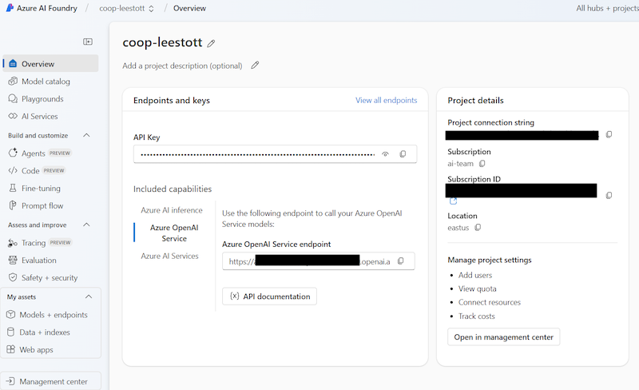
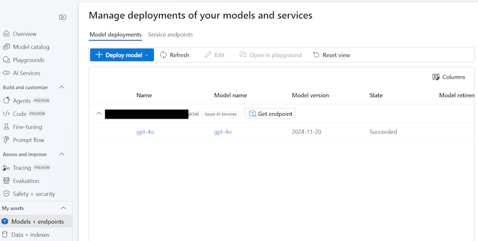
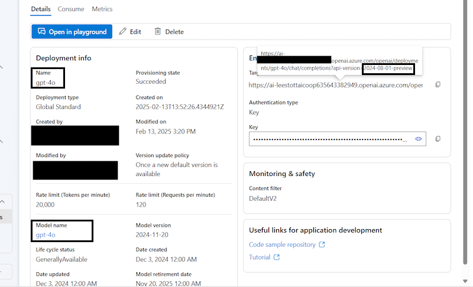

<!--
CO_OP_TRANSLATOR_METADATA:
{
  "original_hash": "53c99ea0ead7a3500149d4bb96be5811",
  "translation_date": "2025-05-06T17:55:18+00:00",
  "source_file": "getting_started/command-line-guide/create-env-file.md",
  "language_code": "ar"
}
-->
# إنشاء ملف *.env* في الدليل الرئيسي

في هذا الدليل، سنرشدك خلال إعداد متغيرات البيئة لخدمات Azure باستخدام ملف *.env*. تتيح لك متغيرات البيئة إدارة بيانات الاعتماد الحساسة بأمان، مثل مفاتيح API، دون الحاجة إلى تضمينها مباشرة في قاعدة الكود الخاصة بك.

> [!IMPORTANT]
> - لا يحتاج الأمر إلا إلى تكوين خدمة نموذج لغة واحدة فقط (Azure OpenAI أو OpenAI). املأ متغيرات البيئة للخدمة التي تفضلها. إذا تم تعيين متغيرات بيئة لعدة نماذج لغوية، سيختار المترجم التعاوني واحدًا بناءً على الأولوية.
> - إذا لم يتم تعيين متغيرات بيئة Computer Vision، سيتحول المترجم تلقائيًا إلى [وضع Markdown فقط](./markdown-only-mode.md).

> [!NOTE]
> يركز هذا الدليل بشكل رئيسي على خدمات Azure، لكن يمكنك اختيار أي نموذج لغوي مدعوم من [قائمة النماذج والخدمات المدعومة](../README.md#-supported-models-and-services).

## إنشاء ملف *.env*

في الدليل الرئيسي لمشروعك، أنشئ ملفًا باسم *.env*. سيخزن هذا الملف جميع متغيرات البيئة الخاصة بك بطريقة بسيطة.

> [!WARNING]
> لا تقم بإضافة ملف *.env* إلى أنظمة التحكم في الإصدارات مثل Git. أضف *.env* إلى ملف .gitignore الخاص بك لتجنب الالتزامات العرضية.

1. انتقل إلى الدليل الرئيسي لمشروعك.

1. أنشئ ملف *.env* في الدليل الرئيسي لمشروعك.

    

1. افتح ملف *.env* والصق القالب التالي:

    ```plaintext
    # Azure Credentials
    AZURE_SUBSCRIPTION_KEY="your_azure_AIServices_api_key"
    AZURE_AI_SERVICE_ENDPOINT="https://your_azure_ai_service_endpoint"

    # Azure OpenAI Credentials
    AZURE_OPENAI_API_KEY="your_azure_openai_api_key"
    AZURE_OPENAI_ENDPOINT="https://your_azure_openai_endpoint"
    AZURE_OPENAI_MODEL_NAME="your_model_name"
    AZURE_OPENAI_CHAT_DEPLOYMENT_NAME="your_deployment_name"
    AZURE_OPENAI_API_VERSION="your_api_version"

    # OpenAI Credentials
    OPENAI_API_KEY="your_openai_api_key"
    OPENAI_ORG_ID="your_openai_org_id"
    OPENAI_CHAT_MODEL_ID="your_chat_model_id(ex. gpt-4o)"
    OPENAI_BASE_URL="https://api.openai.com/v1 (If you don't have a custom base URL, you can delete this lin, then it will use the default base URL)"
    ```

## جمع بيانات اعتماد Azure الخاصة بك

ستحتاج إلى بيانات الاعتماد التالية من Azure لتكوين البيئة:

يمكنك الحصول على جميع التفاصيل من صفحة نظرة عامة على المشروع داخل [AI Foundry](https://ai.azure.com/build/overview)



### لخدمة Azure AI:

    - مفتاح اشتراك Azure: مفتاح API لخدمات Azure AI الخاص بك، والذي يتيح لك الوصول إلى خدمات Azure AI.
    - نقطة نهاية خدمة Azure AI: عنوان URL لنقطة النهاية الخاصة بخدمة Azure AI التي تستخدمها.

### لخدمة Azure OpenAI:

    - مفتاح API لـ Azure OpenAI: مفتاح API للوصول إلى خدمات Azure OpenAI.
    - نقطة نهاية Azure OpenAI: عنوان URL لنقطة النهاية الخاصة بخدمة Azure OpenAI الخاصة بك.

1. انسخ والصق مفتاح وخادم خدمات AI في ملف *.env*.
2. انسخ والصق مفتاح API ونقطة نهاية Azure OpenAI في ملف *.env*.

### تفاصيل النموذج

اختر النموذج ونقاط النهاية من القائمة الجانبية اليسرى



الآن عليك اختيار النموذج الذي ترغب في استخدامه للحصول على تفاصيل النموذج


لملف .env نحتاج إلى التفاصيل التالية

    - اسم نموذج Azure OpenAI: اسم النموذج الذي ستتفاعل معه.
    - اسم Azure OpenAI: اسم النشر الخاص بنماذج Azure OpenAI.
    - إصدار API لـ Azure OpenAI: إصدار API الخاص بـ Azure OpenAI والذي تجده في نهاية سلسلة عنوان URL.

للحصول على هذه التفاصيل اختر نشر النموذج



### إضافة متغيرات بيئة Azure

3. انسخ والصق **الاسم** و **الإصدار** الخاص بنموذج Azure OpenAI في ملف *.env*.
4. احفظ ملف *.env*.
5. الآن، يمكنك الوصول إلى هذه المتغيرات لاستخدام **Co-op Translator** مع خدمات Azure الخاصة بك.

**إخلاء مسؤولية**:  
تمت ترجمة هذا المستند باستخدام خدمة الترجمة الآلية [Co-op Translator](https://github.com/Azure/co-op-translator). بينما نسعى لتحقيق الدقة، يرجى العلم أن الترجمات الآلية قد تحتوي على أخطاء أو عدم دقة. يجب اعتبار المستند الأصلي بلغته الأصلية المصدر الموثوق به. للمعلومات الحساسة أو الهامة، يُنصح بالاستعانة بالترجمة البشرية المهنية. نحن غير مسؤولين عن أي سوء فهم أو تفسير خاطئ ناتج عن استخدام هذه الترجمة.