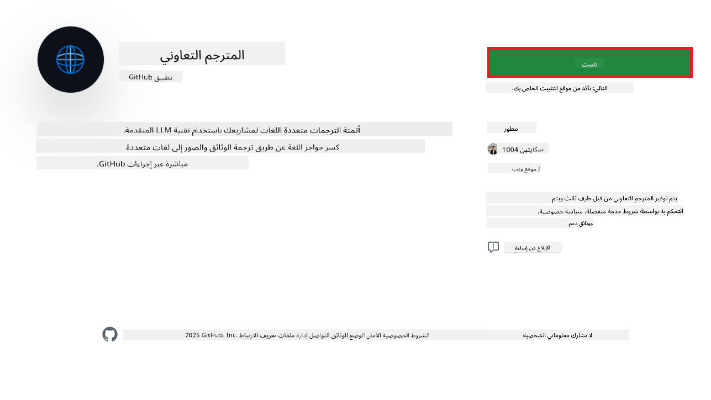
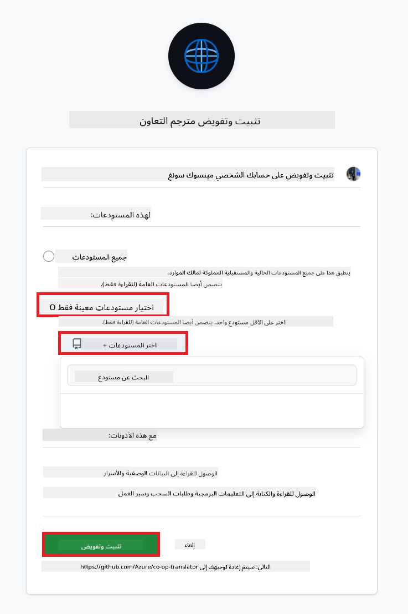
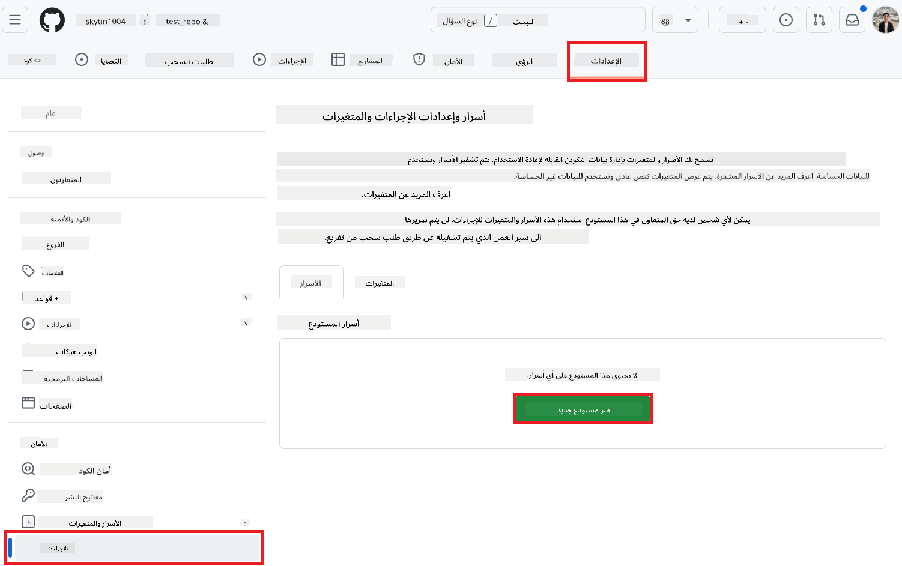

<!--
CO_OP_TRANSLATOR_METADATA:
{
  "original_hash": "c437820027c197f25fb2cbee95bae28c",
  "translation_date": "2025-06-12T19:00:55+00:00",
  "source_file": "getting_started/github-actions-guide/github-actions-guide-org.md",
  "language_code": "ar"
}
-->
# استخدام إجراء Co-op Translator على GitHub (دليل المنظمة)

**الجمهور المستهدف:** هذا الدليل موجه لـ **المستخدمين الداخليين في Microsoft** أو **الفرق التي تمتلك بيانات الاعتماد اللازمة لتطبيق Co-op Translator الجاهز على GitHub** أو التي يمكنها إنشاء تطبيق GitHub مخصص خاص بها.

قم بأتمتة ترجمة توثيق المستودع الخاص بك بسهولة باستخدام إجراء Co-op Translator على GitHub. يرشدك هذا الدليل خلال إعداد الإجراء لإنشاء طلبات سحب تلقائيًا مع الترجمات المحدثة كلما تغيرت ملفات Markdown المصدرية أو الصور الخاصة بك.

> [!IMPORTANT]
> 
> **اختيار الدليل المناسب:**
>
> يوضح هذا الدليل الإعداد باستخدام **معرّف تطبيق GitHub ومفتاح خاص**. عادةً ما تحتاج إلى طريقة "دليل المنظمة" هذه إذا: **`GITHUB_TOKEN` الأذونات مقيدة:** تقيد إعدادات المنظمة أو المستودع الأذونات الافتراضية الممنوحة لـ `GITHUB_TOKEN` القياسي. على وجه التحديد، إذا لم يُسمح لـ `GITHUB_TOKEN` بالحصول على أذونات `write` اللازمة (مثل `contents: write` أو `pull-requests: write`)، فسيفشل سير العمل في [دليل الإعداد العام](./github-actions-guide-public.md) بسبب عدم كفاية الأذونات. استخدام تطبيق GitHub مخصص مع أذونات ممنوحة صراحةً يتجاوز هذا القيد.
>
> **إذا لم ينطبق ما سبق عليك:**
>
> إذا كان لدى `GITHUB_TOKEN` القياسي الأذونات الكافية في مستودعك (أي أنك لست مقيدًا بقيود تنظيمية)، يرجى استخدام **[دليل الإعداد العام باستخدام GITHUB_TOKEN](./github-actions-guide-public.md)**. لا يتطلب الدليل العام الحصول على معرّفات التطبيقات أو المفاتيح الخاصة أو إدارتها ويعتمد فقط على `GITHUB_TOKEN` القياسي وأذونات المستودع.

## المتطلبات الأساسية

قبل تكوين إجراء GitHub، تأكد من أن لديك بيانات اعتماد خدمة الذكاء الاصطناعي اللازمة جاهزة.

**1. مطلوب: بيانات اعتماد نموذج اللغة AI**  
تحتاج إلى بيانات اعتماد لنموذج لغة مدعوم واحد على الأقل:

- **Azure OpenAI**: يتطلب نقطة نهاية، مفتاح API، أسماء النماذج/النشر، إصدار API.  
- **OpenAI**: يتطلب مفتاح API، (اختياري: معرف المنظمة، عنوان URL الأساسي، معرف النموذج).  
- راجع [النماذج والخدمات المدعومة](../../../../README.md) للمزيد من التفاصيل.  
- دليل الإعداد: [إعداد Azure OpenAI](../set-up-resources/set-up-azure-openai.md).

**2. اختياري: بيانات اعتماد رؤية الكمبيوتر (لترجمة الصور)**

- مطلوب فقط إذا كنت بحاجة لترجمة النصوص داخل الصور.  
- **Azure Computer Vision**: يتطلب نقطة نهاية ومفتاح اشتراك.  
- إذا لم تُقدم، يستخدم الإجراء الوضع [الخاص بـ Markdown فقط](../markdown-only-mode.md).  
- دليل الإعداد: [إعداد Azure Computer Vision](../set-up-resources/set-up-azure-computer-vision.md).

## الإعداد والتكوين

اتبع هذه الخطوات لتكوين إجراء Co-op Translator على GitHub في مستودعك:

### الخطوة 1: تثبيت وتكوين مصادقة تطبيق GitHub

يستخدم سير العمل مصادقة تطبيق GitHub للتفاعل بأمان مع مستودعك (مثل إنشاء طلبات السحب) نيابةً عنك. اختر أحد الخيارات:

#### **الخيار أ: تثبيت تطبيق Co-op Translator الجاهز على GitHub (للاستخدام الداخلي في Microsoft)**

1. انتقل إلى صفحة [تطبيق Co-op Translator على GitHub](https://github.com/apps/co-op-translator).

1. اختر **تثبيت** وحدد الحساب أو المنظمة التي يوجد بها المستودع المستهدف.

    

1. اختر **تحديد المستودعات فقط** وحدد المستودع المستهدف (مثل `PhiCookBook`). اضغط **تثبيت**. قد يُطلب منك تسجيل الدخول.

    

1. **الحصول على بيانات اعتماد التطبيق (يتطلب عملية داخلية):** للسماح لسير العمل بالمصادقة كتطبيق، تحتاج إلى معلومتين مقدمتين من فريق Co-op Translator:  
  - **معرّف التطبيق:** المعرف الفريد لتطبيق Co-op Translator. معرّف التطبيق هو: `1164076`.  
  - **المفتاح الخاص:** يجب الحصول على **المحتوى الكامل** لملف المفتاح الخاص `.pem` من جهة الاتصال المسؤولة. **تعامل مع هذا المفتاح ككلمة مرور واحفظه بأمان.**

1. تابع إلى الخطوة 2.

#### **الخيار ب: استخدام تطبيق GitHub مخصص خاص بك**

- إذا رغبت، يمكنك إنشاء وتكوين تطبيق GitHub خاص بك. تأكد من منحه صلاحيات قراءة وكتابة على المحتويات وطلبات السحب. ستحتاج إلى معرّف التطبيق ومفتاح خاص تم إنشاؤه.

### الخطوة 2: تكوين أسرار المستودع

يجب إضافة بيانات اعتماد تطبيق GitHub وبيانات اعتماد خدمة الذكاء الاصطناعي كأسرار مشفرة في إعدادات مستودعك.

1. انتقل إلى مستودع GitHub المستهدف (مثل `PhiCookBook`).

1. اذهب إلى **الإعدادات** > **الأسرار والمتغيرات** > **الإجراءات**.

1. ضمن **أسرار المستودع**، اضغط **سر جديد للمستودع** لكل سر من الأسرار المذكورة أدناه.

   

**الأسرار المطلوبة (لمصادقة تطبيق GitHub):**

| اسم السر           | الوصف                                         | مصدر القيمة                                  |
| :----------------- | :--------------------------------------------- | :------------------------------------------- |
| `GH_APP_ID`          | معرّف تطبيق GitHub (من الخطوة 1).                  | إعدادات تطبيق GitHub                        |
| `GH_APP_PRIVATE_KEY` | **المحتوى الكامل** لملف المفتاح الخاص `.pem` الذي تم تنزيله. | ملف `.pem` (من الخطوة 1)                 |

**أسرار خدمة الذكاء الاصطناعي (أضف كل ما ينطبق حسب متطلباتك):**

| اسم السر                         | الوصف                                   | مصدر القيمة                          |
| :-------------------------------- | :-------------------------------------- | :---------------------------------- |
| `AZURE_SUBSCRIPTION_KEY`            | مفتاح خدمة Azure AI (رؤية الكمبيوتر)        | Azure AI Foundry                    |
| `AZURE_AI_SERVICE_ENDPOINT`         | نقطة نهاية خدمة Azure AI (رؤية الكمبيوتر)     | Azure AI Foundry                    |
| `AZURE_OPENAI_API_KEY`              | مفتاح خدمة Azure OpenAI                     | Azure AI Foundry                    |
| `AZURE_OPENAI_ENDPOINT`             | نقطة نهاية خدمة Azure OpenAI                 | Azure AI Foundry                    |
| `AZURE_OPENAI_MODEL_NAME`           | اسم نموذج Azure OpenAI الخاص بك               | Azure AI Foundry                    |
| `AZURE_OPENAI_CHAT_DEPLOYMENT_NAME` | اسم نشر Azure OpenAI الخاص بك                 | Azure AI Foundry                    |
| `AZURE_OPENAI_API_VERSION`          | إصدار API الخاص بـ Azure OpenAI               | Azure AI Foundry                    |
| `OPENAI_API_KEY`                    | مفتاح API الخاص بـ OpenAI                      | منصة OpenAI                        |
| `OPENAI_ORG_ID`                     | معرف منظمة OpenAI                              | منصة OpenAI                        |
| `OPENAI_CHAT_MODEL_ID`              | معرف نموذج OpenAI محدد                          | منصة OpenAI                        |
| `OPENAI_BASE_URL`                   | عنوان URL أساسي مخصص لـ OpenAI API             | منصة OpenAI                        |


### الخطوة 3: إنشاء ملف سير العمل

أخيرًا، أنشئ ملف YAML الذي يحدد سير العمل الآلي.

1. في الدليل الجذر لمستودعك، أنشئ الدليل `.github/workflows/` إذا لم يكن موجودًا.

1. داخل `.github/workflows/`، أنشئ ملفًا باسم `co-op-translator.yml`.

1. الصق المحتوى التالي في co-op-translator.yml.

```
name: Co-op Translator

on:
  push:
    branches:
      - main

jobs:
  co-op-translator:
    runs-on: ubuntu-latest

    permissions:
      contents: write
      pull-requests: write

    steps:
      - name: Checkout repository
        uses: actions/checkout@v4
        with:
          fetch-depth: 0

      - name: Set up Python
        uses: actions/setup-python@v4
        with:
          python-version: '3.10'

      - name: Install Co-op Translator
        run: |
          python -m pip install --upgrade pip
          pip install co-op-translator

      - name: Run Co-op Translator
        env:
          PYTHONIOENCODING: utf-8
          # Azure AI Service Credentials
          AZURE_SUBSCRIPTION_KEY: ${{ secrets.AZURE_SUBSCRIPTION_KEY }}
          AZURE_AI_SERVICE_ENDPOINT: ${{ secrets.AZURE_AI_SERVICE_ENDPOINT }}

          # Azure OpenAI Credentials
          AZURE_OPENAI_API_KEY: ${{ secrets.AZURE_OPENAI_API_KEY }}
          AZURE_OPENAI_ENDPOINT: ${{ secrets.AZURE_OPENAI_ENDPOINT }}
          AZURE_OPENAI_MODEL_NAME: ${{ secrets.AZURE_OPENAI_MODEL_NAME }}
          AZURE_OPENAI_CHAT_DEPLOYMENT_NAME: ${{ secrets.AZURE_OPENAI_CHAT_DEPLOYMENT_NAME }}
          AZURE_OPENAI_API_VERSION: ${{ secrets.AZURE_OPENAI_API_VERSION }}

          # OpenAI Credentials
          OPENAI_API_KEY: ${{ secrets.OPENAI_API_KEY }}
          OPENAI_ORG_ID: ${{ secrets.OPENAI_ORG_ID }}
          OPENAI_CHAT_MODEL_ID: ${{ secrets.OPENAI_CHAT_MODEL_ID }}
          OPENAI_BASE_URL: ${{ secrets.OPENAI_BASE_URL }}
        run: |
          # =====================================================================
          # IMPORTANT: Set your target languages here (REQUIRED CONFIGURATION)
          # =====================================================================
          # Example: Translate to Spanish, French, German. Add -y to auto-confirm.
          translate -l "es fr de" -y  # <--- MODIFY THIS LINE with your desired languages

      - name: Authenticate GitHub App
        id: generate_token
        uses: tibdex/github-app-token@v1
        with:
          app_id: ${{ secrets.GH_APP_ID }}
          private_key: ${{ secrets.GH_APP_PRIVATE_KEY }}

      - name: Create Pull Request with translations
        uses: peter-evans/create-pull-request@v5
        with:
          token: ${{ steps.generate_token.outputs.token }}
          commit-message: "🌐 Update translations via Co-op Translator"
          title: "🌐 Update translations via Co-op Translator"
          body: |
            This PR updates translations for recent changes to the main branch.

            ### 📋 Changes included
            - Translated contents are available in the `translations/` directory
            - Translated images are available in the `translated_images/` directory

            ---
            🌐 Automatically generated by the [Co-op Translator](https://github.com/Azure/co-op-translator) GitHub Action.
          branch: update-translations
          base: main
          labels: translation, automated-pr
          delete-branch: true
          add-paths: |
            translations/
            translated_images/

```

4.  **تخصيص سير العمل:**  
  - **[!IMPORTANT] اللغات المستهدفة:** في مفتاح `Run Co-op Translator` step, you **MUST review and modify the list of language codes** within the `translate -l "..." -y` command to match your project's requirements. The example list (`ar de es...`) needs to be replaced or adjusted.
  - **Trigger (`on:`):** The current trigger runs on every push to `main`. For large repositories, consider adding a `paths:` filter (see commented example in the YAML) to run the workflow only when relevant files (e.g., source documentation) change, saving runner minutes.
  - **PR Details:** Customize the `commit-message`, `title`, `body`, `branch` name, and `labels` in the `Create Pull Request` step if needed.

## Credential Management and Renewal

- **Security:** Always store sensitive credentials (API keys, private keys) as GitHub Actions secrets. Never expose them in your workflow file or repository code.
- **[!IMPORTANT] Key Renewal (Internal Microsoft Users):** Be aware that Azure OpenAI key used within Microsoft might have a mandatory renewal policy (e.g., every 5 months). Ensure you update the corresponding GitHub secrets (`AZURE_OPENAI_...` تأكد من تحديث اللغات **قبل انتهاء صلاحية** المفاتيح لمنع فشل سير العمل.

## تشغيل سير العمل

بمجرد دمج ملف `co-op-translator.yml` في الفرع الرئيسي (أو الفرع المحدد في فلتر `on:` trigger), the workflow will automatically run whenever changes are pushed to that branch (and match the `paths`، إذا تم تكوينه).

إذا تم إنشاء أو تحديث الترجمات، سيقوم الإجراء تلقائيًا بإنشاء طلب سحب يحتوي على التغييرات، جاهز للمراجعة والدمج من قبلك.

**تنويه**:  
تمت ترجمة هذا المستند باستخدام خدمة الترجمة الآلية [Co-op Translator](https://github.com/Azure/co-op-translator). بينما نسعى لتحقيق الدقة، يرجى العلم أن الترجمات الآلية قد تحتوي على أخطاء أو عدم دقة. يجب اعتبار المستند الأصلي بلغته الأصلية المصدر الموثوق به. للمعلومات الحساسة، يُنصح بالاستعانة بترجمة بشرية محترفة. نحن غير مسؤولين عن أي سوء فهم أو تفسيرات خاطئة ناتجة عن استخدام هذه الترجمة.