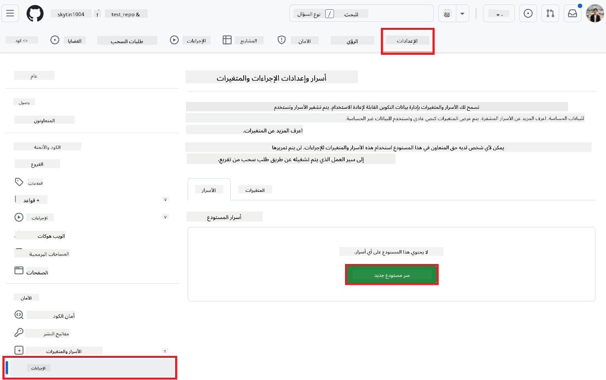
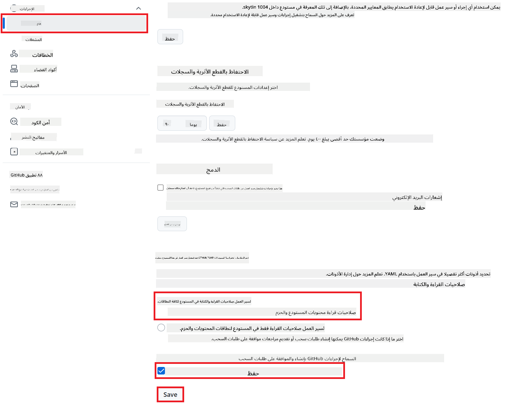

<!--
CO_OP_TRANSLATOR_METADATA:
{
  "original_hash": "a52587a512e667f70d92db853d3c61d5",
  "translation_date": "2025-06-12T19:22:07+00:00",
  "source_file": "getting_started/github-actions-guide/github-actions-guide-public.md",
  "language_code": "ar"
}
-->
# استخدام إجراء Co-op Translator في GitHub (إعداد عام)

**الجمهور المستهدف:** هذا الدليل موجه للمستخدمين في معظم المستودعات العامة أو الخاصة حيث تكفي أذونات GitHub Actions القياسية. يعتمد على `GITHUB_TOKEN` المدمج.

قم بأتمتة ترجمة توثيق المستودع الخاص بك بسهولة باستخدام إجراء Co-op Translator في GitHub. سيرشدك هذا الدليل خلال إعداد الإجراء لإنشاء طلبات سحب تلقائيًا مع الترجمات المحدثة كلما تغيرت ملفات Markdown المصدر أو الصور.

> [!IMPORTANT]
>
> **اختيار الدليل المناسب:**
>
> يشرح هذا الدليل **الإعداد الأبسط باستخدام `GITHUB_TOKEN` القياسي**. هذه هي الطريقة الموصى بها لمعظم المستخدمين لأنها لا تتطلب إدارة مفاتيح خاصة حساسة لتطبيق GitHub.
>

## المتطلبات الأساسية

قبل تكوين إجراء GitHub، تأكد من أن لديك بيانات اعتماد خدمة الذكاء الاصطناعي اللازمة جاهزة.

**1. مطلوب: بيانات اعتماد نموذج اللغة للذكاء الاصطناعي**  
تحتاج إلى بيانات اعتماد لنموذج لغة واحد مدعوم على الأقل:

- **Azure OpenAI**: يتطلب نقطة النهاية، مفتاح API، أسماء النماذج/النشر، إصدار API.  
- **OpenAI**: يتطلب مفتاح API، (اختياري: معرف المؤسسة، عنوان URL الأساسي، معرف النموذج).  
- راجع [النماذج والخدمات المدعومة](../../../../README.md) للمزيد من التفاصيل.

**2. اختياري: بيانات اعتماد رؤية الذكاء الاصطناعي (لترجمة الصور)**

- مطلوب فقط إذا كنت بحاجة إلى ترجمة النصوص داخل الصور.  
- **Azure AI Vision**: يتطلب نقطة النهاية ومفتاح الاشتراك.  
- إذا لم تُقدم، سيعمل الإجراء في [وضع Markdown فقط](../markdown-only-mode.md).

## الإعداد والتكوين

اتبع هذه الخطوات لتكوين إجراء Co-op Translator في مستودعك باستخدام `GITHUB_TOKEN` القياسي.

### الخطوة 1: فهم المصادقة (باستخدام `GITHUB_TOKEN`)

يستخدم هذا التدفق `GITHUB_TOKEN` المدمج المقدم من GitHub Actions. يمنح هذا الرمز تلقائيًا الأذونات اللازمة للتفاعل مع مستودعك بناءً على الإعدادات التي تم تكوينها في **الخطوة 3**.

### الخطوة 2: تكوين أسرار المستودع

كل ما عليك هو إضافة **بيانات اعتماد خدمة الذكاء الاصطناعي** كأسرار مشفرة في إعدادات مستودعك.

1.  انتقل إلى مستودع GitHub المستهدف.  
2.  اذهب إلى **الإعدادات** > **الأسرار والمتغيرات** > **الإجراءات**.  
3.  ضمن **أسرار المستودع**، اضغط على **سر جديد للمستودع** لكل سر من أسرار خدمة الذكاء الاصطناعي المطلوبة المذكورة أدناه.

     *(مرجع الصورة: يوضح مكان إضافة الأسرار)*

**أسرار خدمة الذكاء الاصطناعي المطلوبة (أضف كل ما ينطبق حسب متطلباتك):**

| اسم السر                          | الوصف                                  | مصدر القيمة                      |
| :-------------------------------- | :------------------------------------- | :------------------------------ |
| `AZURE_SUBSCRIPTION_KEY`            | مفتاح خدمة Azure AI (رؤية الحاسوب)       | Azure AI Foundry الخاص بك         |
| `AZURE_AI_SERVICE_ENDPOINT`         | نقطة النهاية لخدمة Azure AI (رؤية الحاسوب) | Azure AI Foundry الخاص بك         |
| `AZURE_OPENAI_API_KEY`              | مفتاح خدمة Azure OpenAI                 | Azure AI Foundry الخاص بك         |
| `AZURE_OPENAI_ENDPOINT`             | نقطة النهاية لخدمة Azure OpenAI         | Azure AI Foundry الخاص بك         |
| `AZURE_OPENAI_MODEL_NAME`           | اسم نموذج Azure OpenAI الخاص بك          | Azure AI Foundry الخاص بك         |
| `AZURE_OPENAI_CHAT_DEPLOYMENT_NAME` | اسم نشر Azure OpenAI الخاص بك             | Azure AI Foundry الخاص بك         |
| `AZURE_OPENAI_API_VERSION`          | إصدار API لخدمة Azure OpenAI            | Azure AI Foundry الخاص بك         |
| `OPENAI_API_KEY`                    | مفتاح API لـ OpenAI                     | منصة OpenAI الخاصة بك             |
| `OPENAI_ORG_ID`                     | معرف مؤسسة OpenAI (اختياري)              | منصة OpenAI الخاصة بك             |
| `OPENAI_CHAT_MODEL_ID`              | معرف نموذج OpenAI محدد (اختياري)          | منصة OpenAI الخاصة بك             |
| `OPENAI_BASE_URL`                   | عنوان URL مخصص لواجهة API لـ OpenAI (اختياري) | منصة OpenAI الخاصة بك             |

### الخطوة 3: تكوين أذونات التدفق

يحتاج إجراء GitHub إلى أذونات يمنحها `GITHUB_TOKEN` للسحب وإنشاء طلبات السحب.

1.  في مستودعك، انتقل إلى **الإعدادات** > **الإجراءات** > **عام**.  
2.  مرر للأسفل إلى قسم **أذونات التدفق**.  
3.  اختر **أذونات القراءة والكتابة**. يمنح هذا `GITHUB_TOKEN` أذونات `contents: write` و`pull-requests: write` اللازمة لهذا التدفق.  
4.  تأكد من تحديد خانة **السماح لـ GitHub Actions بإنشاء واعتماد طلبات السحب**.  
5.  اختر **حفظ**.



### الخطوة 4: إنشاء ملف التدفق

أخيرًا، أنشئ ملف YAML الذي يحدد التدفق الآلي باستخدام `GITHUB_TOKEN`.

1.  في الدليل الجذري لمستودعك، أنشئ دليل `.github/workflows/` إذا لم يكن موجودًا.  
2.  داخل `.github/workflows/`، أنشئ ملفًا باسم `co-op-translator.yml`.  
3.  الصق المحتوى التالي في `co-op-translator.yml`.

```yaml
name: Co-op Translator

on:
  push:
    branches:
      - main

jobs:
  co-op-translator:
    runs-on: ubuntu-latest

    permissions:
      contents: write
      pull-requests: write

    steps:
      - name: Checkout repository
        uses: actions/checkout@v4
        with:
          fetch-depth: 0

      - name: Set up Python
        uses: actions/setup-python@v4
        with:
          python-version: '3.10'

      - name: Install Co-op Translator
        run: |
          python -m pip install --upgrade pip
          pip install co-op-translator

      - name: Run Co-op Translator
        env:
          PYTHONIOENCODING: utf-8
          # === AI Service Credentials ===
          AZURE_SUBSCRIPTION_KEY: ${{ secrets.AZURE_SUBSCRIPTION_KEY }}
          AZURE_AI_SERVICE_ENDPOINT: ${{ secrets.AZURE_AI_SERVICE_ENDPOINT }}
          AZURE_OPENAI_API_KEY: ${{ secrets.AZURE_OPENAI_API_KEY }}
          AZURE_OPENAI_ENDPOINT: ${{ secrets.AZURE_OPENAI_ENDPOINT }}
          AZURE_OPENAI_MODEL_NAME: ${{ secrets.AZURE_OPENAI_MODEL_NAME }}
          AZURE_OPENAI_CHAT_DEPLOYMENT_NAME: ${{ secrets.AZURE_OPENAI_CHAT_DEPLOYMENT_NAME }}
          AZURE_OPENAI_API_VERSION: ${{ secrets.AZURE_OPENAI_API_VERSION }}
          OPENAI_API_KEY: ${{ secrets.OPENAI_API_KEY }}
          OPENAI_ORG_ID: ${{ secrets.OPENAI_ORG_ID }}
          OPENAI_CHAT_MODEL_ID: ${{ secrets.OPENAI_CHAT_MODEL_ID }}
          OPENAI_BASE_URL: ${{ secrets.OPENAI_BASE_URL }}
        run: |
          # =====================================================================
          # IMPORTANT: Set your target languages here (REQUIRED CONFIGURATION)
          # =====================================================================
          # Example: Translate to Spanish, French, German. Add -y to auto-confirm.
          translate -l "es fr de" -y  # <--- MODIFY THIS LINE with your desired languages

      - name: Create Pull Request with translations
        uses: peter-evans/create-pull-request@v5
        with:
          token: ${{ secrets.GITHUB_TOKEN }}
          commit-message: "🌐 Update translations via Co-op Translator"
          title: "🌐 Update translations via Co-op Translator"
          body: |
            This PR updates translations for recent changes to the main branch.

            ### 📋 Changes included
            - Translated contents are available in the `translations/` directory
            - Translated images are available in the `translated_images/` directory

            ---
            🌐 Automatically generated by the [Co-op Translator](https://github.com/Azure/co-op-translator) GitHub Action.
          branch: update-translations
          base: main
          labels: translation, automated-pr
          delete-branch: true
          add-paths: |
            translations/
            translated_images/
```  
4.  **خصص التدفق:**  
  - **[!IMPORTANT] اللغات المستهدفة:** في خطوة `Run Co-op Translator` step, you **MUST review and modify the list of language codes** within the `translate -l "..." -y` command to match your project's requirements. The example list (`ar de es...`) needs to be replaced or adjusted.
  - **Trigger (`on:`):** The current trigger runs on every push to `main`. For large repositories, consider adding a `paths:` filter (see commented example in the YAML) to run the workflow only when relevant files (e.g., source documentation) change, saving runner minutes.
  - **PR Details:** Customize the `commit-message`, `title`, `body`, `branch` name, and `labels` in the `Create Pull Request` إذا لزم الأمر.

**تنويه**:  
تمت ترجمة هذا المستند باستخدام خدمة الترجمة الآلية [Co-op Translator](https://github.com/Azure/co-op-translator). بينما نسعى لتحقيق الدقة، يرجى العلم أن الترجمات الآلية قد تحتوي على أخطاء أو عدم دقة. يجب اعتبار المستند الأصلي بلغته الأصلية المصدر الرسمي والمعتمد. للمعلومات الحساسة أو الهامة، يُنصح بالاستعانة بترجمة بشرية محترفة. نحن غير مسؤولين عن أي سوء فهم أو تفسير ناتج عن استخدام هذه الترجمة.