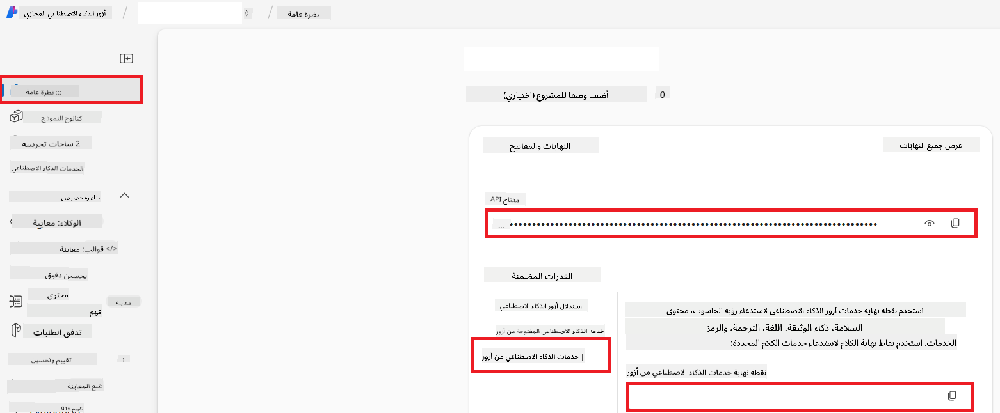

<!--
CO_OP_TRANSLATOR_METADATA:
{
  "original_hash": "b58d7c3cb4210697a073d20eb3064945",
  "translation_date": "2025-06-12T11:46:09+00:00",
  "source_file": "getting_started/set-up-azure-ai.md",
  "language_code": "ar"
}
-->
# إعداد Azure AI لمترجم التعاون (Azure OpenAI و Azure AI Vision)

يرشدك هذا الدليل خلال إعداد Azure OpenAI لترجمة اللغات وAzure Computer Vision لتحليل محتوى الصور (والذي يمكن استخدامه لاحقًا لترجمة الصور) ضمن Azure AI Foundry.

**المتطلبات الأساسية:**
- حساب Azure مع اشتراك نشط.
- أذونات كافية لإنشاء الموارد والنشر ضمن اشتراك Azure الخاص بك.

## إنشاء مشروع Azure AI

ستبدأ بإنشاء مشروع Azure AI، والذي يعمل كمركز لإدارة موارد الذكاء الاصطناعي الخاصة بك.

1. انتقل إلى [https://ai.azure.com](https://ai.azure.com) وقم بتسجيل الدخول باستخدام حساب Azure الخاص بك.

1. اختر **+Create** لإنشاء مشروع جديد.

1. قم بالمهام التالية:
   - أدخل **اسم المشروع** (مثلاً `CoopTranslator-Project`).
   - اختر **AI hub** (مثلاً `CoopTranslator-Hub`) (قم بإنشاء واحد جديد إذا لزم الأمر).

1. اضغط "**Review and Create**" لإعداد مشروعك. سيتم نقلك إلى صفحة نظرة عامة على المشروع.

## إعداد Azure OpenAI لترجمة اللغات

داخل مشروعك، ستقوم بنشر نموذج Azure OpenAI ليعمل كخلفية لترجمة النصوص.

### الانتقال إلى مشروعك

إذا لم تكن هناك بالفعل، افتح مشروعك الجديد (مثلاً `CoopTranslator-Project`) في Azure AI Foundry.

### نشر نموذج OpenAI

1. من القائمة اليسرى لمشروعك، ضمن "My assets"، اختر "**Models + endpoints**".

1. اختر **+ Deploy model**.

1. اختر **Deploy Base Model**.

1. ستظهر لك قائمة بالنماذج المتاحة. قم بتصفية أو البحث عن نموذج GPT مناسب. نوصي بـ `gpt-4o`.

1. اختر النموذج المطلوب واضغط **Confirm**.

1. اختر **Deploy**.

### تكوين Azure OpenAI

بعد النشر، يمكنك اختيار النشر من صفحة "**Models + endpoints**" للعثور على **REST endpoint URL**، **Key**، **Deployment name**، **Model name** و**API version**. ستحتاج هذه المعلومات لدمج نموذج الترجمة في تطبيقك.

> [!NOTE]
> يمكنك اختيار إصدارات API من صفحة [API version deprecation](https://learn.microsoft.com/azure/ai-services/openai/api-version-deprecation) بناءً على متطلباتك. لاحظ أن **إصدار API** يختلف عن **إصدار النموذج** المعروض في صفحة **Models + endpoints** في Azure AI Foundry.

## إعداد Azure Computer Vision لترجمة الصور

لتمكين ترجمة النصوص داخل الصور، تحتاج إلى العثور على مفتاح API ونقطة النهاية لخدمة Azure AI.

1. انتقل إلى مشروع Azure AI الخاص بك (مثلاً `CoopTranslator-Project`). تأكد من أنك في صفحة نظرة عامة على المشروع.

### تكوين خدمة Azure AI

ابحث عن مفتاح API ونقطة النهاية من تبويب خدمة Azure AI.

1. انتقل إلى مشروع Azure AI الخاص بك (مثلاً `CoopTranslator-Project`). تأكد من أنك في صفحة نظرة عامة على المشروع.

1. ابحث عن **API Key** و **Endpoint** من تبويب خدمة Azure AI.

    

هذا الاتصال يجعل قدرات مورد خدمة Azure AI المرتبط (بما في ذلك تحليل الصور) متاحة لمشروع AI Foundry الخاص بك. يمكنك بعد ذلك استخدام هذا الاتصال في دفاتر الملاحظات أو التطبيقات الخاصة بك لاستخراج النصوص من الصور، والتي يمكن إرسالها لاحقًا إلى نموذج Azure OpenAI للترجمة.

## تجميع بيانات الاعتماد الخاصة بك

بحلول الآن، يجب أن تكون قد جمعت المعلومات التالية:

**لـ Azure OpenAI (ترجمة النصوص):**
- نقطة نهاية Azure OpenAI
- مفتاح API الخاص بـ Azure OpenAI
- اسم نموذج Azure OpenAI (مثلاً `gpt-4o`)
- اسم نشر Azure OpenAI (مثلاً `cooptranslator-gpt4o`)
- إصدار API الخاص بـ Azure OpenAI

**لخدمات Azure AI (استخراج نص الصور عبر الرؤية):**
- نقطة نهاية خدمة Azure AI
- مفتاح API الخاص بخدمة Azure AI

### مثال: تكوين متغيرات البيئة (معاينة)

لاحقًا، عند بناء تطبيقك، من المحتمل أن تقوم بتكوينه باستخدام بيانات الاعتماد التي جمعتها. على سبيل المثال، قد تقوم بتعيينها كمتغيرات بيئة كما يلي:

```bash
# Azure AI Service Credentials (Required for image translation)
AZURE_AI_SERVICE_API_KEY="your_azure_ai_service_api_key" # e.g., 21xasd...
AZURE_AI_SERVICE_ENDPOINT="https://your_azure_ai_service_endpoint.cognitiveservices.azure.com/"

# Azure OpenAI Credentials (Required for text translation)
AZURE_OPENAI_API_KEY="your_azure_openai_api_key" # e.g., 21xasd...
AZURE_OPENAI_ENDPOINT="https://your_azure_openai_endpoint.openai.azure.com/"
AZURE_OPENAI_MODEL_NAME="your_model_name" # e.g., gpt-4o
AZURE_OPENAI_CHAT_DEPLOYMENT_NAME="your_deployment_name" # e.g., cooptranslator-gpt4o
AZURE_OPENAI_API_VERSION="your_api_version" # e.g., 2024-12-01-preview
```

---

### قراءة إضافية

- [كيفية إنشاء مشروع في Azure AI Foundry](https://learn.microsoft.com/azure/ai-foundry/how-to/create-projects?tabs=ai-studio)
- [كيفية إنشاء موارد Azure AI](https://learn.microsoft.com/azure/ai-foundry/how-to/create-azure-ai-resource?tabs=portal)
- [كيفية نشر نماذج OpenAI في Azure AI Foundry](https://learn.microsoft.com/en-us/azure/ai-foundry/how-to/deploy-models-openai)

**تنويه**:  
تمت ترجمة هذا المستند باستخدام خدمة الترجمة الآلية [Co-op Translator](https://github.com/Azure/co-op-translator). بينما نسعى لتحقيق الدقة، يرجى العلم أن الترجمات الآلية قد تحتوي على أخطاء أو عدم دقة. يجب اعتبار المستند الأصلي بلغته الأصلية المصدر الموثوق به. للمعلومات الهامة، يُنصح بالاستعانة بترجمة بشرية محترفة. نحن غير مسؤولين عن أي سوء فهم أو تفسير ناتج عن استخدام هذه الترجمة.