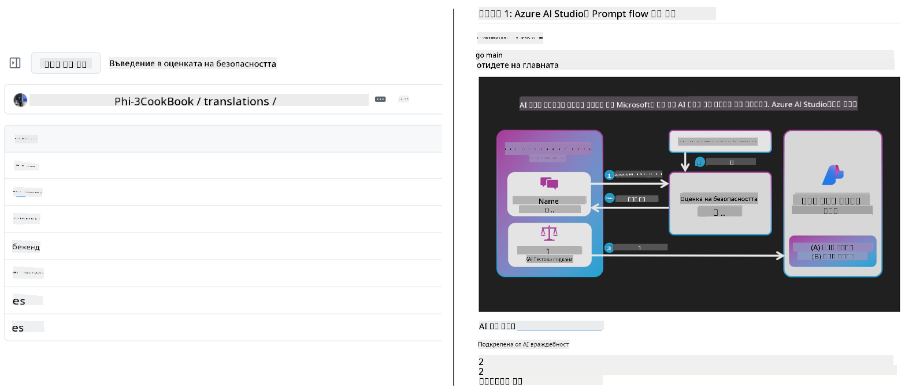
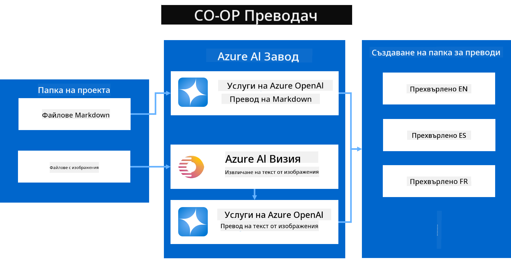
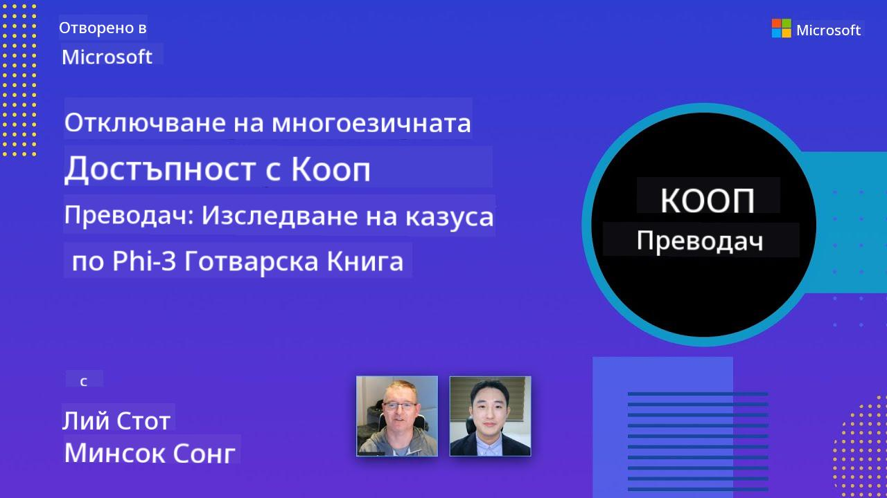

<!--
CO_OP_TRANSLATOR_METADATA:
{
  "original_hash": "044724537b57868117aadae8e7728c7c",
  "translation_date": "2025-06-12T10:52:07+00:00",
  "source_file": "README.md",
  "language_code": "bg"
}
-->


# Co-op Translator: Автоматизирайте превода на образователна документация без усилия

_Лесно автоматизирайте превода на вашата документация на множество езици, за да достигнете до глобална аудитория._

[](https://pypi.org/project/co-op-translator/)
[](https://github.com/azure/co-op-translator/blob/main/LICENSE)
[](https://pepy.tech/project/co-op-translator)
[](https://pepy.tech/project/co-op-translator)
[](https://github.com/psf/black)

[](https://GitHub.com/azure/co-op-translator/graphs/contributors/)
[](https://GitHub.com/azure/co-op-translator/issues/)
[](https://GitHub.com/azure/co-op-translator/pulls/)
[](http://makeapullrequest.com)

### Поддръжка на езици, захранвана от Co-op Translator
[Френски](../fr/README.md) | [Испански](../es/README.md) | [Немски](../de/README.md) | [Руски](../ru/README.md) | [Арабски](../ar/README.md) | [Персийски (фарси)](../fa/README.md) | [Урду](../ur/README.md) | [Китайски (опростен)](../zh/README.md) | [Китайски (традиционен, Макао)](../mo/README.md) | [Китайски (традиционен, Хонконг)](../hk/README.md) | [Китайски (традиционен, Тайван)](../tw/README.md) | [Японски](../ja/README.md) | [Корейски](../ko/README.md) | [Хинди](../hi/README.md) | [Бенгалски](../bn/README.md) | [Маратхи](../mr/README.md) | [Непалски](../ne/README.md) | [Пенджабски (Гурмукхи)](../pa/README.md) | [Португалски (Португалия)](../pt/README.md) | [Португалски (Бразилия)](../br/README.md) | [Италиански](../it/README.md) | [Полски](../pl/README.md) | [Турски](../tr/README.md) | [Гръцки](../el/README.md) | [Тайски](../th/README.md) | [Шведски](../sv/README.md) | [Датски](../da/README.md) | [Норвежки](../no/README.md) | [Фински](../fi/README.md) | [Холандски](../nl/README.md) | [Иврит](../he/README.md) | [Виетнамски](../vi/README.md) | [Индонезийски](../id/README.md) | [Малайски](../ms/README.md) | [Тагалог (филипински)](../tl/README.md) | [Суахили](../sw/README.md) | [Унгарски](../hu/README.md) | [Чешки](../cs/README.md) | [Словашки](../sk/README.md) | [Румънски](../ro/README.md) | [Български](./README.md) | [Сръбски (кирилица)](../sr/README.md) | [Хърватски](../hr/README.md) | [Словенски](../sl/README.md) | [Украински](../uk/README.md) | [Бирмански (Мианмар)](../my/README.md) Моля, напишете изхода от ляво на дясно.
> [!NOTE]
> Това са текущите преводи на съдържанието на това хранилище. За пълен списък с езици, поддържани от Co-op Translator, моля, вижте секцията [Language Support](../..).

[](https://GitHub.com/azure/co-op-translator/watchers/)
[](https://GitHub.com/azure/co-op-translator/network/)
[](https://GitHub.com/azure/co-op-translator/stargazers/)

[](https://discord.com/invite/ByRwuEEgH4)

[](https://codespaces.new/azure/co-op-translator)
[](https://vscode.dev/redirect?url=vscode://ms-vscode-remote.remote-containers/cloneInVolume?url=https://github.com/azure/co-op-translator)

## Обзор: Оптимизирайте превода на вашето образователно съдържание

Езиковите бариери сериозно затрудняват достъпа до ценни образователни ресурси и технически знания за учащи и разработчици по целия свят. Това ограничава участието и забавя темпото на глобалните иновации и учене.

**Co-op Translator** възникна от нуждата да се подобри неефективният ръчен превод на големи образователни серии на Microsoft (като ръководствата „За начинаещи“). Той се превърна в лесен за ползване и мощен инструмент, който премахва тези бариери за всички. Чрез предоставяне на висококачествени автоматични преводи чрез CLI и GitHub Actions, Co-op Translator дава възможност на преподаватели, студенти, изследователи и разработчици по целия свят да споделят и получават знания без езикови ограничения.

Вижте как Co-op Translator организира преведеното образователно съдържание:



Markdown файловете и текстът в изображенията се превеждат автоматично и се подреждат в папки, специфични за езика.

**Отключете глобален достъп до вашето образователно съдържание с Co-op Translator още днес!**

## Подкрепа за глобален достъп до образователните ресурси на Microsoft

Co-op Translator помага да се преодолее езиковата бариера за ключови образователни инициативи на Microsoft, автоматизирайки процеса на превод за хранилища, обслужващи глобална общност от разработчици. Примери за проекти, които вече използват Co-op Translator:

[](https://github.com/microsoft/Generative-AI-for-beginners)
[](https://github.com/microsoft/ML-For-Beginners)
[](https://github.com/microsoft/AI-For-Beginners)
[](https://github.com/microsoft/ai-agents-for-beginners)
[](https://github.com/microsoft/PhiCookBook)
[](https://github.com/microsoft/Generative-AI-for-beginners-dotnet)

## Основни характеристики

- **Автоматични преводи**: Превеждайте текст на множество езици без усилие.
- **Интеграция с GitHub Actions**: Автоматизирайте преводите като част от вашия CI/CD процес.
- **Запазване на Markdown**: Поддържа правилния Markdown синтаксис по време на превода.
- **Превод на текст в изображения**: Извлича и превежда текст в изображения.
- **Модерна LLM технология**: Използва най-новите езикови модели за висококачествени преводи.
- **Лесна интеграция**: Безпроблемно се включва във вашата текуща проектна среда.
- **Оптимизиране на локализацията**: Улеснява процеса на локализиране за международни пазари.

## Как работи



Co-op Translator взема Markdown файлове и изображения от вашата проектна папка и ги обработва по следния начин:

1. **Извличане на текст**: Извлича текст от Markdown файловете и, ако е конфигурирано (например с Azure AI Vision), текст, вграден в изображенията.
1. **AI превод**: Изпраща извлечения текст към конфигурирания LLM (Azure OpenAI, OpenAI и др.) за превод.
1. **Запис на резултата**: Записва преведените Markdown файлове и изображения (с преведен текст) в папки, специфични за езика, като запазва оригиналното форматиране.

## Започване

Започнете бързо с CLI или настройте пълна автоматизация с GitHub Actions. Изберете подхода, който най-добре пасва на вашия работен процес:

1. **Команден ред (CLI)** – за еднократни преводи или ръчен контрол
2. **GitHub Actions** – за автоматични преводи при всяко качване

> [!NOTE]
> Въпреки че това ръководство се фокусира върху Azure ресурси, можете да използвате всеки поддържан езиков модел.

### Поддръжка на езици

Co-op Translator поддържа широк набор от езици, за да ви помогне да достигнете до глобална аудитория. Ето какво трябва да знаете:

#### Бърза справка

| Език | Код | Език | Код | Език | Код |
|----------|------|----------|------|----------|------|
| Arabic | ar | Bengali | bn | Bulgarian | bg |
| Burmese (Myanmar) | my | Chinese (Simplified) | zh | Chinese (Traditional, HK) | hk |
| Chinese (Traditional, Macau) | mo | Chinese (Traditional, TW) | tw | Croatian | hr |
| Czech | cs | Danish | da | Dutch | nl |
| Finnish | fi | French | fr | German | de |
| Greek | el | Hebrew | he | Hindi | hi |
| Hungarian | hu | Indonesian | id | Italian | it |
| Japanese | ja | Korean | ko | Malay | ms |
| Marathi | mr | Nepali | ne | Norwegian | no |
| Persian (Farsi) | fa | Polish | pl | Portuguese (Brazil) | br |
| Portuguese (Portugal) | pt | Punjabi (Gurmukhi) | pa | Romanian | ro |
| Russian | ru | Serbian (Cyrillic) | sr | Slovak | sk |
| Slovenian | sl | Spanish | es | Swahili | sw |
| Swedish | sv | Tagalog (Filipino) | tl | Thai | th |
| Turkish | tr | Ukrainian | uk | Urdu | ur |
| Vietnamese | vi | — | — | — | — |

#### Използване на езикови кодове

При работа с Co-op Translator трябва да посочвате езиците чрез техните кодове. Например:

```bash
# Translate to French, Spanish, and German
translate -l "fr es de"

# Translate to Chinese (Simplified) and Japanese
translate -l "zh ja"
```

> [!NOTE]
> За подробна техническа информация относно поддръжката на езици, включително:
>
> - Спецификации на шрифтовете за всеки език
> - Известни проблеми
> - Как да добавите нови езици
>
> Вижте нашата [документация за поддържаните езици](./getting_started/supported-languages.md).

### Поддържани модели и услуги

| Тип                   | Име                           |
|-----------------------|--------------------------------|
| Езиков модел          |   |
| AI Vision             |  |

> [!NOTE]
> Ако AI vision услуга не е налична, co-op translator автоматично ще превключи в [Markdown-only режим](./getting_started/markdown-only-mode.md).

### Първоначална настройка

Преди да започнете, трябва да осигурите следните ресурси:

1. Ресурс за езиков модел (задължително):
   - Azure OpenAI (препоръчително) – осигурява висококачествени преводи с надеждност на корпоративно ниво
   - OpenAI – алтернативен вариант, ако нямате достъп до Azure
   - За подробна информация за поддържаните модели вижте [Supported Models and Services](../..)

1. AI Vision ресурс (по избор):
   - Azure AI Vision – позволява превод на текст в изображения
   - Ако не е конфигуриран, преводачът автоматично ще използва [Markdown-only режим](./getting_started/markdown-only-mode.md)
   - Препоръчва се за проекти с изображения, съдържащи текст, който трябва да се преведе

1. Стъпки за конфигурация:
   - Следвайте нашето [ръководство за настройка на Azure AI](./getting_started/set-up-azure-ai.md) за подробни инструкции
   - Създайте `.env` файл с вашите API ключове и крайни точки (вижте секцията [Quick Start](../..))
   - Уверете се, че имате необходимите разрешения и квоти за избраните услуги

### Подготовка на проекта преди превод

Преди да започнете превода, следвайте тези стъпки за подготовка на проекта:

1. Подгответе README файла си:
   - Добавете таблица с преводите в README.md, за да свържете към преведените версии
   - Примерен формат:

     ```markdown

     ### 🌐 Multi-Language Support
     
     [French](../fr/README.md) | [Spanish](../es/README.md) | [German](../de/README.md) | [Russian](../ru/README.md) | [Arabic](../ar/README.md) | [Persian (Farsi)](../fa/README.md) | [Urdu](../ur/README.md) | [Chinese (Simplified)](../zh/README.md) | [Chinese (Traditional, Macau)](../mo/README.md) | [Chinese (Traditional, Hong Kong)](../hk/README.md) | [Chinese (Traditional, Taiwan)](../tw/README.md) | [Japanese](../ja/README.md) | [Korean](../ko/README.md) | [Hindi](../hi/README.md) | [Bengali](../bn/README.md) | [Marathi](../mr/README.md) | [Nepali](../ne/README.md) | [Punjabi (Gurmukhi)](../pa/README.md) | [Portuguese (Portugal)](../pt/README.md) | [Portuguese (Brazil)](../br/README.md) | [Italian](../it/README.md) | [Polish](../pl/README.md) | [Turkish](../tr/README.md) | [Greek](../el/README.md) | [Thai](../th/README.md) | [Swedish](../sv/README.md) | [Danish](../da/README.md) | [Norwegian](../no/README.md) | [Finnish](../fi/README.md) | [Dutch](../nl/README.md) | [Hebrew](../he/README.md) | [Vietnamese](../vi/README.md) | [Indonesian](../id/README.md) | [Malay](../ms/README.md) | [Tagalog (Filipino)](../tl/README.md) | [Swahili](../sw/README.md) | [Hungarian](../hu/README.md) | [Czech](../cs/README.md) | [Slovak](../sk/README.md) | [Romanian](../ro/README.md) | [Bulgarian](./README.md) | [Serbian (Cyrillic)](../sr/README.md) | [Croatian](../hr/README.md) | [Slovenian](../sl/README.md) | [Ukrainian](../uk/README.md) | [Burmese (Myanmar)](../my/README.md) 
    
     ```

1. Почистете съществуващите преводи (ако е необходимо):
   - Премахнете всички съществуващи папки с преводи (например `translations/`)
   - Изтрийте стари преводни файлове, за да започнете отначало
   - Това гарантира, че няма конфликти с новия процес на превод

### Бърз старт: Команден ред

За бързо стартиране чрез командния ред:

1. Създайте виртуална среда:

    ```bash
    python -m venv .venv
    ```

1. Активирайте виртуалната среда:

    - В Windows:

    ```bash
    .venv\scripts\activate
    ```

    - В Linux/macOS:

    ```bash
    source .venv/bin/activate
    ```

1. Инсталирайте пакета:

    ```bash
    pip install co-op-translator
    ```

1. Конфигурирайте креденшъли:

    - Създайте `.env` file in your project's root directory.
    - Copy the contents from the [.env.template](../../.env.template) file into your new `.env` file.
    - Fill in the required API keys and endpoint information in your `.env` file.

1. Run Translation:
    - Navigate to your project's root directory in your terminal.
    - Execute the translate command, specifying target languages with the `-l` флаг:

    ```bash
    translate -l "ko ja fr"
    ```

    _(Заменете `"ko ja fr"` with your desired space-separated language codes)_

### Detailed Usage Guides

Choose the approach that best fits your workflow:

#### 1. Using the Command Line (CLI)

- Best for: One-time translations, manual control, or integration into custom scripts.
- Requires: Local installation of Python and the `co-op-translator` package.
- Guide: [Command Line Guide](./getting_started/command-line-guide/command-line-guide.md)

#### 2. Using GitHub Actions (Automation)

- Best for: Automatically translating content whenever changes are pushed to your repository. Keeps translations consistently up-to-date.
- Requires: Setting up a workflow file (`.github/workflows`) в хранилището си. Не е необходима локална инсталация.
- Ръководства:
  - [GitHub Actions Guide (Public Repositories & Standard Secrets)](./getting_started/github-actions-guide/github-actions-guide-public.md) – използвайте това за повечето публични или лични хранилища, които разчитат на стандартни секрети на хранилището.
  - [GitHub Actions Guide (Microsoft Organization Repos & Org-Level Setups)](./getting_started/github-actions-guide/github-actions-guide-org.md) – използвайте това, ако работите в GitHub организацията на Microsoft или трябва да използвате секрети или изпълнители на ниво организация.

### Отстраняване на проблеми и съвети

- [Ръководство за отстраняване на проблеми](./getting_started/troubleshooting.md)

### Допълнителни ресурси

- [Справочник с команди](./getting_started/command-reference.md): Подробно ръководство за всички налични команди и опции.
- [Поддържани езици](./getting_started/supported-languages.md): Проверете списъка с поддържани езици и инструкции за добавяне на нови.
- [Markdown-only режим](./getting_started/markdown-only-mode.md): Как да превеждате само текст, без превод на изображения.

## Видео презентации

Научете повече за Co-op Translator чрез нашите презентации _(Кликнете върху изображението по-долу, за да гледате в YouTube.)_:

- **Open at Microsoft**: Кратко 18-минутно въведение и бързо ръководство за използване на Co-op Translator.
[](https://www.youtube.com/watch?v=jX_swfH_KNU)

## Подкрепете ни и насърчете глобалното обучение

Присъединете се към нас в революционизирането на начина, по който образователното съдържание се споделя по света! Дайте ⭐ на [Co-op Translator](https://github.com/azure/co-op-translator) в GitHub и подкрепете нашата мисия за премахване на езиковите бариери в обучението и технологиите. Вашият интерес и принос имат голямо значение! Винаги сме благодарни за кодови приноси и предложения за нови функции.

## Принос

Този проект приема приноси и предложения. Интересувате ли се да допринесете за Azure Co-op Translator? Моля, вижте нашия [CONTRIBUTING.md](./CONTRIBUTING.md) за указания как можете да помогнете Co-op Translator да стане по-достъпен.

## Приносители

[](https://github.com/Azure/co-op-translator/graphs/contributors)

## Кодекс на поведение

Този проект е приел [Microsoft Open Source Code of Conduct](https://opensource.microsoft.com/codeofconduct/).
За повече информация вижте [Често задавани въпроси за Кодекса на поведение](https://opensource.microsoft.com/codeofconduct/faq/) или
се свържете с [opencode@microsoft.com](mailto:opencode@microsoft.com) при допълнителни въпроси или коментари.

## Отговорен изкуствен интелект

Microsoft се ангажира да помага на клиентите си да използват нашите AI продукти отговорно, като споделя наученото и изгражда партньорства, базирани на доверие, чрез инструменти като Transparency Notes и Impact Assessments. Много от тези ресурси могат да бъдат намерени на [https://aka.ms/RAI](https://aka.ms/RAI).
Подходът на Microsoft към отговорния изкуствен интелект се основава на нашите AI принципи за справедливост, надеждност и безопасност, поверителност и сигурност, приобщаване, прозрачност и отчетност.

Големи модели за естествен език, изображения и реч – като тези, използвани в този пример – могат потенциално да се държат несправедливо, ненадеждно или обидно, което може да причини вреди. Моля, консултирайте се с [Transparency note на Azure OpenAI service](https://learn.microsoft.com/legal/cognitive-services/openai/transparency-note?tabs=text), за да се информирате за рисковете и ограниченията.

Препоръчителният подход за намаляване на тези рискове е да включите система за безопасност във вашата архитектура, която може да открива и предотвратява вредно поведение. [Azure AI Content Safety](https://learn.microsoft.com/azure/ai-services/content-safety/overview) предоставя независим слой защита, способен да открива вредно съдържание, генерирано от потребители и AI, в приложения и услуги. Azure AI Content Safety включва текстови и графични API-та, които ви позволяват да откривате вредно съдържание. Имаме и интерактивно Content Safety Studio, което ви позволява да разглеждате, изследвате и тествате примерен код за откриване на вредно съдържание в различни модалности. Следващата [документация за бърз старт](https://learn.microsoft.com/azure/ai-services/content-safety/quickstart-text?tabs=visual-studio%2Clinux&pivots=programming-language-rest) ще ви преведе през изпращането на заявки към услугата.

Друг аспект, който трябва да имате предвид, е цялостната производителност на приложението. При мулти-модални и мулти-моделни приложения, производителността означава, че системата работи според очакванията на вас и вашите потребители, включително и да не генерира вредни изходи. Важно е да оцените производителността на цялото приложение, използвайки [метрики за качество на генериране и рискове и безопасност](https://learn.microsoft.com/azure/ai-studio/concepts/evaluation-metrics-built-in).

Можете да оцените вашето AI приложение в средата за разработка, използвайки [prompt flow SDK](https://microsoft.github.io/promptflow/index.html). С помощта на тестов набор от данни или цел, вашите генерации от генеративното AI приложение се измерват количествено с вградени оценители или потребителски оценители по ваш избор. За да започнете с prompt flow sdk за оценка на вашата система, можете да следвате [бързия старт](https://learn.microsoft.com/azure/ai-studio/how-to/develop/flow-evaluate-sdk). След като изпълните оценка, можете да [визуализирате резултатите в Azure AI Studio](https://learn.microsoft.com/azure/ai-studio/how-to/evaluate-flow-results).

## Търговски марки

Този проект може да съдържа търговски марки или лога на проекти, продукти или услуги. Разрешената употреба на Microsoft
търговски марки или лога е подчинена на и трябва да следва
[Microsoft's Trademark & Brand Guidelines](https://www.microsoft.com/en-us/legal/intellectualproperty/trademarks/usage/general).
Употребата на Microsoft търговски марки или лога в модифицирани версии на този проект не трябва да създава объркване или да предполага спонсорство от Microsoft.
Всяка употреба на търговски марки или лога на трети страни е подчинена на правилата на съответните трети страни.

**Отказ от отговорност**:  
Този документ е преведен с помощта на AI преводаческа услуга [Co-op Translator](https://github.com/Azure/co-op-translator). Въпреки че се стремим към точност, моля, имайте предвид, че автоматизираните преводи могат да съдържат грешки или неточности. Оригиналният документ на неговия роден език трябва да се счита за авторитетен източник. За критична информация се препоръчва професионален човешки превод. Ние не носим отговорност за каквито и да е недоразумения или неправилни тълкувания, произтичащи от използването на този превод.