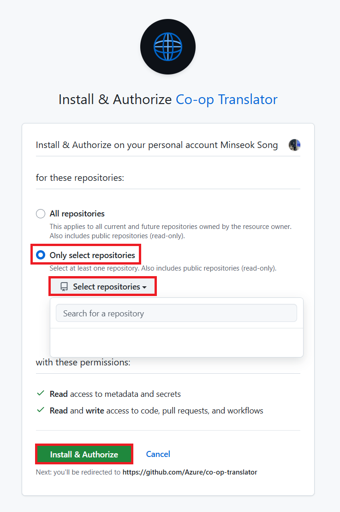

<!--
CO_OP_TRANSLATOR_METADATA:
{
  "original_hash": "9fac847815936ef6e6c8bfde6d191571",
  "translation_date": "2025-10-15T04:01:23+00:00",
  "source_file": "getting_started/github-actions-guide/github-actions-guide-org.md",
  "language_code": "bg"
}
-->
# Използване на Co-op Translator GitHub Action (Ръководство за организации)

**Целева аудитория:** Това ръководство е предназначено за **вътрешни потребители на Microsoft** или **екипи, които имат достъп до необходимите идентификационни данни за предварително изградения Co-op Translator GitHub App** или могат да създадат собствен GitHub App.

Автоматизирайте превода на документацията във вашето хранилище лесно с помощта на Co-op Translator GitHub Action. Това ръководство ще ви преведе през настройката на действието, така че автоматично да се създават pull request-и с обновени преводи всеки път, когато се променят изходните Markdown файлове или изображения.

> [!IMPORTANT]
> 
> **Избор на правилното ръководство:**
>
> Това ръководство описва настройка с помощта на **GitHub App ID и Private Key**. Обикновено ви е необходим този "Организационен метод", ако: **`GITHUB_TOKEN` има ограничени права:** Настройките на вашата организация или хранилище ограничават стандартните права, предоставени на `GITHUB_TOKEN`. По-конкретно, ако `GITHUB_TOKEN` няма необходимите права за запис (`contents: write` или `pull-requests: write`), работният процес от [Публичното ръководство](./github-actions-guide-public.md) ще се провали поради недостатъчни права. Използването на специален GitHub App с изрично предоставени права заобикаля това ограничение.
>
> **Ако горното не се отнася за вас:**
>
> Ако стандартният `GITHUB_TOKEN` има достатъчни права във вашето хранилище (т.е. не сте ограничени от организационни политики), използвайте **[Публичното ръководство с GITHUB_TOKEN](./github-actions-guide-public.md)**. Публичното ръководство не изисква получаване или управление на App ID или Private Key и разчита само на стандартния `GITHUB_TOKEN` и правата на хранилището.

## Предварителни изисквания

Преди да конфигурирате GitHub Action, уверете се, че разполагате с необходимите идентификационни данни за AI услугите.

**1. Задължително: Идентификационни данни за езиков модел (AI)**
Трябва да имате идентификационни данни за поне един поддържан езиков модел:

- **Azure OpenAI**: Изисква Endpoint, API Key, имена на модел/деплоймънт, версия на API.
- **OpenAI**: Изисква API Key, (по избор: Org ID, Base URL, Model ID).
- Вижте [Поддържани модели и услуги](../../../../README.md) за подробности.
- Ръководство за настройка: [Настройка на Azure OpenAI](../set-up-resources/set-up-azure-openai.md).

**2. По избор: Идентификационни данни за Computer Vision (за превод на изображения)**

- Необходимо само ако искате да превеждате текст в изображения.
- **Azure Computer Vision**: Изисква Endpoint и Subscription Key.
- Ако не са предоставени, действието работи в [режим само за Markdown](../markdown-only-mode.md).
- Ръководство за настройка: [Настройка на Azure Computer Vision](../set-up-resources/set-up-azure-computer-vision.md).

## Настройка и конфигуриране

Следвайте тези стъпки, за да конфигурирате Co-op Translator GitHub Action във вашето хранилище:

### Стъпка 1: Инсталирайте и конфигурирайте GitHub App удостоверяване

Работният процес използва удостоверяване чрез GitHub App, за да взаимодейства сигурно с вашето хранилище (например да създава pull request-и) от ваше име. Изберете една от опциите:

#### **Вариант A: Инсталирайте предварително изградения Co-op Translator GitHub App (за вътрешна употреба в Microsoft)**

1. Отидете на страницата на [Co-op Translator GitHub App](https://github.com/apps/co-op-translator).

1. Изберете **Install** и изберете акаунта или организацията, в която се намира вашето хранилище.

    

1. Изберете **Only select repositories** и изберете вашето хранилище (например `PhiCookBook`). Натиснете **Install**. Може да бъдете помолени да се удостоверите.

    

1. **Получете идентификационни данни за приложението (необходим е вътрешен процес):** За да позволите на работния процес да се удостоверява като приложението, са ви необходими две неща, предоставени от екипа на Co-op Translator:
  - **App ID:** Уникалният идентификатор на Co-op Translator приложението. App ID е: `1164076`.
  - **Private Key:** Трябва да получите **цялото съдържание** на `.pem` файла с частния ключ от поддръжката. **Третирайте този ключ като парола и го пазете сигурно.**

1. Продължете към Стъпка 2.

#### **Вариант B: Използвайте собствен GitHub App**

- Ако предпочитате, можете да създадете и конфигурирате собствен GitHub App. Уверете се, че има Read & write достъп до Contents и Pull requests. Ще ви трябват неговият App ID и генериран Private Key.

### Стъпка 2: Конфигурирайте секретите на хранилището

Трябва да добавите идентификационните данни на GitHub App и вашите AI услуги като криптирани секрети в настройките на хранилището.

1. Отидете във вашето GitHub хранилище (например `PhiCookBook`).

1. Изберете **Settings** > **Secrets and variables** > **Actions**.

1. Под **Repository secrets** натиснете **New repository secret** за всеки от секретите по-долу.

   

**Задължителни секрети (за удостоверяване с GitHub App):**

| Име на секрета      | Описание                                         | Източник на стойността                        |
| :------------------- | :----------------------------------------------- | :-------------------------------------------- |
| `GH_APP_ID`          | App ID на GitHub App (от Стъпка 1).              | GitHub App Settings                           |
| `GH_APP_PRIVATE_KEY` | **Цялото съдържание** на изтегления `.pem` файл. | `.pem` файл (от Стъпка 1)                     |

**Секрети за AI услуги (добавете ВСИЧКИ, които са приложими според вашите изисквания):**

| Име на секрета                      | Описание                                   | Източник на стойността         |
| :---------------------------------- | :---------------------------------------- | :----------------------------- |
| `AZURE_AI_SERVICE_API_KEY`            | Ключ за Azure AI Service (Computer Vision)  | Azure AI Foundry               |
| `AZURE_AI_SERVICE_ENDPOINT`         | Endpoint за Azure AI Service (Computer Vision) | Azure AI Foundry            |
| `AZURE_OPENAI_API_KEY`              | Ключ за Azure OpenAI service               | Azure AI Foundry               |
| `AZURE_OPENAI_ENDPOINT`             | Endpoint за Azure OpenAI service           | Azure AI Foundry               |
| `AZURE_OPENAI_MODEL_NAME`           | Име на вашия Azure OpenAI модел            | Azure AI Foundry               |
| `AZURE_OPENAI_CHAT_DEPLOYMENT_NAME` | Име на вашия Azure OpenAI Deployment       | Azure AI Foundry               |
| `AZURE_OPENAI_API_VERSION`          | Версия на API за Azure OpenAI              | Azure AI Foundry               |
| `OPENAI_API_KEY`                    | API Key за OpenAI                          | OpenAI Platform                |
| `OPENAI_ORG_ID`                     | OpenAI Organization ID                     | OpenAI Platform                |
| `OPENAI_CHAT_MODEL_ID`              | Конкретен OpenAI model ID                  | OpenAI Platform                |
| `OPENAI_BASE_URL`                   | Персонализиран OpenAI API Base URL         | OpenAI Platform                |


### Стъпка 3: Създайте файла за работния процес

Накрая създайте YAML файл, който дефинира автоматизирания работен процес.

1. В основната директория на вашето хранилище създайте папка `.github/workflows/`, ако не съществува.

1. Вътре в `.github/workflows/` създайте файл с име `co-op-translator.yml`.

1. Поставете следното съдържание в co-op-translator.yml.

```
name: Co-op Translator

on:
  push:
    branches:
      - main

jobs:
  co-op-translator:
    runs-on: ubuntu-latest

    permissions:
      contents: write
      pull-requests: write

    steps:
      - name: Checkout repository
        uses: actions/checkout@v4
        with:
          fetch-depth: 0

      - name: Set up Python
        uses: actions/setup-python@v4
        with:
          python-version: '3.10'

      - name: Install Co-op Translator
        run: |
          python -m pip install --upgrade pip
          pip install co-op-translator

      - name: Run Co-op Translator
        env:
          PYTHONIOENCODING: utf-8
          # Azure AI Service Credentials
          AZURE_AI_SERVICE_API_KEY: ${{ secrets.AZURE_AI_SERVICE_API_KEY }}
          AZURE_AI_SERVICE_ENDPOINT: ${{ secrets.AZURE_AI_SERVICE_ENDPOINT }}

          # Azure OpenAI Credentials
          AZURE_OPENAI_API_KEY: ${{ secrets.AZURE_OPENAI_API_KEY }}
          AZURE_OPENAI_ENDPOINT: ${{ secrets.AZURE_OPENAI_ENDPOINT }}
          AZURE_OPENAI_MODEL_NAME: ${{ secrets.AZURE_OPENAI_MODEL_NAME }}
          AZURE_OPENAI_CHAT_DEPLOYMENT_NAME: ${{ secrets.AZURE_OPENAI_CHAT_DEPLOYMENT_NAME }}
          AZURE_OPENAI_API_VERSION: ${{ secrets.AZURE_OPENAI_API_VERSION }}

          # OpenAI Credentials
          OPENAI_API_KEY: ${{ secrets.OPENAI_API_KEY }}
          OPENAI_ORG_ID: ${{ secrets.OPENAI_ORG_ID }}
          OPENAI_CHAT_MODEL_ID: ${{ secrets.OPENAI_CHAT_MODEL_ID }}
          OPENAI_BASE_URL: ${{ secrets.OPENAI_BASE_URL }}
        run: |
          # =====================================================================
          # IMPORTANT: Set your target languages here (REQUIRED CONFIGURATION)
          # =====================================================================
          # Example: Translate to Spanish, French, German. Add -y to auto-confirm.
          translate -l "es fr de" -y  # <--- MODIFY THIS LINE with your desired languages

      - name: Authenticate GitHub App
        id: generate_token
        uses: tibdex/github-app-token@v1
        with:
          app_id: ${{ secrets.GH_APP_ID }}
          private_key: ${{ secrets.GH_APP_PRIVATE_KEY }}

      - name: Create Pull Request with translations
        uses: peter-evans/create-pull-request@v5
        with:
          token: ${{ steps.generate_token.outputs.token }}
          commit-message: "🌐 Update translations via Co-op Translator"
          title: "🌐 Update translations via Co-op Translator"
          body: |
            This PR updates translations for recent changes to the main branch.

            ### 📋 Changes included
            - Translated contents are available in the `translations/` directory
            - Translated images are available in the `translated_images/` directory

            ---
            🌐 Automatically generated by the [Co-op Translator](https://github.com/Azure/co-op-translator) GitHub Action.
          branch: update-translations
          base: main
          labels: translation, automated-pr
          delete-branch: true
          add-paths: |
            translations/
            translated_images/

```

4.  **Персонализирайте работния процес:**
  - **[!IMPORTANT] Целеви езици:** В стъпката `Run Co-op Translator` **ТРЯБВА да прегледате и промените списъка с езикови кодове** в командата `translate -l "..." -y`, така че да отговаря на нуждите на вашия проект. Примерният списък (`ar de es...`) трябва да бъде заменен или коригиран.
  - **Тригер (`on:`):** Настоящият тригер се изпълнява при всеки push към `main`. За големи хранилища обмислете добавяне на `paths:` филтър (вижте коментирания пример в YAML), за да се изпълнява работният процес само при промяна на релевантни файлове (например изходна документация), което ще спести време на runner-ите.
  - **Детайли за PR:** Персонализирайте `commit-message`, `title`, `body`, името на `branch` и `labels` в стъпката `Create Pull Request`, ако е необходимо.

## Управление и подновяване на идентификационни данни

- **Сигурност:** Винаги съхранявайте чувствителни идентификационни данни (API ключове, частни ключове) като GitHub Actions секрети. Никога не ги излагайте във файла на работния процес или в кода на хранилището.
- **[!IMPORTANT] Подновяване на ключове (вътрешни потребители на Microsoft):** Имайте предвид, че Azure OpenAI ключът, използван във Microsoft, може да има задължителна политика за подновяване (например на всеки 5 месеца). Уверете се, че обновявате съответните GitHub секрети (`AZURE_OPENAI_...` ключове) **преди да изтекат**, за да избегнете неуспехи на работния процес.

## Изпълнение на работния процес

> [!WARNING]  
> **Лимит на време за GitHub-hosted runner:**  
> GitHub-hosted runner-и като `ubuntu-latest` имат **максимално време за изпълнение от 6 часа**.  
> За големи хранилища с документация, ако процесът на превод надвиши 6 часа, работният процес ще бъде автоматично прекъснат.  
> За да избегнете това, обмислете:  
> - Използване на **self-hosted runner** (без лимит на време)  
> - Намаляване на броя на целевите езици за всяко изпълнение

След като файлът `co-op-translator.yml` бъде слят в основния ви клон (или клона, посочен в тригера `on:`), работният процес ще се изпълнява автоматично всеки път, когато има промени в този клон (и съвпадат с филтъра `paths`, ако е конфигуриран).

Ако бъдат генерирани или обновени преводи, действието автоматично ще създаде Pull Request с промените, готови за преглед и сливане.

---

**Отказ от отговорност**:
Този документ е преведен с помощта на AI услуга за превод [Co-op Translator](https://github.com/Azure/co-op-translator). Въпреки че се стремим към точност, имайте предвид, че автоматизираните преводи могат да съдържат грешки или неточности. Оригиналният документ на неговия роден език трябва да се счита за авторитетен източник. За критична информация се препоръчва професионален човешки превод. Не носим отговорност за недоразумения или погрешни тълкувания, възникнали в резултат на използването на този превод.