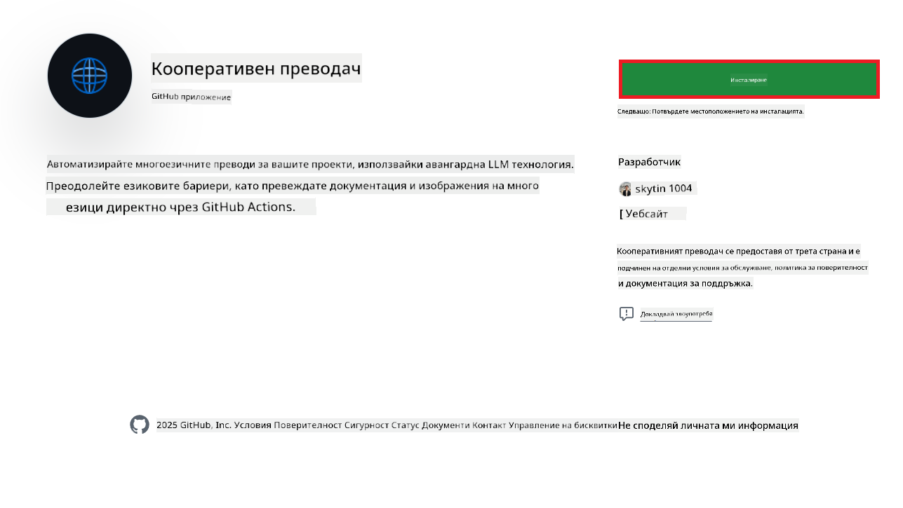
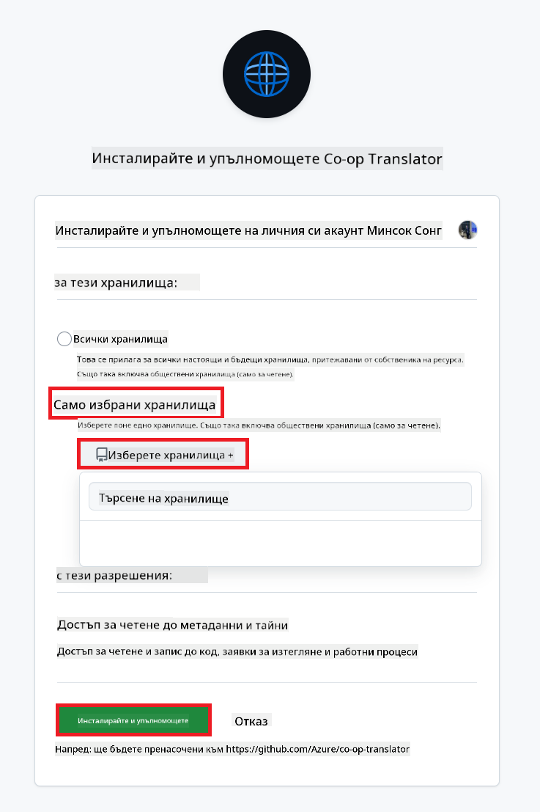
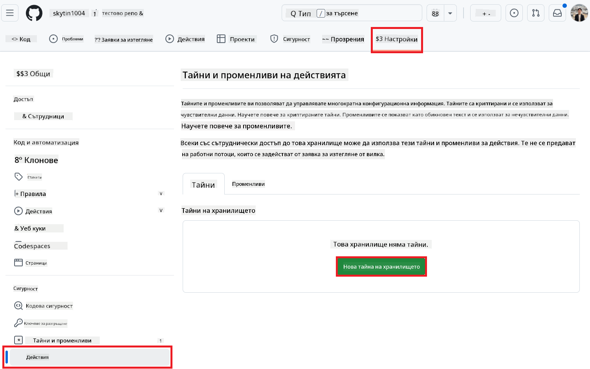
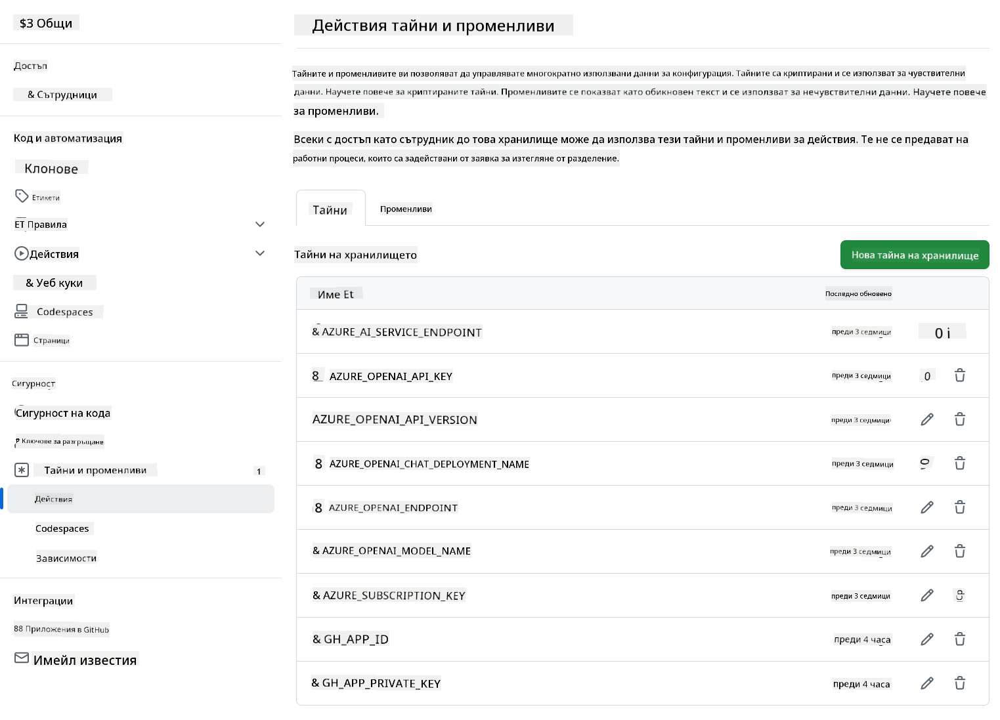

<!--
CO_OP_TRANSLATOR_METADATA:
{
  "original_hash": "c437820027c197f25fb2cbee95bae28c",
  "translation_date": "2025-06-12T19:17:42+00:00",
  "source_file": "getting_started/github-actions-guide/github-actions-guide-org.md",
  "language_code": "bg"
}
-->
# Използване на Co-op Translator GitHub Action (Ръководство за организации)

**Целева аудитория:** Това ръководство е предназначено за **вътрешни потребители на Microsoft** или **екипи, които имат достъп до необходимите идентификационни данни за предварително изградения Co-op Translator GitHub App** или могат да създадат собствен GitHub App.

Автоматизирайте превода на документацията в хранилището си лесно с помощта на Co-op Translator GitHub Action. Това ръководство ще ви преведе през настройката на действието, което автоматично създава pull request-и с актуализирани преводи всеки път, когато източниковите ви Markdown файлове или изображения се променят.

> [!IMPORTANT]
> 
> **Избор на подходящо ръководство:**
>
> Това ръководство описва настройка с помощта на **GitHub App ID и Private Key**. Обикновено се нуждаете от този метод „Ръководство за организации“, ако: **`GITHUB_TOKEN` разрешенията са ограничени:** Настройките на вашата организация или хранилище ограничават стандартните разрешения, предоставени на стандартния `GITHUB_TOKEN`. По-конкретно, ако на `GITHUB_TOKEN` не са разрешени необходимите `write` разрешения (като `contents: write` или `pull-requests: write`), работният процес в [Публичното ръководство за настройка](./github-actions-guide-public.md) ще се провали поради недостатъчни разрешения. Използването на специален GitHub App с изрично предоставени разрешения заобикаля това ограничение.
>
> **Ако горното не важи за вас:**
>
> Ако стандартният `GITHUB_TOKEN` има достатъчни разрешения в хранилището ви (т.е. не сте блокирани от организационни ограничения), моля, използвайте **[Публичното ръководство за настройка с GITHUB_TOKEN](./github-actions-guide-public.md)**. Публичното ръководство не изисква получаване или управление на App ID или Private Key и разчита единствено на стандартния `GITHUB_TOKEN` и разрешенията на хранилището.

## Предварителни условия

Преди да конфигурирате GitHub Action, уверете се, че разполагате с необходимите идентификационни данни за AI услугите.

**1. Задължително: Идентификационни данни за AI езиков модел**  
Необходими са ви идентификационни данни за поне един от поддържаните езикови модели:

- **Azure OpenAI**: Изисква Endpoint, API Key, имена на модели/деплоймънти, версия на API.
- **OpenAI**: Изисква API Key, (по избор: Org ID, Base URL, Model ID).
- Вижте [Поддържани модели и услуги](../../../../README.md) за подробности.
- Ръководство за настройка: [Настройка на Azure OpenAI](../set-up-resources/set-up-azure-openai.md).

**2. По избор: Идентификационни данни за Computer Vision (за превод на изображения)**

- Необходими само ако трябва да превеждате текст в изображения.
- **Azure Computer Vision**: Изисква Endpoint и Subscription Key.
- Ако не са предоставени, действието използва [режим само с Markdown](../markdown-only-mode.md).
- Ръководство за настройка: [Настройка на Azure Computer Vision](../set-up-resources/set-up-azure-computer-vision.md).

## Настройка и конфигурация

Следвайте тези стъпки, за да конфигурирате Co-op Translator GitHub Action във вашето хранилище:

### Стъпка 1: Инсталиране и конфигуриране на GitHub App автентикация

Работният процес използва автентикация чрез GitHub App, за да взаимодейства сигурно с вашето хранилище (например за създаване на pull request-и) от ваше име. Изберете една от опциите:

#### **Опция A: Инсталиране на предварително изградения Co-op Translator GitHub App (за вътрешна употреба в Microsoft)**

1. Отидете на страницата на [Co-op Translator GitHub App](https://github.com/apps/co-op-translator).

1. Изберете **Install** и изберете акаунта или организацията, където се намира вашето целево хранилище.

    

1. Изберете **Only select repositories** и маркирайте вашето целево хранилище (например `PhiCookBook`). Натиснете **Install**. Може да бъдете подканени да се автентикирате.

    

1. **Получаване на идентификационни данни за приложението (вътрешен процес):** За да позволите на работния процес да се автентикира като приложението, са ви нужни две неща, предоставени от екипа на Co-op Translator:  
  - **App ID:** Уникалният идентификатор на Co-op Translator приложението. App ID е: `1164076`.  
  - **Private Key:** Трябва да получите **цялото съдържание** на файла с частния ключ `.pem` от контактното лице на поддръжката. **Третирайте този ключ като парола и го пазете сигурно.**

1. Продължете към Стъпка 2.

#### **Опция B: Използване на собствен потребителски GitHub App**

- Ако предпочитате, можете да създадете и конфигурирате собствен GitHub App. Уверете се, че има права за четене и запис на съдържанието и pull request-и. Ще ви трябват App ID и генериран Private Key.

### Стъпка 2: Конфигуриране на секрети в хранилището

Трябва да добавите идентификационните данни на GitHub App и AI услугите като криптирани секрети в настройките на хранилището.

1. Отидете в целевото GitHub хранилище (например `PhiCookBook`).

1. Изберете **Settings** > **Secrets and variables** > **Actions**.

1. Под **Repository secrets** натиснете **New repository secret** за всеки от изброените по-долу секрети.

   

**Задължителни секрети (за GitHub App автентикация):**

| Име на секрета       | Описание                                         | Източник на стойност                              |
| :------------------- | :----------------------------------------------- | :------------------------------------------------ |
| `GH_APP_ID`          | App ID на GitHub App (от Стъпка 1).               | Настройки на GitHub App                           |
| `GH_APP_PRIVATE_KEY` | **Цялото съдържание** на изтегления файл `.pem`. | Файл `.pem` (от Стъпка 1)            |

**Секрети за AI услуги (Добавете ВСИЧКИ, които са приложими според предварителните условия):**

| Име на секрета                     | Описание                                  | Източник на стойност                   |
| :-------------------------------- | :---------------------------------------- | :------------------------------------- |
| `AZURE_SUBSCRIPTION_KEY`            | Ключ за Azure AI услуга (Computer Vision)  | Azure AI Foundry                       |
| `AZURE_AI_SERVICE_ENDPOINT`         | Endpoint за Azure AI услуга (Computer Vision) | Azure AI Foundry                       |
| `AZURE_OPENAI_API_KEY`              | Ключ за Azure OpenAI услуга                | Azure AI Foundry                       |
| `AZURE_OPENAI_ENDPOINT`             | Endpoint за Azure OpenAI услуга             | Azure AI Foundry                       |
| `AZURE_OPENAI_MODEL_NAME`           | Име на вашия Azure OpenAI модел             | Azure AI Foundry                       |
| `AZURE_OPENAI_CHAT_DEPLOYMENT_NAME` | Име на вашия Azure OpenAI деплоймънт         | Azure AI Foundry                       |
| `AZURE_OPENAI_API_VERSION`          | Версия на API за Azure OpenAI                | Azure AI Foundry                       |
| `OPENAI_API_KEY`                    | API ключ за OpenAI                          | OpenAI Platform                       |
| `OPENAI_ORG_ID`                     | OpenAI Organization ID                      | OpenAI Platform                       |
| `OPENAI_CHAT_MODEL_ID`              | Специфичен OpenAI модел ID                   | OpenAI Platform                       |
| `OPENAI_BASE_URL`                   | Персонализиран OpenAI API Base URL          | OpenAI Platform                       |



### Стъпка 3: Създаване на файла с работния процес

Накрая създайте YAML файл, който дефинира автоматизирания работен процес.

1. В кореновата директория на вашето хранилище създайте директория `.github/workflows/`, ако още не съществува.

1. Вътре в `.github/workflows/` създайте файл с име `co-op-translator.yml`.

1. Поставете следното съдържание в co-op-translator.yml.

```
name: Co-op Translator

on:
  push:
    branches:
      - main

jobs:
  co-op-translator:
    runs-on: ubuntu-latest

    permissions:
      contents: write
      pull-requests: write

    steps:
      - name: Checkout repository
        uses: actions/checkout@v4
        with:
          fetch-depth: 0

      - name: Set up Python
        uses: actions/setup-python@v4
        with:
          python-version: '3.10'

      - name: Install Co-op Translator
        run: |
          python -m pip install --upgrade pip
          pip install co-op-translator

      - name: Run Co-op Translator
        env:
          PYTHONIOENCODING: utf-8
          # Azure AI Service Credentials
          AZURE_SUBSCRIPTION_KEY: ${{ secrets.AZURE_SUBSCRIPTION_KEY }}
          AZURE_AI_SERVICE_ENDPOINT: ${{ secrets.AZURE_AI_SERVICE_ENDPOINT }}

          # Azure OpenAI Credentials
          AZURE_OPENAI_API_KEY: ${{ secrets.AZURE_OPENAI_API_KEY }}
          AZURE_OPENAI_ENDPOINT: ${{ secrets.AZURE_OPENAI_ENDPOINT }}
          AZURE_OPENAI_MODEL_NAME: ${{ secrets.AZURE_OPENAI_MODEL_NAME }}
          AZURE_OPENAI_CHAT_DEPLOYMENT_NAME: ${{ secrets.AZURE_OPENAI_CHAT_DEPLOYMENT_NAME }}
          AZURE_OPENAI_API_VERSION: ${{ secrets.AZURE_OPENAI_API_VERSION }}

          # OpenAI Credentials
          OPENAI_API_KEY: ${{ secrets.OPENAI_API_KEY }}
          OPENAI_ORG_ID: ${{ secrets.OPENAI_ORG_ID }}
          OPENAI_CHAT_MODEL_ID: ${{ secrets.OPENAI_CHAT_MODEL_ID }}
          OPENAI_BASE_URL: ${{ secrets.OPENAI_BASE_URL }}
        run: |
          # =====================================================================
          # IMPORTANT: Set your target languages here (REQUIRED CONFIGURATION)
          # =====================================================================
          # Example: Translate to Spanish, French, German. Add -y to auto-confirm.
          translate -l "es fr de" -y  # <--- MODIFY THIS LINE with your desired languages

      - name: Authenticate GitHub App
        id: generate_token
        uses: tibdex/github-app-token@v1
        with:
          app_id: ${{ secrets.GH_APP_ID }}
          private_key: ${{ secrets.GH_APP_PRIVATE_KEY }}

      - name: Create Pull Request with translations
        uses: peter-evans/create-pull-request@v5
        with:
          token: ${{ steps.generate_token.outputs.token }}
          commit-message: "🌐 Update translations via Co-op Translator"
          title: "🌐 Update translations via Co-op Translator"
          body: |
            This PR updates translations for recent changes to the main branch.

            ### 📋 Changes included
            - Translated contents are available in the `translations/` directory
            - Translated images are available in the `translated_images/` directory

            ---
            🌐 Automatically generated by the [Co-op Translator](https://github.com/Azure/co-op-translator) GitHub Action.
          branch: update-translations
          base: main
          labels: translation, automated-pr
          delete-branch: true
          add-paths: |
            translations/
            translated_images/

```

4.  **Персонализиране на работния процес:**  
  - **[!IMPORTANT] Целеви езици:** В `Run Co-op Translator` step, you **MUST review and modify the list of language codes** within the `translate -l "..." -y` command to match your project's requirements. The example list (`ar de es...`) needs to be replaced or adjusted.
  - **Trigger (`on:`):** The current trigger runs on every push to `main`. For large repositories, consider adding a `paths:` filter (see commented example in the YAML) to run the workflow only when relevant files (e.g., source documentation) change, saving runner minutes.
  - **PR Details:** Customize the `commit-message`, `title`, `body`, `branch` name, and `labels` in the `Create Pull Request` step if needed.

## Credential Management and Renewal

- **Security:** Always store sensitive credentials (API keys, private keys) as GitHub Actions secrets. Never expose them in your workflow file or repository code.
- **[!IMPORTANT] Key Renewal (Internal Microsoft Users):** Be aware that Azure OpenAI key used within Microsoft might have a mandatory renewal policy (e.g., every 5 months). Ensure you update the corresponding GitHub secrets (`AZURE_OPENAI_...` ключове) **преди да изтекат**, за да предотвратите грешки в работния процес.

## Изпълнение на работния процес

След като файлът `co-op-translator.yml` бъде обединен в основния клон (или клона, посочен в филтъра `on:` trigger), the workflow will automatically run whenever changes are pushed to that branch (and match the `paths`, ако е конфигуриран).

Ако се генерират или обновят преводи, действието автоматично ще създаде Pull Request със съответните промени, готов за преглед и сливане.

**Отказ от отговорност**:  
Този документ е преведен с помощта на AI преводаческа услуга [Co-op Translator](https://github.com/Azure/co-op-translator). Въпреки че се стремим към точност, моля, имайте предвид, че автоматизираните преводи могат да съдържат грешки или неточности. Оригиналният документ на неговия оригинален език трябва да се счита за авторитетен източник. За критична информация се препоръчва професионален човешки превод. Ние не носим отговорност за каквито и да е недоразумения или неправилни тълкувания, произтичащи от използването на този превод.