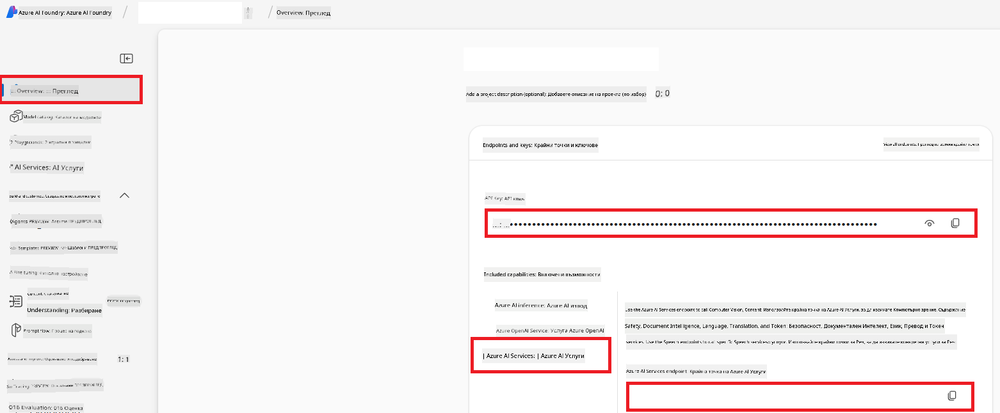

<!--
CO_OP_TRANSLATOR_METADATA:
{
  "original_hash": "b58d7c3cb4210697a073d20eb3064945",
  "translation_date": "2025-06-12T11:58:38+00:00",
  "source_file": "getting_started/set-up-azure-ai.md",
  "language_code": "bg"
}
-->
# Настройване на Azure AI за Co-op Translator (Azure OpenAI и Azure AI Vision)

Това ръководство ви превежда през процеса на настройване на Azure OpenAI за езиков превод и Azure Computer Vision за анализ на съдържанието на изображения (което после може да се използва за превод на базата на изображения) в рамките на Azure AI Foundry.

**Изисквания:**
- Активен абонамент в Azure.
- Достатъчни права за създаване на ресурси и разгръщания във вашия Azure абонамент.

## Създаване на Azure AI проект

Започнете със създаването на Azure AI проект, който служи като централно място за управление на вашите AI ресурси.

1. Отидете на [https://ai.azure.com](https://ai.azure.com) и влезте с вашия Azure акаунт.

1. Изберете **+Create**, за да създадете нов проект.

1. Извършете следните стъпки:
   - Въведете **Име на проекта** (например `CoopTranslator-Project`).
   - Изберете **AI hub** (например `CoopTranslator-Hub`) (създайте нов, ако е необходимо).

1. Натиснете "**Review and Create**", за да създадете проекта. Ще бъдете пренасочени към страницата с преглед на проекта.

## Настройване на Azure OpenAI за езиков превод

В рамките на вашия проект ще разположите Azure OpenAI модел, който ще служи като бекенд за превод на текст.

### Навигиране до вашия проект

Ако все още не сте там, отворете новосъздадения проект (например `CoopTranslator-Project`) в Azure AI Foundry.

### Разгръщане на OpenAI модел

1. От лявото меню на проекта, под "My assets", изберете "**Models + endpoints**".

1. Изберете **+ Deploy model**.

1. Изберете **Deploy Base Model**.

1. Ще видите списък с налични модели. Филтрирайте или потърсете подходящ GPT модел. Препоръчваме `gpt-4o`.

1. Изберете желания модел и натиснете **Confirm**.

1. Изберете **Deploy**.

### Конфигурация на Azure OpenAI

След разгръщането можете да изберете разгръщането от страницата "**Models + endpoints**", за да намерите неговия **REST endpoint URL**, **Key**, **Deployment name**, **Model name** и **API version**. Тези данни са необходими за интегриране на преводаческия модел във вашето приложение.

> [!NOTE]
> Можете да избирате версии на API от страницата [API version deprecation](https://learn.microsoft.com/azure/ai-services/openai/api-version-deprecation) според вашите нужди. Имайте предвид, че **API версията** се различава от **версията на модела**, показвана на страницата **Models + endpoints** в Azure AI Foundry.

## Настройване на Azure Computer Vision за превод на изображения

За да разрешите превод на текст в изображения, трябва да намерите API ключа и Endpoint на Azure AI Service.

1. Отидете до вашия Azure AI проект (например `CoopTranslator-Project`). Уверете се, че сте на страницата с преглед на проекта.

### Конфигурация на Azure AI Service

Намерете API ключа и Endpoint от Azure AI Service.

1. Отидете до вашия Azure AI проект (например `CoopTranslator-Project`). Уверете се, че сте на страницата с преглед на проекта.

1. Намерете **API Key** и **Endpoint** в таба Azure AI Service.

    

Тази връзка прави възможностите на свързания Azure AI Services ресурс (включително анализ на изображения) достъпни за вашия AI Foundry проект. След това можете да използвате тази връзка в своите тетрадки или приложения, за да извличате текст от изображения, който след това може да бъде изпратен към Azure OpenAI модела за превод.

## Обединяване на вашите данни за достъп

Към момента трябва да имате събрана следната информация:

**За Azure OpenAI (Превод на текст):**
- Azure OpenAI Endpoint
- Azure OpenAI API Key
- Azure OpenAI Model Name (например `gpt-4o`)
- Azure OpenAI Deployment Name (например `cooptranslator-gpt4o`)
- Azure OpenAI API Version

**За Azure AI Services (Извличане на текст от изображения чрез Vision):**
- Azure AI Service Endpoint
- Azure AI Service API Key

### Пример: Конфигуриране на променливи на средата (Преглед)

По-късно, при изграждането на вашето приложение, вероятно ще ги конфигурирате като променливи на средата, например така:

```bash
# Azure AI Service Credentials (Required for image translation)
AZURE_AI_SERVICE_API_KEY="your_azure_ai_service_api_key" # e.g., 21xasd...
AZURE_AI_SERVICE_ENDPOINT="https://your_azure_ai_service_endpoint.cognitiveservices.azure.com/"

# Azure OpenAI Credentials (Required for text translation)
AZURE_OPENAI_API_KEY="your_azure_openai_api_key" # e.g., 21xasd...
AZURE_OPENAI_ENDPOINT="https://your_azure_openai_endpoint.openai.azure.com/"
AZURE_OPENAI_MODEL_NAME="your_model_name" # e.g., gpt-4o
AZURE_OPENAI_CHAT_DEPLOYMENT_NAME="your_deployment_name" # e.g., cooptranslator-gpt4o
AZURE_OPENAI_API_VERSION="your_api_version" # e.g., 2024-12-01-preview
```

---

### Допълнително четене

- [Как да създадете проект в Azure AI Foundry](https://learn.microsoft.com/azure/ai-foundry/how-to/create-projects?tabs=ai-studio)
- [Как да създадете Azure AI ресурси](https://learn.microsoft.com/azure/ai-foundry/how-to/create-azure-ai-resource?tabs=portal)
- [Как да разгръщате OpenAI модели в Azure AI Foundry](https://learn.microsoft.com/en-us/azure/ai-foundry/how-to/deploy-models-openai)

**Отказ от отговорност**:  
Този документ е преведен с помощта на AI преводаческа услуга [Co-op Translator](https://github.com/Azure/co-op-translator). Въпреки че се стремим към точност, моля имайте предвид, че автоматизираните преводи могат да съдържат грешки или неточности. Оригиналният документ на неговия роден език трябва да се счита за авторитетен източник. За критична информация се препоръчва професионален човешки превод. Ние не носим отговорност за каквито и да е недоразумения или неправилни тълкувания, произтичащи от използването на този превод.