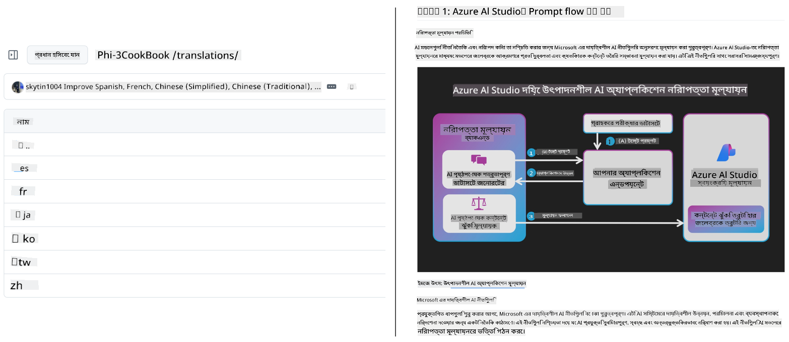
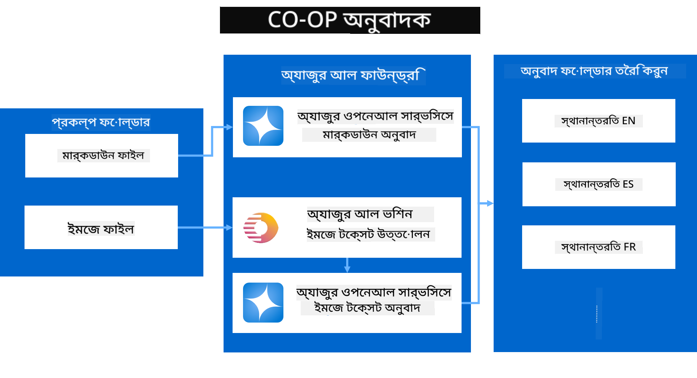

<!--
CO_OP_TRANSLATOR_METADATA:
{
  "original_hash": "044724537b57868117aadae8e7728c7c",
  "translation_date": "2025-06-12T10:11:08+00:00",
  "source_file": "README.md",
  "language_code": "bn"
}
-->


# Co-op Translator: শিক্ষামূলক ডকুমেন্টেশনের অনুবাদ সহজেই স্বয়ংক্রিয় করুন

_আপনার ডকুমেন্টেশনকে একাধিক ভাষায় সহজেই স্বয়ংক্রিয়ভাবে অনুবাদ করুন এবং বৈশ্বিক দর্শকের কাছে পৌঁছান।_

[](https://pypi.org/project/co-op-translator/)
[](https://github.com/azure/co-op-translator/blob/main/LICENSE)
[](https://pepy.tech/project/co-op-translator)
[](https://pepy.tech/project/co-op-translator)
[](https://github.com/psf/black)

[](https://GitHub.com/azure/co-op-translator/graphs/contributors/)
[](https://GitHub.com/azure/co-op-translator/issues/)
[](https://GitHub.com/azure/co-op-translator/pulls/)
[](http://makeapullrequest.com)

### Co-op Translator দ্বারা চালিত ভাষা সমর্থন
[ফরাসি](../fr/README.md) | [স্প্যানিশ](../es/README.md) | [জার্মান](../de/README.md) | [রাশিয়ান](../ru/README.md) | [আরবি](../ar/README.md) | [ফার্সি (পার্সিয়ান)](../fa/README.md) | [উর্দু](../ur/README.md) | [চীনা (সরলীকৃত)](../zh/README.md) | [চীনা (প্রচলিত, ম্যাকাও)](../mo/README.md) | [চীনা (প্রচলিত, হংকং)](../hk/README.md) | [চীনা (প্রচলিত, তাইওয়ান)](../tw/README.md) | [জাপানি](../ja/README.md) | [কোরিয়ান](../ko/README.md) | [হিন্দি](../hi/README.md) | [বাংলা](./README.md) | [মারাঠি](../mr/README.md) | [নেপালি](../ne/README.md) | [পাঞ্জাবি (গুরুমুখি)](../pa/README.md) | [পর্তুগিজ (পর্তুগাল)](../pt/README.md) | [পর্তুগিজ (ব্রাজিল)](../br/README.md) | [ইতালিয়ান](../it/README.md) | [পোলিশ](../pl/README.md) | [তুর্কি](../tr/README.md) | [গ্রীক](../el/README.md) | [থাই](../th/README.md) | [সুইডিশ](../sv/README.md) | [ড্যানিশ](../da/README.md) | [নরওয়েজিয়ান](../no/README.md) | [ফিনিশ](../fi/README.md) | [ডাচ](../nl/README.md) | [হিব্রু](../he/README.md) | [ভিয়েতনামী](../vi/README.md) | [ইন্দোনেশিয়ান](../id/README.md) | [মালয়](../ms/README.md) | [টাগালগ (ফিলিপিনো)](../tl/README.md) | [সোয়াহিলি](../sw/README.md) | [হাঙ্গেরিয়ান](../hu/README.md) | [চেক](../cs/README.md) | [স্লোভাক](../sk/README.md) | [রোমানিয়ান](../ro/README.md) | [বুলগেরিয়ান](../bg/README.md) | [সার্বিয়ান (সিরিলিক)](../sr/README.md) | [ক্রোয়েশিয়ান](../hr/README.md) | [স্লোভেনিয়ান](../sl/README.md) | [ইউক্রেনীয়](../uk/README.md) | [বর্মী (মায়ানমার)](../my/README.md)
> [!NOTE]
> এইগুলো এই রিপোজিটরির বর্তমান অনুবাদসমূহ। Co-op Translator দ্বারা সমর্থিত সম্পূর্ণ ভাষার তালিকার জন্য, অনুগ্রহ করে [Language Support](../..) বিভাগটি দেখুন।

[](https://GitHub.com/azure/co-op-translator/watchers/)
[](https://GitHub.com/azure/co-op-translator/network/)
[](https://GitHub.com/azure/co-op-translator/stargazers/)

[](https://discord.com/invite/ByRwuEEgH4)

[](https://codespaces.new/azure/co-op-translator)
[](https://vscode.dev/redirect?url=vscode://ms-vscode-remote.remote-containers/cloneInVolume?url=https://github.com/azure/co-op-translator)

## ওভারভিউ: আপনার শিক্ষামূলক কন্টেন্টের অনুবাদকে সহজ করুন

ভাষাগত প্রতিবন্ধকতা শিক্ষার্থীদের এবং ডেভেলপারদের জন্য মূল্যবান শিক্ষামূলক সম্পদ এবং প্রযুক্তিগত জ্ঞানে প্রবেশাধিকারকে অনেকটাই বাধাগ্রস্ত করে। এটি অংশগ্রহণকে সীমিত করে এবং বিশ্বব্যাপী উদ্ভাবন ও শেখার গতি ধীর করে দেয়।

**Co-op Translator** Microsoft-এর নিজস্ব বৃহৎ শিক্ষামূলক সিরিজের (যেমন "For Beginners" গাইড) অকার্যকর ম্যানুয়াল অনুবাদ প্রক্রিয়া মোকাবেলার প্রয়োজন থেকে জন্ম নিয়েছে। এটি একটি সহজে ব্যবহারযোগ্য, শক্তিশালী টুলে পরিণত হয়েছে যা সবার জন্য এই প্রতিবন্ধকতাগুলো ভাঙার উদ্দেশ্যে তৈরি। CLI এবং GitHub Actions এর মাধ্যমে উচ্চমানের স্বয়ংক্রিয় অনুবাদ প্রদান করে, Co-op Translator শিক্ষাবিদ, ছাত্র, গবেষক এবং ডেভেলপারদের ভাষাগত সীমাবদ্ধতা ছাড়াই জ্ঞান ভাগাভাগি ও প্রবেশাধিকার নিশ্চিত করে।

Co-op Translator কীভাবে অনুবাদকৃত শিক্ষামূলক কন্টেন্ট সংগঠিত করে দেখুন:



Markdown ফাইল এবং ছবির টেক্সট স্বয়ংক্রিয়ভাবে অনূদিত হয় এবং ভাষা-নির্দিষ্ট ফোল্ডারে সুন্দরভাবে সাজানো হয়।

**আজই Co-op Translator দিয়ে আপনার শিক্ষামূলক কন্টেন্টকে বিশ্বব্যাপী পৌঁছে দিন!**

## Microsoft-এর শিক্ষামূলক সম্পদের জন্য বিশ্বব্যাপী প্রবেশাধিকার নিশ্চিতকরণ

Co-op Translator Microsoft-এর গুরুত্বপূর্ণ শিক্ষামূলক উদ্যোগগুলোর ভাষাগত ফাঁক পূরণে সাহায্য করে, এমন রিপোজিটরিগুলোর জন্য অনুবাদ প্রক্রিয়া স্বয়ংক্রিয় করে যা বিশ্বব্যাপী ডেভেলপার সম্প্রদায়কে সেবা দেয়। বর্তমানে Co-op Translator ব্যবহার করছে নিম্নলিখিত প্রকল্পসমূহ:

[](https://github.com/microsoft/Generative-AI-for-beginners)
[](https://github.com/microsoft/ML-For-Beginners)
[](https://github.com/microsoft/AI-For-Beginners)
[](https://github.com/microsoft/ai-agents-for-beginners)
[](https://github.com/microsoft/PhiCookBook)
[](https://github.com/microsoft/Generative-AI-for-beginners-dotnet)

## প্রধান বৈশিষ্ট্যসমূহ

- **স্বয়ংক্রিয় অনুবাদ**: একাধিক ভাষায় সহজে টেক্সট অনুবাদ করুন।
- **GitHub Actions ইন্টিগ্রেশন**: আপনার CI/CD পাইপলাইনের অংশ হিসেবে অনুবাদ স্বয়ংক্রিয় করুন।
- **Markdown সংরক্ষণ**: অনুবাদের সময় সঠিক Markdown সিনট্যাক্স বজায় রাখুন।
- **ছবির টেক্সট অনুবাদ**: ছবির মধ্যে থাকা টেক্সট বের করে অনুবাদ করুন।
- **অগ্রণী LLM প্রযুক্তি**: উন্নত ভাষা মডেল ব্যবহার করে উচ্চমানের অনুবাদ নিশ্চিত করুন।
- **সহজ ইন্টিগ্রেশন**: আপনার বিদ্যমান প্রকল্পের সাথে সহজেই সংযুক্ত করুন।
- **লোকালাইজেশন সহজ করুন**: আন্তর্জাতিক বাজারের জন্য আপনার প্রকল্পের লোকালাইজেশন প্রক্রিয়া সরল করুন।

## এটি কীভাবে কাজ করে



Co-op Translator আপনার প্রকল্পের ফোল্ডার থেকে Markdown ফাইল এবং ছবি গ্রহণ করে নিম্নলিখিত প্রক্রিয়া অনুসরণ করে:

1. **টেক্সট আহরণ**: Markdown ফাইল থেকে টেক্সট এবং কনফিগার করা থাকলে (যেমন Azure AI Vision) ছবির মধ্যে থাকা টেক্সট বের করে নেয়।
1. **AI অনুবাদ**: আহরিত টেক্সট নির্ধারিত LLM (Azure OpenAI, OpenAI ইত্যাদি) এ পাঠিয়ে অনুবাদ করানো হয়।
1. **ফলাফল সংরক্ষণ**: অনূদিত Markdown ফাইল এবং ছবিগুলো (অনূদিত টেক্সট সহ) ভাষা-নির্দিষ্ট ফোল্ডারে সঠিক ফরম্যাট বজায় রেখে সংরক্ষণ করা হয়।

## শুরু করা

CLI দিয়ে দ্রুত শুরু করুন অথবা GitHub Actions এর মাধ্যমে পূর্ণ স্বয়ংক্রিয়তা সেট আপ করুন। আপনার কাজের ধরণ অনুযায়ী পছন্দ করুন:

1. **কমান্ড লাইন (CLI)** - একবারের জন্য অনুবাদ বা ম্যানুয়াল নিয়ন্ত্রণের জন্য
2. **GitHub Actions** - প্রতিটি পুশে স্বয়ংক্রিয় অনুবাদের জন্য

> [!NOTE]
> যদিও এই টিউটোরিয়াল Azure রিসোর্সের উপর কেন্দ্রীভূত, আপনি যেকোনো সমর্থিত ভাষা মডেল ব্যবহার করতে পারেন।

### ভাষা সমর্থন

Co-op Translator বিভিন্ন ভাষার সমর্থন দেয় যাতে আপনি বিশ্বব্যাপী দর্শকদের কাছে পৌঁছাতে পারেন। এখানে যা জানা প্রয়োজন:

#### দ্রুত রেফারেন্স

| ভাষা | কোড | ভাষা | কোড | ভাষা | কোড |
|----------|------|----------|------|----------|------|
| Arabic | ar | Bengali | bn | Bulgarian | bg |
| Burmese (Myanmar) | my | Chinese (Simplified) | zh | Chinese (Traditional, HK) | hk |
| Chinese (Traditional, Macau) | mo | Chinese (Traditional, TW) | tw | Croatian | hr |
| Czech | cs | Danish | da | Dutch | nl |
| Finnish | fi | French | fr | German | de |
| Greek | el | Hebrew | he | Hindi | hi |
| Hungarian | hu | Indonesian | id | Italian | it |
| Japanese | ja | Korean | ko | Malay | ms |
| Marathi | mr | Nepali | ne | Norwegian | no |
| Persian (Farsi) | fa | Polish | pl | Portuguese (Brazil) | br |
| Portuguese (Portugal) | pt | Punjabi (Gurmukhi) | pa | Romanian | ro |
| Russian | ru | Serbian (Cyrillic) | sr | Slovak | sk |
| Slovenian | sl | Spanish | es | Swahili | sw |
| Swedish | sv | Tagalog (Filipino) | tl | Thai | th |
| Turkish | tr | Ukrainian | uk | Urdu | ur |
| Vietnamese | vi | — | — | — | — |

#### ভাষা কোড ব্যবহারের নিয়ম

Co-op Translator ব্যবহার করার সময়, আপনাকে ভাষাগুলো তাদের কোড দিয়ে নির্দিষ্ট করতে হবে। উদাহরণস্বরূপ:

```bash
# Translate to French, Spanish, and German
translate -l "fr es de"

# Translate to Chinese (Simplified) and Japanese
translate -l "zh ja"
```

> [!NOTE]
> ভাষা সমর্থন সম্পর্কিত বিস্তারিত প্রযুক্তিগত তথ্যের জন্য, যেমন:
>
> - প্রতিটি ভাষার ফন্ট স্পেসিফিকেশন
> - পরিচিত সমস্যা
> - নতুন ভাষা যোগ করার পদ্ধতি
>
> আমাদের [Supported Languages Documentation](./getting_started/supported-languages.md) দেখুন।

### সমর্থিত মডেল ও সার্ভিসসমূহ

| ধরন                  | নাম                           |
|-----------------------|--------------------------------|
| Language Model        |   |
| AI Vision       |  |

> [!NOTE]
> যদি কোনো AI vision সার্ভিস উপলব্ধ না থাকে, তাহলে co-op translator স্বয়ংক্রিয়ভাবে [Markdown-only mode](./getting_started/markdown-only-mode.md) এ চলে যাবে।

### প্রাথমিক সেটআপ

শুরু করার আগে, আপনাকে নিচের রিসোর্সগুলো সেট আপ করতে হবে:

1. Language Model Resource (আবশ্যক):
   - Azure OpenAI (প্রস্তাবিত) - এন্টারপ্রাইজ মানের নির্ভরযোগ্যতা সহ উচ্চমানের অনুবাদ প্রদান করে
   - OpenAI - Azure অ্যাক্সেস না থাকলে বিকল্প
   - সমর্থিত মডেল সম্পর্কিত বিস্তারিত তথ্যের জন্য [Supported Models and Services](../..) দেখুন

1. AI Vision Resource (ঐচ্ছিক):
   - Azure AI Vision - ছবির মধ্যে থাকা টেক্সট অনুবাদের সুবিধা দেয়
   - কনফিগার না করলে, ট্রান্সলেটর স্বয়ংক্রিয়ভাবে [Markdown-only mode](./getting_started/markdown-only-mode.md) ব্যবহার করবে
   - ছবি সহ প্রকল্পের জন্য সুপারিশকৃত

1. কনফিগারেশন ধাপসমূহ:
   - বিস্তারিত নির্দেশনার জন্য আমাদের [Azure AI setup guide](./getting_started/set-up-azure-ai.md) অনুসরণ করুন
   - API কী এবং এন্ডপয়েন্ট সহ `.env` ফাইল তৈরি করুন (দেখুন [Quick Start](../..) বিভাগ)
   - আপনার নির্বাচিত সার্ভিসের জন্য প্রয়োজনীয় অনুমতি ও কোটা নিশ্চিত করুন

### অনুবাদের আগে প্রকল্প প্রস্তুতি

অনুবাদ শুরু করার আগে, আপনার প্রকল্প প্রস্তুত করতে নিচের ধাপগুলো অনুসরণ করুন:

1. আপনার README প্রস্তুত করুন:
   - README.md এ অনুবাদের টেবিল যোগ করুন যাতে অনূদিত সংস্করণগুলোর লিঙ্ক থাকে
   - উদাহরণ ফরম্যাট:

     ```markdown

     ### 🌐 Multi-Language Support
     
     [French](../fr/README.md) | [Spanish](../es/README.md) | [German](../de/README.md) | [Russian](../ru/README.md) | [Arabic](../ar/README.md) | [Persian (Farsi)](../fa/README.md) | [Urdu](../ur/README.md) | [Chinese (Simplified)](../zh/README.md) | [Chinese (Traditional, Macau)](../mo/README.md) | [Chinese (Traditional, Hong Kong)](../hk/README.md) | [Chinese (Traditional, Taiwan)](../tw/README.md) | [Japanese](../ja/README.md) | [Korean](../ko/README.md) | [Hindi](../hi/README.md) | [Bengali](./README.md) | [Marathi](../mr/README.md) | [Nepali](../ne/README.md) | [Punjabi (Gurmukhi)](../pa/README.md) | [Portuguese (Portugal)](../pt/README.md) | [Portuguese (Brazil)](../br/README.md) | [Italian](../it/README.md) | [Polish](../pl/README.md) | [Turkish](../tr/README.md) | [Greek](../el/README.md) | [Thai](../th/README.md) | [Swedish](../sv/README.md) | [Danish](../da/README.md) | [Norwegian](../no/README.md) | [Finnish](../fi/README.md) | [Dutch](../nl/README.md) | [Hebrew](../he/README.md) | [Vietnamese](../vi/README.md) | [Indonesian](../id/README.md) | [Malay](../ms/README.md) | [Tagalog (Filipino)](../tl/README.md) | [Swahili](../sw/README.md) | [Hungarian](../hu/README.md) | [Czech](../cs/README.md) | [Slovak](../sk/README.md) | [Romanian](../ro/README.md) | [Bulgarian](../bg/README.md) | [Serbian (Cyrillic)](../sr/README.md) | [Croatian](../hr/README.md) | [Slovenian](../sl/README.md) | [Ukrainian](../uk/README.md) | [Burmese (Myanmar)](../my/README.md) 
    
     ```

1. বিদ্যমান অনুবাদ পরিষ্কার করুন (প্রয়োজন হলে):
   - যেকোনো পুরনো অনুবাদ ফোল্ডার (যেমন `translations/`) মুছে ফেলুন
   - পুরনো অনুবাদ ফাইলগুলো ডিলিট করুন যাতে নতুন অনুবাদের সাথে কোনো সংঘাত না হয়

### দ্রুত শুরু: কমান্ড লাইন

দ্রুত শুরু করার জন্য কমান্ড লাইন ব্যবহার করুন:

1. একটি ভার্চুয়াল এনভায়রনমেন্ট তৈরি করুন:

    ```bash
    python -m venv .venv
    ```

1. ভার্চুয়াল এনভায়রনমেন্ট সক্রিয় করুন:

    - Windows এ:

    ```bash
    .venv\scripts\activate
    ```

    - Linux/macOS এ:

    ```bash
    source .venv/bin/activate
    ```

1. প্যাকেজ ইনস্টল করুন:

    ```bash
    pip install co-op-translator
    ```

1. ক্রেডেনশিয়াল কনফিগার করুন:

    - `.env` file in your project's root directory.
    - Copy the contents from the [.env.template](../../.env.template) file into your new `.env` file.
    - Fill in the required API keys and endpoint information in your `.env` file.

1. Run Translation:
    - Navigate to your project's root directory in your terminal.
    - Execute the translate command, specifying target languages with the `-l` ফ্ল্যাগ তৈরি করুন:

    ```bash
    translate -l "ko ja fr"
    ```

_(“ko ja fr”` with your desired space-separated language codes)_

### Detailed Usage Guides

Choose the approach that best fits your workflow:

#### 1. Using the Command Line (CLI)

- Best for: One-time translations, manual control, or integration into custom scripts.
- Requires: Local installation of Python and the `co-op-translator` package.
- Guide: [Command Line Guide](./getting_started/command-line-guide/command-line-guide.md)

#### 2. Using GitHub Actions (Automation)

- Best for: Automatically translating content whenever changes are pushed to your repository. Keeps translations consistently up-to-date.
- Requires: Setting up a workflow file (`.github/workflows) আপনার রিপোজিটরিতে প্রতিস্থাপন করুন। লোকাল ইনস্টলেশন দরকার নেই।_
- গাইডসমূহ:
  - [GitHub Actions Guide (Public Repositories & Standard Secrets)](./getting_started/github-actions-guide/github-actions-guide-public.md) - বেশিরভাগ পাবলিক বা ব্যক্তিগত রিপোজিটরির জন্য, যা স্ট্যান্ডার্ড সিক্রেটস ব্যবহার করে।
  - [GitHub Actions Guide (Microsoft Organization Repos & Org-Level Setups)](./getting_started/github-actions-guide/github-actions-guide-org.md) - Microsoft GitHub অর্গানাইজেশন বা অর্গ লেভেল সিক্রেটস/রানার ব্যবহারের জন্য।

### সমস্যার সমাধান এবং টিপস

- [Troubleshooting Guide](./getting_started/troubleshooting.md)

### অতিরিক্ত সম্পদ

- [Command Reference](./getting_started/command-reference.md): সকল কমান্ড ও অপশনের বিস্তারিত গাইড।
- [Supported Languages](./getting_started/supported-languages.md): সমর্থিত ভাষার তালিকা এবং নতুন ভাষা যোগ করার নির্দেশনা।
- [Markdown-Only Mode](./getting_started/markdown-only-mode.md): কেবল টেক্সট অনুবাদ করার পদ্ধতি, ছবি অনুবাদ ছাড়া।

## ভিডিও উপস্থাপনা

Co-op Translator সম্পর্কে আরও জানুন আমাদের উপস্থাপনাগুলোর মাধ্যমে _(নীচের ছবিতে ক্লিক করে YouTube-এ দেখুন)_:

- **Open at Microsoft**: Co-op Translator ব্যবহারের সংক্ষিপ্ত ১৮ মিনিটের পরিচিতি ও দ্রুত গাইড।
[](https://www.youtube.com/watch?v=jX_swfH_KNU)

## আমাদের সহায়তা করুন এবং বিশ্বব্যাপী শেখাকে উৎসাহিত করুন

শিক্ষাগত বিষয়বস্তু বিশ্বব্যাপী শেয়ার করার পদ্ধতিতে বিপ্লব ঘটাতে আমাদের সঙ্গে যোগ দিন! [Co-op Translator](https://github.com/azure/co-op-translator) কে GitHub-এ একটি ⭐ দিন এবং শেখা ও প্রযুক্তিতে ভাষাগত প্রতিবন্ধকতা ভাঙার আমাদের মিশনকে সমর্থন করুন। আপনার আগ্রহ এবং অবদান গুরুত্বপূর্ণ প্রভাব ফেলে! কোড অবদান এবং ফিচার প্রস্তাব সবসময় স্বাগত।

## অবদান রাখা

এই প্রকল্পে অবদান এবং প্রস্তাবনা স্বাগত। Azure Co-op Translator-এ অবদান রাখতে আগ্রহী? অনুগ্রহ করে আমাদের [CONTRIBUTING.md](./CONTRIBUTING.md) দেখুন যাতে আপনি Co-op Translator কে আরও সহজলভ্য করতে সাহায্য করতে পারেন।

## অবদানকারীরা

[](https://github.com/Azure/co-op-translator/graphs/contributors)

## আচরণবিধি

এই প্রকল্পটি [Microsoft Open Source Code of Conduct](https://opensource.microsoft.com/codeofconduct/) গ্রহণ করেছে।  
অধিক তথ্যের জন্য দেখুন [Code of Conduct FAQ](https://opensource.microsoft.com/codeofconduct/faq/) অথবা  
যেকোনো অতিরিক্ত প্রশ্ন বা মন্তব্যের জন্য যোগাযোগ করুন [opencode@microsoft.com](mailto:opencode@microsoft.com)-এ।

## দায়িত্বশীল AI

Microsoft আমাদের গ্রাহকদের AI পণ্যগুলি দায়িত্বশীলভাবে ব্যবহারে সহায়তা করতে প্রতিশ্রুতিবদ্ধ, আমাদের শিখনগুলি শেয়ার করে এবং Transparency Notes এবং Impact Assessments-এর মতো সরঞ্জামগুলির মাধ্যমে বিশ্বাসভিত্তিক অংশীদারিত্ব গড়ে তোলে। এই অনেক রিসোর্স [https://aka.ms/RAI](https://aka.ms/RAI)-এ পাওয়া যায়।  
Microsoft-এর দায়িত্বশীল AI-এর দৃষ্টিভঙ্গি আমাদের AI নীতিমালা অনুযায়ী, যা অন্তর্ভুক্ত ন্যায়পরায়ণতা, নির্ভরযোগ্যতা ও নিরাপত্তা, গোপনীয়তা ও সুরক্ষা, অন্তর্ভুক্তিমূলকতা, স্বচ্ছতা এবং দায়বদ্ধতা।

বড় আকারের প্রাকৃতিক ভাষা, ছবি, এবং স্পিচ মডেল - যেমন এই নমুনায় ব্যবহৃত মডেলগুলো - এমনভাবে আচরণ করতে পারে যা অনিয়মিত, অবিশ্বাস্য, বা আপত্তিকর হতে পারে, যা ক্ষতি করতে পারে। অনুগ্রহ করে ঝুঁকি এবং সীমাবদ্ধতা সম্পর্কে জানতে [Azure OpenAI service Transparency note](https://learn.microsoft.com/legal/cognitive-services/openai/transparency-note?tabs=text) দেখুন।

ঝুঁকিগুলো কমানোর জন্য সুপারিশকৃত পদ্ধতি হলো আপনার আর্কিটেকচারে একটি নিরাপত্তা ব্যবস্থা অন্তর্ভুক্ত করা যা ক্ষতিকর আচরণ শনাক্ত ও প্রতিরোধ করতে পারে। [Azure AI Content Safety](https://learn.microsoft.com/azure/ai-services/content-safety/overview) একটি স্বাধীন সুরক্ষা স্তর প্রদান করে, যা অ্যাপ্লিকেশন ও সেবাগুলিতে ক্ষতিকর ব্যবহারকারী-উৎপন্ন এবং AI-উৎপন্ন বিষয়বস্তু শনাক্ত করতে সক্ষম। Azure AI Content Safety-তে এমন টেক্সট এবং ইমেজ API রয়েছে যা ক্ষতিকর উপাদান শনাক্ত করতে সাহায্য করে। আমাদের একটি ইন্টারেক্টিভ Content Safety Studio আছে, যা বিভিন্ন মাধ্যম জুড়ে ক্ষতিকর বিষয়বস্তু শনাক্তকরণের জন্য নমুনা কোড দেখার, অন্বেষণ করার এবং পরীক্ষা করার সুযোগ দেয়। নিম্নলিখিত [quickstart documentation](https://learn.microsoft.com/azure/ai-services/content-safety/quickstart-text?tabs=visual-studio%2Clinux&pivots=programming-language-rest) আপনাকে সার্ভিসে অনুরোধ পাঠানোর প্রক্রিয়ায় সাহায্য করবে।

আরেকটি বিষয় যা বিবেচনা করতে হবে তা হলো মোট অ্যাপ্লিকেশন পারফরম্যান্স। মাল্টি-মোডাল এবং মাল্টি-মডেল অ্যাপ্লিকেশনগুলিতে, আমরা পারফরম্যান্সকে বুঝি এমনভাবে যে সিস্টেমটি আপনি এবং আপনার ব্যবহারকারীরা প্রত্যাশা করেন, যার মধ্যে ক্ষতিকর আউটপুট তৈরি না করাও অন্তর্ভুক্ত। আপনার সামগ্রিক অ্যাপ্লিকেশনের পারফরম্যান্স মূল্যায়ন করা গুরুত্বপূর্ণ [generation quality and risk and safety metrics](https://learn.microsoft.com/azure/ai-studio/concepts/evaluation-metrics-built-in) ব্যবহার করে।

আপনি আপনার AI অ্যাপ্লিকেশনটি আপনার ডেভেলপমেন্ট পরিবেশে [prompt flow SDK](https://microsoft.github.io/promptflow/index.html) ব্যবহার করে মূল্যায়ন করতে পারেন। একটি টেস্ট ডেটাসেট অথবা লক্ষ্য অনুযায়ী, আপনার জেনারেটিভ AI অ্যাপ্লিকেশন জেনারেশনগুলি অন্তর্নির্মিত ইভ্যালুয়েটর অথবা আপনার পছন্দসই কাস্টম ইভ্যালুয়েটর দ্বারা পরিমাণগতভাবে পরিমাপ করা হয়। prompt flow sdk দিয়ে আপনার সিস্টেম মূল্যায়ন শুরু করতে, আপনি [quickstart guide](https://learn.microsoft.com/azure/ai-studio/how-to/develop/flow-evaluate-sdk) অনুসরণ করতে পারেন। একবার আপনি একটি ইভ্যালুয়েশন রান সম্পাদন করলে, আপনি [Azure AI Studio-তে ফলাফলগুলি ভিজ্যুয়ালাইজ করতে পারেন](https://learn.microsoft.com/azure/ai-studio/how-to/evaluate-flow-results)।

## ট্রেডমার্ক

এই প্রকল্পে প্রকল্প, পণ্য, বা সেবার জন্য ট্রেডমার্ক বা লোগো থাকতে পারে। Microsoft ট্রেডমার্ক বা লোগোর অনুমোদিত ব্যবহার [Microsoft's Trademark & Brand Guidelines](https://www.microsoft.com/en-us/legal/intellectualproperty/trademarks/usage/general) অনুসারে হতে হবে।  
Microsoft ট্রেডমার্ক বা লোগোর পরিবর্তিত সংস্করণে ব্যবহার Microsoft-এর স্পনসরশিপ বোঝাতে বা বিভ্রান্তি সৃষ্টির কারণ হওয়া উচিত নয়।  
তৃতীয় পক্ষের ট্রেডমার্ক বা লোগোর ব্যবহার সংশ্লিষ্ট পক্ষের নীতিমালা অনুসারে হতে হবে।

**অস্বীকৃতি**:  
এই নথিটি AI অনুবাদ সেবা [Co-op Translator](https://github.com/Azure/co-op-translator) ব্যবহার করে অনূদিত হয়েছে। আমরা যথাসাধ্য সঠিকতার চেষ্টা করি, তবে অনুগ্রহ করে মনে রাখবেন যে স্বয়ংক্রিয় অনুবাদে ভুল বা অসঙ্গতি থাকতে পারে। মূল নথিটি তার নিজস্ব ভাষায়ই কর্তৃত্বপূর্ণ উৎস হিসেবে বিবেচিত হওয়া উচিত। গুরুত্বপূর্ণ তথ্যের জন্য পেশাদার মানব অনুবাদ গ্রহণ করার পরামর্শ দেওয়া হয়। এই অনুবাদের ব্যবহার থেকে উদ্ভূত কোনো ভুল বোঝাবুঝি বা ভুল ব্যাখ্যার জন্য আমরা দায়বদ্ধ নই।