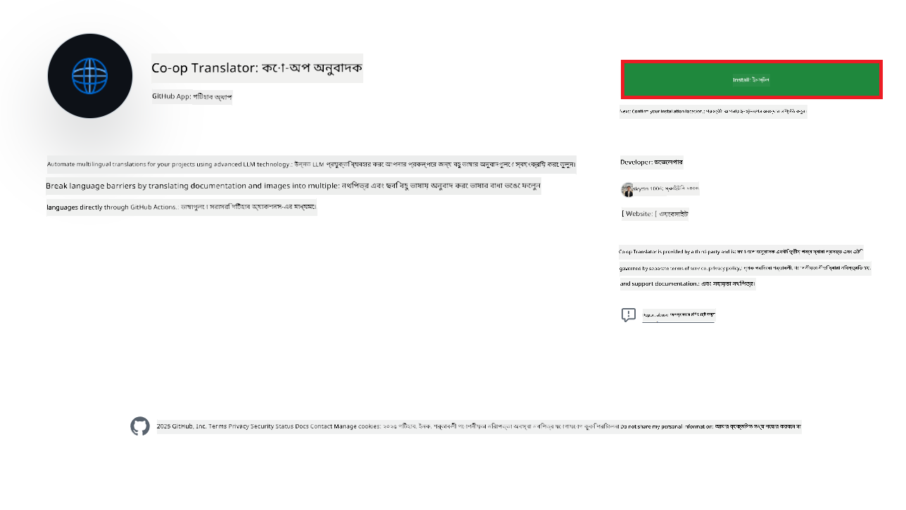
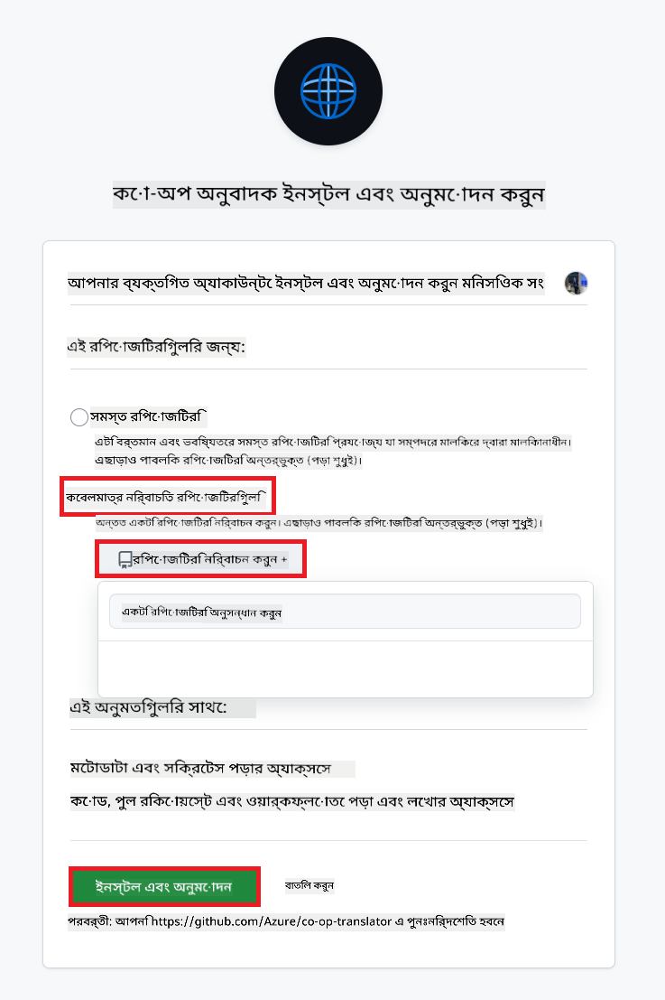
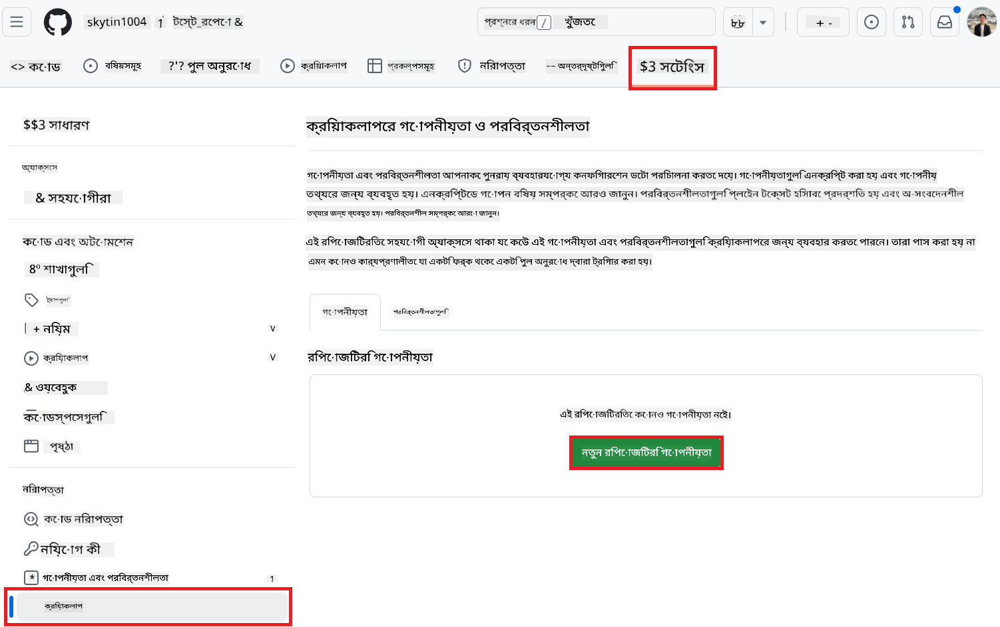
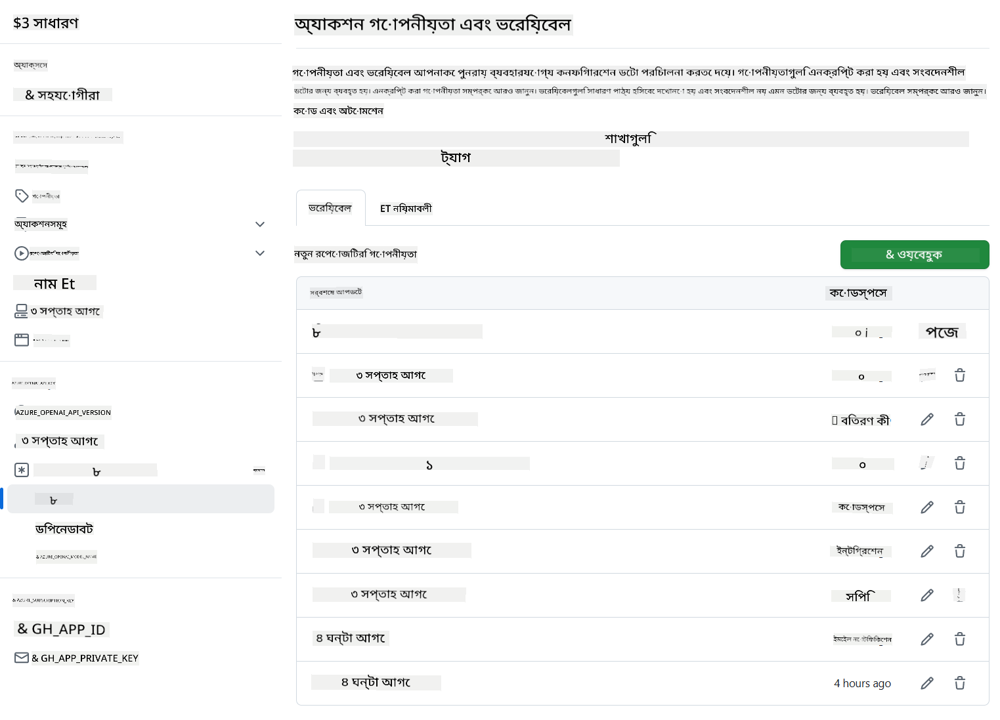

<!--
CO_OP_TRANSLATOR_METADATA:
{
  "original_hash": "c437820027c197f25fb2cbee95bae28c",
  "translation_date": "2025-06-12T19:06:03+00:00",
  "source_file": "getting_started/github-actions-guide/github-actions-guide-org.md",
  "language_code": "bn"
}
-->
# Co-op Translator GitHub Action ব্যবহার (সংগঠন নির্দেশিকা)

**লক্ষ্য শ্রোতা:** এই নির্দেশিকা মূলত **Microsoft এর অভ্যন্তরীণ ব্যবহারকারী** বা **যারা প্রি-বিল্ট Co-op Translator GitHub অ্যাপের প্রয়োজনীয় ক্রেডেনশিয়াল অ্যাক্সেস রাখে** অথবা নিজেরা কাস্টম GitHub অ্যাপ তৈরি করতে পারে তাদের জন্য।

Co-op Translator GitHub Action ব্যবহার করে আপনার রেপোজিটরির ডকুমেন্টেশনের অনুবাদ স্বয়ংক্রিয়ভাবে করুন। এই নির্দেশিকায় দেখানো হয়েছে কীভাবে অ্যাকশনটি সেটআপ করবেন যাতে যখনই আপনার সোর্স Markdown ফাইল বা ইমেজ পরিবর্তিত হয়, তখন স্বয়ংক্রিয়ভাবে আপডেটেড অনুবাদের সঙ্গে একটি পুল রিকোয়েস্ট তৈরি হয়।

> [!IMPORTANT]
> 
> **সঠিক নির্দেশিকা নির্বাচন:**
>
> এই নির্দেশিকায় GitHub App ID এবং Private Key ব্যবহার করে সেটআপের বিবরণ দেয়া হয়েছে। সাধারণত এই "সংগঠন নির্দেশিকা" পদ্ধতি প্রয়োজন হয় যখন: **`GITHUB_TOKEN` অনুমতিগুলো সীমাবদ্ধ থাকে:** আপনার সংগঠন বা রেপোজিটরি সেটিংস ডিফল্ট `GITHUB_TOKEN` অনুমতিগুলো সীমাবদ্ধ করে রাখে। বিশেষ করে, যদি `GITHUB_TOKEN`-কে প্রয়োজনীয় `write` অনুমতি (যেমন `contents: write` বা `pull-requests: write`) না দেওয়া হয়, তাহলে [Public Setup Guide](./github-actions-guide-public.md) অনুযায়ী ওয়ার্কফ্লো অনুমতির অভাবে ব্যর্থ হবে। স্পষ্ট অনুমতিসহ একটি নির্দিষ্ট GitHub অ্যাপ ব্যবহার করলে এই সীমাবদ্ধতা এড়ানো যায়।
>
> **যদি উপরোক্ত আপনার ক্ষেত্রে প্রযোজ্য না হয়:**
>
> যদি আপনার রেপোজিটরিতে ডিফল্ট `GITHUB_TOKEN` যথেষ্ট অনুমতি পায় (অর্থাৎ আপনি সাংগঠনিক সীমাবদ্ধতায় বাধাগ্রস্ত না হন), তাহলে **[Public Setup Guide using GITHUB_TOKEN](./github-actions-guide-public.md)** ব্যবহার করুন। পাবলিক গাইডে App ID বা Private Key সংগ্রহ বা পরিচালনার প্রয়োজন নেই এবং এটি শুধুমাত্র ডিফল্ট `GITHUB_TOKEN` এবং রেপোজিটরি অনুমতির উপর নির্ভর করে।

## পূর্বশর্তসমূহ

GitHub Action কনফিগার করার আগে নিশ্চিত করুন যে আপনার কাছে প্রয়োজনীয় AI সার্ভিস ক্রেডেনশিয়ালস প্রস্তুত আছে।

**১. প্রয়োজনীয়: AI ভাষা মডেল ক্রেডেনশিয়ালস**  
কমপক্ষে একটি সমর্থিত ভাষা মডেলের জন্য ক্রেডেনশিয়ালস প্রয়োজন:

- **Azure OpenAI**: Endpoint, API Key, Model/Deployment নাম, API Version প্রয়োজন।  
- **OpenAI**: API Key, (ঐচ্ছিক: Org ID, Base URL, Model ID) প্রয়োজন।  
- বিস্তারিত জানতে দেখুন [Supported Models and Services](../../../../README.md)।  
- সেটআপ নির্দেশিকা: [Azure OpenAI সেটআপ করুন](../set-up-resources/set-up-azure-openai.md)।

**২. ঐচ্ছিক: কম্পিউটার ভিশন ক্রেডেনশিয়ালস (ইমেজ অনুবাদের জন্য)**

- শুধুমাত্র ইমেজের মধ্যে থাকা টেক্সট অনুবাদের প্রয়োজন হলে।  
- **Azure Computer Vision**: Endpoint এবং Subscription Key প্রয়োজন।  
- না দিলে, অ্যাকশন [Markdown-only মোডে](../markdown-only-mode.md) চলে।  
- সেটআপ নির্দেশিকা: [Azure Computer Vision সেটআপ করুন](../set-up-resources/set-up-azure-computer-vision.md)।

## সেটআপ এবং কনফিগারেশন

আপনার রেপোজিটরিতে Co-op Translator GitHub Action কনফিগার করতে নিচের ধাপগুলো অনুসরণ করুন:

### ধাপ ১: GitHub App Authentication ইনস্টল এবং কনফিগার করুন

ওয়ার্কফ্লো GitHub App authentication ব্যবহার করে আপনার রেপোজিটরির সঙ্গে নিরাপদভাবে যোগাযোগ করে (যেমন পুল রিকোয়েস্ট তৈরি)। একটি অপশন নির্বাচন করুন:

#### **অপশন এ: প্রি-বিল্ট Co-op Translator GitHub App ইনস্টল করুন (Microsoft অভ্যন্তরীণ ব্যবহারের জন্য)**

1. [Co-op Translator GitHub App](https://github.com/apps/co-op-translator) পেজে যান।

1. **Install** নির্বাচন করুন এবং আপনার টার্গেট রেপোজিটরি যেখানে আছে সেই অ্যাকাউন্ট বা সংগঠন নির্বাচন করুন।

    

1. **Only select repositories** নির্বাচন করুন এবং আপনার টার্গেট রেপোজিটরি (যেমন `PhiCookBook`) নির্বাচন করুন। **Install** ক্লিক করুন। আপনাকে অথেনটিকেট করতে বলা হতে পারে।

    

1. **অ্যাপ ক্রেডেনশিয়ালস সংগ্রহ করুন (অভ্যন্তরীণ প্রক্রিয়া প্রয়োজন):** ওয়ার্কফ্লো যাতে অ্যাপ হিসেবে অথেনটিকেট করতে পারে, Co-op Translator টিম থেকে দুইটি তথ্য প্রয়োজন:  
  - **App ID:** Co-op Translator অ্যাপের ইউনিক আইডেন্টিফায়ার। App ID হল: `1164076`।  
  - **Private Key:** `.pem` প্রাইভেট কী ফাইলের **সম্পূর্ণ কনটেন্ট** মেইনটেইনারের কাছ থেকে সংগ্রহ করুন। **এই কীকে পাসওয়ার্ডের মতো নিরাপদে রাখুন।**

1. ধাপ ২ এ যান।

#### **অপশন বি: নিজস্ব কাস্টম GitHub App ব্যবহার করুন**

- চাইলে নিজস্ব GitHub App তৈরি ও কনফিগার করতে পারেন। নিশ্চিত করুন এটি Contents এবং Pull requests এর Read & write অনুমতি পায়। App ID এবং Private Key প্রয়োজন হবে।

### ধাপ ২: রেপোজিটরি সিক্রেটস কনফিগার করুন

GitHub App ক্রেডেনশিয়ালস এবং AI সার্ভিস ক্রেডেনশিয়ালস এনক্রিপ্টেড সিক্রেট হিসেবে আপনার রেপোজিটরি সেটিংসে যোগ করুন।

1. আপনার টার্গেট GitHub রেপোজিটরিতে যান (যেমন `PhiCookBook`)।

1. **Settings** > **Secrets and variables** > **Actions** এ যান।

1. **Repository secrets** এর নিচে **New repository secret** ক্লিক করে নিচের সিক্রেটগুলো এক এক করে যোগ করুন।

   

**প্রয়োজনীয় সিক্রেটস (GitHub App Authentication এর জন্য):**

| সিক্রেট নাম          | বর্ণনা                                      | ভ্যালু সোর্স                                     |
| :------------------- | :------------------------------------------- | :---------------------------------------------- |
| `GH_APP_ID`          | GitHub App এর App ID (ধাপ ১ থেকে)              | GitHub App Settings                              |
| `GH_APP_PRIVATE_KEY` | ডাউনলোডকৃত `.pem` ফাইলের **সম্পূর্ণ কনটেন্ট** | `.pem` ফাইল (ধাপ ১ থেকে)            |

**AI সার্ভিস সিক্রেটস (আপনার পূর্বশর্ত অনুসারে প্রযোজ্য সবগুলো যোগ করুন):**

| সিক্রেট নাম                         | বর্ণনা                               | ভ্যালু সোর্স                     |
| :---------------------------------- | :----------------------------------- | :------------------------------- |
| `AZURE_SUBSCRIPTION_KEY`            | Azure AI সার্ভিস (Computer Vision) এর কী  | Azure AI Foundry                    |
| `AZURE_AI_SERVICE_ENDPOINT`         | Azure AI সার্ভিস (Computer Vision) এর Endpoint | Azure AI Foundry                     |
| `AZURE_OPENAI_API_KEY`              | Azure OpenAI সার্ভিসের কী              | Azure AI Foundry                     |
| `AZURE_OPENAI_ENDPOINT`             | Azure OpenAI সার্ভিসের Endpoint         | Azure AI Foundry                     |
| `AZURE_OPENAI_MODEL_NAME`           | আপনার Azure OpenAI মডেল নাম              | Azure AI Foundry                     |
| `AZURE_OPENAI_CHAT_DEPLOYMENT_NAME` | আপনার Azure OpenAI ডিপ্লয়মেন্ট নাম         | Azure AI Foundry                     |
| `AZURE_OPENAI_API_VERSION`          | Azure OpenAI এর API Version              | Azure AI Foundry                     |
| `OPENAI_API_KEY`                    | OpenAI এর API Key                        | OpenAI Platform                  |
| `OPENAI_ORG_ID`                     | OpenAI Organization ID                    | OpenAI Platform                  |
| `OPENAI_CHAT_MODEL_ID`              | নির্দিষ্ট OpenAI মডেল ID                  | OpenAI Platform                    |
| `OPENAI_BASE_URL`                   | কাস্টম OpenAI API Base URL                | OpenAI Platform                    |



### ধাপ ৩: ওয়ার্কফ্লো ফাইল তৈরি করুন

অবশেষে, স্বয়ংক্রিয় ওয়ার্কফ্লো সংজ্ঞায়িত করতে YAML ফাইল তৈরি করুন।

1. আপনার রেপোজিটরির রুট ডিরেক্টরিতে `.github/workflows/` ডিরেক্টরি তৈরি করুন যদি না থাকে।

1. `.github/workflows/` এর ভিতরে `co-op-translator.yml` নামের একটি ফাইল তৈরি করুন।

1. নিচের কনটেন্ট co-op-translator.yml এ পেস্ট করুন।

```
name: Co-op Translator

on:
  push:
    branches:
      - main

jobs:
  co-op-translator:
    runs-on: ubuntu-latest

    permissions:
      contents: write
      pull-requests: write

    steps:
      - name: Checkout repository
        uses: actions/checkout@v4
        with:
          fetch-depth: 0

      - name: Set up Python
        uses: actions/setup-python@v4
        with:
          python-version: '3.10'

      - name: Install Co-op Translator
        run: |
          python -m pip install --upgrade pip
          pip install co-op-translator

      - name: Run Co-op Translator
        env:
          PYTHONIOENCODING: utf-8
          # Azure AI Service Credentials
          AZURE_SUBSCRIPTION_KEY: ${{ secrets.AZURE_SUBSCRIPTION_KEY }}
          AZURE_AI_SERVICE_ENDPOINT: ${{ secrets.AZURE_AI_SERVICE_ENDPOINT }}

          # Azure OpenAI Credentials
          AZURE_OPENAI_API_KEY: ${{ secrets.AZURE_OPENAI_API_KEY }}
          AZURE_OPENAI_ENDPOINT: ${{ secrets.AZURE_OPENAI_ENDPOINT }}
          AZURE_OPENAI_MODEL_NAME: ${{ secrets.AZURE_OPENAI_MODEL_NAME }}
          AZURE_OPENAI_CHAT_DEPLOYMENT_NAME: ${{ secrets.AZURE_OPENAI_CHAT_DEPLOYMENT_NAME }}
          AZURE_OPENAI_API_VERSION: ${{ secrets.AZURE_OPENAI_API_VERSION }}

          # OpenAI Credentials
          OPENAI_API_KEY: ${{ secrets.OPENAI_API_KEY }}
          OPENAI_ORG_ID: ${{ secrets.OPENAI_ORG_ID }}
          OPENAI_CHAT_MODEL_ID: ${{ secrets.OPENAI_CHAT_MODEL_ID }}
          OPENAI_BASE_URL: ${{ secrets.OPENAI_BASE_URL }}
        run: |
          # =====================================================================
          # IMPORTANT: Set your target languages here (REQUIRED CONFIGURATION)
          # =====================================================================
          # Example: Translate to Spanish, French, German. Add -y to auto-confirm.
          translate -l "es fr de" -y  # <--- MODIFY THIS LINE with your desired languages

      - name: Authenticate GitHub App
        id: generate_token
        uses: tibdex/github-app-token@v1
        with:
          app_id: ${{ secrets.GH_APP_ID }}
          private_key: ${{ secrets.GH_APP_PRIVATE_KEY }}

      - name: Create Pull Request with translations
        uses: peter-evans/create-pull-request@v5
        with:
          token: ${{ steps.generate_token.outputs.token }}
          commit-message: "🌐 Update translations via Co-op Translator"
          title: "🌐 Update translations via Co-op Translator"
          body: |
            This PR updates translations for recent changes to the main branch.

            ### 📋 Changes included
            - Translated contents are available in the `translations/` directory
            - Translated images are available in the `translated_images/` directory

            ---
            🌐 Automatically generated by the [Co-op Translator](https://github.com/Azure/co-op-translator) GitHub Action.
          branch: update-translations
          base: main
          labels: translation, automated-pr
          delete-branch: true
          add-paths: |
            translations/
            translated_images/

```

4.  **ওয়ার্কফ্লো কাস্টমাইজ করুন:**  
  - **[!IMPORTANT] লক্ষ্য ভাষাসমূহ:** `Run Co-op Translator` step, you **MUST review and modify the list of language codes** within the `translate -l "..." -y` command to match your project's requirements. The example list (`ar de es...`) needs to be replaced or adjusted.
  - **Trigger (`on:`):** The current trigger runs on every push to `main`. For large repositories, consider adding a `paths:` filter (see commented example in the YAML) to run the workflow only when relevant files (e.g., source documentation) change, saving runner minutes.
  - **PR Details:** Customize the `commit-message`, `title`, `body`, `branch` name, and `labels` in the `Create Pull Request` step if needed.

## Credential Management and Renewal

- **Security:** Always store sensitive credentials (API keys, private keys) as GitHub Actions secrets. Never expose them in your workflow file or repository code.
- **[!IMPORTANT] Key Renewal (Internal Microsoft Users):** Be aware that Azure OpenAI key used within Microsoft might have a mandatory renewal policy (e.g., every 5 months). Ensure you update the corresponding GitHub secrets (`AZURE_OPENAI_...` কীগুলোর মধ্যে **মেয়াদ উত্তীর্ণ হওয়ার আগে** আপনার টার্গেট ভাষাগুলো ঠিক করুন যাতে ওয়ার্কফ্লো ব্যর্থ না হয়।

## ওয়ার্কফ্লো চালানো

যখন `co-op-translator.yml` ফাইলটি আপনার main ব্রাঞ্চে মার্জ করা হবে (অথবা `on:` trigger), the workflow will automatically run whenever changes are pushed to that branch (and match the `paths` ফিল্টারে নির্দিষ্ট ব্রাঞ্চে, যদি কনফিগার করা থাকে)।

অনুবাদ তৈরি বা আপডেট হলে, অ্যাকশন স্বয়ংক্রিয়ভাবে একটি পুল রিকোয়েস্ট তৈরি করবে যা পরিবর্তনগুলো ধারণ করবে, আপনার রিভিউ ও মার্জ করার জন্য প্রস্তুত।

**দায়িত্ব পরিহার**:  
এই নথিটি AI অনুবাদ সেবা [Co-op Translator](https://github.com/Azure/co-op-translator) ব্যবহার করে অনূদিত হয়েছে। আমরা যথাসাধ্য সঠিকতার চেষ্টা করি, তবে স্বয়ংক্রিয় অনুবাদে ভুল বা অসঙ্গতি থাকতে পারে। মূল নথিটি তার নিজ ভাষায় প্রামাণিক উৎস হিসেবে বিবেচনা করা উচিত। গুরুত্বপূর্ণ তথ্যের জন্য পেশাদার মানব অনুবাদের পরামর্শ দেওয়া হয়। এই অনুবাদ ব্যবহারের ফলে সৃষ্ট কোনও ভুল বোঝাবুঝি বা ভুল ব্যাখ্যার জন্য আমরা দায়বদ্ধ নয়।