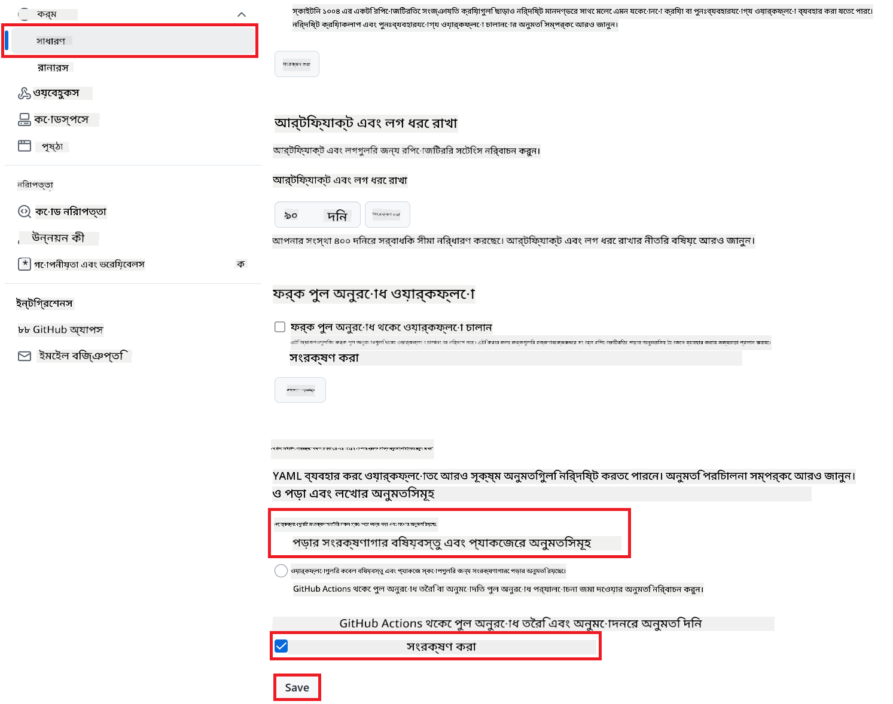

<!--
CO_OP_TRANSLATOR_METADATA:
{
  "original_hash": "a52587a512e667f70d92db853d3c61d5",
  "translation_date": "2025-06-12T19:25:29+00:00",
  "source_file": "getting_started/github-actions-guide/github-actions-guide-public.md",
  "language_code": "bn"
}
-->
# Co-op Translator GitHub Action ব্যবহার (পাবলিক সেটআপ)

**লক্ষ্য শ্রোতা:** এই গাইডটি মূলত পাবলিক বা প্রাইভেট অধিকাংশ রিপোজিটরির জন্য যারা স্ট্যান্ডার্ড GitHub Actions অনুমতি ব্যবহার করেন। এটি বিল্ট-ইন `GITHUB_TOKEN` ব্যবহার করে।

Co-op Translator GitHub Action ব্যবহার করে আপনার রিপোজিটরির ডকুমেন্টেশনের অনুবাদ স্বয়ংক্রিয়ভাবে করুন। এই গাইডটি আপনাকে দেখাবে কীভাবে এই অ্যাকশন সেটআপ করতে হয় যাতে সোর্স Markdown ফাইল বা ইমেজ পরিবর্তন হলে স্বয়ংক্রিয়ভাবে আপডেটেড অনুবাদের সাথে পুল রিকোয়েস্ট তৈরি হয়।

> [!IMPORTANT]
>
> **সঠিক গাইড নির্বাচন:**
>
> এই গাইডটি **স্ট্যান্ডার্ড `GITHUB_TOKEN` ব্যবহার করে সহজ সেটআপ** সম্পর্কে। অধিকাংশ ব্যবহারকারীর জন্য এটি সুপারিশকৃত কারণ এতে সংবেদনশীল GitHub App Private Keys ব্যবস্থাপনা লাগে না।
>

## প্রয়োজনীয়তাসমূহ

GitHub Action কনফিগার করার আগে নিশ্চিত করুন আপনার কাছে প্রয়োজনীয় AI সার্ভিসের ক্রেডেনশিয়ালস আছে।

**১. প্রয়োজনীয়: AI ভাষা মডেল ক্রেডেনশিয়ালস**  
কমপক্ষে একটি সমর্থিত ভাষা মডেলের জন্য ক্রেডেনশিয়ালস দরকার:

- **Azure OpenAI**: Endpoint, API Key, Model/Deployment নাম, API Version প্রয়োজন।  
- **OpenAI**: API Key প্রয়োজন, (ঐচ্ছিক: Org ID, Base URL, Model ID)।  
- বিস্তারিত জানতে [Supported Models and Services](../../../../README.md) দেখুন।

**২. ঐচ্ছিক: AI Vision ক্রেডেনশিয়ালস (ইমেজ অনুবাদের জন্য)**

- শুধুমাত্র তখনই প্রয়োজন যখন ইমেজের ভিতরের টেক্সট অনুবাদ করতে চান।  
- **Azure AI Vision**: Endpoint এবং Subscription Key প্রয়োজন।  
- না দিলে অ্যাকশন [Markdown-only mode](../markdown-only-mode.md) এ চলে যাবে।

## সেটআপ এবং কনফিগারেশন

স্ট্যান্ডার্ড `GITHUB_TOKEN` ব্যবহার করে Co-op Translator GitHub Action আপনার রিপোজিটরিতে কনফিগার করতে নিচের ধাপগুলো অনুসরণ করুন।

### ধাপ ১: Authentication বোঝা (`GITHUB_TOKEN` ব্যবহার)

এই ওয়ার্কফ্লো GitHub Actions এর বিল্ট-ইন `GITHUB_TOKEN` ব্যবহার করে। এই টোকেন স্বয়ংক্রিয়ভাবে ওয়ার্কফ্লোকে আপনার রিপোজিটরির সাথে ইন্টারঅ্যাক্ট করার অনুমতি দেয় যা আপনি **ধাপ ৩** এ কনফিগার করবেন।

### ধাপ ২: রিপোজিটরি সিক্রেটস কনফিগার করা

শুধুমাত্র আপনার **AI সার্ভিস ক্রেডেনশিয়ালস** গুলো এনক্রিপ্টেড সিক্রেট হিসেবে রিপোজিটরির সেটিংসে যোগ করুন।

1. আপনার লক্ষ্যমাত্রা GitHub রিপোজিটরিতে যান।  
2. **Settings** > **Secrets and variables** > **Actions** এ যান।  
3. **Repository secrets** এর নিচে, প্রতিটি প্রয়োজনীয় AI সার্ভিস সিক্রেটের জন্য **New repository secret** ক্লিক করুন।

     *(ইমেজ রেফারেন্স: কোথায় সিক্রেট যোগ করবেন দেখানো হয়েছে)*

**প্রয়োজনীয় AI সার্ভিস সিক্রেটস (আপনার প্রয়োজন অনুসারে সব যোগ করুন):**

| সিক্রেট নাম                         | বর্ণনা                                 | ভ্যালু সোর্স                     |
| :---------------------------------- | :------------------------------------- | :------------------------------- |
| `AZURE_SUBSCRIPTION_KEY`            | Azure AI সার্ভিসের (কম্পিউটার ভিশন) কী  | আপনার Azure AI Foundry            |
| `AZURE_AI_SERVICE_ENDPOINT`         | Azure AI সার্ভিসের (কম্পিউটার ভিশন) এন্ডপয়েন্ট | আপনার Azure AI Foundry            |
| `AZURE_OPENAI_API_KEY`              | Azure OpenAI সার্ভিসের কী              | আপনার Azure AI Foundry            |
| `AZURE_OPENAI_ENDPOINT`             | Azure OpenAI সার্ভিসের এন্ডপয়েন্ট     | আপনার Azure AI Foundry            |
| `AZURE_OPENAI_MODEL_NAME`           | আপনার Azure OpenAI মডেলের নাম          | আপনার Azure AI Foundry            |
| `AZURE_OPENAI_CHAT_DEPLOYMENT_NAME` | আপনার Azure OpenAI ডিপ্লয়মেন্টের নাম    | আপনার Azure AI Foundry            |
| `AZURE_OPENAI_API_VERSION`          | Azure OpenAI এর API ভার্সন               | আপনার Azure AI Foundry            |
| `OPENAI_API_KEY`                    | OpenAI এর API কী                       | আপনার OpenAI প্ল্যাটফর্ম           |
| `OPENAI_ORG_ID`                     | OpenAI অর্গানাইজেশন আইডি (ঐচ্ছিক)      | আপনার OpenAI প্ল্যাটফর্ম           |
| `OPENAI_CHAT_MODEL_ID`              | নির্দিষ্ট OpenAI মডেল আইডি (ঐচ্ছিক)      | আপনার OpenAI প্ল্যাটফর্ম           |
| `OPENAI_BASE_URL`                   | কাস্টম OpenAI API বেস URL (ঐচ্ছিক)       | আপনার OpenAI প্ল্যাটফর্ম           |

### ধাপ ৩: ওয়ার্কফ্লো অনুমতিসমূহ কনফিগার করা

GitHub Action কে কোড চেকআউট এবং পুল রিকোয়েস্ট তৈরির জন্য `GITHUB_TOKEN` এর মাধ্যমে অনুমতি দিতে হবে।

1. আপনার রিপোজিটরিতে **Settings** > **Actions** > **General** এ যান।  
2. **Workflow permissions** সেকশনে স্ক্রল করুন।  
3. **Read and write permissions** সিলেক্ট করুন। এতে `GITHUB_TOKEN` এই ওয়ার্কফ্লোর জন্য প্রয়োজনীয় `contents: write` এবং `pull-requests: write` অনুমতি পাবে।  
4. **Allow GitHub Actions to create and approve pull requests** চেকবক্সটি নিশ্চিত করুন চেক করা আছে।  
5. **Save** ক্লিক করুন।



### ধাপ ৪: ওয়ার্কফ্লো ফাইল তৈরি করা

সবশেষে, `GITHUB_TOKEN` ব্যবহার করে স্বয়ংক্রিয় ওয়ার্কফ্লো সংজ্ঞায়িত করার YAML ফাইল তৈরি করুন।

1. আপনার রিপোজিটরির রুট ডিরেক্টরিতে `.github/workflows/` ডিরেক্টরি তৈরি করুন যদি না থাকে।  
2. `.github/workflows/` এর ভিতরে `co-op-translator.yml` নামের একটি ফাইল তৈরি করুন।  
3. নিচের কন্টেন্টটি `co-op-translator.yml` তে পেস্ট করুন।

```yaml
name: Co-op Translator

on:
  push:
    branches:
      - main

jobs:
  co-op-translator:
    runs-on: ubuntu-latest

    permissions:
      contents: write
      pull-requests: write

    steps:
      - name: Checkout repository
        uses: actions/checkout@v4
        with:
          fetch-depth: 0

      - name: Set up Python
        uses: actions/setup-python@v4
        with:
          python-version: '3.10'

      - name: Install Co-op Translator
        run: |
          python -m pip install --upgrade pip
          pip install co-op-translator

      - name: Run Co-op Translator
        env:
          PYTHONIOENCODING: utf-8
          # === AI Service Credentials ===
          AZURE_SUBSCRIPTION_KEY: ${{ secrets.AZURE_SUBSCRIPTION_KEY }}
          AZURE_AI_SERVICE_ENDPOINT: ${{ secrets.AZURE_AI_SERVICE_ENDPOINT }}
          AZURE_OPENAI_API_KEY: ${{ secrets.AZURE_OPENAI_API_KEY }}
          AZURE_OPENAI_ENDPOINT: ${{ secrets.AZURE_OPENAI_ENDPOINT }}
          AZURE_OPENAI_MODEL_NAME: ${{ secrets.AZURE_OPENAI_MODEL_NAME }}
          AZURE_OPENAI_CHAT_DEPLOYMENT_NAME: ${{ secrets.AZURE_OPENAI_CHAT_DEPLOYMENT_NAME }}
          AZURE_OPENAI_API_VERSION: ${{ secrets.AZURE_OPENAI_API_VERSION }}
          OPENAI_API_KEY: ${{ secrets.OPENAI_API_KEY }}
          OPENAI_ORG_ID: ${{ secrets.OPENAI_ORG_ID }}
          OPENAI_CHAT_MODEL_ID: ${{ secrets.OPENAI_CHAT_MODEL_ID }}
          OPENAI_BASE_URL: ${{ secrets.OPENAI_BASE_URL }}
        run: |
          # =====================================================================
          # IMPORTANT: Set your target languages here (REQUIRED CONFIGURATION)
          # =====================================================================
          # Example: Translate to Spanish, French, German. Add -y to auto-confirm.
          translate -l "es fr de" -y  # <--- MODIFY THIS LINE with your desired languages

      - name: Create Pull Request with translations
        uses: peter-evans/create-pull-request@v5
        with:
          token: ${{ secrets.GITHUB_TOKEN }}
          commit-message: "🌐 Update translations via Co-op Translator"
          title: "🌐 Update translations via Co-op Translator"
          body: |
            This PR updates translations for recent changes to the main branch.

            ### 📋 Changes included
            - Translated contents are available in the `translations/` directory
            - Translated images are available in the `translated_images/` directory

            ---
            🌐 Automatically generated by the [Co-op Translator](https://github.com/Azure/co-op-translator) GitHub Action.
          branch: update-translations
          base: main
          labels: translation, automated-pr
          delete-branch: true
          add-paths: |
            translations/
            translated_images/
```  
4. **ওয়ার্কফ্লো কাস্টমাইজ করুন:**  
  - **[!IMPORTANT] লক্ষ্য ভাষাসমূহ:** `Run Co-op Translator` step, you **MUST review and modify the list of language codes** within the `translate -l "..." -y` command to match your project's requirements. The example list (`ar de es...`) needs to be replaced or adjusted.
  - **Trigger (`on:`):** The current trigger runs on every push to `main`. For large repositories, consider adding a `paths:` filter (see commented example in the YAML) to run the workflow only when relevant files (e.g., source documentation) change, saving runner minutes.
  - **PR Details:** Customize the `commit-message`, `title`, `body`, `branch` name, and `labels` in the `Create Pull Request` স্টেপে প্রয়োজনে ভাষাসমূহ পরিবর্তন করুন।

**দায়বদ্ধতা**:  
এই নথিটি AI অনুবাদ সেবা [Co-op Translator](https://github.com/Azure/co-op-translator) ব্যবহার করে অনূদিত হয়েছে। আমরা যথাসাধ্য সঠিকতার চেষ্টা করি, তবে দয়া করে মনে রাখবেন যে স্বয়ংক্রিয় অনুবাদে ভুল বা অশুদ্ধতা থাকতে পারে। মূল নথিটি তার নিজ ভাষায়ই সর্বোত্তম এবং প্রামাণিক উৎস হিসেবে বিবেচনা করা উচিত। গুরুত্বপূর্ণ তথ্যের জন্য পেশাদার মানুষের অনুবাদ গ্রহণ করার পরামর্শ দেওয়া হয়। এই অনুবাদের ব্যবহার থেকে উদ্ভূত কোনো ভুল বোঝাবুঝি বা ভুল ব্যাখ্যার জন্য আমরা দায়ী নই।