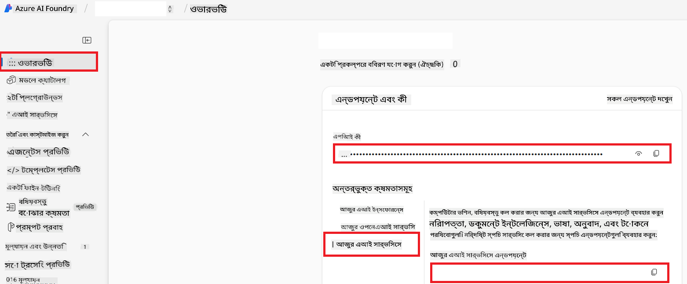

<!--
CO_OP_TRANSLATOR_METADATA:
{
  "original_hash": "b58d7c3cb4210697a073d20eb3064945",
  "translation_date": "2025-06-12T11:49:43+00:00",
  "source_file": "getting_started/set-up-azure-ai.md",
  "language_code": "bn"
}
-->
# Set Up Azure AI for Co-op Translator (Azure OpneAI & Azure AI Vision)

এই গাইডটি আপনাকে Azure AI Foundry এর মধ্যে ভাষা অনুবাদের জন্য Azure OpenAI এবং চিত্র ভিত্তিক অনুবাদের জন্য Azure Computer Vision সেটআপ করতে সাহায্য করবে।

**প্রয়োজনীয়তা:**
- একটি সক্রিয় সাবস্ক্রিপশনসহ Azure অ্যাকাউন্ট।
- আপনার Azure সাবস্ক্রিপশনে রিসোর্স এবং ডিপ্লয়মেন্ট তৈরি করার জন্য যথেষ্ট অনুমতি।

## Create an Azure AI Project

আপনি একটি Azure AI Project তৈরি করে শুরু করবেন, যা আপনার AI রিসোর্সগুলো পরিচালনার কেন্দ্রবিন্দু হিসেবে কাজ করবে।

1. [https://ai.azure.com](https://ai.azure.com) এ যান এবং আপনার Azure অ্যাকাউন্ট দিয়ে সাইন ইন করুন।

1. একটি নতুন প্রকল্প তৈরি করতে **+Create** নির্বাচন করুন।

1. নিম্নলিখিত কাজগুলো করুন:
   - একটি **Project name** লিখুন (যেমন, `CoopTranslator-Project`)।
   - **AI hub** নির্বাচন করুন (যেমন, `CoopTranslator-Hub`) (প্রয়োজনে নতুন তৈরি করুন)।

1. আপনার প্রকল্প সেটআপ করতে "**Review and Create**" ক্লিক করুন। এরপর আপনি আপনার প্রকল্পের ওভারভিউ পেজে নিয়ে যাওয়া হবে।

## Set up Azure OpenAI for Language Translation

আপনার প্রকল্পের মধ্যে, আপনি একটি Azure OpenAI মডেল ডিপ্লয় করবেন যা টেক্সট অনুবাদের ব্যাকএন্ড হিসেবে কাজ করবে।

### Navigate to Your Project

যদি ইতোমধ্যে না থাকেন, তাহলে Azure AI Foundry-তে আপনার সদ্য তৈরি করা প্রকল্পটি (যেমন, `CoopTranslator-Project`) খুলুন।

### Deploy an OpenAI Model

1. আপনার প্রকল্পের বাম দিকের মেনু থেকে, "My assets" এর অধীনে "**Models + endpoints**" নির্বাচন করুন।

1. **+ Deploy model** নির্বাচন করুন।

1. **Deploy Base Model** নির্বাচন করুন।

1. উপলব্ধ মডেলের তালিকা দেখতে পাবেন। একটি উপযুক্ত GPT মডেল ফিল্টার বা সার্চ করুন। আমরা `gpt-4o` সুপারিশ করছি।

1. আপনার পছন্দের মডেল নির্বাচন করে **Confirm** ক্লিক করুন।

1. **Deploy** নির্বাচন করুন।

### Azure OpenAI configuration

ডিপ্লয় করার পর, আপনি "**Models + endpoints**" পেজ থেকে ডিপ্লয়মেন্ট নির্বাচন করে এর **REST endpoint URL**, **Key**, **Deployment name**, **Model name** এবং **API version** দেখতে পারবেন। এগুলো আপনার অ্যাপ্লিকেশনে অনুবাদ মডেল ইন্টিগ্রেট করার জন্য প্রয়োজন হবে।

> [!NOTE]
> আপনি আপনার প্রয়োজন অনুযায়ী [API version deprecation](https://learn.microsoft.com/azure/ai-services/openai/api-version-deprecation) পেজ থেকে API ভার্সন নির্বাচন করতে পারেন। লক্ষ্য রাখবেন **API version** এবং Azure AI Foundry এর "**Models + endpoints**" পেজে দেখানো **Model version** আলাদা।

## Set up Azure Computer Vision for Image Translation

ছবির মধ্যে থাকা টেক্সট অনুবাদের জন্য, আপনাকে Azure AI Service এর API Key এবং Endpoint জানতে হবে।

1. আপনার Azure AI Project (যেমন, `CoopTranslator-Project`) এ যান। নিশ্চিত করুন যে আপনি প্রকল্পের ওভারভিউ পেজে আছেন।

### Azure AI Service configuration

Azure AI Service থেকে API Key এবং Endpoint খুঁজে বের করুন।

1. আপনার Azure AI Project (যেমন, `CoopTranslator-Project`) এ যান। নিশ্চিত করুন যে আপনি প্রকল্পের ওভারভিউ পেজে আছেন।

1. Azure AI Service ট্যাব থেকে **API Key** এবং **Endpoint** খুঁজে বের করুন।

    

এই সংযোগটি সংযুক্ত Azure AI Services রিসোর্সের ক্ষমতাগুলো (যেমন, ছবি বিশ্লেষণ) আপনার AI Foundry প্রকল্পে উপলব্ধ করে তোলে। এরপর আপনি এই সংযোগটি আপনার নোটবুক বা অ্যাপ্লিকেশনে ব্যবহার করে ছবির টেক্সট বের করতে পারবেন, যা পরে Azure OpenAI মডেলে অনুবাদের জন্য পাঠানো যাবে।

## Consolidating Your Credentials

এখন পর্যন্ত, আপনার কাছে নিম্নলিখিত তথ্যগুলো থাকা উচিত:

**Azure OpenAI (টেক্সট অনুবাদের জন্য):**
- Azure OpenAI Endpoint
- Azure OpenAI API Key
- Azure OpenAI Model Name (যেমন, `gpt-4o`)
- Azure OpenAI Deployment Name (যেমন, `cooptranslator-gpt4o`)
- Azure OpenAI API Version

**Azure AI Services (ভিশন ব্যবহার করে ছবি থেকে টেক্সট বের করার জন্য):**
- Azure AI Service Endpoint
- Azure AI Service API Key

### Example: Environment Variable Configuration (Preview)

পরবর্তীতে, যখন আপনি আপনার অ্যাপ্লিকেশন তৈরি করবেন, তখন সম্ভবত আপনি এই সংগ্রহীত তথ্যগুলো পরিবেশ ভেরিয়েবল হিসেবে কনফিগার করবেন। উদাহরণস্বরূপ:

```bash
# Azure AI Service Credentials (Required for image translation)
AZURE_AI_SERVICE_API_KEY="your_azure_ai_service_api_key" # e.g., 21xasd...
AZURE_AI_SERVICE_ENDPOINT="https://your_azure_ai_service_endpoint.cognitiveservices.azure.com/"

# Azure OpenAI Credentials (Required for text translation)
AZURE_OPENAI_API_KEY="your_azure_openai_api_key" # e.g., 21xasd...
AZURE_OPENAI_ENDPOINT="https://your_azure_openai_endpoint.openai.azure.com/"
AZURE_OPENAI_MODEL_NAME="your_model_name" # e.g., gpt-4o
AZURE_OPENAI_CHAT_DEPLOYMENT_NAME="your_deployment_name" # e.g., cooptranslator-gpt4o
AZURE_OPENAI_API_VERSION="your_api_version" # e.g., 2024-12-01-preview
```

---

### Further Reading

- [How to Create a project in Azure AI Foundry](https://learn.microsoft.com/azure/ai-foundry/how-to/create-projects?tabs=ai-studio)
- [How to Create Azure AI resources](https://learn.microsoft.com/azure/ai-foundry/how-to/create-azure-ai-resource?tabs=portal)
- [How to Deploy OpenAI models in Azure AI Foundry](https://learn.microsoft.com/en-us/azure/ai-foundry/how-to/deploy-models-openai)

**দায়বদ্ধতা প্রত্যাখ্যান**:  
এই নথিটি AI অনুবাদ সেবা [Co-op Translator](https://github.com/Azure/co-op-translator) ব্যবহার করে অনূদিত হয়েছে। আমরা সঠিকতার জন্য চেষ্টা করি, তবে দয়া করে মনে রাখবেন যে স্বয়ংক্রিয় অনুবাদে ভুল বা অসঙ্গতি থাকতে পারে। মূল নথিটি তার নিজস্ব ভাষায় কর্তৃত্বপ্রাপ্ত উৎস হিসেবে বিবেচিত হওয়া উচিত। গুরুত্বপূর্ণ তথ্যের জন্য পেশাদার মানব অনুবাদ গ্রহণ করার পরামর্শ দেওয়া হয়। এই অনুবাদের ব্যবহারে যে কোনও ভুল বোঝাবুঝি বা ভুল ব্যাখ্যার জন্য আমরা দায়বদ্ধ নই।