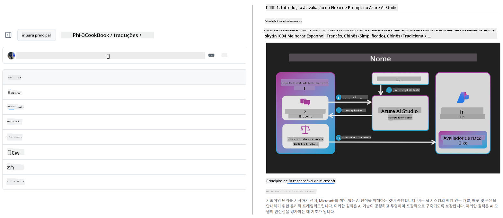
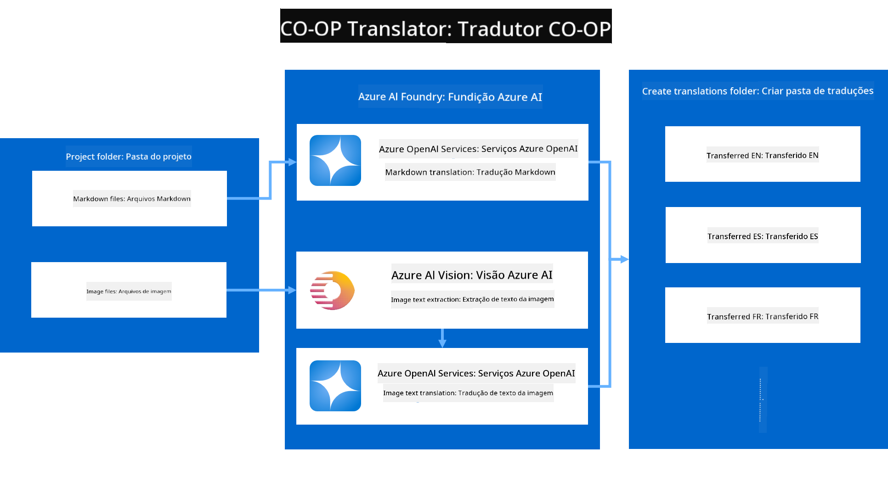
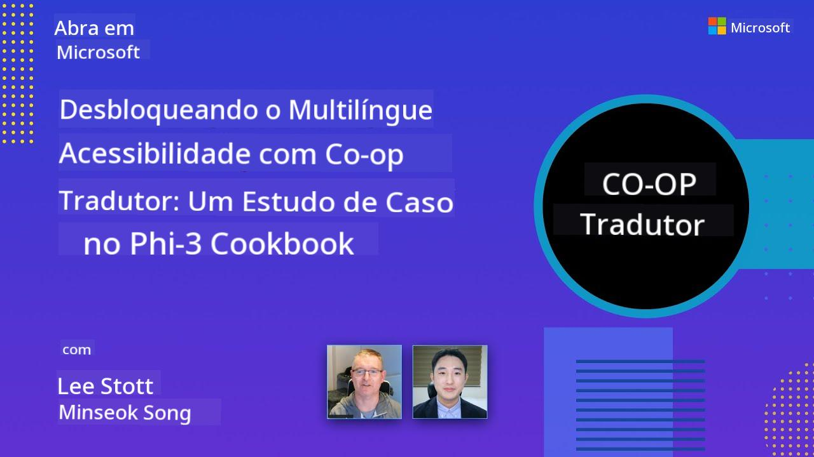

<!--
CO_OP_TRANSLATOR_METADATA:
{
  "original_hash": "044724537b57868117aadae8e7728c7c",
  "translation_date": "2025-06-12T10:19:28+00:00",
  "source_file": "README.md",
  "language_code": "br"
}
-->


# Co-op Translator: Automate a Tradução de Documentação Educacional Sem Esforço

_Automatique facilmente a tradução da sua documentação para vários idiomas e alcance um público global._

[](https://pypi.org/project/co-op-translator/)
[](https://github.com/azure/co-op-translator/blob/main/LICENSE)
[](https://pepy.tech/project/co-op-translator)
[](https://pepy.tech/project/co-op-translator)
[](https://github.com/psf/black)

[](https://GitHub.com/azure/co-op-translator/graphs/contributors/)
[](https://GitHub.com/azure/co-op-translator/issues/)
[](https://GitHub.com/azure/co-op-translator/pulls/)
[](http://makeapullrequest.com)

### Suporte a Idiomas com Tecnologia Co-op Translator
[Francês](../fr/README.md) | [Espanhol](../es/README.md) | [Alemão](../de/README.md) | [Russo](../ru/README.md) | [Árabe](../ar/README.md) | [Persa (Farsi)](../fa/README.md) | [Urdu](../ur/README.md) | [Chinês (Simplificado)](../zh/README.md) | [Chinês (Tradicional, Macau)](../mo/README.md) | [Chinês (Tradicional, Hong Kong)](../hk/README.md) | [Chinês (Tradicional, Taiwan)](../tw/README.md) | [Japonês](../ja/README.md) | [Coreano](../ko/README.md) | [Hindi](../hi/README.md) | [Bengali](../bn/README.md) | [Marathi](../mr/README.md) | [Nepali](../ne/README.md) | [Punjabi (Gurmukhi)](../pa/README.md) | [Português (Portugal)](../pt/README.md) | [Português (Brasil)](./README.md) | [Italiano](../it/README.md) | [Polonês](../pl/README.md) | [Turco](../tr/README.md) | [Grego](../el/README.md) | [Tailandês](../th/README.md) | [Sueco](../sv/README.md) | [Dinamarquês](../da/README.md) | [Norueguês](../no/README.md) | [Finlandês](../fi/README.md) | [Holandês](../nl/README.md) | [Hebraico](../he/README.md) | [Vietnamita](../vi/README.md) | [Indonésio](../id/README.md) | [Malaio](../ms/README.md) | [Tagalog (Filipino)](../tl/README.md) | [Suaíli](../sw/README.md) | [Húngaro](../hu/README.md) | [Tcheco](../cs/README.md) | [Eslovaco](../sk/README.md) | [Romeno](../ro/README.md) | [Búlgaro](../bg/README.md) | [Sérvio (Cirílico)](../sr/README.md) | [Croata](../hr/README.md) | [Esloveno](../sl/README.md) | [Ucraniano](../uk/README.md) | [Birmanês (Myanmar)](../my/README.md)
> [!NOTE]
> Evit an d’anvreoù kinniget bremañ evit kontadenn an teuliadoù-mañ. Evit ur roll klok eus ar yezhoù skoazeliet gant Co-op Translator, gwelout ar rann [Language Support](../..).

[](https://GitHub.com/azure/co-op-translator/watchers/)
[](https://GitHub.com/azure/co-op-translator/network/)
[](https://GitHub.com/azure/co-op-translator/stargazers/)

[](https://discord.com/invite/ByRwuEEgH4)

[](https://codespaces.new/azure/co-op-translator)
[](https://vscode.dev/redirect?url=vscode://ms-vscode-remote.remote-containers/cloneInVolume?url=https://github.com/azure/co-op-translator)

## Kinnig : Simplaat treuzkas ho danvez deskadurel

Ar c’hudennoù yezh a ziskouez kalz er c’hleuzerezh d’an danvez deskadurel talvoudus hag ar skiantoù teknikel evit ar studierien ha ar diorroadorion er bed a-bezh. Se a dimezi ar c’hinnig ha a ziskenn buanadur ar c’hengladur hag ar studiadenn bedel.

**Co-op Translator** zo bet savet evit respont d’ar goulennoù war an doareoù treuzkas dizalc’h evit al lennadurezhioù bras Microsoft (evit ar gideoù "Evit an dechadoù" da skouer). Bez’ ez eus kemeret perzh da vezañ ur benveg aes da implijout hag a ginnig kalz a fedoù evit dispartiañ ar c’hudennoù-se d’an holl. Dre ma kinnig treuzkas automatiset uhel dre CLI hag GitHub Actions, Co-op Translator a ro nerzh d’ar skolidi, studierien, enklaskerien ha diorroadorion er bed a-bezh da rannañ ha da gaout an titouroù hep bezañ serret gant an yezhoù.

Sell ouzh penaos e aozer Co-op Translator ar c’hontennoù deskadurel treuzket :



Ar fajennoù Markdown ha testoù ar skeudennoù a vez treuzket en-dro gant anavezet e folderoù yezh-specifik.

**Digeriñ an hent da gaout ho danvez deskadurel e bed ar bed gant Co-op Translator hiziv !**

## Sikour da gaout ar gontadenn bedel evit ar c’hudennoù deskadurel Microsoft

Co-op Translator a sikour da ziskouez ar c’hudennoù yezh evit ar raktresoù brasañ deskadurel Microsoft, en ur automatisaat an treuzkas evit ar repoioù a servij an diorroadorion bedel. Da skouerioù a implij Co-op Translator bremañ :

[](https://github.com/microsoft/Generative-AI-for-beginners)
[](https://github.com/microsoft/ML-For-Beginners)
[](https://github.com/microsoft/AI-For-Beginners)
[](https://github.com/microsoft/ai-agents-for-beginners)
[](https://github.com/microsoft/PhiCookBook)
[](https://github.com/microsoft/Generative-AI-for-beginners-dotnet)

## Perzhioù Pennañ

- **Treuzkasou automatiset** : Treuzkas testoù e meur a yezh hep strivoù.
- **Integradur gant GitHub Actions** : Automatisa an treuzkas er pipeline CI/CD.
- **Mirdi Markdown en deroù** : Mirdi ar sintaks markdown reizh e-pad an treuzkas.
- **Treuzkas testoù skeudennoù** : Dizoloiñ ha treuzkas testoù en arskeudennoù.
- **Technologie LLM uhel** : Implij modeloù yezh modern evit treuzkasou uhel.
- **Integradur aes** : Kenlabour gant ho raktres koulz hag e vezañ.
- **Simplaat ar lokalisadur** : Simplaat ar proses da lakaat ho raktres e yezhoù disheñvel.

## Penaos e vez graet anezhañ



Co-op Translator a ginnig ar fajennoù markdown hag ar skeudennoù eus ho folder raktres hag a ra ar pal da heul :

1. **Dizoloiñ testoù** : Dizolo testoù eus fajennoù markdown ha, ma vez kinniget (da skouer gant Azure AI Vision), testoù en arskeudennoù.
1. **Treuzkas AI** : Kas an testoù dizoloet d’ar LLM kinniget (Azure OpenAI, OpenAI, hag all) evit treuzkas.
1. **Enrollañ ar respontoù** : Enroll fajennoù markdown ha skeudennoù (gant testoù treuzket) er folderoù yezh-specifik, en ur mirout ar furmad orin.

## Kregiñ Goude

Kregiñ buan gant ar CLI pe staliañ an automatisadur hollek gant GitHub Actions. Dibabit ar mod a zo gwellañ evit ho doare labour :

1. **Linenn urzh (CLI)** - Evit treuzkasoù un tamm pe evit mererezh dorn.
2. **GitHub Actions** - Evit treuzkasou automatiset pep gwech ma vez ur push.

> [!NOTE]
> Er c’hinnig-mañ e vez gwelet resoursoù Azure, met gallout a rit implij ha modeloù yezh skoazeliet all.

### Skor Yezhoù

Co-op Translator a skoazell meur a yezh evit ma c’hallit kaout ur c’hontadenn bedel. Setu ar pezh da gouzout :

#### Adkavout buan

| Yezh | Kod | Yezh | Kod | Yezh | Kod |
|----------|------|----------|------|----------|------|
| Arabic | ar | Bengali | bn | Bulgarian | bg |
| Burmese (Myanmar) | my | Chinese (Simplified) | zh | Chinese (Traditional, HK) | hk |
| Chinese (Traditional, Macau) | mo | Chinese (Traditional, TW) | tw | Croatian | hr |
| Czech | cs | Danish | da | Dutch | nl |
| Finnish | fi | French | fr | German | de |
| Greek | el | Hebrew | he | Hindi | hi |
| Hungarian | hu | Indonesian | id | Italian | it |
| Japanese | ja | Korean | ko | Malay | ms |
| Marathi | mr | Nepali | ne | Norwegian | no |
| Persian (Farsi) | fa | Polish | pl | Portuguese (Brazil) | br |
| Portuguese (Portugal) | pt | Punjabi (Gurmukhi) | pa | Romanian | ro |
| Russian | ru | Serbian (Cyrillic) | sr | Slovak | sk |
| Slovenian | sl | Spanish | es | Swahili | sw |
| Swedish | sv | Tagalog (Filipino) | tl | Thai | th |
| Turkish | tr | Ukrainian | uk | Urdu | ur |
| Vietnamese | vi | — | — | — | — |

#### Implij kodoù yezh

Pa implijit Co-op Translator, ezhomm ez eus da zisplegañ yezhoù dre o kodoù. Da skouer :

```bash
# Translate to French, Spanish, and German
translate -l "fr es de"

# Translate to Chinese (Simplified) and Japanese
translate -l "zh ja"
```

> [!NOTE]
> Evit titouroù teknikel donoc’h diwar-benn skoazell yezhoù, en o zouez :
>
> - Spesifikadurioù ar fontoù evit pep yezh
> - Kudennoù anavezet
> - Penaos ouzhpennañ yezhoù nevez
>
> Gwelout hon [Skrid Skoazell Yezhoù](./getting_started/supported-languages.md).

### Modeloù ha servijoù skoazellet

| Seurt | Anv |
|-----------------------|--------------------------------|
| Model Yezh        |   |
| AI Vision       |  |

> [!NOTE]
> Ma n’eus ket servij AI vision, e vo troet ar co-op translator da [mod markdown hepken](./getting_started/markdown-only-mode.md).

### Kinnig kentañ

A-raok kregiñ, ezhomm zo da sevel ar resoursoù da heul :

1. Model Yezh (Ret) :
   - Azure OpenAI (Argaset) - Kinnig treuzkasou uhel gant surentez an embregerezh
   - OpenAI - Dibab all ma n’hoc’h eus ket ar gwirioù Azure
   - Titouroù hollek diwar-benn ar modeloù skoazellet, sell ouzh [Modeloù ha servijoù skoazellet](../..)

1. Servij AI Vision (Dibabet) :
   - Azure AI Vision - Aotren da treuzkas testoù en arskeudennoù
   - Ma n’eo ket kinniget, e vo implijet [mod markdown hepken](./getting_started/markdown-only-mode.md)
   - Argaset evit raktresoù gant skeudennoù o deus testoù da vezañ treuzket

1. Kuzulioù :
   - Dilennit hor [kinnig Azure AI](./getting_started/set-up-azure-ai.md) evit titouroù resis
   - Sevel ur fajenn `.env` gant ho kleier API hag ho pontoù (sell ouzh ar rann [Kregiñ buan](../..))
   - Gwiriit e vez ho peus ar gwirioù ha kaskadoù ret evit ho servijoù

### Kinnig ho raktres a-raok ar treuzkas

A-raok kregiñ ar proses treuzkas, heuliañ ar mod-se evit prestaat ho raktres :

1. Prestaat ho README :
   - Ouzhpennañ ur tablo treuzkas d’ho README.md evit liammañ da verzioù treuzket
   - Ur skouer :

     ```markdown

     ### 🌐 Multi-Language Support
     
     [French](../fr/README.md) | [Spanish](../es/README.md) | [German](../de/README.md) | [Russian](../ru/README.md) | [Arabic](../ar/README.md) | [Persian (Farsi)](../fa/README.md) | [Urdu](../ur/README.md) | [Chinese (Simplified)](../zh/README.md) | [Chinese (Traditional, Macau)](../mo/README.md) | [Chinese (Traditional, Hong Kong)](../hk/README.md) | [Chinese (Traditional, Taiwan)](../tw/README.md) | [Japanese](../ja/README.md) | [Korean](../ko/README.md) | [Hindi](../hi/README.md) | [Bengali](../bn/README.md) | [Marathi](../mr/README.md) | [Nepali](../ne/README.md) | [Punjabi (Gurmukhi)](../pa/README.md) | [Portuguese (Portugal)](../pt/README.md) | [Portuguese (Brazil)](./README.md) | [Italian](../it/README.md) | [Polish](../pl/README.md) | [Turkish](../tr/README.md) | [Greek](../el/README.md) | [Thai](../th/README.md) | [Swedish](../sv/README.md) | [Danish](../da/README.md) | [Norwegian](../no/README.md) | [Finnish](../fi/README.md) | [Dutch](../nl/README.md) | [Hebrew](../he/README.md) | [Vietnamese](../vi/README.md) | [Indonesian](../id/README.md) | [Malay](../ms/README.md) | [Tagalog (Filipino)](../tl/README.md) | [Swahili](../sw/README.md) | [Hungarian](../hu/README.md) | [Czech](../cs/README.md) | [Slovak](../sk/README.md) | [Romanian](../ro/README.md) | [Bulgarian](../bg/README.md) | [Serbian (Cyrillic)](../sr/README.md) | [Croatian](../hr/README.md) | [Slovenian](../sl/README.md) | [Ukrainian](../uk/README.md) | [Burmese (Myanmar)](../my/README.md) 
    
     ```

1. Dilemel an treuzkasou kozh (ma ezhomm) :
   - Dilemel ar folderoù treuzkas (da skouer `translations/`)
   - Dilemel ar fajennoù treuzkas kozh evit kregiñ gant ur bladenn nevez
   - Evit evit ma vefe ket kudennoù gant ar proses nevez

### Kregiñ buan : Linenn urzh

Evit kregiñ buan gant linenn urzh :

1. Sevel ur bed virtual :

    ```bash
    python -m venv .venv
    ```

1. Krouiñ ar bed virtual :

    - War Windows :

    ```bash
    .venv\scripts\activate
    ```

    - War Linux/macOS :

    ```bash
    source .venv/bin/activate
    ```

1. Staliañ ar paket :

    ```bash
    pip install co-op-translator
    ```

1. Kinnig ar goulennoù kredensial :

    - Sevel ur fajenn `.env` file in your project's root directory.
    - Copy the contents from the [.env.template](../../.env.template) file into your new `.env` file.
    - Fill in the required API keys and endpoint information in your `.env` file.

1. Run Translation:
    - Navigate to your project's root directory in your terminal.
    - Execute the translate command, specifying target languages with the `-l` gant ar c’hlierioù :

    ```bash
    translate -l "ko ja fr"
    ```

_(Evit ar c’hlierioù "ko ja fr"` with your desired space-separated language codes)_

### Detailed Usage Guides

Choose the approach that best fits your workflow:

#### 1. Using the Command Line (CLI)

- Best for: One-time translations, manual control, or integration into custom scripts.
- Requires: Local installation of Python and the `co-op-translator` package.
- Guide: [Command Line Guide](./getting_started/command-line-guide/command-line-guide.md)

#### 2. Using GitHub Actions (Automation)

- Best for: Automatically translating content whenever changes are pushed to your repository. Keeps translations consistently up-to-date.
- Requires: Setting up a workflow file (`.github/workflows) e ho repo. N’eo ket ret staliañ loc’h.

- Kuzulioù :
  - [GitHub Actions Guide (Repoioù publik & sekretioù standard)](./getting_started/github-actions-guide/github-actions-guide-public.md) - Implij evit kalz repoioù publik pe personel o heuliañ sekretioù an repo.
  - [GitHub Actions Guide (Repoioù Microsoft Organisation & stummoù organisationel)](./getting_started/github-actions-guide/github-actions-guide-org.md) - Implij evit labourat e Microsoft organisation GitHub pe evit ober gant sekretioù organisationel pe runners organisationel.

### Klask gant an traoù hag Arvestoù

- [Kuzulioù Klask](./getting_started/troubleshooting.md)

### Restroù ouzhpenn

- [Adkavout urzhioù](./getting_started/command-reference.md) : Kuzul hollek diwar-benn an urzhioù ha dielfennadoù.
- [Yezhoù skoazellet](./getting_started/supported-languages.md) : Sell ouzh roll ar yezhoù skoazellet ha penaos ouzhpennañ nevez.
- [Mod markdown hepken](./getting_started/markdown-only-mode.md) : Penaos treuzkas testoù hep ober gant skeudennoù.

## Kinnigioù Video

Deskit muioc’h diwar-benn Co-op Translator dre hor kinnigioù _(Klikit war ar skeudenn a-is evit gwelet war YouTube.)_ :

- **Open at Microsoft** : Ur mennozh berr 18 munut ha kinnig buan evit implij Co-op Translator.
[](https://www.youtube.com/watch?v=jX_swfH_KNU)

## Apoie-nos e Incentive o Aprendizado Global

Junte-se a nós para revolucionar a forma como o conteúdo educacional é compartilhado globalmente! Dê uma ⭐ no [Co-op Translator](https://github.com/azure/co-op-translator) no GitHub e apoie nossa missão de derrubar barreiras linguísticas no aprendizado e na tecnologia. Seu interesse e contribuições fazem uma grande diferença! Contribuições de código e sugestões de funcionalidades são sempre bem-vindas.

## Contribuindo

Este projeto aceita contribuições e sugestões. Quer contribuir para o Azure Co-op Translator? Confira nosso [CONTRIBUTING.md](./CONTRIBUTING.md) para orientações sobre como você pode ajudar a tornar o Co-op Translator mais acessível.

## Contributors

[](https://github.com/Azure/co-op-translator/graphs/contributors)

## Código de Conduta

Este projeto adotou o [Microsoft Open Source Code of Conduct](https://opensource.microsoft.com/codeofconduct/).  
Para mais informações, veja o [Code of Conduct FAQ](https://opensource.microsoft.com/codeofconduct/faq/) ou  
entre em contato pelo e-mail [opencode@microsoft.com](mailto:opencode@microsoft.com) para dúvidas ou comentários adicionais.

## IA Responsável

A Microsoft está comprometida em ajudar nossos clientes a usar nossos produtos de IA de forma responsável, compartilhando nossos aprendizados e construindo parcerias baseadas em confiança por meio de ferramentas como Transparency Notes e Impact Assessments. Muitos desses recursos estão disponíveis em [https://aka.ms/RAI](https://aka.ms/RAI).  
A abordagem da Microsoft para IA responsável está fundamentada em nossos princípios de IA: justiça, confiabilidade e segurança, privacidade e segurança, inclusão, transparência e responsabilidade.

Modelos em larga escala de linguagem natural, imagem e fala — como os usados neste exemplo — podem se comportar de formas injustas, não confiáveis ou ofensivas, causando danos. Consulte a [Azure OpenAI service Transparency note](https://learn.microsoft.com/legal/cognitive-services/openai/transparency-note?tabs=text) para entender os riscos e limitações.

A abordagem recomendada para mitigar esses riscos é incluir um sistema de segurança na sua arquitetura que detecte e previna comportamentos nocivos. O [Azure AI Content Safety](https://learn.microsoft.com/azure/ai-services/content-safety/overview) oferece uma camada independente de proteção, capaz de identificar conteúdo gerado por usuários e IA que seja prejudicial em aplicações e serviços. O Azure AI Content Safety inclui APIs de texto e imagem para detectar material nocivo. Também contamos com o Content Safety Studio interativo, que permite visualizar, explorar e testar exemplos de código para detecção de conteúdo prejudicial em diferentes modalidades. A documentação de [quickstart](https://learn.microsoft.com/azure/ai-services/content-safety/quickstart-text?tabs=visual-studio%2Clinux&pivots=programming-language-rest) abaixo orienta você a fazer requisições ao serviço.

Outro aspecto importante é o desempenho geral da aplicação. Em aplicações multimodais e com múltiplos modelos, consideramos desempenho como a capacidade do sistema de funcionar conforme esperado por você e seus usuários, incluindo não gerar resultados nocivos. É fundamental avaliar o desempenho da sua aplicação usando [métricas de qualidade de geração, risco e segurança](https://learn.microsoft.com/azure/ai-studio/concepts/evaluation-metrics-built-in).

Você pode avaliar sua aplicação de IA no ambiente de desenvolvimento usando o [prompt flow SDK](https://microsoft.github.io/promptflow/index.html). Com um conjunto de dados de teste ou um objetivo definido, as gerações da sua aplicação de IA generativa são medidas quantitativamente com avaliadores integrados ou personalizados. Para começar a usar o prompt flow SDK na avaliação do seu sistema, siga o [guia rápido](https://learn.microsoft.com/azure/ai-studio/how-to/develop/flow-evaluate-sdk). Após executar uma avaliação, você pode [visualizar os resultados no Azure AI Studio](https://learn.microsoft.com/azure/ai-studio/how-to/evaluate-flow-results).

## Marcas Registradas

Este projeto pode conter marcas registradas ou logotipos de projetos, produtos ou serviços. O uso autorizado das marcas ou logotipos da Microsoft está sujeito e deve seguir as [Microsoft's Trademark & Brand Guidelines](https://www.microsoft.com/en-us/legal/intellectualproperty/trademarks/usage/general).  
O uso das marcas ou logotipos da Microsoft em versões modificadas deste projeto não deve causar confusão nem sugerir patrocínio da Microsoft.  
Qualquer uso de marcas ou logotipos de terceiros está sujeito às políticas desses terceiros.

**Aviso Legal**:  
Este documento foi traduzido utilizando o serviço de tradução por IA [Co-op Translator](https://github.com/Azure/co-op-translator). Embora nos esforcemos para garantir a precisão, esteja ciente de que traduções automáticas podem conter erros ou imprecisões. O documento original em seu idioma nativo deve ser considerado a fonte autorizada. Para informações críticas, recomenda-se tradução profissional realizada por humanos. Não nos responsabilizamos por quaisquer mal-entendidos ou interpretações equivocadas decorrentes do uso desta tradução.