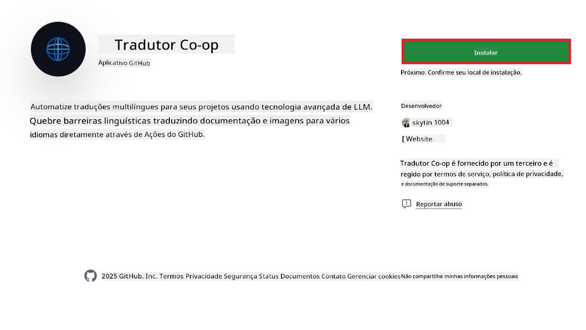
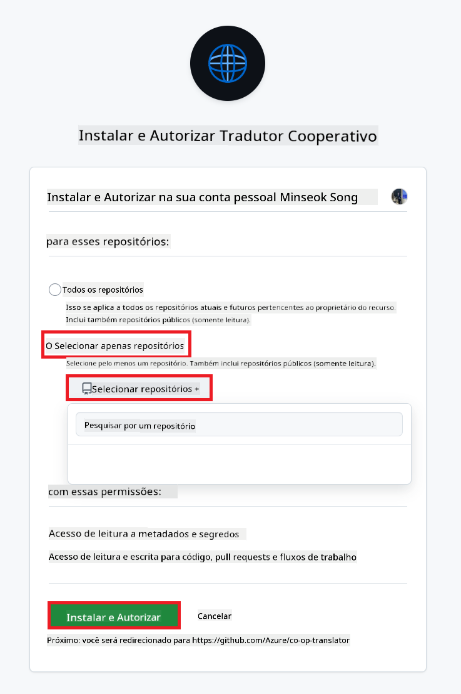
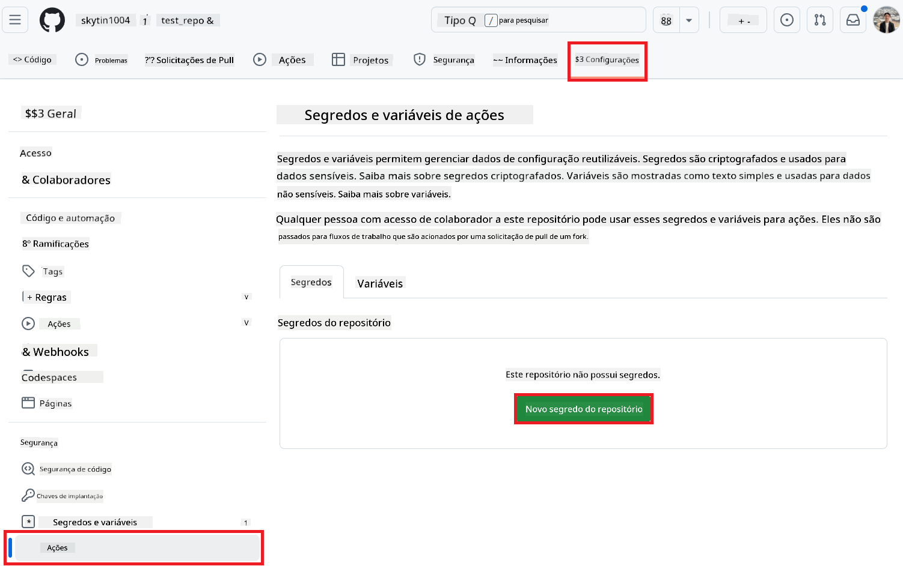
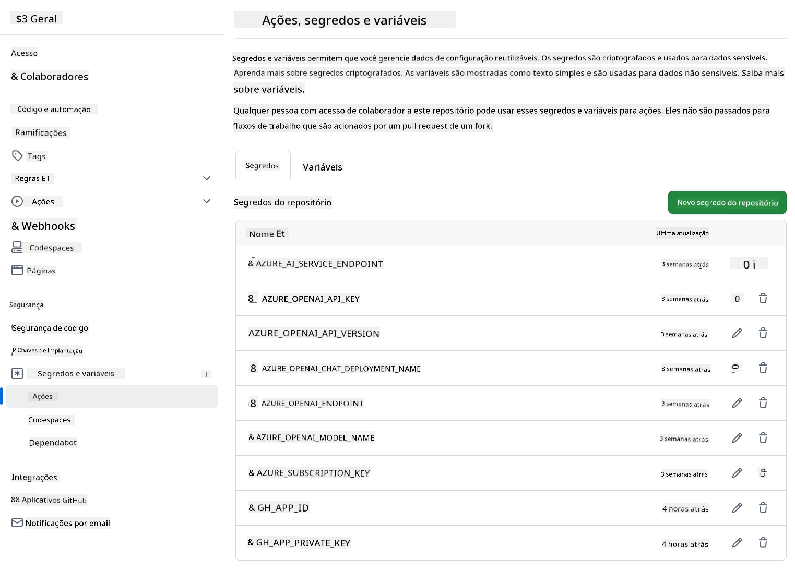

<!--
CO_OP_TRANSLATOR_METADATA:
{
  "original_hash": "c437820027c197f25fb2cbee95bae28c",
  "translation_date": "2025-06-12T19:08:17+00:00",
  "source_file": "getting_started/github-actions-guide/github-actions-guide-org.md",
  "language_code": "br"
}
-->
# Usando a Ação Co-op Translator do GitHub (Guia para Organizações)

**Público-alvo:** Este guia é destinado a **usuários internos da Microsoft** ou **times que possuem acesso às credenciais necessárias para o Co-op Translator GitHub App pré-construído** ou que podem criar seu próprio GitHub App personalizado.

Automatize a tradução da documentação do seu repositório de forma simples usando a Ação Co-op Translator do GitHub. Este guia explica como configurar a ação para criar automaticamente pull requests com traduções atualizadas sempre que seus arquivos Markdown fonte ou imagens forem alterados.

> [!IMPORTANT]
> 
> **Escolhendo o Guia Certo:**
>
> Este guia detalha a configuração usando um **GitHub App ID e uma Chave Privada**. Normalmente, você precisa deste método "Guia para Organizações" se: **`GITHUB_TOKEN` Permissões são Restritas:** As configurações da sua organização ou repositório limitam as permissões padrão concedidas ao `GITHUB_TOKEN` padrão. Especificamente, se o `GITHUB_TOKEN` não tem as permissões `write` necessárias (como `contents: write` ou `pull-requests: write`), o fluxo de trabalho do [Guia Público de Configuração](./github-actions-guide-public.md) falhará devido a permissões insuficientes. Usar um GitHub App dedicado com permissões explicitamente concedidas contorna essa limitação.
>
> **Se isso não se aplica a você:**
>
> Se o `GITHUB_TOKEN` padrão tem permissões suficientes no seu repositório (ou seja, você não está bloqueado por restrições organizacionais), use o **[Guia Público de Configuração usando GITHUB_TOKEN](./github-actions-guide-public.md)**. O guia público não exige obtenção ou gerenciamento de App IDs ou Chaves Privadas e depende apenas do `GITHUB_TOKEN` padrão e permissões do repositório.

## Pré-requisitos

Antes de configurar a Ação do GitHub, certifique-se de ter as credenciais necessárias dos serviços de IA.

**1. Obrigatório: Credenciais do Modelo de Linguagem AI**  
Você precisa de credenciais para pelo menos um Modelo de Linguagem suportado:

- **Azure OpenAI**: Requer Endpoint, Chave de API, Nomes do Modelo/Implantação, Versão da API.  
- **OpenAI**: Requer Chave de API, (Opcional: ID da Organização, URL Base, ID do Modelo).  
- Veja [Modelos e Serviços Suportados](../../../../README.md) para mais detalhes.  
- Guia de Configuração: [Configurar Azure OpenAI](../set-up-resources/set-up-azure-openai.md).

**2. Opcional: Credenciais de Visão Computacional (para Tradução de Imagens)**

- Necessário somente se precisar traduzir texto dentro de imagens.  
- **Azure Computer Vision**: Requer Endpoint e Chave de Assinatura.  
- Se não fornecido, a ação usará o [modo somente Markdown](../markdown-only-mode.md) por padrão.  
- Guia de Configuração: [Configurar Azure Computer Vision](../set-up-resources/set-up-azure-computer-vision.md).

## Configuração

Siga estes passos para configurar a Ação Co-op Translator no seu repositório:

### Passo 1: Instalar e Configurar a Autenticação do GitHub App

O fluxo de trabalho usa autenticação via GitHub App para interagir com segurança no seu repositório (por exemplo, criar pull requests) em seu nome. Escolha uma opção:

#### **Opção A: Instalar o GitHub App Co-op Translator Pré-construído (uso interno Microsoft)**

1. Acesse a página do [GitHub App Co-op Translator](https://github.com/apps/co-op-translator).

1. Selecione **Instalar** e escolha a conta ou organização onde seu repositório alvo está localizado.

    

1. Escolha **Selecionar apenas repositórios** e selecione seu repositório alvo (ex.: `PhiCookBook`). Clique em **Instalar**. Pode ser solicitado que você se autentique.

    

1. **Obtenha as Credenciais do App (Processo Interno Necessário):** Para que o fluxo de trabalho autentique como o app, você precisa de duas informações fornecidas pela equipe do Co-op Translator:  
  - **App ID:** O identificador único do app Co-op Translator. O App ID é: `1164076`.  
  - **Chave Privada:** Você deve obter o **conteúdo completo** do arquivo de chave privada `.pem` com o contato mantenedor. **Trate essa chave como uma senha e mantenha-a segura.**

1. Prossiga para o Passo 2.

#### **Opção B: Use Seu Próprio GitHub App Personalizado**

- Se preferir, você pode criar e configurar seu próprio GitHub App. Garanta que ele tenha acesso de Leitura e Escrita para Contents e Pull requests. Você precisará do App ID e de uma Chave Privada gerada.

### Passo 2: Configurar Segredos do Repositório

Você precisa adicionar as credenciais do GitHub App e as credenciais do serviço de IA como segredos criptografados nas configurações do seu repositório.

1. Acesse seu repositório alvo no GitHub (ex.: `PhiCookBook`).

1. Vá em **Configurações** > **Segredos e variáveis** > **Ações**.

1. Em **Segredos do repositório**, clique em **Novo segredo do repositório** para cada segredo listado abaixo.

   

**Segredos Obrigatórios (para Autenticação do GitHub App):**

| Nome do Segredo          | Descrição                                       | Fonte do Valor                                   |
| :----------------------- | :---------------------------------------------- | :----------------------------------------------- |
| `GH_APP_ID`       | O App ID do GitHub App (do Passo 1).            | Configurações do GitHub App                      |
| `GH_APP_PRIVATE_KEY`       | O **conteúdo completo** do arquivo `.pem` baixado. | Arquivo `.pem` (do Passo 1)          |

**Segredos do Serviço de IA (Adicione TODOS que se aplicam conforme seus Pré-requisitos):**

| Nome do Segredo              | Descrição                                   | Fonte do Valor                     |
| :--------------------------- | :------------------------------------------ | :-------------------------------- |
| `AZURE_SUBSCRIPTION_KEY`           | Chave para Azure AI Service (Visão Computacional) | Azure AI Foundry                  |
| `AZURE_AI_SERVICE_ENDPOINT`           | Endpoint para Azure AI Service (Visão Computacional) | Azure AI Foundry                  |
| `AZURE_OPENAI_API_KEY`           | Chave para serviço Azure OpenAI             | Azure AI Foundry                  |
| `AZURE_OPENAI_ENDPOINT`           | Endpoint para serviço Azure OpenAI           | Azure AI Foundry                  |
| `AZURE_OPENAI_MODEL_NAME`           | Nome do seu Modelo Azure OpenAI               | Azure AI Foundry                  |
| `AZURE_OPENAI_CHAT_DEPLOYMENT_NAME`           | Nome da sua Implantação Azure OpenAI          | Azure AI Foundry                  |
| `AZURE_OPENAI_API_VERSION`           | Versão da API para Azure OpenAI                | Azure AI Foundry                  |
| `OPENAI_API_KEY`           | Chave da API para OpenAI                        | Plataforma OpenAI                 |
| `OPENAI_ORG_ID`           | ID da Organização OpenAI                        | Plataforma OpenAI                 |
| `OPENAI_CHAT_MODEL_ID`           | ID do modelo específico OpenAI                   | Plataforma OpenAI                 |
| `OPENAI_BASE_URL`           | URL Base personalizada da API OpenAI              | Plataforma OpenAI                 |



### Passo 3: Criar o Arquivo de Workflow

Por fim, crie o arquivo YAML que define o fluxo de trabalho automatizado.

1. No diretório raiz do seu repositório, crie o diretório `.github/workflows/`, caso ele não exista.

1. Dentro de `.github/workflows/`, crie um arquivo chamado `co-op-translator.yml`.

1. Cole o conteúdo abaixo no arquivo co-op-translator.yml.

```
name: Co-op Translator

on:
  push:
    branches:
      - main

jobs:
  co-op-translator:
    runs-on: ubuntu-latest

    permissions:
      contents: write
      pull-requests: write

    steps:
      - name: Checkout repository
        uses: actions/checkout@v4
        with:
          fetch-depth: 0

      - name: Set up Python
        uses: actions/setup-python@v4
        with:
          python-version: '3.10'

      - name: Install Co-op Translator
        run: |
          python -m pip install --upgrade pip
          pip install co-op-translator

      - name: Run Co-op Translator
        env:
          PYTHONIOENCODING: utf-8
          # Azure AI Service Credentials
          AZURE_SUBSCRIPTION_KEY: ${{ secrets.AZURE_SUBSCRIPTION_KEY }}
          AZURE_AI_SERVICE_ENDPOINT: ${{ secrets.AZURE_AI_SERVICE_ENDPOINT }}

          # Azure OpenAI Credentials
          AZURE_OPENAI_API_KEY: ${{ secrets.AZURE_OPENAI_API_KEY }}
          AZURE_OPENAI_ENDPOINT: ${{ secrets.AZURE_OPENAI_ENDPOINT }}
          AZURE_OPENAI_MODEL_NAME: ${{ secrets.AZURE_OPENAI_MODEL_NAME }}
          AZURE_OPENAI_CHAT_DEPLOYMENT_NAME: ${{ secrets.AZURE_OPENAI_CHAT_DEPLOYMENT_NAME }}
          AZURE_OPENAI_API_VERSION: ${{ secrets.AZURE_OPENAI_API_VERSION }}

          # OpenAI Credentials
          OPENAI_API_KEY: ${{ secrets.OPENAI_API_KEY }}
          OPENAI_ORG_ID: ${{ secrets.OPENAI_ORG_ID }}
          OPENAI_CHAT_MODEL_ID: ${{ secrets.OPENAI_CHAT_MODEL_ID }}
          OPENAI_BASE_URL: ${{ secrets.OPENAI_BASE_URL }}
        run: |
          # =====================================================================
          # IMPORTANT: Set your target languages here (REQUIRED CONFIGURATION)
          # =====================================================================
          # Example: Translate to Spanish, French, German. Add -y to auto-confirm.
          translate -l "es fr de" -y  # <--- MODIFY THIS LINE with your desired languages

      - name: Authenticate GitHub App
        id: generate_token
        uses: tibdex/github-app-token@v1
        with:
          app_id: ${{ secrets.GH_APP_ID }}
          private_key: ${{ secrets.GH_APP_PRIVATE_KEY }}

      - name: Create Pull Request with translations
        uses: peter-evans/create-pull-request@v5
        with:
          token: ${{ steps.generate_token.outputs.token }}
          commit-message: "🌐 Update translations via Co-op Translator"
          title: "🌐 Update translations via Co-op Translator"
          body: |
            This PR updates translations for recent changes to the main branch.

            ### 📋 Changes included
            - Translated contents are available in the `translations/` directory
            - Translated images are available in the `translated_images/` directory

            ---
            🌐 Automatically generated by the [Co-op Translator](https://github.com/Azure/co-op-translator) GitHub Action.
          branch: update-translations
          base: main
          labels: translation, automated-pr
          delete-branch: true
          add-paths: |
            translations/
            translated_images/

```

4.  **Personalize o Workflow:**  
  - **[!IMPORTANT] Idiomas Alvo:** No comando `Run Co-op Translator` step, you **MUST review and modify the list of language codes** within the `translate -l "..." -y` command to match your project's requirements. The example list (`ar de es...`) needs to be replaced or adjusted.
  - **Trigger (`on:`):** The current trigger runs on every push to `main`. For large repositories, consider adding a `paths:` filter (see commented example in the YAML) to run the workflow only when relevant files (e.g., source documentation) change, saving runner minutes.
  - **PR Details:** Customize the `commit-message`, `title`, `body`, `branch` name, and `labels` in the `Create Pull Request` step if needed.

## Credential Management and Renewal

- **Security:** Always store sensitive credentials (API keys, private keys) as GitHub Actions secrets. Never expose them in your workflow file or repository code.
- **[!IMPORTANT] Key Renewal (Internal Microsoft Users):** Be aware that Azure OpenAI key used within Microsoft might have a mandatory renewal policy (e.g., every 5 months). Ensure you update the corresponding GitHub secrets (`AZURE_OPENAI_...` configure os idiomas desejados **antes que as credenciais expirem** para evitar falhas no fluxo de trabalho.

## Executando o Workflow

Assim que o arquivo `co-op-translator.yml` for mesclado na sua branch principal (ou na branch especificada no filtro `on:` trigger), the workflow will automatically run whenever changes are pushed to that branch (and match the `paths`, se configurado), 

Se traduções forem geradas ou atualizadas, a ação criará automaticamente um Pull Request com as mudanças, pronto para sua revisão e merge.

**Aviso Legal**:  
Este documento foi traduzido utilizando o serviço de tradução por IA [Co-op Translator](https://github.com/Azure/co-op-translator). Embora nos esforcemos para garantir a precisão, esteja ciente de que traduções automáticas podem conter erros ou imprecisões. O documento original em seu idioma nativo deve ser considerado a fonte autorizada. Para informações críticas, recomenda-se tradução profissional humana. Não nos responsabilizamos por quaisquer mal-entendidos ou interpretações incorretas decorrentes do uso desta tradução.