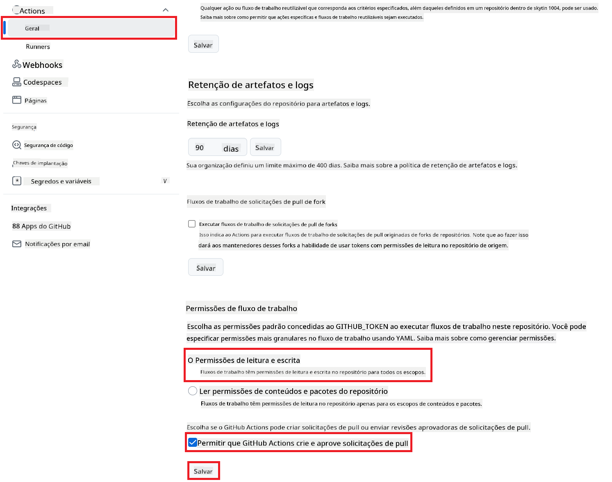

<!--
CO_OP_TRANSLATOR_METADATA:
{
  "original_hash": "a52587a512e667f70d92db853d3c61d5",
  "translation_date": "2025-06-12T19:27:18+00:00",
  "source_file": "getting_started/github-actions-guide/github-actions-guide-public.md",
  "language_code": "br"
}
-->
# Usando a GitHub Action do Co-op Translator (Configuração Pública)

**Público-alvo:** Este guia é destinado a usuários da maioria dos repositórios públicos ou privados onde as permissões padrão do GitHub Actions são suficientes. Ele utiliza o `GITHUB_TOKEN` embutido.

Automatize a tradução da documentação do seu repositório de forma simples usando a GitHub Action do Co-op Translator. Este guia mostra como configurar a action para criar automaticamente pull requests com traduções atualizadas sempre que seus arquivos Markdown fonte ou imagens forem alterados.

> [!IMPORTANT]
>
> **Escolhendo o Guia Certo:**
>
> Este guia detalha a **configuração mais simples usando o `GITHUB_TOKEN` padrão**. Este é o método recomendado para a maioria dos usuários, pois não exige gerenciar chaves privadas sensíveis do GitHub App.
>

## Pré-requisitos

Antes de configurar a GitHub Action, certifique-se de que você tem as credenciais necessárias dos serviços de IA.

**1. Obrigatório: Credenciais do Modelo de Linguagem de IA**  
Você precisa de credenciais para pelo menos um Modelo de Linguagem suportado:

- **Azure OpenAI**: Requer Endpoint, Chave da API, Nomes do Modelo/Implantação, Versão da API.  
- **OpenAI**: Requer Chave da API, (Opcional: ID da Organização, URL Base, ID do Modelo).  
- Veja [Modelos e Serviços Suportados](../../../../README.md) para mais detalhes.

**2. Opcional: Credenciais de Visão por IA (para Tradução de Imagens)**

- Necessário apenas se você precisar traduzir texto dentro de imagens.  
- **Azure AI Vision**: Requer Endpoint e Chave de Assinatura.  
- Caso não sejam fornecidas, a action usará o [modo apenas Markdown](../markdown-only-mode.md).

## Configuração

Siga estes passos para configurar a GitHub Action do Co-op Translator no seu repositório usando o `GITHUB_TOKEN` padrão.

### Passo 1: Entenda a Autenticação (Usando `GITHUB_TOKEN`)

Este workflow utiliza o `GITHUB_TOKEN` embutido fornecido pelo GitHub Actions. Este token concede automaticamente permissões ao workflow para interagir com seu repositório conforme as configurações definidas no **Passo 3**.

### Passo 2: Configure os Segredos do Repositório

Você só precisa adicionar suas **credenciais dos serviços de IA** como segredos criptografados nas configurações do repositório.

1. Acesse o repositório alvo no GitHub.  
2. Vá para **Settings** > **Secrets and variables** > **Actions**.  
3. Em **Repository secrets**, clique em **New repository secret** para cada segredo necessário listado abaixo.

 *(Referência da imagem: mostra onde adicionar segredos)*

**Segredos Obrigatórios dos Serviços de IA (adicione TODOS que se aplicam conforme seus pré-requisitos):**

| Nome do Segredo                     | Descrição                               | Fonte do Valor                  |
| :--------------------------------- | :------------------------------------ | :----------------------------- |
| `AZURE_SUBSCRIPTION_KEY`           | Chave para o Azure AI Service (Visão Computacional)  | Seu Azure AI Foundry            |
| `AZURE_AI_SERVICE_ENDPOINT`          | Endpoint para o Azure AI Service (Visão Computacional) | Seu Azure AI Foundry            |
| `AZURE_OPENAI_API_KEY`             | Chave para o serviço Azure OpenAI              | Seu Azure AI Foundry            |
| `AZURE_OPENAI_ENDPOINT`            | Endpoint para o serviço Azure OpenAI            | Seu Azure AI Foundry            |
| `AZURE_OPENAI_MODEL_NAME`          | Nome do Modelo Azure OpenAI                     | Seu Azure AI Foundry            |
| `AZURE_OPENAI_CHAT_DEPLOYMENT_NAME` | Nome da Implantação Azure OpenAI                 | Seu Azure AI Foundry            |
| `AZURE_OPENAI_API_VERSION`         | Versão da API para Azure OpenAI                  | Seu Azure AI Foundry            |
| `OPENAI_API_KEY`                 | Chave da API para OpenAI                       | Sua Plataforma OpenAI           |
| `OPENAI_ORG_ID`                  | ID da Organização OpenAI (Opcional)            | Sua Plataforma OpenAI           |
| `OPENAI_CHAT_MODEL_ID`             | ID específico do modelo OpenAI (Opcional)       | Sua Plataforma OpenAI           |
| `OPENAI_BASE_URL`                  | URL Base customizada da API OpenAI (Opcional)   | Sua Plataforma OpenAI           |

### Passo 3: Configure as Permissões do Workflow

A GitHub Action precisa das permissões concedidas via `GITHUB_TOKEN` para fazer checkout do código e criar pull requests.

1. No seu repositório, vá para **Settings** > **Actions** > **General**.  
2. Role até a seção **Workflow permissions**.  
3. Selecione **Read and write permissions**. Isso concede ao `GITHUB_TOKEN` as permissões necessárias de `contents: write` e `pull-requests: write` para este workflow.  
4. Certifique-se de que a caixa **Allow GitHub Actions to create and approve pull requests** esteja marcada.  
5. Clique em **Save**.



### Passo 4: Crie o Arquivo do Workflow

Por fim, crie o arquivo YAML que define o workflow automatizado usando `GITHUB_TOKEN`.

1. No diretório raiz do seu repositório, crie a pasta `.github/workflows/` caso ela não exista.  
2. Dentro de `.github/workflows/`, crie um arquivo chamado `co-op-translator.yml`.  
3. Cole o conteúdo abaixo dentro do `co-op-translator.yml`.

```yaml
name: Co-op Translator

on:
  push:
    branches:
      - main

jobs:
  co-op-translator:
    runs-on: ubuntu-latest

    permissions:
      contents: write
      pull-requests: write

    steps:
      - name: Checkout repository
        uses: actions/checkout@v4
        with:
          fetch-depth: 0

      - name: Set up Python
        uses: actions/setup-python@v4
        with:
          python-version: '3.10'

      - name: Install Co-op Translator
        run: |
          python -m pip install --upgrade pip
          pip install co-op-translator

      - name: Run Co-op Translator
        env:
          PYTHONIOENCODING: utf-8
          # === AI Service Credentials ===
          AZURE_SUBSCRIPTION_KEY: ${{ secrets.AZURE_SUBSCRIPTION_KEY }}
          AZURE_AI_SERVICE_ENDPOINT: ${{ secrets.AZURE_AI_SERVICE_ENDPOINT }}
          AZURE_OPENAI_API_KEY: ${{ secrets.AZURE_OPENAI_API_KEY }}
          AZURE_OPENAI_ENDPOINT: ${{ secrets.AZURE_OPENAI_ENDPOINT }}
          AZURE_OPENAI_MODEL_NAME: ${{ secrets.AZURE_OPENAI_MODEL_NAME }}
          AZURE_OPENAI_CHAT_DEPLOYMENT_NAME: ${{ secrets.AZURE_OPENAI_CHAT_DEPLOYMENT_NAME }}
          AZURE_OPENAI_API_VERSION: ${{ secrets.AZURE_OPENAI_API_VERSION }}
          OPENAI_API_KEY: ${{ secrets.OPENAI_API_KEY }}
          OPENAI_ORG_ID: ${{ secrets.OPENAI_ORG_ID }}
          OPENAI_CHAT_MODEL_ID: ${{ secrets.OPENAI_CHAT_MODEL_ID }}
          OPENAI_BASE_URL: ${{ secrets.OPENAI_BASE_URL }}
        run: |
          # =====================================================================
          # IMPORTANT: Set your target languages here (REQUIRED CONFIGURATION)
          # =====================================================================
          # Example: Translate to Spanish, French, German. Add -y to auto-confirm.
          translate -l "es fr de" -y  # <--- MODIFY THIS LINE with your desired languages

      - name: Create Pull Request with translations
        uses: peter-evans/create-pull-request@v5
        with:
          token: ${{ secrets.GITHUB_TOKEN }}
          commit-message: "🌐 Update translations via Co-op Translator"
          title: "🌐 Update translations via Co-op Translator"
          body: |
            This PR updates translations for recent changes to the main branch.

            ### 📋 Changes included
            - Translated contents are available in the `translations/` directory
            - Translated images are available in the `translated_images/` directory

            ---
            🌐 Automatically generated by the [Co-op Translator](https://github.com/Azure/co-op-translator) GitHub Action.
          branch: update-translations
          base: main
          labels: translation, automated-pr
          delete-branch: true
          add-paths: |
            translations/
            translated_images/
```  
4. **Personalize o Workflow:**  
  - **[!IMPORTANT] Idiomas de Destino:** No passo `Run Co-op Translator` step, you **MUST review and modify the list of language codes** within the `translate -l "..." -y` command to match your project's requirements. The example list (`ar de es...`) needs to be replaced or adjusted.
  - **Trigger (`on:`):** The current trigger runs on every push to `main`. For large repositories, consider adding a `paths:` filter (see commented example in the YAML) to run the workflow only when relevant files (e.g., source documentation) change, saving runner minutes.
  - **PR Details:** Customize the `commit-message`, `title`, `body`, `branch` name, and `labels` in the `Create Pull Request` ajuste se necessário.

**Aviso Legal**:  
Este documento foi traduzido utilizando o serviço de tradução automática [Co-op Translator](https://github.com/Azure/co-op-translator). Embora nos esforcemos para garantir a precisão, esteja ciente de que traduções automáticas podem conter erros ou imprecisões. O documento original em seu idioma nativo deve ser considerado a fonte autorizada. Para informações críticas, recomenda-se tradução profissional humana. Não nos responsabilizamos por quaisquer mal-entendidos ou interpretações incorretas decorrentes do uso desta tradução.