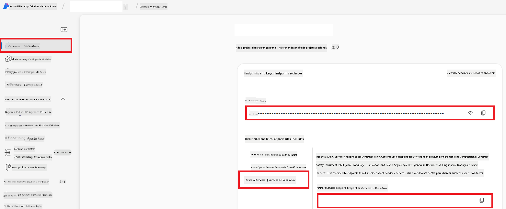

<!--
CO_OP_TRANSLATOR_METADATA:
{
  "original_hash": "b58d7c3cb4210697a073d20eb3064945",
  "translation_date": "2025-06-12T11:51:21+00:00",
  "source_file": "getting_started/set-up-azure-ai.md",
  "language_code": "br"
}
-->
# Set Up Azure AI for Co-op Translator (Azure OpneAI & Azure AI Vision)

Este guia orienta você na configuração do Azure OpenAI para tradução de idiomas e do Azure Computer Vision para análise de conteúdo de imagens (que pode ser usado para tradução baseada em imagens) dentro do Azure AI Foundry.

**Pré-requisitos:**
- Uma conta Azure com uma assinatura ativa.
- Permissões suficientes para criar recursos e implantações na sua assinatura Azure.

## Criar um Projeto Azure AI

Você começará criando um Projeto Azure AI, que funciona como um local central para gerenciar seus recursos de IA.

1. Acesse [https://ai.azure.com](https://ai.azure.com) e faça login com sua conta Azure.

1. Selecione **+Create** para criar um novo projeto.

1. Realize as seguintes tarefas:
   - Insira um **Nome do projeto** (ex.: `CoopTranslator-Project`).
   - Selecione o **AI hub** (ex.: `CoopTranslator-Hub`) (Crie um novo, se necessário).

1. Clique em "**Review and Create**" para configurar seu projeto. Você será levado à página de visão geral do projeto.

## Configurar Azure OpenAI para Tradução de Idiomas

Dentro do seu projeto, você implantará um modelo Azure OpenAI para servir como backend para tradução de texto.

### Navegue até Seu Projeto

Se ainda não estiver lá, abra seu projeto recém-criado (ex.: `CoopTranslator-Project`) no Azure AI Foundry.

### Implante um Modelo OpenAI

1. No menu à esquerda do seu projeto, em "My assets", selecione "**Models + endpoints**".

1. Selecione **+ Deploy model**.

1. Selecione **Deploy Base Model**.

1. Você verá uma lista de modelos disponíveis. Filtre ou busque por um modelo GPT adequado. Recomendamos `gpt-4o`.

1. Selecione o modelo desejado e clique em **Confirm**.

1. Selecione **Deploy**.

### Configuração do Azure OpenAI

Após a implantação, você pode selecionar a implantação na página "**Models + endpoints**" para encontrar seu **REST endpoint URL**, **Key**, **Deployment name**, **Model name** e **API version**. Esses dados serão necessários para integrar o modelo de tradução ao seu aplicativo.

> [!NOTE]
> Você pode escolher versões da API na página [API version deprecation](https://learn.microsoft.com/azure/ai-services/openai/api-version-deprecation) conforme suas necessidades. Lembre-se que a **API version** é diferente da **Model version** exibida na página **Models + endpoints** no Azure AI Foundry.

## Configurar Azure Computer Vision para Tradução de Imagens

Para permitir a tradução de texto dentro de imagens, você precisa localizar a Chave de API e o Endpoint do Azure AI Service.

1. Acesse seu Projeto Azure AI (ex.: `CoopTranslator-Project`). Certifique-se de estar na página de visão geral do projeto.

### Configuração do Azure AI Service

Encontre a Chave de API e o Endpoint no Azure AI Service.

1. Acesse seu Projeto Azure AI (ex.: `CoopTranslator-Project`). Certifique-se de estar na página de visão geral do projeto.

1. Localize a **API Key** e o **Endpoint** na aba do Azure AI Service.

    

Essa conexão disponibiliza as funcionalidades do recurso vinculado do Azure AI Services (incluindo análise de imagens) para seu projeto no AI Foundry. Assim, você pode usar essa conexão em seus notebooks ou aplicativos para extrair texto de imagens, que pode ser enviado ao modelo Azure OpenAI para tradução.

## Consolidando Suas Credenciais

Até aqui, você deve ter reunido o seguinte:

**Para Azure OpenAI (Tradução de Texto):**
- Azure OpenAI Endpoint
- Azure OpenAI API Key
- Azure OpenAI Model Name (ex.: `gpt-4o`)
- Azure OpenAI Deployment Name (ex.: `cooptranslator-gpt4o`)
- Azure OpenAI API Version

**Para Azure AI Services (Extração de Texto de Imagens via Vision):**
- Azure AI Service Endpoint
- Azure AI Service API Key

### Exemplo: Configuração de Variáveis de Ambiente (Preview)

Mais tarde, ao construir seu aplicativo, você provavelmente configurará essas credenciais como variáveis de ambiente, por exemplo:

```bash
# Azure AI Service Credentials (Required for image translation)
AZURE_AI_SERVICE_API_KEY="your_azure_ai_service_api_key" # e.g., 21xasd...
AZURE_AI_SERVICE_ENDPOINT="https://your_azure_ai_service_endpoint.cognitiveservices.azure.com/"

# Azure OpenAI Credentials (Required for text translation)
AZURE_OPENAI_API_KEY="your_azure_openai_api_key" # e.g., 21xasd...
AZURE_OPENAI_ENDPOINT="https://your_azure_openai_endpoint.openai.azure.com/"
AZURE_OPENAI_MODEL_NAME="your_model_name" # e.g., gpt-4o
AZURE_OPENAI_CHAT_DEPLOYMENT_NAME="your_deployment_name" # e.g., cooptranslator-gpt4o
AZURE_OPENAI_API_VERSION="your_api_version" # e.g., 2024-12-01-preview
```

---

### Leituras Complementares

- [How to Create a project in Azure AI Foundry](https://learn.microsoft.com/azure/ai-foundry/how-to/create-projects?tabs=ai-studio)
- [How to Create Azure AI resources](https://learn.microsoft.com/azure/ai-foundry/how-to/create-azure-ai-resource?tabs=portal)
- [How to Deploy OpenAI models in Azure AI Foundry](https://learn.microsoft.com/en-us/azure/ai-foundry/how-to/deploy-models-openai)

**Aviso Legal**:  
Este documento foi traduzido utilizando o serviço de tradução por IA [Co-op Translator](https://github.com/Azure/co-op-translator). Embora nos esforcemos para garantir a precisão, esteja ciente de que traduções automáticas podem conter erros ou imprecisões. O documento original em seu idioma nativo deve ser considerado a fonte oficial. Para informações críticas, recomenda-se a tradução profissional humana. Não nos responsabilizamos por quaisquer mal-entendidos ou interpretações incorretas decorrentes do uso desta tradução.