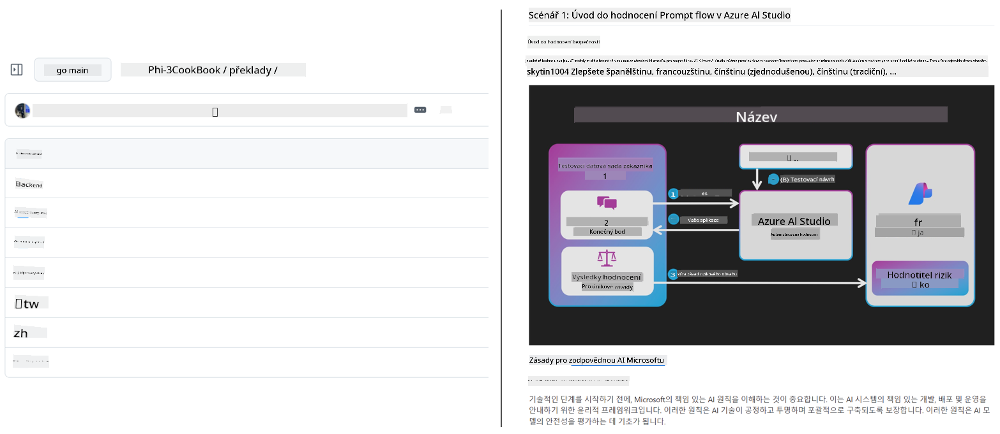
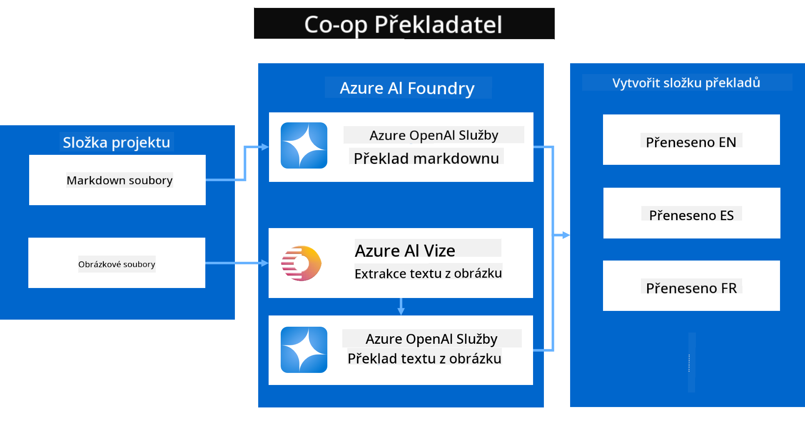
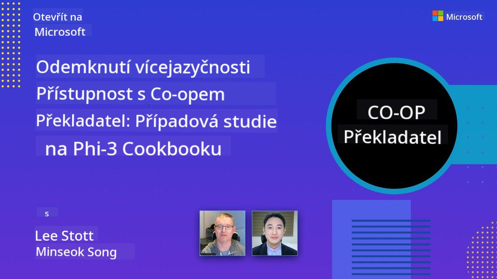

<!--
CO_OP_TRANSLATOR_METADATA:
{
  "original_hash": "044724537b57868117aadae8e7728c7c",
  "translation_date": "2025-06-12T10:48:12+00:00",
  "source_file": "README.md",
  "language_code": "cs"
}
-->


# Co-op Translator: Automatiza la traducción de documentación educativa sin esfuerzo

_Facilita la automatización de la traducción de tu documentación a múltiples idiomas para alcanzar una audiencia global._

[](https://pypi.org/project/co-op-translator/)
[](https://github.com/azure/co-op-translator/blob/main/LICENSE)
[](https://pepy.tech/project/co-op-translator)
[](https://pepy.tech/project/co-op-translator)
[](https://github.com/psf/black)

[](https://GitHub.com/azure/co-op-translator/graphs/contributors/)
[](https://GitHub.com/azure/co-op-translator/issues/)
[](https://GitHub.com/azure/co-op-translator/pulls/)
[](http://makeapullrequest.com)

### Soporte de idiomas impulsado por Co-op Translator

> [!NOTE]
> Estas son las traducciones actuales del contenido de este repositorio. Para una lista completa de los idiomas soportados por Co-op Translator, consulte la sección [Language Support](../..).

[](https://GitHub.com/azure/co-op-translator/watchers/)
[](https://GitHub.com/azure/co-op-translator/network/)
[](https://GitHub.com/azure/co-op-translator/stargazers/)

[](https://discord.com/invite/ByRwuEEgH4)

[](https://codespaces.new/azure/co-op-translator)
[](https://vscode.dev/redirect?url=vscode://ms-vscode-remote.remote-containers/cloneInVolume?url=https://github.com/azure/co-op-translator)

## Visión general: Simplifica la traducción de tu contenido educativo

Las barreras idiomáticas dificultan significativamente el acceso a recursos educativos valiosos y conocimientos técnicos para estudiantes y desarrolladores en todo el mundo. Esto limita la participación y ralentiza el ritmo de la innovación y el aprendizaje global.

**Co-op Translator** nació para resolver el proceso ineficiente de traducción manual de las grandes series educativas de Microsoft (como las guías "Para principiantes"). Se ha convertido en una herramienta potente y fácil de usar, diseñada para eliminar estas barreras para todos. Al ofrecer traducciones automáticas de alta calidad a través de CLI y GitHub Actions, Co-op Translator empodera a educadores, estudiantes, investigadores y desarrolladores en todo el mundo para compartir y acceder al conocimiento sin limitaciones de idioma.

Mira cómo Co-op Translator organiza el contenido educativo traducido:



Los archivos Markdown y el texto de las imágenes se traducen automáticamente y se organizan ordenadamente en carpetas específicas por idioma.

**¡Accede globalmente a tu contenido educativo con Co-op Translator hoy mismo!**

## Apoyando el acceso global a los recursos de aprendizaje de Microsoft

Co-op Translator ayuda a cerrar la brecha idiomática en iniciativas educativas clave de Microsoft, automatizando el proceso de traducción para repositorios que sirven a una comunidad global de desarrolladores. Algunos ejemplos que actualmente usan Co-op Translator incluyen:

[](https://github.com/microsoft/Generative-AI-for-beginners)
[](https://github.com/microsoft/ML-For-Beginners)
[](https://github.com/microsoft/AI-For-Beginners)
[](https://github.com/microsoft/ai-agents-for-beginners)
[](https://github.com/microsoft/PhiCookBook)
[](https://github.com/microsoft/Generative-AI-for-beginners-dotnet)

## Características principales

- **Traducciones automáticas**: Traduce texto a múltiples idiomas sin esfuerzo.
- **Integración con GitHub Actions**: Automatiza las traducciones como parte de tu pipeline CI/CD.
- **Preservación de Markdown**: Mantiene la sintaxis Markdown correcta durante la traducción.
- **Traducción de texto en imágenes**: Extrae y traduce el texto contenido en imágenes.
- **Tecnología avanzada LLM**: Utiliza modelos de lenguaje de última generación para traducciones de alta calidad.
- **Integración sencilla**: Se integra fácilmente con la configuración actual de tu proyecto.
- **Simplifica la localización**: Facilita el proceso de adaptar tu proyecto para mercados internacionales.

## Cómo funciona



Co-op Translator toma archivos Markdown e imágenes de la carpeta de tu proyecto y los procesa así:

1. **Extracción de texto**: Extrae texto de archivos Markdown y, si está configurado (por ejemplo, con Azure AI Vision), también del texto embebido en imágenes.
1. **Traducción con IA**: Envía el texto extraído al modelo LLM configurado (Azure OpenAI, OpenAI, etc.) para traducirlo.
1. **Guardado de resultados**: Guarda los archivos Markdown traducidos y las imágenes (con texto traducido) en carpetas específicas por idioma, preservando el formato original.

## Primeros pasos

Comienza rápidamente con la CLI o configura la automatización completa con GitHub Actions. Elige el método que mejor se adapte a tu flujo de trabajo:

1. **Línea de comandos (CLI)** - Para traducciones puntuales o control manual
2. **GitHub Actions** - Para traducciones automáticas en cada push

> [!NOTE]
> Aunque este tutorial se centra en recursos de Azure, puedes usar cualquier modelo de lenguaje compatible.

### Soporte de idiomas

Co-op Translator soporta una amplia variedad de idiomas para ayudarte a llegar a una audiencia global. Esto es lo que necesitas saber:

#### Referencia rápida

| Idioma | Código | Idioma | Código | Idioma | Código |
|--------|--------|--------|--------|--------|--------|
| Árabe | ar | Bengalí | bn | Búlgaro | bg |
| Birmano (Myanmar) | my | Chino (Simplificado) | zh | Chino (Tradicional, HK) | hk |
| Chino (Tradicional, Macau) | mo | Chino (Tradicional, TW) | tw | Croata | hr |
| Checo | cs | Danés | da | Neerlandés | nl |
| Finés | fi | Francés | fr | Alemán | de |
| Griego | el | Hebreo | he | Hindi | hi |
| Húngaro | hu | Indonesio | id | Italiano | it |
| Japonés | ja | Coreano | ko | Malayo | ms |
| Marathi | mr | Nepalí | ne | Noruego | no |
| Persa (Farsi) | fa | Polaco | pl | Portugués (Brasil) | br |
| Portugués (Portugal) | pt | Punjabi (Gurmukhi) | pa | Rumano | ro |
| Ruso | ru | Serbio (Cirílico) | sr | Eslovaco | sk |
| Esloveno | sl | Español | es | Swahili | sw |
| Sueco | sv | Tagalo (Filipino) | tl | Tailandés | th |
| Turco | tr | Ucraniano | uk | Urdu | ur |
| Vietnamita | vi | — | — | — | — |

#### Uso de códigos de idioma

Al usar Co-op Translator, deberás especificar los idiomas con sus códigos. Por ejemplo:

```bash
# Translate to French, Spanish, and German
translate -l "fr es de"

# Translate to Chinese (Simplified) and Japanese
translate -l "zh ja"
```

> [!NOTE]
> Para información técnica detallada sobre el soporte de idiomas, incluyendo:
>
> - Especificaciones de fuentes para cada idioma
> - Problemas conocidos
> - Cómo agregar nuevos idiomas
>
> Consulta nuestra [Documentación de idiomas soportados](./getting_started/supported-languages.md).

### Modelos y servicios soportados

| Tipo                  | Nombre                           |
|-----------------------|--------------------------------|
| Modelo de lenguaje    |   |
| Visión AI             |  |

> [!NOTE]
> Si un servicio de visión AI no está disponible, el co-op translator cambiará automáticamente al [modo solo Markdown](./getting_started/markdown-only-mode.md).

### Configuración inicial

Antes de comenzar, necesitas configurar los siguientes recursos:

1. Recurso de modelo de lenguaje (Obligatorio):
   - Azure OpenAI (Recomendado) - Ofrece traducciones de alta calidad con fiabilidad empresarial
   - OpenAI - Opción alternativa si no tienes acceso a Azure
   - Para información detallada sobre modelos soportados, consulta [Modelos y servicios soportados](../..)

1. Recurso de Visión AI (Opcional):
   - Azure AI Vision - Permite traducir texto dentro de imágenes
   - Si no está configurado, el traductor usará automáticamente el [modo solo Markdown](./getting_started/markdown-only-mode.md)
   - Recomendado para proyectos con imágenes que contienen texto a traducir

1. Pasos de configuración:
   - Sigue nuestra [guía de configuración de Azure AI](./getting_started/set-up-azure-ai.md) para instrucciones detalladas
   - Crea un archivo `.env` con tus claves API y endpoints (consulta la sección [Quick Start](../..))
   - Asegúrate de tener los permisos y cuotas necesarios para los servicios elegidos

### Preparación del proyecto antes de traducir

Antes de iniciar la traducción, sigue estos pasos para preparar tu proyecto:

1. Prepara tu README:
   - Añade una tabla de traducciones en tu README.md para enlazar las versiones traducidas
   - Formato de ejemplo:

     ```markdown

     ### 🌐 Multi-Language Support
     
     [French](../fr/README.md) | [Spanish](../es/README.md) | [German](../de/README.md) | [Russian](../ru/README.md) | [Arabic](../ar/README.md) | [Persian (Farsi)](../fa/README.md) | [Urdu](../ur/README.md) | [Chinese (Simplified)](../zh/README.md) | [Chinese (Traditional, Macau)](../mo/README.md) | [Chinese (Traditional, Hong Kong)](../hk/README.md) | [Chinese (Traditional, Taiwan)](../tw/README.md) | [Japanese](../ja/README.md) | [Korean](../ko/README.md) | [Hindi](../hi/README.md) | [Bengali](../bn/README.md) | [Marathi](../mr/README.md) | [Nepali](../ne/README.md) | [Punjabi (Gurmukhi)](../pa/README.md) | [Portuguese (Portugal)](../pt/README.md) | [Portuguese (Brazil)](../br/README.md) | [Italian](../it/README.md) | [Polish](../pl/README.md) | [Turkish](../tr/README.md) | [Greek](../el/README.md) | [Thai](../th/README.md) | [Swedish](../sv/README.md) | [Danish](../da/README.md) | [Norwegian](../no/README.md) | [Finnish](../fi/README.md) | [Dutch](../nl/README.md) | [Hebrew](../he/README.md) | [Vietnamese](../vi/README.md) | [Indonesian](../id/README.md) | [Malay](../ms/README.md) | [Tagalog (Filipino)](../tl/README.md) | [Swahili](../sw/README.md) | [Hungarian](../hu/README.md) | [Czech](./README.md) | [Slovak](../sk/README.md) | [Romanian](../ro/README.md) | [Bulgarian](../bg/README.md) | [Serbian (Cyrillic)](../sr/README.md) | [Croatian](../hr/README.md) | [Slovenian](../sl/README.md) | [Ukrainian](../uk/README.md) | [Burmese (Myanmar)](../my/README.md) 
    
     ```

1. Limpia traducciones existentes (si es necesario):
   - Elimina cualquier carpeta de traducciones existente (por ejemplo, `translations/`)
   - Borra archivos de traducción antiguos para comenzar desde cero
   - Esto evita conflictos con el nuevo proceso de traducción

### Inicio rápido: Línea de comandos

Para empezar rápido usando la línea de comandos:

1. Crea un entorno virtual:

    ```bash
    python -m venv .venv
    ```

1. Activa el entorno virtual:

    - En Windows:

    ```bash
    .venv\scripts\activate
    ```

    - En Linux/macOS:

    ```bash
    source .venv/bin/activate
    ```

1. Instala el paquete:

    ```bash
    pip install co-op-translator
    ```

1. Configura las credenciales:

    - Crea un archivo `.env` file in your project's root directory.
    - Copy the contents from the [.env.template](../../.env.template) file into your new `.env` file.
    - Fill in the required API keys and endpoint information in your `.env` file.

1. Run Translation:
    - Navigate to your project's root directory in your terminal.
    - Execute the translate command, specifying target languages with the `-l` con la bandera:

    ```bash
    translate -l "ko ja fr"
    ```

    _(Reemplaza `"ko ja fr"` with your desired space-separated language codes)_

### Detailed Usage Guides

Choose the approach that best fits your workflow:

#### 1. Using the Command Line (CLI)

- Best for: One-time translations, manual control, or integration into custom scripts.
- Requires: Local installation of Python and the `co-op-translator` package.
- Guide: [Command Line Guide](./getting_started/command-line-guide/command-line-guide.md)

#### 2. Using GitHub Actions (Automation)

- Best for: Automatically translating content whenever changes are pushed to your repository. Keeps translations consistently up-to-date.
- Requires: Setting up a workflow file (`.github/workflows`) en tu repositorio. No se requiere instalación local.
- Guías:
  - [Guía de GitHub Actions (Repositorios públicos y secretos estándar)](./getting_started/github-actions-guide/github-actions-guide-public.md) - Úsala para la mayoría de repositorios públicos o personales que usan secretos estándar.
  - [Guía de GitHub Actions (Repositorios de Microsoft y configuraciones a nivel organización)](./getting_started/github-actions-guide/github-actions-guide-org.md) - Úsala si trabajas dentro de la organización Microsoft en GitHub o necesitas usar secretos o runners a nivel organización.

### Solución de problemas y consejos

- [Guía de solución de problemas](./getting_started/troubleshooting.md)

### Recursos adicionales

- [Referencia de comandos](./getting_started/command-reference.md): Guía detallada de todos los comandos y opciones disponibles.
- [Idiomas soportados](./getting_started/supported-languages.md): Consulta la lista de idiomas soportados e instrucciones para agregar nuevos.
- [Modo solo Markdown](./getting_started/markdown-only-mode.md): Cómo traducir solo texto, sin traducción de imágenes.

## Presentaciones en video

Conoce más sobre Co-op Translator a través de nuestras presentaciones _(Haz clic en la imagen para ver en YouTube.)_:

- **Open at Microsoft**: Una breve introducción de 18 minutos y guía rápida sobre cómo usar Co-op Translator.
[](https://www.youtube.com/watch?v=jX_swfH_KNU)

## Поддержите нас и способствуйте глобальному обучению

Присоединяйтесь к нам в революции обмена образовательным контентом по всему миру! Поставьте ⭐ проекту [Co-op Translator](https://github.com/azure/co-op-translator) на GitHub и поддержите нашу миссию по устранению языковых барьеров в обучении и технологиях. Ваш интерес и вклад имеют большое значение! Мы всегда рады вашим кодовым предложениям и идеям по улучшению.

## Вклад в проект

Этот проект приветствует ваши предложения и участие. Хотите внести вклад в Azure Co-op Translator? Пожалуйста, ознакомьтесь с нашими [CONTRIBUTING.md](./CONTRIBUTING.md), где описаны рекомендации о том, как вы можете помочь сделать Co-op Translator более доступным.

## Участники

[](https://github.com/Azure/co-op-translator/graphs/contributors)

## Кодекс поведения

В этом проекте принят [Microsoft Open Source Code of Conduct](https://opensource.microsoft.com/codeofconduct/).  
Для дополнительной информации смотрите [FAQ по Кодексу поведения](https://opensource.microsoft.com/codeofconduct/faq/) или  
свяжитесь по адресу [opencode@microsoft.com](mailto:opencode@microsoft.com) с любыми вопросами или комментариями.

## Ответственный ИИ

Microsoft стремится помогать нашим клиентам использовать наши AI-продукты ответственно, делиться накопленными знаниями и строить доверительные партнерства с помощью таких инструментов, как Transparency Notes и Impact Assessments. Многие из этих ресурсов доступны по адресу [https://aka.ms/RAI](https://aka.ms/RAI).  
Подход Microsoft к ответственному ИИ основан на принципах справедливости, надежности и безопасности, конфиденциальности и защите данных, инклюзивности, прозрачности и подотчетности.

Крупномасштабные модели для обработки естественного языка, изображений и речи — подобные тем, что используются в этом примере — могут иногда вести себя несправедливо, ненадежно или оскорбительно, что может привести к негативным последствиям. Пожалуйста, ознакомьтесь с [Azure OpenAI service Transparency note](https://learn.microsoft.com/legal/cognitive-services/openai/transparency-note?tabs=text), чтобы быть в курсе рисков и ограничений.

Рекомендуемый способ снижения этих рисков — включить в архитектуру систему безопасности, способную обнаруживать и предотвращать вредоносное поведение. [Azure AI Content Safety](https://learn.microsoft.com/azure/ai-services/content-safety/overview) предоставляет независимый уровень защиты, который позволяет выявлять вредоносный контент, созданный пользователями и AI, в приложениях и сервисах. Azure AI Content Safety включает API для работы с текстом и изображениями, позволяющие обнаруживать опасный материал. Также доступна интерактивная Content Safety Studio, которая позволяет просматривать, исследовать и тестировать пример кода для обнаружения вредоносного контента в различных форматах. Следующая [документация для быстрого старта](https://learn.microsoft.com/azure/ai-services/content-safety/quickstart-text?tabs=visual-studio%2Clinux&pivots=programming-language-rest) поможет вам сделать запросы к сервису.

Еще один важный аспект — общая производительность приложения. В многоформатных и многомодельных приложениях под производительностью понимается соответствие системы ожиданиям вас и ваших пользователей, включая отсутствие генерации вредоносного контента. Важно оценивать производительность вашего приложения с помощью [метрик качества генерации и рисков безопасности](https://learn.microsoft.com/azure/ai-studio/concepts/evaluation-metrics-built-in).

Вы можете оценить свое AI-приложение в среде разработки с помощью [prompt flow SDK](https://microsoft.github.io/promptflow/index.html). Используя тестовые наборы данных или целевые показатели, ваши генерации ИИ количественно оцениваются встроенными или кастомными оценщиками. Чтобы начать работу с prompt flow SDK для оценки вашей системы, следуйте [руководству для быстрого старта](https://learn.microsoft.com/azure/ai-studio/how-to/develop/flow-evaluate-sdk). После выполнения оценки вы сможете [визуализировать результаты в Azure AI Studio](https://learn.microsoft.com/azure/ai-studio/how-to/evaluate-flow-results).

## Торговые марки

В этом проекте могут использоваться торговые марки или логотипы проектов, продуктов или сервисов. Авторизованное использование торговых марок или логотипов Microsoft регулируется и должно соответствовать  
[Microsoft's Trademark & Brand Guidelines](https://www.microsoft.com/en-us/legal/intellectualproperty/trademarks/usage/general).  
Использование торговых марок или логотипов Microsoft в изменённых версиях проекта не должно вводить в заблуждение или подразумевать спонсорство Microsoft.  
Использование торговых марок или логотипов третьих сторон регулируется политиками соответствующих правообладателей.

**Prohlášení o vyloučení odpovědnosti**:  
Tento dokument byl přeložen pomocí AI překladatelské služby [Co-op Translator](https://github.com/Azure/co-op-translator). I když usilujeme o přesnost, mějte prosím na paměti, že automatizované překlady mohou obsahovat chyby nebo nepřesnosti. Původní dokument v jeho mateřském jazyce by měl být považován za závazný zdroj. Pro důležité informace se doporučuje profesionální lidský překlad. Nejsme odpovědní za jakékoli nedorozumění nebo nesprávné výklady vyplývající z použití tohoto překladu.