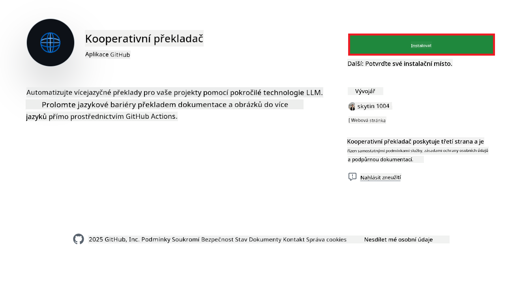
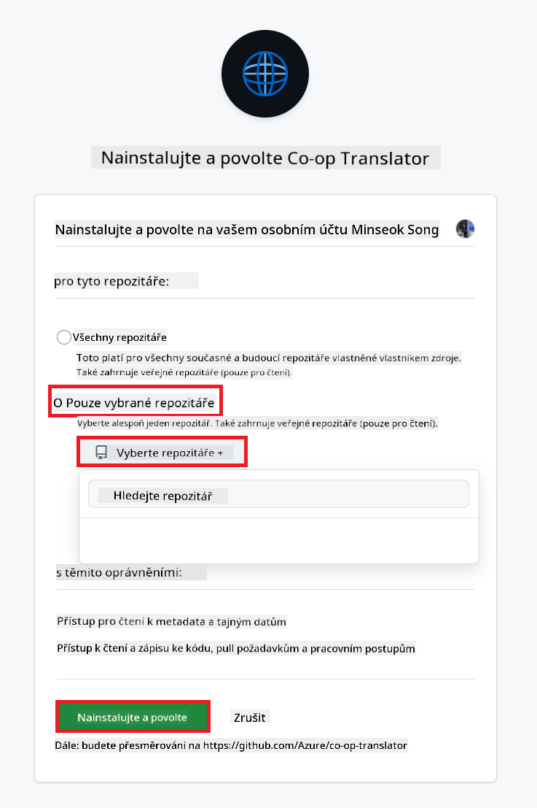
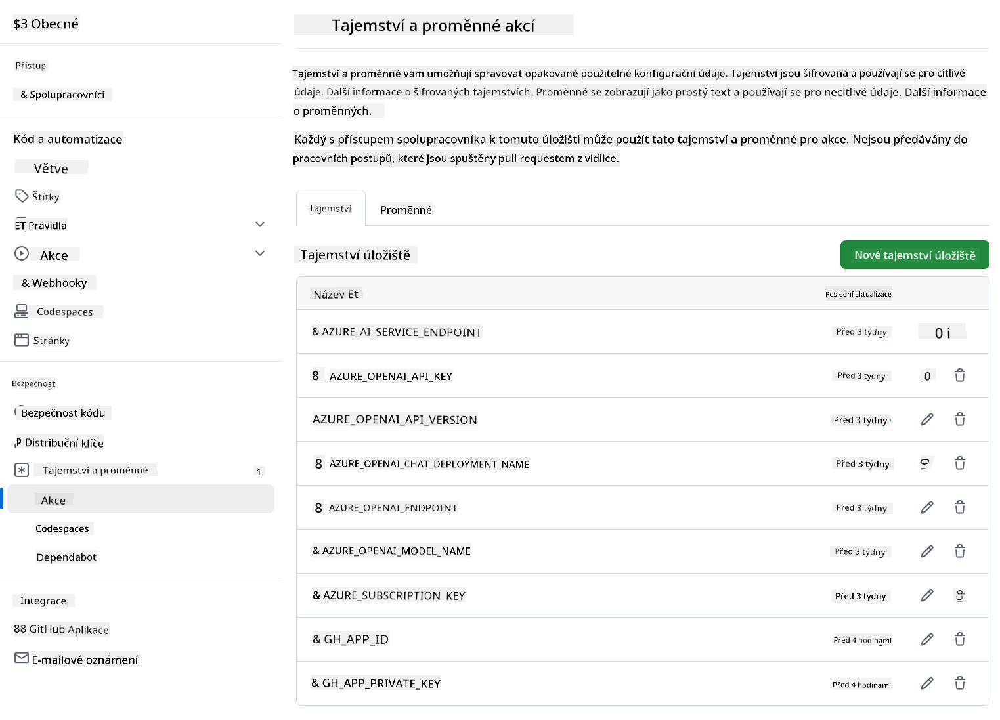

<!--
CO_OP_TRANSLATOR_METADATA:
{
  "original_hash": "c437820027c197f25fb2cbee95bae28c",
  "translation_date": "2025-06-12T19:16:18+00:00",
  "source_file": "getting_started/github-actions-guide/github-actions-guide-org.md",
  "language_code": "cs"
}
-->
# Použití GitHub Action Co-op Translator (Průvodce pro organizace)

**Cílová skupina:** Tento průvodce je určen pro **interní uživatele Microsoftu** nebo **týmy, které mají přístup k potřebným přihlašovacím údajům pro předpřipravenou aplikaci Co-op Translator GitHub App** nebo si mohou vytvořit vlastní vlastní GitHub App.

Automatizujte překlad dokumentace vašeho repozitáře snadno pomocí GitHub Action Co-op Translator. Tento průvodce vás provede nastavením akce, která automaticky vytvoří pull requesty s aktualizovanými překlady vždy, když se změní vaše zdrojové Markdown soubory nebo obrázky.

> [!IMPORTANT]
> 
> **Výběr správného průvodce:**
>
> Tento průvodce popisuje nastavení pomocí **GitHub App ID a soukromého klíče**. Tento způsob "Průvodce pro organizace" obvykle potřebujete, pokud: **`GITHUB_TOKEN` oprávnění jsou omezená:** Nastavení vaší organizace nebo repozitáře omezuje výchozí oprávnění udělená standardnímu `GITHUB_TOKEN`. Konkrétně pokud `GITHUB_TOKEN` nemá povolená potřebná oprávnění `write` (například `contents: write` nebo `pull-requests: write`), workflow v [Průvodci pro veřejné nastavení](./github-actions-guide-public.md) selže kvůli nedostatečným oprávněním. Použití dedikované GitHub App s explicitně udělenými oprávněními tuto překážku obchází.
>
> **Pokud výše uvedené neplatí:**
>
> Pokud má standardní `GITHUB_TOKEN` dostatečná oprávnění ve vašem repozitáři (tj. nejste blokováni omezeními organizace), použijte prosím **[Průvodce pro veřejné nastavení s GITHUB_TOKEN](./github-actions-guide-public.md)**. Veřejný průvodce nevyžaduje získávání nebo správu App ID či soukromých klíčů a spoléhá pouze na standardní `GITHUB_TOKEN` a oprávnění repozitáře.

## Požadavky

Před nastavením GitHub Action si připravte potřebné přihlašovací údaje pro AI služby.

**1. Povinné: Přihlašovací údaje k AI jazykovému modelu**  
Potřebujete přihlašovací údaje alespoň k jednomu podporovanému jazykovému modelu:

- **Azure OpenAI**: Vyžaduje Endpoint, API klíč, názvy modelu/deploymentu, verzi API.  
- **OpenAI**: Vyžaduje API klíč, (volitelně: Org ID, Base URL, Model ID).  
- Podrobnosti viz [Podporované modely a služby](../../../../README.md).  
- Průvodce nastavením: [Nastavení Azure OpenAI](../set-up-resources/set-up-azure-openai.md).

**2. Volitelné: Přihlašovací údaje k Computer Vision (pro překlad obrázků)**

- Potřebné pouze pokud chcete překládat text v obrázcích.  
- **Azure Computer Vision**: Vyžaduje Endpoint a Subscription Key.  
- Pokud nejsou poskytnuty, akce běží ve [režimu pouze pro Markdown](../markdown-only-mode.md).  
- Průvodce nastavením: [Nastavení Azure Computer Vision](../set-up-resources/set-up-azure-computer-vision.md).

## Nastavení a konfigurace

Postupujte podle těchto kroků pro konfiguraci GitHub Action Co-op Translator ve vašem repozitáři:

### Krok 1: Instalace a konfigurace autentizace GitHub App

Workflow používá autentizaci GitHub App pro bezpečnou interakci s vaším repozitářem (např. vytváření pull requestů) vaším jménem. Vyberte jednu z možností:

#### **Možnost A: Instalace předpřipravené GitHub App Co-op Translator (pro interní použití Microsoftu)**

1. Přejděte na stránku [Co-op Translator GitHub App](https://github.com/apps/co-op-translator).

1. Zvolte **Install** a vyberte účet nebo organizaci, kde se nachází váš cílový repozitář.

    

1. Vyberte **Only select repositories** a zvolte váš cílový repozitář (např. `PhiCookBook`). Klikněte na **Install**. Můžete být vyzváni k ověření.

    

1. **Získání údajů aplikace (interní proces):** Pro umožnění workflow autentizace jako aplikace potřebujete dvě informace poskytnuté týmem Co-op Translator:  
  - **App ID:** Jedinečný identifikátor aplikace Co-op Translator. App ID je: `1164076`.  
  - **Soukromý klíč:** Musíte získat **celý obsah** souboru soukromého klíče `.pem` od správce. **S tímto klíčem zacházejte jako s heslem a udržujte jej v bezpečí.**

1. Pokračujte na Krok 2.

#### **Možnost B: Použití vlastní vlastní GitHub App**

- Pokud chcete, můžete si vytvořit a nastavit vlastní GitHub App. Ujistěte se, že má oprávnění pro čtení a zápis do Contents a Pull requests. Budete potřebovat jeho App ID a vygenerovaný soukromý klíč.

### Krok 2: Nastavení tajných hodnot repozitáře

Musíte přidat přihlašovací údaje GitHub App a přihlašovací údaje AI služeb jako zašifrované tajné hodnoty v nastavení repozitáře.

1. Přejděte do vašeho cílového GitHub repozitáře (např. `PhiCookBook`).

1. Otevřete **Settings** > **Secrets and variables** > **Actions**.

1. V sekci **Repository secrets** klikněte na **New repository secret** pro každý níže uvedený tajný údaj.

   

**Povinné tajné hodnoty (pro autentizaci GitHub App):**

| Název tajného údaje     | Popis                                           | Zdroj hodnoty                                   |
| :---------------------- | :---------------------------------------------- | :---------------------------------------------- |
| `GH_APP_ID`      | App ID GitHub App (z Kroku 1).                   | Nastavení GitHub App                            |
| `GH_APP_PRIVATE_KEY`      | **Celý obsah** staženého souboru `.pem`. | Soubor `.pem` (z Kroku 1)           |

**Tajné hodnoty AI služeb (přidejte VŠECHNY, které odpovídají vašim požadavkům):**

| Název tajného údaje     | Popis                                           | Zdroj hodnoty                                   |
| :---------------------- | :---------------------------------------------- | :---------------------------------------------- |
| `AZURE_SUBSCRIPTION_KEY`      | Klíč pro Azure AI službu (Computer Vision)      | Azure AI Foundry                               |
| `AZURE_AI_SERVICE_ENDPOINT`      | Endpoint pro Azure AI službu (Computer Vision)  | Azure AI Foundry                               |
| `AZURE_OPENAI_API_KEY`      | Klíč pro Azure OpenAI službu                      | Azure AI Foundry                               |
| `AZURE_OPENAI_ENDPOINT`      | Endpoint pro Azure OpenAI službu                  | Azure AI Foundry                               |
| `AZURE_OPENAI_MODEL_NAME`      | Název vašeho Azure OpenAI modelu                  | Azure AI Foundry                               |
| `AZURE_OPENAI_CHAT_DEPLOYMENT_NAME`      | Název vašeho Azure OpenAI deploymentu             | Azure AI Foundry                               |
| `AZURE_OPENAI_API_VERSION`      | Verze API pro Azure OpenAI                         | Azure AI Foundry                               |
| `OPENAI_API_KEY`      | API klíč pro OpenAI                                | OpenAI Platform                               |
| `OPENAI_ORG_ID`      | ID organizace OpenAI                               | OpenAI Platform                               |
| `OPENAI_CHAT_MODEL_ID`      | Specifické ID modelu OpenAI                        | OpenAI Platform                               |
| `OPENAI_BASE_URL`      | Vlastní základní URL OpenAI API                    | OpenAI Platform                               |



### Krok 3: Vytvoření workflow souboru

Nakonec vytvořte YAML soubor, který definuje automatizovaný workflow.

1. V kořenovém adresáři vašeho repozitáře vytvořte adresář `.github/workflows/`, pokud neexistuje.

1. V adresáři `.github/workflows/` vytvořte soubor s názvem `co-op-translator.yml`.

1. Vložte do souboru co-op-translator.yml následující obsah.

```
name: Co-op Translator

on:
  push:
    branches:
      - main

jobs:
  co-op-translator:
    runs-on: ubuntu-latest

    permissions:
      contents: write
      pull-requests: write

    steps:
      - name: Checkout repository
        uses: actions/checkout@v4
        with:
          fetch-depth: 0

      - name: Set up Python
        uses: actions/setup-python@v4
        with:
          python-version: '3.10'

      - name: Install Co-op Translator
        run: |
          python -m pip install --upgrade pip
          pip install co-op-translator

      - name: Run Co-op Translator
        env:
          PYTHONIOENCODING: utf-8
          # Azure AI Service Credentials
          AZURE_SUBSCRIPTION_KEY: ${{ secrets.AZURE_SUBSCRIPTION_KEY }}
          AZURE_AI_SERVICE_ENDPOINT: ${{ secrets.AZURE_AI_SERVICE_ENDPOINT }}

          # Azure OpenAI Credentials
          AZURE_OPENAI_API_KEY: ${{ secrets.AZURE_OPENAI_API_KEY }}
          AZURE_OPENAI_ENDPOINT: ${{ secrets.AZURE_OPENAI_ENDPOINT }}
          AZURE_OPENAI_MODEL_NAME: ${{ secrets.AZURE_OPENAI_MODEL_NAME }}
          AZURE_OPENAI_CHAT_DEPLOYMENT_NAME: ${{ secrets.AZURE_OPENAI_CHAT_DEPLOYMENT_NAME }}
          AZURE_OPENAI_API_VERSION: ${{ secrets.AZURE_OPENAI_API_VERSION }}

          # OpenAI Credentials
          OPENAI_API_KEY: ${{ secrets.OPENAI_API_KEY }}
          OPENAI_ORG_ID: ${{ secrets.OPENAI_ORG_ID }}
          OPENAI_CHAT_MODEL_ID: ${{ secrets.OPENAI_CHAT_MODEL_ID }}
          OPENAI_BASE_URL: ${{ secrets.OPENAI_BASE_URL }}
        run: |
          # =====================================================================
          # IMPORTANT: Set your target languages here (REQUIRED CONFIGURATION)
          # =====================================================================
          # Example: Translate to Spanish, French, German. Add -y to auto-confirm.
          translate -l "es fr de" -y  # <--- MODIFY THIS LINE with your desired languages

      - name: Authenticate GitHub App
        id: generate_token
        uses: tibdex/github-app-token@v1
        with:
          app_id: ${{ secrets.GH_APP_ID }}
          private_key: ${{ secrets.GH_APP_PRIVATE_KEY }}

      - name: Create Pull Request with translations
        uses: peter-evans/create-pull-request@v5
        with:
          token: ${{ steps.generate_token.outputs.token }}
          commit-message: "🌐 Update translations via Co-op Translator"
          title: "🌐 Update translations via Co-op Translator"
          body: |
            This PR updates translations for recent changes to the main branch.

            ### 📋 Changes included
            - Translated contents are available in the `translations/` directory
            - Translated images are available in the `translated_images/` directory

            ---
            🌐 Automatically generated by the [Co-op Translator](https://github.com/Azure/co-op-translator) GitHub Action.
          branch: update-translations
          base: main
          labels: translation, automated-pr
          delete-branch: true
          add-paths: |
            translations/
            translated_images/

```

4.  **Přizpůsobení workflow:**  
  - **[!IMPORTANT] Cílové jazyky:** V příkazu `Run Co-op Translator` step, you **MUST review and modify the list of language codes** within the `translate -l "..." -y` command to match your project's requirements. The example list (`ar de es...`) needs to be replaced or adjusted.
  - **Trigger (`on:`):** The current trigger runs on every push to `main`. For large repositories, consider adding a `paths:` filter (see commented example in the YAML) to run the workflow only when relevant files (e.g., source documentation) change, saving runner minutes.
  - **PR Details:** Customize the `commit-message`, `title`, `body`, `branch` name, and `labels` in the `Create Pull Request` step if needed.

## Credential Management and Renewal

- **Security:** Always store sensitive credentials (API keys, private keys) as GitHub Actions secrets. Never expose them in your workflow file or repository code.
- **[!IMPORTANT] Key Renewal (Internal Microsoft Users):** Be aware that Azure OpenAI key used within Microsoft might have a mandatory renewal policy (e.g., every 5 months). Ensure you update the corresponding GitHub secrets (`AZURE_OPENAI_...` nastavte jazyky, do kterých chcete překládat.  
  - Nezapomeňte obnovovat tajné hodnoty (např. klíče) **před jejich vypršením platnosti**, aby workflow nepřestalo fungovat.

## Spuštění workflow

Jakmile je soubor `co-op-translator.yml` sloučen do hlavní větve (nebo větve specifikované v `on:` trigger), the workflow will automatically run whenever changes are pushed to that branch (and match the `paths` filtru, pokud je nastaven),

pokud jsou vygenerovány nebo aktualizovány překlady, akce automaticky vytvoří Pull Request obsahující změny, připravený k vašemu přezkoumání a sloučení.

**Prohlášení o vyloučení odpovědnosti**:  
Tento dokument byl přeložen pomocí AI překladatelské služby [Co-op Translator](https://github.com/Azure/co-op-translator). Přestože usilujeme o přesnost, mějte prosím na paměti, že automatické překlady mohou obsahovat chyby nebo nepřesnosti. Původní dokument v jeho mateřském jazyce by měl být považován za autoritativní zdroj. Pro kritické informace se doporučuje profesionální lidský překlad. Nejsme odpovědní za jakékoli nedorozumění nebo nesprávné výklady vyplývající z použití tohoto překladu.