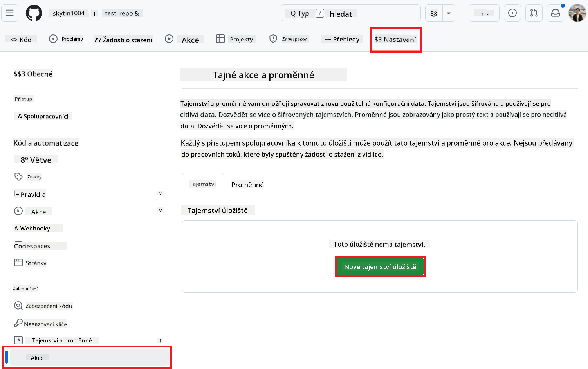
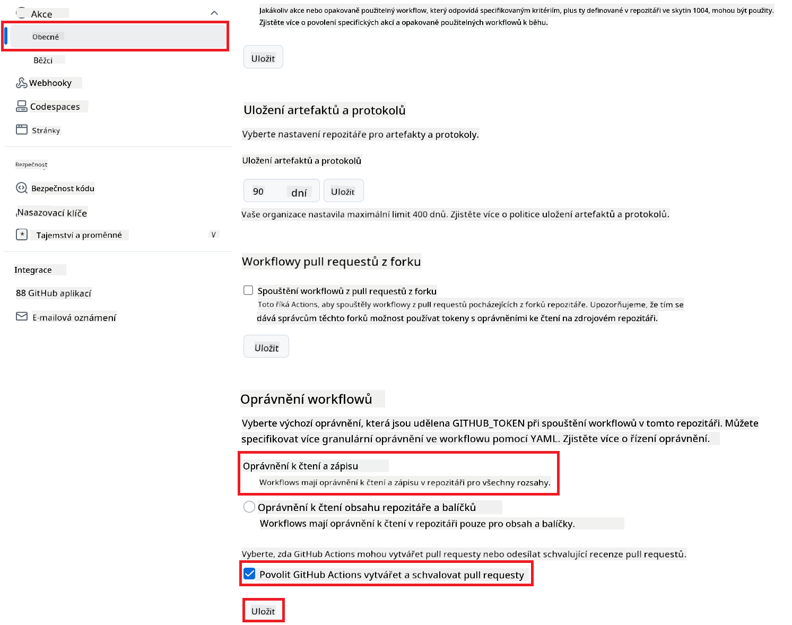

<!--
CO_OP_TRANSLATOR_METADATA:
{
  "original_hash": "a52587a512e667f70d92db853d3c61d5",
  "translation_date": "2025-06-12T19:33:53+00:00",
  "source_file": "getting_started/github-actions-guide/github-actions-guide-public.md",
  "language_code": "cs"
}
-->
# Použití Co-op Translator GitHub Action (Veřejné nastavení)

**Cílová skupina:** Tento návod je určen pro uživatele ve většině veřejných nebo soukromých repozitářů, kde jsou dostačující standardní oprávnění GitHub Actions. Využívá vestavěný `GITHUB_TOKEN`.

Automatizujte překlad dokumentace vašeho repozitáře snadno pomocí Co-op Translator GitHub Action. Tento návod vás provede nastavením akce tak, aby automaticky vytvářela pull requesty s aktualizovanými překlady vždy, když dojde ke změně zdrojových Markdown souborů nebo obrázků.

> [!IMPORTANT]
>
> **Výběr správného návodu:**
>
> Tento návod popisuje **jednodušší nastavení pomocí standardního `GITHUB_TOKEN`**. Toto je doporučený způsob pro většinu uživatelů, protože nevyžaduje správu citlivých privátních klíčů GitHub App.
>

## Předpoklady

Než nakonfigurujete GitHub Action, ujistěte se, že máte připravené potřebné přihlašovací údaje k AI službám.

**1. Povinné: Přihlašovací údaje k AI jazykovému modelu**  
Potřebujete přihlašovací údaje alespoň k jednomu podporovanému jazykovému modelu:

- **Azure OpenAI**: Vyžaduje Endpoint, API Key, názvy modelu/deploymentu, verzi API.  
- **OpenAI**: Vyžaduje API Key, (volitelně: Org ID, Base URL, Model ID).  
- Podrobnosti najdete v [Supported Models and Services](../../../../README.md).

**2. Volitelné: Přihlašovací údaje k AI Vision (pro překlad obrázků)**

- Potřebné pouze pokud chcete překládat text v obrázcích.  
- **Azure AI Vision**: Vyžaduje Endpoint a Subscription Key.  
- Pokud nejsou poskytnuty, akce přejde do [Markdown-only režimu](../markdown-only-mode.md).

## Nastavení a konfigurace

Postupujte podle těchto kroků pro nastavení Co-op Translator GitHub Action ve vašem repozitáři pomocí standardního `GITHUB_TOKEN`.

### Krok 1: Pochopení autentizace (použití `GITHUB_TOKEN`)

Tento workflow využívá vestavěný `GITHUB_TOKEN` poskytovaný GitHub Actions. Tento token automaticky uděluje workflow oprávnění pro interakci s vaším repozitářem na základě nastavení provedených v **Kroku 3**.

### Krok 2: Konfigurace tajemství repozitáře

Stačí přidat **přihlašovací údaje k AI službám** jako zašifrovaná tajemství v nastavení repozitáře.

1.  Otevřete cílový GitHub repozitář.  
2.  Přejděte do **Settings** > **Secrets and variables** > **Actions**.  
3.  V sekci **Repository secrets** klikněte na **New repository secret** pro každý požadovaný AI servisní klíč uvedený níže.

     *(Obrázek znázorňuje, kde přidat tajemství)*

**Požadovaná tajemství AI služeb (přidejte VŠECHNA, která odpovídají vašim předpokladům):**

| Název tajemství                  | Popis                                      | Zdroj hodnoty                    |
| :------------------------------- | :----------------------------------------- | :------------------------------- |
| `AZURE_SUBSCRIPTION_KEY`            | Klíč pro Azure AI službu (Computer Vision)  | Vaše Azure AI Foundry             |
| `AZURE_AI_SERVICE_ENDPOINT`         | Endpoint pro Azure AI službu (Computer Vision) | Vaše Azure AI Foundry             |
| `AZURE_OPENAI_API_KEY`              | Klíč pro Azure OpenAI službu                 | Vaše Azure AI Foundry             |
| `AZURE_OPENAI_ENDPOINT`             | Endpoint pro Azure OpenAI službu              | Vaše Azure AI Foundry             |
| `AZURE_OPENAI_MODEL_NAME`           | Název vašeho Azure OpenAI modelu              | Vaše Azure AI Foundry             |
| `AZURE_OPENAI_CHAT_DEPLOYMENT_NAME` | Název vašeho Azure OpenAI deploymentu         | Vaše Azure AI Foundry             |
| `AZURE_OPENAI_API_VERSION`          | Verze API pro Azure OpenAI                     | Vaše Azure AI Foundry             |
| `OPENAI_API_KEY`                    | API klíč pro OpenAI                           | Vaše OpenAI Platform              |
| `OPENAI_ORG_ID`                     | OpenAI Organization ID (volitelně)             | Vaše OpenAI Platform              |
| `OPENAI_CHAT_MODEL_ID`              | Specifické ID modelu OpenAI (volitelně)          | Vaše OpenAI Platform              |
| `OPENAI_BASE_URL`                   | Vlastní základní URL OpenAI API (volitelně)       | Vaše OpenAI Platform              |

### Krok 3: Nastavení oprávnění workflow

GitHub Action potřebuje oprávnění udělená přes `GITHUB_TOKEN`, aby mohl stahovat kód a vytvářet pull requesty.

1.  V repozitáři přejděte do **Settings** > **Actions** > **General**.  
2.  Sjeďte dolů do sekce **Workflow permissions**.  
3.  Vyberte **Read and write permissions**. Tím udělíte `GITHUB_TOKEN` potřebná oprávnění `contents: write` a `pull-requests: write` pro tento workflow.  
4.  Ujistěte se, že je zaškrtnuto políčko **Allow GitHub Actions to create and approve pull requests**.  
5.  Klikněte na **Save**.



### Krok 4: Vytvoření souboru workflow

Nakonec vytvořte YAML soubor, který definuje automatizovaný workflow s využitím `GITHUB_TOKEN`.

1.  V kořenovém adresáři vašeho repozitáře vytvořte složku `.github/workflows/`, pokud ještě neexistuje.  
2.  V rámci `.github/workflows/` vytvořte soubor s názvem `co-op-translator.yml`.  
3.  Vložte do `co-op-translator.yml` následující obsah.

```yaml
name: Co-op Translator

on:
  push:
    branches:
      - main

jobs:
  co-op-translator:
    runs-on: ubuntu-latest

    permissions:
      contents: write
      pull-requests: write

    steps:
      - name: Checkout repository
        uses: actions/checkout@v4
        with:
          fetch-depth: 0

      - name: Set up Python
        uses: actions/setup-python@v4
        with:
          python-version: '3.10'

      - name: Install Co-op Translator
        run: |
          python -m pip install --upgrade pip
          pip install co-op-translator

      - name: Run Co-op Translator
        env:
          PYTHONIOENCODING: utf-8
          # === AI Service Credentials ===
          AZURE_SUBSCRIPTION_KEY: ${{ secrets.AZURE_SUBSCRIPTION_KEY }}
          AZURE_AI_SERVICE_ENDPOINT: ${{ secrets.AZURE_AI_SERVICE_ENDPOINT }}
          AZURE_OPENAI_API_KEY: ${{ secrets.AZURE_OPENAI_API_KEY }}
          AZURE_OPENAI_ENDPOINT: ${{ secrets.AZURE_OPENAI_ENDPOINT }}
          AZURE_OPENAI_MODEL_NAME: ${{ secrets.AZURE_OPENAI_MODEL_NAME }}
          AZURE_OPENAI_CHAT_DEPLOYMENT_NAME: ${{ secrets.AZURE_OPENAI_CHAT_DEPLOYMENT_NAME }}
          AZURE_OPENAI_API_VERSION: ${{ secrets.AZURE_OPENAI_API_VERSION }}
          OPENAI_API_KEY: ${{ secrets.OPENAI_API_KEY }}
          OPENAI_ORG_ID: ${{ secrets.OPENAI_ORG_ID }}
          OPENAI_CHAT_MODEL_ID: ${{ secrets.OPENAI_CHAT_MODEL_ID }}
          OPENAI_BASE_URL: ${{ secrets.OPENAI_BASE_URL }}
        run: |
          # =====================================================================
          # IMPORTANT: Set your target languages here (REQUIRED CONFIGURATION)
          # =====================================================================
          # Example: Translate to Spanish, French, German. Add -y to auto-confirm.
          translate -l "es fr de" -y  # <--- MODIFY THIS LINE with your desired languages

      - name: Create Pull Request with translations
        uses: peter-evans/create-pull-request@v5
        with:
          token: ${{ secrets.GITHUB_TOKEN }}
          commit-message: "🌐 Update translations via Co-op Translator"
          title: "🌐 Update translations via Co-op Translator"
          body: |
            This PR updates translations for recent changes to the main branch.

            ### 📋 Changes included
            - Translated contents are available in the `translations/` directory
            - Translated images are available in the `translated_images/` directory

            ---
            🌐 Automatically generated by the [Co-op Translator](https://github.com/Azure/co-op-translator) GitHub Action.
          branch: update-translations
          base: main
          labels: translation, automated-pr
          delete-branch: true
          add-paths: |
            translations/
            translated_images/
```  
4.  **Přizpůsobení workflow:**  
  - **[!IMPORTANT] Cílové jazyky:** Ve kroku `Run Co-op Translator` step, you **MUST review and modify the list of language codes** within the `translate -l "..." -y` command to match your project's requirements. The example list (`ar de es...`) needs to be replaced or adjusted.
  - **Trigger (`on:`):** The current trigger runs on every push to `main`. For large repositories, consider adding a `paths:` filter (see commented example in the YAML) to run the workflow only when relevant files (e.g., source documentation) change, saving runner minutes.
  - **PR Details:** Customize the `commit-message`, `title`, `body`, `branch` name, and `labels` in the `Create Pull Request` upravte podle potřeby.

**Upozornění**:  
Tento dokument byl přeložen pomocí AI překladatelské služby [Co-op Translator](https://github.com/Azure/co-op-translator). Přestože usilujeme o přesnost, mějte prosím na paměti, že automatické překlady mohou obsahovat chyby nebo nepřesnosti. Původní dokument v jeho mateřském jazyce by měl být považován za autoritativní zdroj. Pro zásadní informace se doporučuje profesionální lidský překlad. Nejsme odpovědní za jakékoliv nedorozumění nebo nesprávné výklady vyplývající z použití tohoto překladu.