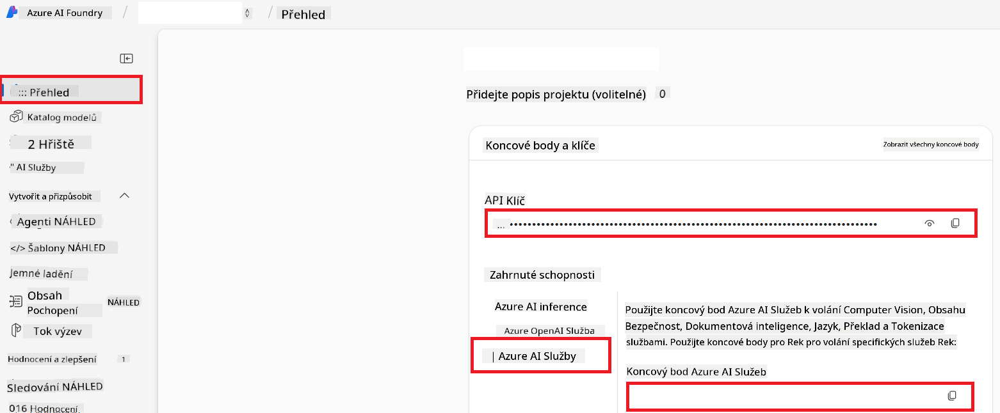

<!--
CO_OP_TRANSLATOR_METADATA:
{
  "original_hash": "b58d7c3cb4210697a073d20eb3064945",
  "translation_date": "2025-06-12T11:57:44+00:00",
  "source_file": "getting_started/set-up-azure-ai.md",
  "language_code": "cs"
}
-->
# Set Up Azure AI for Co-op Translator (Azure OpneAI & Azure AI Vision)

This guide explains how to set up Azure OpenAI for language translation and Azure Computer Vision for image content analysis (which can then be used for image-based translation) within Azure AI Foundry.

**Prerequisites:**
- An Azure account with an active subscription.
- Sufficient permissions to create resources and deployments in your Azure subscription.

## Create an Azure AI Project

Begin by creating an Azure AI Project, which serves as a central hub for managing your AI resources.

1. Go to [https://ai.azure.com](https://ai.azure.com) and sign in with your Azure account.

1. Click **+Create** to start a new project.

1. Complete the following:
   - Enter a **Project name** (e.g., `CoopTranslator-Project`).
   - Choose the **AI hub** (e.g., `CoopTranslator-Hub`) (Create a new one if necessary).

1. Click "**Review and Create**" to finalize your project setup. You will be directed to the project overview page.

## Set up Azure OpenAI for Language Translation

Inside your project, deploy an Azure OpenAI model to handle text translation.

### Navigate to Your Project

If you’re not already there, open your newly created project (e.g., `CoopTranslator-Project`) in Azure AI Foundry.

### Deploy an OpenAI Model

1. From the project’s left menu, under "My assets", select "**Models + endpoints**".

1. Click **+ Deploy model**.

1. Choose **Deploy Base Model**.

1. A list of available models will appear. Filter or search for an appropriate GPT model. We recommend `gpt-4o`.

1. Select your preferred model and click **Confirm**.

1. Click **Deploy**.

### Azure OpenAI configuration

After deployment, select the deployment from the "**Models + endpoints**" page to find its **REST endpoint URL**, **Key**, **Deployment name**, **Model name**, and **API version**. You’ll need these details to integrate the translation model into your application.

> [!NOTE]
> You can select API versions on the [API version deprecation](https://learn.microsoft.com/azure/ai-services/openai/api-version-deprecation) page according to your needs. Note that the **API version** is different from the **Model version** shown on the **Models + endpoints** page in Azure AI Foundry.

## Set up Azure Computer Vision for Image Translation

To translate text within images, locate the Azure AI Service API Key and Endpoint.

1. Go to your Azure AI Project (e.g., `CoopTranslator-Project`). Make sure you are on the project overview page.

### Azure AI Service configuration

Retrieve the API Key and Endpoint from the Azure AI Service.

1. Navigate to your Azure AI Project (e.g., `CoopTranslator-Project`). Confirm you’re on the project overview page.

1. Find the **API Key** and **Endpoint** under the Azure AI Service tab.

    

This connection enables the features of the linked Azure AI Services resource (including image analysis) within your AI Foundry project. You can then use this connection in notebooks or applications to extract text from images, which can be forwarded to the Azure OpenAI model for translation.

## Consolidating Your Credentials

At this point, you should have gathered the following:

**For Azure OpenAI (Text Translation):**
- Azure OpenAI Endpoint
- Azure OpenAI API Key
- Azure OpenAI Model Name (e.g., `gpt-4o`)
- Azure OpenAI Deployment Name (e.g., `cooptranslator-gpt4o`)
- Azure OpenAI API Version

**For Azure AI Services (Image Text Extraction via Vision):**
- Azure AI Service Endpoint
- Azure AI Service API Key

### Example: Environment Variable Configuration (Preview)

Later, when building your application, you’ll likely set these credentials as environment variables like this:

```bash
# Azure AI Service Credentials (Required for image translation)
AZURE_AI_SERVICE_API_KEY="your_azure_ai_service_api_key" # e.g., 21xasd...
AZURE_AI_SERVICE_ENDPOINT="https://your_azure_ai_service_endpoint.cognitiveservices.azure.com/"

# Azure OpenAI Credentials (Required for text translation)
AZURE_OPENAI_API_KEY="your_azure_openai_api_key" # e.g., 21xasd...
AZURE_OPENAI_ENDPOINT="https://your_azure_openai_endpoint.openai.azure.com/"
AZURE_OPENAI_MODEL_NAME="your_model_name" # e.g., gpt-4o
AZURE_OPENAI_CHAT_DEPLOYMENT_NAME="your_deployment_name" # e.g., cooptranslator-gpt4o
AZURE_OPENAI_API_VERSION="your_api_version" # e.g., 2024-12-01-preview
```

---

### Further Reading

- [How to Create a project in Azure AI Foundry](https://learn.microsoft.com/azure/ai-foundry/how-to/create-projects?tabs=ai-studio)
- [How to Create Azure AI resources](https://learn.microsoft.com/azure/ai-foundry/how-to/create-azure-ai-resource?tabs=portal)
- [How to Deploy OpenAI models in Azure AI Foundry](https://learn.microsoft.com/en-us/azure/ai-foundry/how-to/deploy-models-openai)

**Prohlášení o vyloučení odpovědnosti**:  
Tento dokument byl přeložen pomocí AI překladatelské služby [Co-op Translator](https://github.com/Azure/co-op-translator). Přestože usilujeme o přesnost, mějte prosím na paměti, že automatizované překlady mohou obsahovat chyby nebo nepřesnosti. Původní dokument v jeho mateřském jazyce by měl být považován za autoritativní zdroj. Pro důležité informace se doporučuje profesionální lidský překlad. Nejsme odpovědní za jakákoliv nedorozumění nebo chybné výklady vzniklé použitím tohoto překladu.