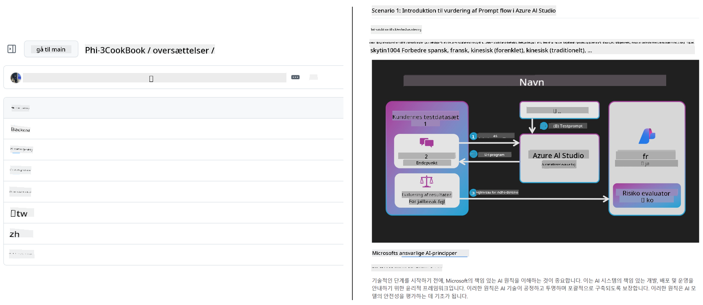
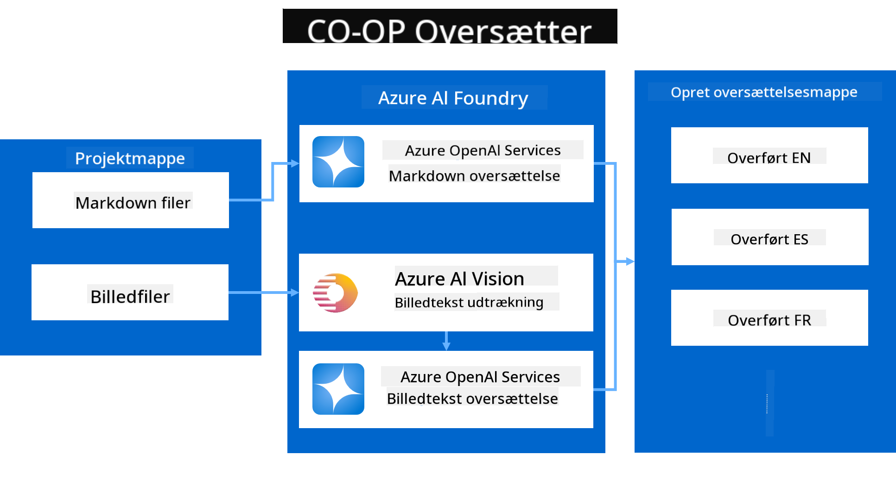
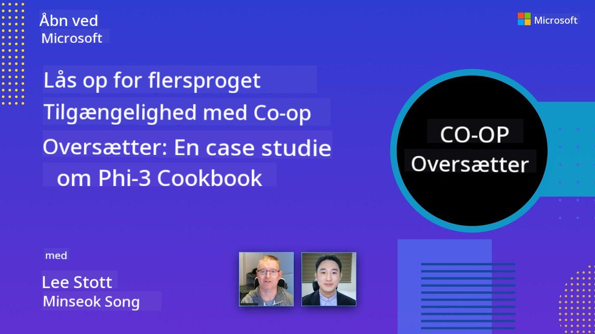

<!--
CO_OP_TRANSLATOR_METADATA:
{
  "original_hash": "044724537b57868117aadae8e7728c7c",
  "translation_date": "2025-06-12T10:32:51+00:00",
  "source_file": "README.md",
  "language_code": "da"
}
-->


# Co-op Translator: Automatiser oversættelsen af uddannelsesdokumentation uden besvær

_Automatiser nemt oversættelsen af din dokumentation til flere sprog for at nå et globalt publikum._

[](https://pypi.org/project/co-op-translator/)
[](https://github.com/azure/co-op-translator/blob/main/LICENSE)
[](https://pepy.tech/project/co-op-translator)
[](https://pepy.tech/project/co-op-translator)
[](https://github.com/psf/black)

[](https://GitHub.com/azure/co-op-translator/graphs/contributors/)
[](https://GitHub.com/azure/co-op-translator/issues/)
[](https://GitHub.com/azure/co-op-translator/pulls/)
[](http://makeapullrequest.com)

### Sprogunderstøttelse drevet af Co-op Translator

> [!NOTE]
> Dette er de nuværende oversættelser af dette repositories indhold. For en komplet liste over sprog, som Co-op Translator understøtter, se venligst afsnittet [Language Support](../..).

[](https://GitHub.com/azure/co-op-translator/watchers/)
[](https://GitHub.com/azure/co-op-translator/network/)
[](https://GitHub.com/azure/co-op-translator/stargazers/)

[](https://discord.com/invite/ByRwuEEgH4)

[](https://codespaces.new/azure/co-op-translator)
[](https://vscode.dev/redirect?url=vscode://ms-vscode-remote.remote-containers/cloneInVolume?url=https://github.com/azure/co-op-translator)

## Oversigt: Effektivisér Oversættelsen af Dit Undervisningsmateriale

Sprogbarrierer begrænser i høj grad adgangen til værdifulde undervisningsressourcer og teknisk viden for elever og udviklere verden over. Det hæmmer deltagelse og sænker tempoet for global innovation og læring.

**Co-op Translator** blev skabt ud fra behovet for at løse den ineffektive manuelle oversættelsesproces for Microsofts egne store undervisningsserier (som f.eks. "For Beginners" guiderne). Det er udviklet til et brugervenligt og kraftfuldt værktøj, der bryder disse barrierer for alle. Ved at tilbyde automatiserede oversættelser af høj kvalitet via CLI og GitHub Actions, giver Co-op Translator undervisere, studerende, forskere og udviklere verden over mulighed for at dele og få adgang til viden uden sprogbarrierer.

Se hvordan Co-op Translator organiserer oversat undervisningsmateriale:



Markdown-filer og billedtekster oversættes automatisk og organiseres pænt i sprog-specifikke mapper.

**Åbn global adgang til dit undervisningsmateriale med Co-op Translator i dag!**

## Understøttelse af Global Adgang til Microsofts Læringsressourcer

Co-op Translator hjælper med at bygge bro over sprogbarrierer for vigtige Microsoft undervisningsinitiativer ved at automatisere oversættelsesprocessen for repositories, der betjener et globalt udviklersamfund. Eksempler der i øjeblikket bruger Co-op Translator inkluderer:

[](https://github.com/microsoft/Generative-AI-for-beginners)
[](https://github.com/microsoft/ML-For-Beginners)
[](https://github.com/microsoft/AI-For-Beginners)
[](https://github.com/microsoft/ai-agents-for-beginners)
[](https://github.com/microsoft/PhiCookBook)
[](https://github.com/microsoft/Generative-AI-for-beginners-dotnet)

## Nøglefunktioner

- **Automatiserede Oversættelser**: Oversæt tekst til flere sprog uden besvær.
- **GitHub Actions Integration**: Automatiser oversættelser som en del af din CI/CD pipeline.
- **Bevaring af Markdown**: Bevar korrekt Markdown-syntaks under oversættelse.
- **Oversættelse af Billedtekst**: Udtræk og oversæt tekst i billeder.
- **Avanceret LLM Teknologi**: Brug topmoderne sprogmodeller til oversættelser af høj kvalitet.
- **Nem Integration**: Integrer problemfrit med din eksisterende projektopsætning.
- **Forenklet Lokalisering**: Effektivisér processen med at lokalisere dit projekt til internationale markeder.

## Sådan Fungerer Det



Co-op Translator tager Markdown-filer og billeder fra din projektmappe og behandler dem som følger:

1. **Tekstudtræk**: Udtrækker tekst fra Markdown-filer og, hvis konfigureret (f.eks. med Azure AI Vision), tekst indlejret i billeder.
1. **AI Oversættelse**: Sender den udtrukne tekst til den konfigurerede LLM (Azure OpenAI, OpenAI osv.) til oversættelse.
1. **Resultatgemning**: Gemmer de oversatte Markdown-filer og billeder (med oversat tekst) i sprog-specifikke mapper, mens den oprindelige formatering bevares.

## Kom Godt I Gang

Kom hurtigt i gang med CLI eller opsæt fuld automatisering med GitHub Actions. Vælg den metode, der passer bedst til din arbejdsproces:

1. **Command Line (CLI)** - Til engangsoversættelser eller manuel styring
2. **GitHub Actions** - Til automatiserede oversættelser ved hver push

> [!NOTE]
> Selvom denne vejledning fokuserer på Azure-ressourcer, kan du bruge enhver understøttet sprogmodel.

### Language Support

Co-op Translator understøtter et bredt udvalg af sprog for at hjælpe dig med at nå et globalt publikum. Her er hvad du skal vide:

#### Hurtig Reference

| Sprog | Kode | Sprog | Kode | Sprog | Kode |
|----------|------|----------|------|----------|------|
| Arabic | ar | Bengali | bn | Bulgarian | bg |
| Burmese (Myanmar) | my | Chinese (Simplified) | zh | Chinese (Traditional, HK) | hk |
| Chinese (Traditional, Macau) | mo | Chinese (Traditional, TW) | tw | Croatian | hr |
| Czech | cs | Danish | da | Dutch | nl |
| Finnish | fi | French | fr | German | de |
| Greek | el | Hebrew | he | Hindi | hi |
| Hungarian | hu | Indonesian | id | Italian | it |
| Japanese | ja | Korean | ko | Malay | ms |
| Marathi | mr | Nepali | ne | Norwegian | no |
| Persian (Farsi) | fa | Polish | pl | Portuguese (Brazil) | br |
| Portuguese (Portugal) | pt | Punjabi (Gurmukhi) | pa | Romanian | ro |
| Russian | ru | Serbian (Cyrillic) | sr | Slovak | sk |
| Slovenian | sl | Spanish | es | Swahili | sw |
| Swedish | sv | Tagalog (Filipino) | tl | Thai | th |
| Turkish | tr | Ukrainian | uk | Urdu | ur |
| Vietnamese | vi | — | — | — | — |

#### Brug af Sprogkoder

Når du bruger Co-op Translator, skal du angive sprog ved hjælp af deres koder. For eksempel:

```bash
# Translate to French, Spanish, and German
translate -l "fr es de"

# Translate to Chinese (Simplified) and Japanese
translate -l "zh ja"
```

> [!NOTE]
> For detaljeret teknisk information om sprogunderstøttelse, herunder:
>
> - Skrifttype-specifikationer for hvert sprog
> - Kendte problemer
> - Hvordan man tilføjer nye sprog
>
> Se vores [Supported Languages Documentation](./getting_started/supported-languages.md).

### Understøttede Modeller og Tjenester

| Type                  | Navn                           |
|-----------------------|--------------------------------|
| Language Model        |   |
| AI Vision       |  |

> [!NOTE]
> Hvis en AI vision-tjeneste ikke er tilgængelig, skifter co-op translator til [Markdown-only mode](./getting_started/markdown-only-mode.md).

### Første Opsætning

Før du går i gang, skal du opsætte følgende ressourcer:

1. Language Model Ressource (påkrævet):
   - Azure OpenAI (anbefalet) - Leverer oversættelser af høj kvalitet med enterprise-niveau pålidelighed
   - OpenAI - Alternativ mulighed, hvis du ikke har adgang til Azure
   - For detaljeret information om understøttede modeller, se [Supported Models and Services](../..)

1. AI Vision Ressource (valgfri):
   - Azure AI Vision - Muliggør oversættelse af tekst i billeder
   - Hvis ikke konfigureret, bruger translatoren automatisk [Markdown-only mode](./getting_started/markdown-only-mode.md)
   - Anbefales til projekter med billeder, der indeholder tekst, som skal oversættes

1. Konfigurations-Trin:
   - Følg vores [Azure AI opsætningsvejledning](./getting_started/set-up-azure-ai.md) for detaljerede instruktioner
   - Opret en `.env`-fil med dine API-nøgler og endpoints (se afsnittet [Quick Start](../..))
   - Sørg for, at du har de nødvendige tilladelser og kvoter til de valgte tjenester

### Projektopsætning Før Oversættelse

Før du starter oversættelsesprocessen, skal du følge disse trin for at forberede dit projekt:

1. Forbered dit README:
   - Tilføj en oversættelsestabel til din README.md for at linke til de oversatte versioner
   - Eksempel på format:

     ```markdown

     ### 🌐 Multi-Language Support
     
     [French](../fr/README.md) | [Spanish](../es/README.md) | [German](../de/README.md) | [Russian](../ru/README.md) | [Arabic](../ar/README.md) | [Persian (Farsi)](../fa/README.md) | [Urdu](../ur/README.md) | [Chinese (Simplified)](../zh/README.md) | [Chinese (Traditional, Macau)](../mo/README.md) | [Chinese (Traditional, Hong Kong)](../hk/README.md) | [Chinese (Traditional, Taiwan)](../tw/README.md) | [Japanese](../ja/README.md) | [Korean](../ko/README.md) | [Hindi](../hi/README.md) | [Bengali](../bn/README.md) | [Marathi](../mr/README.md) | [Nepali](../ne/README.md) | [Punjabi (Gurmukhi)](../pa/README.md) | [Portuguese (Portugal)](../pt/README.md) | [Portuguese (Brazil)](../br/README.md) | [Italian](../it/README.md) | [Polish](../pl/README.md) | [Turkish](../tr/README.md) | [Greek](../el/README.md) | [Thai](../th/README.md) | [Swedish](../sv/README.md) | [Danish](./README.md) | [Norwegian](../no/README.md) | [Finnish](../fi/README.md) | [Dutch](../nl/README.md) | [Hebrew](../he/README.md) | [Vietnamese](../vi/README.md) | [Indonesian](../id/README.md) | [Malay](../ms/README.md) | [Tagalog (Filipino)](../tl/README.md) | [Swahili](../sw/README.md) | [Hungarian](../hu/README.md) | [Czech](../cs/README.md) | [Slovak](../sk/README.md) | [Romanian](../ro/README.md) | [Bulgarian](../bg/README.md) | [Serbian (Cyrillic)](../sr/README.md) | [Croatian](../hr/README.md) | [Slovenian](../sl/README.md) | [Ukrainian](../uk/README.md) | [Burmese (Myanmar)](../my/README.md) 
    
     ```

1. Ryd op i eksisterende oversættelser (hvis nødvendigt):
   - Fjern eventuelle eksisterende oversættelsesmappen (f.eks. `translations/`)
   - Slet gamle oversættelsesfiler for at starte frisk
   - Dette sikrer, at der ikke opstår konflikter med den nye oversættelsesproces

### Hurtig Start: Kommandolinje

For en hurtig start med kommandolinjen:

1. Opret et virtuelt miljø:

    ```bash
    python -m venv .venv
    ```

1. Aktiver det virtuelle miljø:

    - På Windows:

    ```bash
    .venv\scripts\activate
    ```

    - På Linux/macOS:

    ```bash
    source .venv/bin/activate
    ```

1. Installer pakken:

    ```bash
    pip install co-op-translator
    ```

1. Konfigurer legitimationsoplysninger:

    - Opret en `.env` file in your project's root directory.
    - Copy the contents from the [.env.template](../../.env.template) file into your new `.env` file.
    - Fill in the required API keys and endpoint information in your `.env` file.

1. Run Translation:
    - Navigate to your project's root directory in your terminal.
    - Execute the translate command, specifying target languages with the `-l` flag:

    ```bash
    translate -l "ko ja fr"
    ```

    _(Erstat `"ko ja fr"` with your desired space-separated language codes)_

### Detailed Usage Guides

Choose the approach that best fits your workflow:

#### 1. Using the Command Line (CLI)

- Best for: One-time translations, manual control, or integration into custom scripts.
- Requires: Local installation of Python and the `co-op-translator` package.
- Guide: [Command Line Guide](./getting_started/command-line-guide/command-line-guide.md)

#### 2. Using GitHub Actions (Automation)

- Best for: Automatically translating content whenever changes are pushed to your repository. Keeps translations consistently up-to-date.
- Requires: Setting up a workflow file (`.github/workflows`) i dit repository. Ingen lokal installation nødvendig.
- Vejledninger:
  - [GitHub Actions Guide (Public Repositories & Standard Secrets)](./getting_started/github-actions-guide/github-actions-guide-public.md) - Brug denne til de fleste offentlige eller personlige repositories, der benytter standard repository-secrets.
  - [GitHub Actions Guide (Microsoft Organization Repos & Org-Level Setups)](./getting_started/github-actions-guide/github-actions-guide-org.md) - Brug denne guide, hvis du arbejder inden for Microsofts GitHub-organisation eller har brug for at udnytte organisationsniveau-secrets eller -runners.

### Fejlfinding og Tips

- [Fejlfinding Guide](./getting_started/troubleshooting.md)

### Yderligere Ressourcer

- [Kommando Reference](./getting_started/command-reference.md): Detaljeret guide til alle tilgængelige kommandoer og muligheder.
- [Supported Languages](./getting_started/supported-languages.md): Tjek listen over understøttede sprog og instruktioner til at tilføje nye.
- [Markdown-Only Mode](./getting_started/markdown-only-mode.md): Sådan oversætter du kun tekst uden billedoversættelse.

## Video Præsentationer

Lær mere om Co-op Translator gennem vores præsentationer _(klik på billedet nedenfor for at se på YouTube.)_:

- **Open at Microsoft**: En kort 18-minutters introduktion og hurtig guide til, hvordan man bruger Co-op Translator.
[](https://www.youtube.com/watch?v=jX_swfH_KNU)

## Støt os og frem global læring

Vær med til at revolutionere, hvordan uddannelsesindhold deles globalt! Giv [Co-op Translator](https://github.com/azure/co-op-translator) en ⭐ på GitHub og støt vores mission om at nedbryde sprogbarrierer inden for læring og teknologi. Din interesse og dine bidrag gør en stor forskel! Kodebidrag og forslag til funktioner er altid velkomne.

## Bidrag

Dette projekt byder velkommen til bidrag og forslag. Er du interesseret i at bidrage til Azure Co-op Translator? Se venligst vores [CONTRIBUTING.md](./CONTRIBUTING.md) for retningslinjer om, hvordan du kan hjælpe med at gøre Co-op Translator mere tilgængelig.

## Bidragsydere

[](https://github.com/Azure/co-op-translator/graphs/contributors)

## Adfærdskodeks

Dette projekt har taget [Microsoft Open Source Code of Conduct](https://opensource.microsoft.com/codeofconduct/) til sig.
For mere information se [Code of Conduct FAQ](https://opensource.microsoft.com/codeofconduct/faq/) eller
kontakt [opencode@microsoft.com](mailto:opencode@microsoft.com) med yderligere spørgsmål eller kommentarer.

## Ansvarlig AI

Microsoft er forpligtet til at hjælpe vores kunder med at bruge vores AI-produkter ansvarligt, dele vores erfaringer og opbygge tillidsbaserede partnerskaber gennem værktøjer som Transparency Notes og Impact Assessments. Mange af disse ressourcer findes på [https://aka.ms/RAI](https://aka.ms/RAI).
Microsofts tilgang til ansvarlig AI er baseret på vores AI-principper om retfærdighed, pålidelighed og sikkerhed, privatliv og sikkerhed, inklusivitet, gennemsigtighed og ansvarlighed.

Store sprog-, billede- og tale-modeller - som dem, der bruges i dette eksempel - kan potentielt opføre sig på måder, der er uretfærdige, upålidelige eller stødende, hvilket kan forårsage skade. Se venligst [Azure OpenAI service Transparency note](https://learn.microsoft.com/legal/cognitive-services/openai/transparency-note?tabs=text) for at blive informeret om risici og begrænsninger.

Den anbefalede tilgang til at mindske disse risici er at inkludere et sikkerhedssystem i din arkitektur, der kan opdage og forhindre skadelig adfærd. [Azure AI Content Safety](https://learn.microsoft.com/azure/ai-services/content-safety/overview) tilbyder et uafhængigt beskyttelseslag, der kan opdage skadeligt brugergenereret og AI-genereret indhold i applikationer og tjenester. Azure AI Content Safety inkluderer tekst- og billede-API’er, der gør det muligt at opdage skadeligt materiale. Vi har også et interaktivt Content Safety Studio, hvor du kan se, udforske og prøve eksempelkode til at opdage skadeligt indhold på tværs af forskellige modaliteter. Følgende [quickstart dokumentation](https://learn.microsoft.com/azure/ai-services/content-safety/quickstart-text?tabs=visual-studio%2Clinux&pivots=programming-language-rest) guider dig igennem, hvordan du laver forespørgsler til tjenesten.

En anden vigtig faktor er den samlede applikationsydelse. Ved multimodale og multimodel-applikationer betyder ydelse, at systemet fungerer som forventet af dig og dine brugere, herunder ikke at generere skadelige output. Det er vigtigt at vurdere ydelsen af din samlede applikation ved hjælp af [genereringskvalitets- samt risiko- og sikkerhedsmål](https://learn.microsoft.com/azure/ai-studio/concepts/evaluation-metrics-built-in).

Du kan evaluere din AI-applikation i dit udviklingsmiljø ved hjælp af [prompt flow SDK](https://microsoft.github.io/promptflow/index.html). Uanset om du har et testdatasæt eller et mål, måles dine generative AI-applikationsgenereringer kvantitativt med indbyggede evaluatorer eller brugerdefinerede evaluatorer efter eget valg. For at komme i gang med prompt flow sdk til at evaluere dit system kan du følge [quickstart-guiden](https://learn.microsoft.com/azure/ai-studio/how-to/develop/flow-evaluate-sdk). Når du har gennemført en evalueringskørsel, kan du [visualisere resultaterne i Azure AI Studio](https://learn.microsoft.com/azure/ai-studio/how-to/evaluate-flow-results).

## Varemærker

Dette projekt kan indeholde varemærker eller logoer for projekter, produkter eller tjenester. Autoriseret brug af Microsofts
varemærker eller logoer er underlagt og skal følge
[Microsoft's Trademark & Brand Guidelines](https://www.microsoft.com/en-us/legal/intellectualproperty/trademarks/usage/general).
Brug af Microsofts varemærker eller logoer i ændrede versioner af dette projekt må ikke skabe forvirring eller antyde Microsoft-sponsorering.
Enhver brug af tredjeparts varemærker eller logoer er underlagt tredjepartens politikker.

**Ansvarsfraskrivelse**:  
Dette dokument er blevet oversat ved hjælp af AI-oversættelsestjenesten [Co-op Translator](https://github.com/Azure/co-op-translator). Selvom vi bestræber os på nøjagtighed, bedes du være opmærksom på, at automatiserede oversættelser kan indeholde fejl eller unøjagtigheder. Det oprindelige dokument på dets modersmål bør betragtes som den autoritative kilde. For kritisk information anbefales professionel menneskelig oversættelse. Vi påtager os intet ansvar for misforståelser eller fejltolkninger, der opstår som følge af brugen af denne oversættelse.