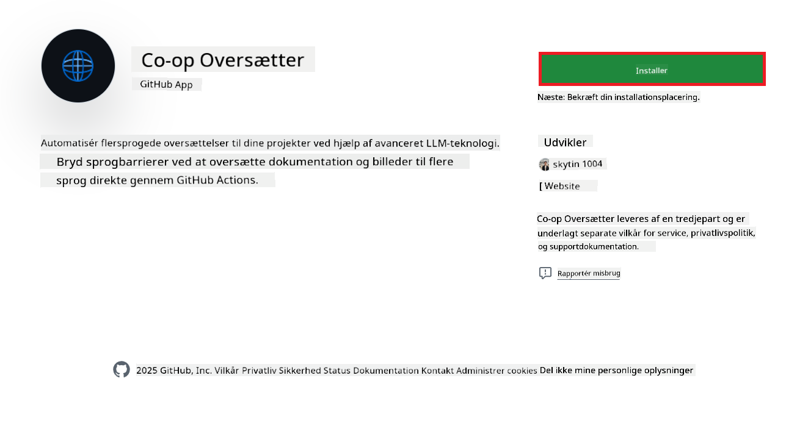
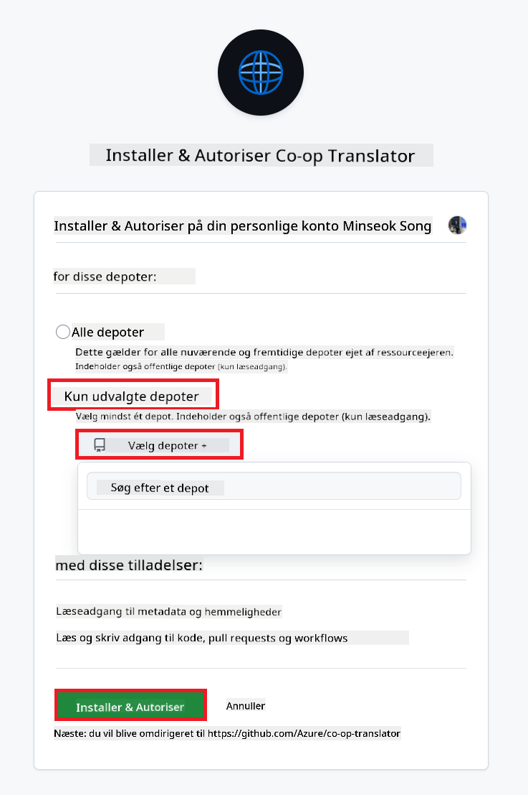
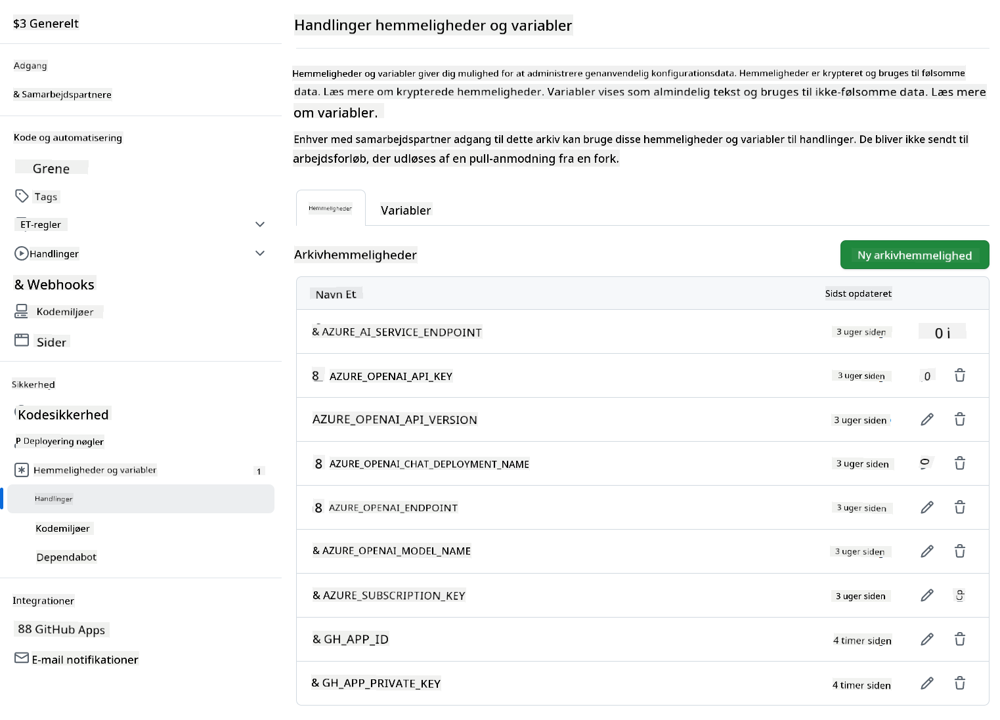

<!--
CO_OP_TRANSLATOR_METADATA:
{
  "original_hash": "c437820027c197f25fb2cbee95bae28c",
  "translation_date": "2025-06-12T19:11:30+00:00",
  "source_file": "getting_started/github-actions-guide/github-actions-guide-org.md",
  "language_code": "da"
}
-->
# Brug af Co-op Translator GitHub Action (Organisationsvejledning)

**Målgruppe:** Denne vejledning er rettet mod **Microsoft interne brugere** eller **teams, der har adgang til de nødvendige legitimationsoplysninger til den færdigbyggede Co-op Translator GitHub App** eller kan oprette deres egen brugerdefinerede GitHub App.

Automatiser oversættelsen af din repositories dokumentation nemt ved hjælp af Co-op Translator GitHub Action. Denne vejledning guider dig gennem opsætningen af action, så den automatisk opretter pull requests med opdaterede oversættelser, hver gang dine kilde Markdown-filer eller billeder ændres.

> [!IMPORTANT]
> 
> **Valg af den rette vejledning:**
>
> Denne vejledning beskriver opsætning ved brug af **GitHub App ID og en Privat Nøgle**. Du har typisk brug for denne "Organisationsvejledning"-metode, hvis: **`GITHUB_TOKEN` Rettigheder er Begrænsede:** Din organisation eller repository-indstillinger begrænser de standardrettigheder, der gives til den normale `GITHUB_TOKEN`. Specifikt, hvis `GITHUB_TOKEN` ikke har de nødvendige `write` rettigheder (som `contents: write` eller `pull-requests: write`), vil workflowet i [Public Setup Guide](./github-actions-guide-public.md) fejle på grund af manglende rettigheder. Brug af en dedikeret GitHub App med eksplicit tildelte rettigheder omgår denne begrænsning.
>
> **Hvis ovenstående ikke gælder for dig:**
>
> Hvis den standard `GITHUB_TOKEN` har tilstrækkelige rettigheder i dit repository (dvs. du ikke er blokeret af organisationsbegrænsninger), bedes du bruge **[Public Setup Guide ved brug af GITHUB_TOKEN](./github-actions-guide-public.md)**. Den offentlige vejledning kræver ikke at hente eller administrere App IDs eller Private Nøgler og baserer sig udelukkende på den standard `GITHUB_TOKEN` og repository rettigheder.

## Forudsætninger

Før du konfigurerer GitHub Action, skal du sikre dig, at du har de nødvendige AI service legitimationsoplysninger klar.

**1. Påkrævet: Legitimation til AI sprogmodel**  
Du skal have legitimationsoplysninger til mindst én understøttet Sprogmodel:

- **Azure OpenAI**: Kræver Endpoint, API-nøgle, Model-/Deploymentsnavne, API-version.  
- **OpenAI**: Kræver API-nøgle, (Valgfrit: Org ID, Base URL, Model ID).  
- Se [Supported Models and Services](../../../../README.md) for detaljer.  
- Opsætningsvejledning: [Opsæt Azure OpenAI](../set-up-resources/set-up-azure-openai.md).

**2. Valgfrit: Legitimation til Computer Vision (til billedoversættelse)**

- Kræves kun, hvis du skal oversætte tekst i billeder.  
- **Azure Computer Vision**: Kræver Endpoint og Abonnementsnøgle.  
- Hvis ikke angivet, anvender action standard [Markdown-only mode](../markdown-only-mode.md).  
- Opsætningsvejledning: [Opsæt Azure Computer Vision](../set-up-resources/set-up-azure-computer-vision.md).

## Opsætning og Konfiguration

Følg disse trin for at konfigurere Co-op Translator GitHub Action i dit repository:

### Trin 1: Installer og Konfigurer GitHub App Autentificering

Workflowet bruger GitHub App autentificering til sikkert at interagere med dit repository (fx oprette pull requests) på dine vegne. Vælg én af mulighederne:

#### **Mulighed A: Installer den færdigbyggede Co-op Translator GitHub App (til Microsoft Intern Brug)**

1. Gå til [Co-op Translator GitHub App](https://github.com/apps/co-op-translator) siden.

1. Vælg **Installér** og vælg den konto eller organisation, hvor dit målrepository ligger.

    

1. Vælg **Vælg kun specifikke repositories** og vælg dit målrepository (fx `PhiCookBook`). Klik **Installér**. Du kan blive bedt om at godkende.

    

1. **Indhent App-legitimationsoplysninger (Intern proces påkrævet):** For at workflowet kan autentificere som appen, skal du bruge to oplysninger fra Co-op Translator teamet:  
  - **App ID:** Den unikke identifikator for Co-op Translator appen. App ID er: `1164076`.  
  - **Privat Nøgle:** Du skal have **hele indholdet** af `.pem` private nøglefilen fra vedligeholderkontakt. **Behandl denne nøgle som en adgangskode og hold den sikker.**

1. Fortsæt til Trin 2.

#### **Mulighed B: Brug din egen brugerdefinerede GitHub App**

- Hvis du foretrækker det, kan du oprette og konfigurere din egen GitHub App. Sørg for, at den har Læs & skriv adgang til Contents og Pull requests. Du skal bruge dens App ID og en genereret Privat Nøgle.

### Trin 2: Konfigurer Repository Secrets

Du skal tilføje GitHub App legitimationsoplysninger og dine AI service legitimationsoplysninger som krypterede secrets i dine repository-indstillinger.

1. Gå til dit mål GitHub repository (fx `PhiCookBook`).

1. Gå til **Settings** > **Secrets and variables** > **Actions**.

1. Under **Repository secrets** klik **New repository secret** for hver af de nedenstående secrets.

   

**Påkrævede Secrets (til GitHub App autentificering):**

| Secret Name          | Beskrivelse                                      | Værdi Kilde                                     |
| :------------------- | :----------------------------------------------- | :----------------------------------------------- |
| `GH_APP_ID`          | App ID for GitHub App (fra Trin 1).               | GitHub App Indstillinger                         |
| `GH_APP_PRIVATE_KEY` | **Hele indholdet** af den downloadede `.pem` fil. | `.pem` fil (fra Trin 1)              |

**AI Service Secrets (Tilføj ALLE relevante baseret på dine forudsætninger):**

| Secret Name                         | Beskrivelse                               | Værdi Kilde                     |
| :---------------------------------- | :---------------------------------------- | :------------------------------- |
| `AZURE_SUBSCRIPTION_KEY`            | Nøgle til Azure AI Service (Computer Vision)  | Azure AI Foundry                    |
| `AZURE_AI_SERVICE_ENDPOINT`         | Endpoint for Azure AI Service (Computer Vision) | Azure AI Foundry                     |
| `AZURE_OPENAI_API_KEY`              | Nøgle til Azure OpenAI service              | Azure AI Foundry                     |
| `AZURE_OPENAI_ENDPOINT`             | Endpoint for Azure OpenAI service         | Azure AI Foundry                     |
| `AZURE_OPENAI_MODEL_NAME`           | Dit Azure OpenAI Modelnavn              | Azure AI Foundry                     |
| `AZURE_OPENAI_CHAT_DEPLOYMENT_NAME` | Dit Azure OpenAI Deploymentsnavn         | Azure AI Foundry                     |
| `AZURE_OPENAI_API_VERSION`          | API-version til Azure OpenAI              | Azure AI Foundry                     |
| `OPENAI_API_KEY`                    | API-nøgle til OpenAI                        | OpenAI Platform                  |
| `OPENAI_ORG_ID`                     | OpenAI Organisations ID                    | OpenAI Platform                  |
| `OPENAI_CHAT_MODEL_ID`              | Specifik OpenAI model ID                  | OpenAI Platform                    |
| `OPENAI_BASE_URL`                   | Brugerdefineret OpenAI API Base URL                | OpenAI Platform                    |



### Trin 3: Opret Workflow-filen

Til sidst opret YAML-filen, der definerer den automatiserede workflow.

1. I rodkataloget af dit repository, opret `.github/workflows/` mappen, hvis den ikke allerede findes.

1. Inde i `.github/workflows/` opret en fil med navnet `co-op-translator.yml`.

1. Indsæt følgende indhold i co-op-translator.yml.

```
name: Co-op Translator

on:
  push:
    branches:
      - main

jobs:
  co-op-translator:
    runs-on: ubuntu-latest

    permissions:
      contents: write
      pull-requests: write

    steps:
      - name: Checkout repository
        uses: actions/checkout@v4
        with:
          fetch-depth: 0

      - name: Set up Python
        uses: actions/setup-python@v4
        with:
          python-version: '3.10'

      - name: Install Co-op Translator
        run: |
          python -m pip install --upgrade pip
          pip install co-op-translator

      - name: Run Co-op Translator
        env:
          PYTHONIOENCODING: utf-8
          # Azure AI Service Credentials
          AZURE_SUBSCRIPTION_KEY: ${{ secrets.AZURE_SUBSCRIPTION_KEY }}
          AZURE_AI_SERVICE_ENDPOINT: ${{ secrets.AZURE_AI_SERVICE_ENDPOINT }}

          # Azure OpenAI Credentials
          AZURE_OPENAI_API_KEY: ${{ secrets.AZURE_OPENAI_API_KEY }}
          AZURE_OPENAI_ENDPOINT: ${{ secrets.AZURE_OPENAI_ENDPOINT }}
          AZURE_OPENAI_MODEL_NAME: ${{ secrets.AZURE_OPENAI_MODEL_NAME }}
          AZURE_OPENAI_CHAT_DEPLOYMENT_NAME: ${{ secrets.AZURE_OPENAI_CHAT_DEPLOYMENT_NAME }}
          AZURE_OPENAI_API_VERSION: ${{ secrets.AZURE_OPENAI_API_VERSION }}

          # OpenAI Credentials
          OPENAI_API_KEY: ${{ secrets.OPENAI_API_KEY }}
          OPENAI_ORG_ID: ${{ secrets.OPENAI_ORG_ID }}
          OPENAI_CHAT_MODEL_ID: ${{ secrets.OPENAI_CHAT_MODEL_ID }}
          OPENAI_BASE_URL: ${{ secrets.OPENAI_BASE_URL }}
        run: |
          # =====================================================================
          # IMPORTANT: Set your target languages here (REQUIRED CONFIGURATION)
          # =====================================================================
          # Example: Translate to Spanish, French, German. Add -y to auto-confirm.
          translate -l "es fr de" -y  # <--- MODIFY THIS LINE with your desired languages

      - name: Authenticate GitHub App
        id: generate_token
        uses: tibdex/github-app-token@v1
        with:
          app_id: ${{ secrets.GH_APP_ID }}
          private_key: ${{ secrets.GH_APP_PRIVATE_KEY }}

      - name: Create Pull Request with translations
        uses: peter-evans/create-pull-request@v5
        with:
          token: ${{ steps.generate_token.outputs.token }}
          commit-message: "🌐 Update translations via Co-op Translator"
          title: "🌐 Update translations via Co-op Translator"
          body: |
            This PR updates translations for recent changes to the main branch.

            ### 📋 Changes included
            - Translated contents are available in the `translations/` directory
            - Translated images are available in the `translated_images/` directory

            ---
            🌐 Automatically generated by the [Co-op Translator](https://github.com/Azure/co-op-translator) GitHub Action.
          branch: update-translations
          base: main
          labels: translation, automated-pr
          delete-branch: true
          add-paths: |
            translations/
            translated_images/

```

4.  **Tilpas Workflowet:**  
  - **[!IMPORTANT] Mål-sprog:** I `Run Co-op Translator` step, you **MUST review and modify the list of language codes** within the `translate -l "..." -y` command to match your project's requirements. The example list (`ar de es...`) needs to be replaced or adjusted.
  - **Trigger (`on:`):** The current trigger runs on every push to `main`. For large repositories, consider adding a `paths:` filter (see commented example in the YAML) to run the workflow only when relevant files (e.g., source documentation) change, saving runner minutes.
  - **PR Details:** Customize the `commit-message`, `title`, `body`, `branch` name, and `labels` in the `Create Pull Request` step if needed.

## Credential Management and Renewal

- **Security:** Always store sensitive credentials (API keys, private keys) as GitHub Actions secrets. Never expose them in your workflow file or repository code.
- **[!IMPORTANT] Key Renewal (Internal Microsoft Users):** Be aware that Azure OpenAI key used within Microsoft might have a mandatory renewal policy (e.g., every 5 months). Ensure you update the corresponding GitHub secrets (`AZURE_OPENAI_...` nøglerne) **før de udløber** for at forhindre fejl i workflowet.

## Kørsel af Workflowet

Når `co-op-translator.yml` filen er flettet ind i din main branch (eller den branch, der er angivet i `on:` trigger), the workflow will automatically run whenever changes are pushed to that branch (and match the `paths` filteret, hvis konfigureret).

Hvis der genereres eller opdateres oversættelser, vil action automatisk oprette en Pull Request med ændringerne, klar til din gennemgang og sammensmeltning.

**Ansvarsfraskrivelse**:  
Dette dokument er blevet oversat ved hjælp af AI-oversættelsestjenesten [Co-op Translator](https://github.com/Azure/co-op-translator). Selvom vi bestræber os på nøjagtighed, bedes du være opmærksom på, at automatiserede oversættelser kan indeholde fejl eller unøjagtigheder. Det oprindelige dokument på dets modersmål bør betragtes som den autoritative kilde. For kritisk information anbefales professionel menneskelig oversættelse. Vi påtager os intet ansvar for misforståelser eller fejltolkninger, der måtte opstå som følge af brugen af denne oversættelse.