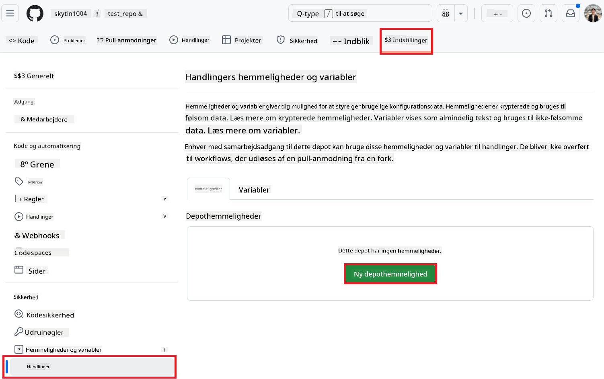
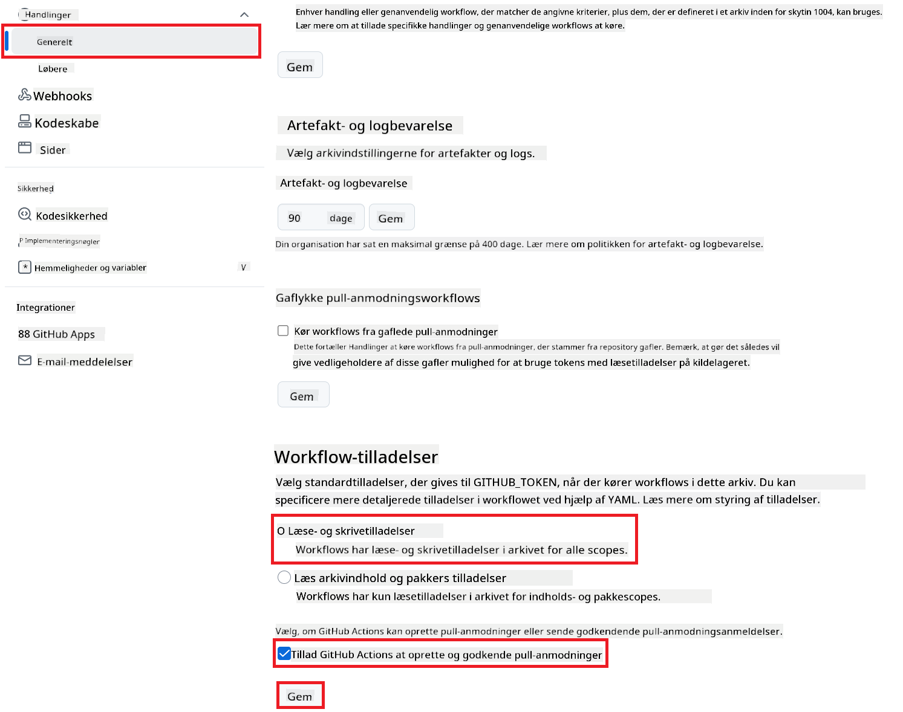

<!--
CO_OP_TRANSLATOR_METADATA:
{
  "original_hash": "a52587a512e667f70d92db853d3c61d5",
  "translation_date": "2025-06-12T19:30:00+00:00",
  "source_file": "getting_started/github-actions-guide/github-actions-guide-public.md",
  "language_code": "da"
}
-->
# Brug af Co-op Translator GitHub Action (Offentlig opsætning)

**Målgruppe:** Denne vejledning er tiltænkt brugere i de fleste offentlige eller private repositories, hvor standard GitHub Actions-tilladelser er tilstrækkelige. Den benytter den indbyggede `GITHUB_TOKEN`.

Automatiser oversættelsen af din repositories dokumentation nemt ved hjælp af Co-op Translator GitHub Action. Denne vejledning guider dig gennem opsætningen af action, så den automatisk opretter pull requests med opdaterede oversættelser, når dine kilde-Markdown-filer eller billeder ændres.

> [!IMPORTANT]
>
> **Valg af den rigtige vejledning:**
>
> Denne vejledning beskriver den **enklere opsætning ved brug af standard `GITHUB_TOKEN`**. Dette er den anbefalede metode for de fleste brugere, da den ikke kræver håndtering af følsomme GitHub App Private Keys.
>

## Forudsætninger

Før du konfigurerer GitHub Action, skal du sikre dig, at du har de nødvendige AI-service legitimationsoplysninger klar.

**1. Påkrævet: AI sprogmodel-legitimationsoplysninger**  
Du skal have legitimationsoplysninger til mindst én understøttet sprogmodel:

- **Azure OpenAI**: Kræver Endpoint, API-nøgle, Model-/Deployment-navne, API-version.  
- **OpenAI**: Kræver API-nøgle, (valgfrit: Org ID, Base URL, Model ID).  
- Se [Supported Models and Services](../../../../README.md) for detaljer.

**2. Valgfrit: AI Vision legitimationsoplysninger (til billedoversættelse)**

- Kræves kun, hvis du skal oversætte tekst i billeder.  
- **Azure AI Vision**: Kræver Endpoint og Subscription Key.  
- Hvis ikke angivet, bruger action som standard [Markdown-only mode](../markdown-only-mode.md).

## Opsætning og konfiguration

Følg disse trin for at konfigurere Co-op Translator GitHub Action i dit repository ved hjælp af standard `GITHUB_TOKEN`.

### Trin 1: Forstå autentificering (Brug af `GITHUB_TOKEN`)

Dette workflow bruger den indbyggede `GITHUB_TOKEN`, som leveres af GitHub Actions. Denne token giver automatisk workflowet de nødvendige tilladelser til at interagere med dit repository baseret på de indstillinger, der konfigureres i **Trin 3**.

### Trin 2: Konfigurer repository-secrets

Du skal kun tilføje dine **AI-service legitimationsoplysninger** som krypterede secrets i dine repository-indstillinger.

1.  Gå til dit mål-GitHub repository.  
2.  Vælg **Settings** > **Secrets and variables** > **Actions**.  
3.  Under **Repository secrets**, klik på **New repository secret** for hver nødvendig AI-service secret, der er listet nedenfor.

     *(Billedreference: Viser hvor secrets tilføjes)*

**Påkrævede AI-service secrets (Tilføj ALLE der gælder ud fra dine forudsætninger):**

| Secret Name                         | Beskrivelse                               | Kilde til værdi                  |
| :---------------------------------- | :---------------------------------------- | :------------------------------- |
| `AZURE_SUBSCRIPTION_KEY`            | Nøgle til Azure AI Service (Computer Vision)  | Din Azure AI Foundry              |
| `AZURE_AI_SERVICE_ENDPOINT`         | Endpoint til Azure AI Service (Computer Vision) | Din Azure AI Foundry              |
| `AZURE_OPENAI_API_KEY`              | Nøgle til Azure OpenAI service              | Din Azure AI Foundry              |
| `AZURE_OPENAI_ENDPOINT`             | Endpoint til Azure OpenAI service         | Din Azure AI Foundry              |
| `AZURE_OPENAI_MODEL_NAME`           | Dit Azure OpenAI Modelnavn                 | Din Azure AI Foundry              |
| `AZURE_OPENAI_CHAT_DEPLOYMENT_NAME` | Dit Azure OpenAI Deployment-navn           | Din Azure AI Foundry              |
| `AZURE_OPENAI_API_VERSION`          | API-version for Azure OpenAI               | Din Azure AI Foundry              |
| `OPENAI_API_KEY`                    | API-nøgle til OpenAI                       | Din OpenAI Platform              |
| `OPENAI_ORG_ID`                     | OpenAI Organisations-ID (valgfri)          | Din OpenAI Platform              |
| `OPENAI_CHAT_MODEL_ID`              | Specifikt OpenAI model-ID (valgfri)        | Din OpenAI Platform              |
| `OPENAI_BASE_URL`                   | Custom OpenAI API Base URL (valgfri)        | Din OpenAI Platform              |

### Trin 3: Konfigurer workflow-tilladelser

GitHub Action skal have tilladelser via `GITHUB_TOKEN` til at checke kode ud og oprette pull requests.

1.  Gå til **Settings** > **Actions** > **General** i dit repository.  
2.  Scroll ned til sektionen **Workflow permissions**.  
3.  Vælg **Read and write permissions**. Dette giver `GITHUB_TOKEN` de nødvendige `contents: write` og `pull-requests: write` tilladelser til dette workflow.  
4.  Sørg for, at boksen **Allow GitHub Actions to create and approve pull requests** er **markeret**.  
5.  Vælg **Save**.



### Trin 4: Opret workflow-filen

Til sidst opretter du YAML-filen, der definerer det automatiserede workflow ved brug af `GITHUB_TOKEN`.

1.  Opret `.github/workflows/` mappen i rodmappen af dit repository, hvis den ikke allerede findes.  
2.  Inde i `.github/workflows/` opretter du en fil med navnet `co-op-translator.yml`.  
3.  Indsæt følgende indhold i `co-op-translator.yml`.

```yaml
name: Co-op Translator

on:
  push:
    branches:
      - main

jobs:
  co-op-translator:
    runs-on: ubuntu-latest

    permissions:
      contents: write
      pull-requests: write

    steps:
      - name: Checkout repository
        uses: actions/checkout@v4
        with:
          fetch-depth: 0

      - name: Set up Python
        uses: actions/setup-python@v4
        with:
          python-version: '3.10'

      - name: Install Co-op Translator
        run: |
          python -m pip install --upgrade pip
          pip install co-op-translator

      - name: Run Co-op Translator
        env:
          PYTHONIOENCODING: utf-8
          # === AI Service Credentials ===
          AZURE_SUBSCRIPTION_KEY: ${{ secrets.AZURE_SUBSCRIPTION_KEY }}
          AZURE_AI_SERVICE_ENDPOINT: ${{ secrets.AZURE_AI_SERVICE_ENDPOINT }}
          AZURE_OPENAI_API_KEY: ${{ secrets.AZURE_OPENAI_API_KEY }}
          AZURE_OPENAI_ENDPOINT: ${{ secrets.AZURE_OPENAI_ENDPOINT }}
          AZURE_OPENAI_MODEL_NAME: ${{ secrets.AZURE_OPENAI_MODEL_NAME }}
          AZURE_OPENAI_CHAT_DEPLOYMENT_NAME: ${{ secrets.AZURE_OPENAI_CHAT_DEPLOYMENT_NAME }}
          AZURE_OPENAI_API_VERSION: ${{ secrets.AZURE_OPENAI_API_VERSION }}
          OPENAI_API_KEY: ${{ secrets.OPENAI_API_KEY }}
          OPENAI_ORG_ID: ${{ secrets.OPENAI_ORG_ID }}
          OPENAI_CHAT_MODEL_ID: ${{ secrets.OPENAI_CHAT_MODEL_ID }}
          OPENAI_BASE_URL: ${{ secrets.OPENAI_BASE_URL }}
        run: |
          # =====================================================================
          # IMPORTANT: Set your target languages here (REQUIRED CONFIGURATION)
          # =====================================================================
          # Example: Translate to Spanish, French, German. Add -y to auto-confirm.
          translate -l "es fr de" -y  # <--- MODIFY THIS LINE with your desired languages

      - name: Create Pull Request with translations
        uses: peter-evans/create-pull-request@v5
        with:
          token: ${{ secrets.GITHUB_TOKEN }}
          commit-message: "🌐 Update translations via Co-op Translator"
          title: "🌐 Update translations via Co-op Translator"
          body: |
            This PR updates translations for recent changes to the main branch.

            ### 📋 Changes included
            - Translated contents are available in the `translations/` directory
            - Translated images are available in the `translated_images/` directory

            ---
            🌐 Automatically generated by the [Co-op Translator](https://github.com/Azure/co-op-translator) GitHub Action.
          branch: update-translations
          base: main
          labels: translation, automated-pr
          delete-branch: true
          add-paths: |
            translations/
            translated_images/
```  
4.  **Tilpas workflowet:**  
  - **[!IMPORTANT] Mål-sprog:** I `Run Co-op Translator` step, you **MUST review and modify the list of language codes** within the `translate -l "..." -y` command to match your project's requirements. The example list (`ar de es...`) needs to be replaced or adjusted.
  - **Trigger (`on:`):** The current trigger runs on every push to `main`. For large repositories, consider adding a `paths:` filter (see commented example in the YAML) to run the workflow only when relevant files (e.g., source documentation) change, saving runner minutes.
  - **PR Details:** Customize the `commit-message`, `title`, `body`, `branch` name, and `labels` in the `Create Pull Request`-steppet efter behov.

**Ansvarsfraskrivelse**:  
Dette dokument er blevet oversat ved hjælp af AI-oversættelsestjenesten [Co-op Translator](https://github.com/Azure/co-op-translator). Selvom vi bestræber os på nøjagtighed, bedes du være opmærksom på, at automatiserede oversættelser kan indeholde fejl eller unøjagtigheder. Det oprindelige dokument på dets modersmål bør betragtes som den autoritative kilde. For kritisk information anbefales professionel menneskelig oversættelse. Vi påtager os intet ansvar for eventuelle misforståelser eller fejltolkninger, der opstår som følge af brugen af denne oversættelse.