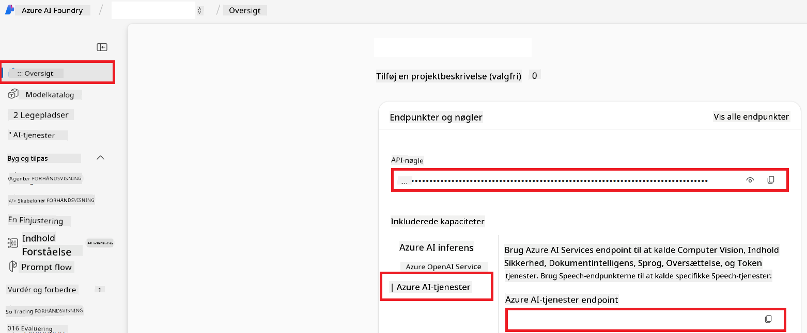

<!--
CO_OP_TRANSLATOR_METADATA:
{
  "original_hash": "b58d7c3cb4210697a073d20eb3064945",
  "translation_date": "2025-06-12T11:54:03+00:00",
  "source_file": "getting_started/set-up-azure-ai.md",
  "language_code": "da"
}
-->
# Opsæt Azure AI til Co-op Translator (Azure OpenAI & Azure AI Vision)

Denne vejledning guider dig igennem opsætningen af Azure OpenAI til sprogoversættelse og Azure Computer Vision til billedindholdsanalyse (som derefter kan bruges til billedbaseret oversættelse) inden for Azure AI Foundry.

**Forudsætninger:**
- En Azure-konto med et aktivt abonnement.
- Tilstrækkelige tilladelser til at oprette ressourcer og implementeringer i dit Azure-abonnement.

## Opret et Azure AI-projekt

Du starter med at oprette et Azure AI-projekt, som fungerer som et centralt sted til at administrere dine AI-ressourcer.

1. Gå til [https://ai.azure.com](https://ai.azure.com) og log ind med din Azure-konto.

1. Vælg **+Create** for at oprette et nyt projekt.

1. Udfør følgende opgaver:
   - Indtast et **Projektnavn** (f.eks. `CoopTranslator-Project`).
   - Vælg **AI hub** (f.eks. `CoopTranslator-Hub`) (Opret en ny, hvis nødvendigt).

1. Klik på "**Review and Create**" for at oprette dit projekt. Du vil blive ført til projektets oversigtsside.

## Opsæt Azure OpenAI til sprogoversættelse

Inden for dit projekt vil du implementere en Azure OpenAI-model, som skal fungere som backend til tekstoversættelse.

### Naviger til dit projekt

Hvis du ikke allerede er der, så åbn dit nyligt oprettede projekt (f.eks. `CoopTranslator-Project`) i Azure AI Foundry.

### Implementer en OpenAI-model

1. Fra projektets venstremenu, under "My assets", vælg "**Models + endpoints**".

1. Vælg **+ Deploy model**.

1. Vælg **Deploy Base Model**.

1. Du vil få vist en liste over tilgængelige modeller. Filtrer eller søg efter en passende GPT-model. Vi anbefaler `gpt-4o`.

1. Vælg din ønskede model og klik på **Confirm**.

1. Vælg **Deploy**.

### Azure OpenAI-konfiguration

Når modellen er implementeret, kan du vælge implementeringen fra siden "**Models + endpoints**" for at finde dens **REST endpoint URL**, **Key**, **Deployment name**, **Model name** og **API version**. Disse oplysninger skal bruges til at integrere oversættelsesmodellen i din applikation.

> [!NOTE]
> Du kan vælge API-versioner fra siden [API version deprecation](https://learn.microsoft.com/azure/ai-services/openai/api-version-deprecation) baseret på dine behov. Vær opmærksom på, at **API version** er forskellig fra den **Model version**, der vises på siden **Models + endpoints** i Azure AI Foundry.

## Opsæt Azure Computer Vision til billedoversættelse

For at muliggøre oversættelse af tekst i billeder skal du finde Azure AI Service API Key og Endpoint.

1. Gå til dit Azure AI-projekt (f.eks. `CoopTranslator-Project`). Sørg for, at du er på projektets oversigtsside.

### Azure AI Service-konfiguration

Find API Key og Endpoint fra Azure AI Service.

1. Gå til dit Azure AI-projekt (f.eks. `CoopTranslator-Project`). Sørg for, at du er på projektets oversigtsside.

1. Find **API Key** og **Endpoint** under Azure AI Service-fanen.

    

Denne forbindelse gør funktionerne i den tilknyttede Azure AI Services-ressource (inklusive billedanalyse) tilgængelige for dit AI Foundry-projekt. Du kan derefter bruge denne forbindelse i dine notesbøger eller applikationer til at udtrække tekst fra billeder, som efterfølgende kan sendes til Azure OpenAI-modellen til oversættelse.

## Samling af dine legitimationsoplysninger

Nu burde du have samlet følgende:

**For Azure OpenAI (Tekstoversættelse):**
- Azure OpenAI Endpoint
- Azure OpenAI API Key
- Azure OpenAI Model Name (f.eks. `gpt-4o`)
- Azure OpenAI Deployment Name (f.eks. `cooptranslator-gpt4o`)
- Azure OpenAI API Version

**For Azure AI Services (Udtrækning af tekst fra billeder via Vision):**
- Azure AI Service Endpoint
- Azure AI Service API Key

### Eksempel: Konfiguration af miljøvariabler (Preview)

Senere, når du bygger din applikation, vil du sandsynligvis konfigurere den ved hjælp af disse indsamlede legitimationsoplysninger. For eksempel kan du sætte dem som miljøvariabler som følger:

```bash
# Azure AI Service Credentials (Required for image translation)
AZURE_AI_SERVICE_API_KEY="your_azure_ai_service_api_key" # e.g., 21xasd...
AZURE_AI_SERVICE_ENDPOINT="https://your_azure_ai_service_endpoint.cognitiveservices.azure.com/"

# Azure OpenAI Credentials (Required for text translation)
AZURE_OPENAI_API_KEY="your_azure_openai_api_key" # e.g., 21xasd...
AZURE_OPENAI_ENDPOINT="https://your_azure_openai_endpoint.openai.azure.com/"
AZURE_OPENAI_MODEL_NAME="your_model_name" # e.g., gpt-4o
AZURE_OPENAI_CHAT_DEPLOYMENT_NAME="your_deployment_name" # e.g., cooptranslator-gpt4o
AZURE_OPENAI_API_VERSION="your_api_version" # e.g., 2024-12-01-preview
```

---

### Yderligere læsning

- [How to Create a project in Azure AI Foundry](https://learn.microsoft.com/azure/ai-foundry/how-to/create-projects?tabs=ai-studio)
- [How to Create Azure AI resources](https://learn.microsoft.com/azure/ai-foundry/how-to/create-azure-ai-resource?tabs=portal)
- [How to Deploy OpenAI models in Azure AI Foundry](https://learn.microsoft.com/en-us/azure/ai-foundry/how-to/deploy-models-openai)

**Ansvarsfraskrivelse**:  
Dette dokument er oversat ved hjælp af AI-oversættelsestjenesten [Co-op Translator](https://github.com/Azure/co-op-translator). Selvom vi bestræber os på nøjagtighed, bedes du være opmærksom på, at automatiserede oversættelser kan indeholde fejl eller unøjagtigheder. Det oprindelige dokument på dets oprindelige sprog bør betragtes som den autoritative kilde. For kritisk information anbefales professionel menneskelig oversættelse. Vi påtager os intet ansvar for misforståelser eller fejltolkninger, der måtte opstå som følge af brugen af denne oversættelse.