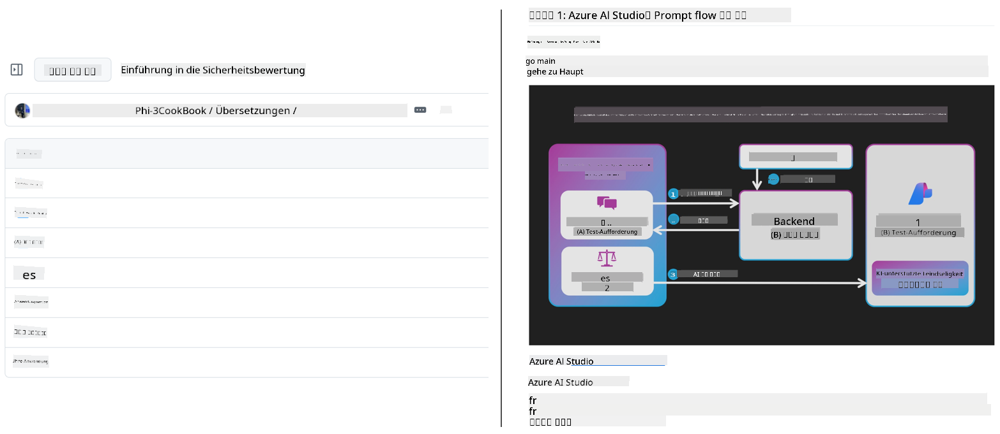
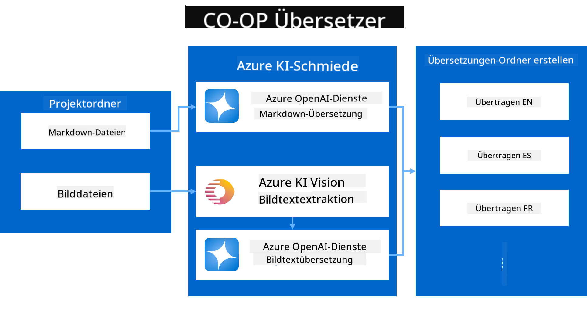
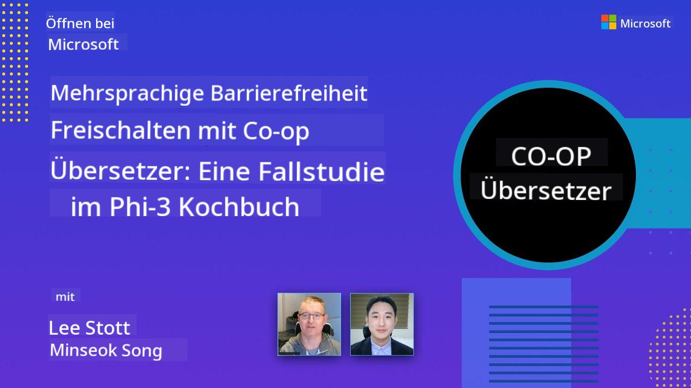

<!--
CO_OP_TRANSLATOR_METADATA:
{
  "original_hash": "044724537b57868117aadae8e7728c7c",
  "translation_date": "2025-06-12T09:50:43+00:00",
  "source_file": "README.md",
  "language_code": "de"
}
-->


# Co-op Translator: Automatisiere mühelos die Übersetzung von Bildungsdokumentationen

_Automatisiere ganz einfach die Übersetzung deiner Dokumentation in mehrere Sprachen, um ein weltweites Publikum zu erreichen._

[](https://pypi.org/project/co-op-translator/)
[](https://github.com/azure/co-op-translator/blob/main/LICENSE)
[](https://pepy.tech/project/co-op-translator)
[](https://pepy.tech/project/co-op-translator)
[](https://github.com/psf/black)

[](https://GitHub.com/azure/co-op-translator/graphs/contributors/)
[](https://GitHub.com/azure/co-op-translator/issues/)
[](https://GitHub.com/azure/co-op-translator/pulls/)
[](http://makeapullrequest.com)

### Sprachunterstützung bereitgestellt von Co-op Translator
[Französisch](../fr/README.md) | [Spanisch](../es/README.md) | [Deutsch](./README.md) | [Russisch](../ru/README.md) | [Arabisch](../ar/README.md) | [Persisch (Farsi)](../fa/README.md) | [Urdu](../ur/README.md) | [Chinesisch (Vereinfacht)](../zh/README.md) | [Chinesisch (Traditionell, Macau)](../mo/README.md) | [Chinesisch (Traditionell, Hongkong)](../hk/README.md) | [Chinesisch (Traditionell, Taiwan)](../tw/README.md) | [Japanisch](../ja/README.md) | [Koreanisch](../ko/README.md) | [Hindi](../hi/README.md) | [Bengalisch](../bn/README.md) | [Marathi](../mr/README.md) | [Nepalesisch](../ne/README.md) | [Punjabi (Gurmukhi)](../pa/README.md) | [Portugiesisch (Portugal)](../pt/README.md) | [Portugiesisch (Brasilien)](../br/README.md) | [Italienisch](../it/README.md) | [Polnisch](../pl/README.md) | [Türkisch](../tr/README.md) | [Griechisch](../el/README.md) | [Thailändisch](../th/README.md) | [Schwedisch](../sv/README.md) | [Dänisch](../da/README.md) | [Norwegisch](../no/README.md) | [Finnisch](../fi/README.md) | [Niederländisch](../nl/README.md) | [Hebräisch](../he/README.md) | [Vietnamesisch](../vi/README.md) | [Indonesisch](../id/README.md) | [Malaiisch](../ms/README.md) | [Tagalog (Filipino)](../tl/README.md) | [Suaheli](../sw/README.md) | [Ungarisch](../hu/README.md) | [Tschechisch](../cs/README.md) | [Slowakisch](../sk/README.md) | [Rumänisch](../ro/README.md) | [Bulgarisch](../bg/README.md) | [Serbisch (Kyrillisch)](../sr/README.md) | [Kroatisch](../hr/README.md) | [Slowenisch](../sl/README.md) | [Ukrainisch](../uk/README.md) | [Birmanisch (Myanmar)](../my/README.md)
> [!NOTE]  
> Dies sind die aktuellen Übersetzungen des Inhalts dieses Repositories. Für eine vollständige Liste der von Co-op Translator unterstützten Sprachen siehe bitte den Abschnitt [Language Support](../..).

[](https://GitHub.com/azure/co-op-translator/watchers/)  
[](https://GitHub.com/azure/co-op-translator/network/)  
[](https://GitHub.com/azure/co-op-translator/stargazers/)

[](https://discord.com/invite/ByRwuEEgH4)

[](https://codespaces.new/azure/co-op-translator)  
[](https://vscode.dev/redirect?url=vscode://ms-vscode-remote.remote-containers/cloneInVolume?url=https://github.com/azure/co-op-translator)

## Überblick: Vereinfachen Sie die Übersetzung Ihrer Bildungsinhalte

Sprachbarrieren erschweren weltweit den Zugang zu wertvollen Bildungsressourcen und technischem Wissen für Lernende und Entwickler. Das begrenzt die Teilnahme und verlangsamt den Fortschritt bei globaler Innovation und Lernen.

**Co-op Translator** entstand aus dem Bedürfnis, den ineffizienten manuellen Übersetzungsprozess für Microsofts eigene groß angelegte Bildungsreihen (wie die „For Beginners“-Anleitungen) zu verbessern. Daraus entwickelte sich ein benutzerfreundliches und leistungsstarkes Tool, das diese Barrieren für alle abbaut. Durch hochwertige automatisierte Übersetzungen via CLI und GitHub Actions ermöglicht Co-op Translator Pädagogen, Studierenden, Forschern und Entwicklern weltweit, Wissen ohne Sprachbarrieren zu teilen und zu nutzen.

So organisiert Co-op Translator übersetzte Bildungsinhalte:



Markdown-Dateien und Bildtexte werden automatisch übersetzt und übersichtlich in sprachspezifischen Ordnern abgelegt.

**Ermöglichen Sie heute mit Co-op Translator den globalen Zugang zu Ihren Bildungsinhalten!**

## Unterstützung des globalen Zugangs zu Microsofts Lernressourcen

Co-op Translator hilft, die Sprachbarriere für wichtige Microsoft-Bildungsinitiativen zu überbrücken und automatisiert den Übersetzungsprozess für Repositories, die einer globalen Entwickler-Community dienen. Beispiele, die aktuell Co-op Translator nutzen:

[](https://github.com/microsoft/Generative-AI-for-beginners)  
[](https://github.com/microsoft/ML-For-Beginners)  
[](https://github.com/microsoft/AI-For-Beginners)  
[](https://github.com/microsoft/ai-agents-for-beginners)  
[](https://github.com/microsoft/PhiCookBook)  
[](https://github.com/microsoft/Generative-AI-for-beginners-dotnet)

## Hauptfunktionen

- **Automatisierte Übersetzungen**: Übersetzen Sie Texte mühelos in mehrere Sprachen.  
- **Integration mit GitHub Actions**: Automatisieren Sie Übersetzungen als Teil Ihrer CI/CD-Pipeline.  
- **Markdown-Erhaltung**: Behalten Sie die korrekte Markdown-Syntax während der Übersetzung bei.  
- **Bildtextübersetzung**: Extrahieren und übersetzen Sie Texte innerhalb von Bildern.  
- **Fortschrittliche LLM-Technologie**: Nutzen Sie moderne Sprachmodelle für hochwertige Übersetzungen.  
- **Einfache Integration**: Nahtlose Einbindung in Ihre bestehende Projektumgebung.  
- **Lokalisierung vereinfachen**: Optimieren Sie den Prozess, Ihr Projekt für internationale Märkte zu lokalisieren.

## Funktionsweise



Co-op Translator nimmt Markdown-Dateien und Bilder aus Ihrem Projektordner und verarbeitet sie wie folgt:

1. **Textextraktion**: Extrahiert Text aus Markdown-Dateien und, falls konfiguriert (z. B. mit Azure AI Vision), auch aus eingebetteten Bildtexten.  
1. **KI-Übersetzung**: Sendet den extrahierten Text an das konfigurierte LLM (Azure OpenAI, OpenAI usw.) zur Übersetzung.  
1. **Ergebnis speichern**: Speichert die übersetzten Markdown-Dateien und Bilder (mit übersetztem Text) in sprachspezifischen Ordnern und bewahrt dabei die ursprüngliche Formatierung.

## Erste Schritte

Starten Sie schnell mit der CLI oder richten Sie eine vollständige Automatisierung mit GitHub Actions ein. Wählen Sie den Ansatz, der am besten zu Ihrem Workflow passt:

1. **Command Line (CLI)** – Für einmalige Übersetzungen oder manuelle Steuerung  
2. **GitHub Actions** – Für automatisierte Übersetzungen bei jedem Push

> [!NOTE]  
> Obwohl dieses Tutorial sich auf Azure-Ressourcen konzentriert, können Sie jedes unterstützte Sprachmodell verwenden.

### Sprachunterstützung

Co-op Translator unterstützt eine Vielzahl von Sprachen, damit Sie ein globales Publikum erreichen können. Hier die wichtigsten Informationen:

#### Schnelle Übersicht

| Sprache           | Code | Sprache                 | Code | Sprache              | Code |
|-------------------|------|-------------------------|------|----------------------|------|
| Arabisch          | ar   | Bengalisch              | bn   | Bulgarisch           | bg   |
| Birmanisch (Myanmar) | my   | Chinesisch (vereinfacht) | zh   | Chinesisch (trad., HK) | hk   |
| Chinesisch (trad., Macau) | mo   | Chinesisch (trad., TW)   | tw   | Kroatisch            | hr   |
| Tschechisch       | cs   | Dänisch                 | da   | Niederländisch       | nl   |
| Finnisch          | fi   | Französisch             | fr   | Deutsch              | de   |
| Griechisch        | el   | Hebräisch               | he   | Hindi                | hi   |
| Ungarisch         | hu   | Indonesisch             | id   | Italienisch          | it   |
| Japanisch         | ja   | Koreanisch              | ko   | Malaiisch            | ms   |
| Marathi           | mr   | Nepalesisch             | ne   | Norwegisch           | no   |
| Persisch (Farsi)  | fa   | Polnisch                | pl   | Portugiesisch (Brasilien) | br   |
| Portugiesisch (Portugal) | pt   | Punjabi (Gurmukhi)       | pa   | Rumänisch            | ro   |
| Russisch          | ru   | Serbisch (Kyrillisch)   | sr   | Slowakisch           | sk   |
| Slowenisch        | sl   | Spanisch                | es   | Suaheli              | sw   |
| Schwedisch        | sv   | Tagalog (Filipino)      | tl   | Thailändisch         | th   |
| Türkisch          | tr   | Ukrainisch              | uk   | Urdu                 | ur   |
| Vietnamesisch     | vi   | —                       | —    | —                    | —    |

#### Verwendung der Sprachcodes

Bei der Nutzung von Co-op Translator müssen Sie die Sprachen über deren Codes angeben. Zum Beispiel:

```bash
# Translate to French, Spanish, and German
translate -l "fr es de"

# Translate to Chinese (Simplified) and Japanese
translate -l "zh ja"
```

> [!NOTE]  
> Für technische Details zur Sprachunterstützung, einschließlich:  
>  
> - Schriftartspezifikationen für jede Sprache  
> - Bekannte Probleme  
> - Wie man neue Sprachen hinzufügt  
>  
> siehe unsere [Dokumentation zu unterstützten Sprachen](./getting_started/supported-languages.md).

### Unterstützte Modelle und Dienste

| Typ                  | Name                           |
|-----------------------|--------------------------------|
| Sprachmodell          |   |
| KI Vision             |  |

> [!NOTE]  
> Wenn kein AI Vision-Dienst verfügbar ist, wechselt der Co-op Translator automatisch in den [Markdown-only mode](./getting_started/markdown-only-mode.md).

### Erste Einrichtung

Bevor Sie starten, richten Sie folgende Ressourcen ein:

1. Sprachmodell-Ressource (erforderlich):  
   - Azure OpenAI (empfohlen) – Bietet hochwertige Übersetzungen mit Unternehmenszuverlässigkeit  
   - OpenAI – Alternative, falls Sie keinen Azure-Zugang haben  
   - Für Details zu unterstützten Modellen siehe [Supported Models and Services](../..)

1. AI Vision-Ressource (optional):  
   - Azure AI Vision – Ermöglicht die Übersetzung von Text in Bildern  
   - Ohne Konfiguration nutzt der Übersetzer automatisch den [Markdown-only mode](./getting_started/markdown-only-mode.md)  
   - Empfohlen für Projekte mit Bildern, die übersetzten Text enthalten

1. Konfigurationsschritte:  
   - Folgen Sie unserer [Azure AI Einrichtung](./getting_started/set-up-azure-ai.md) für detaillierte Anweisungen  
   - Erstellen Sie eine `.env`-Datei mit Ihren API-Schlüsseln und Endpunkten (siehe Abschnitt [Quick Start](../..))  
   - Stellen Sie sicher, dass Sie die erforderlichen Berechtigungen und Kontingente für die gewählten Dienste haben

### Projekteinstellung vor der Übersetzung

Bereiten Sie Ihr Projekt vor dem Übersetzungsstart wie folgt vor:

1. README vorbereiten:  
   - Fügen Sie eine Übersetzungstabelle in Ihre README.md ein, die auf die übersetzten Versionen verweist  
   - Beispiel-Format:

     ```markdown

     ### 🌐 Multi-Language Support
     
     [French](../fr/README.md) | [Spanish](../es/README.md) | [German](./README.md) | [Russian](../ru/README.md) | [Arabic](../ar/README.md) | [Persian (Farsi)](../fa/README.md) | [Urdu](../ur/README.md) | [Chinese (Simplified)](../zh/README.md) | [Chinese (Traditional, Macau)](../mo/README.md) | [Chinese (Traditional, Hong Kong)](../hk/README.md) | [Chinese (Traditional, Taiwan)](../tw/README.md) | [Japanese](../ja/README.md) | [Korean](../ko/README.md) | [Hindi](../hi/README.md) | [Bengali](../bn/README.md) | [Marathi](../mr/README.md) | [Nepali](../ne/README.md) | [Punjabi (Gurmukhi)](../pa/README.md) | [Portuguese (Portugal)](../pt/README.md) | [Portuguese (Brazil)](../br/README.md) | [Italian](../it/README.md) | [Polish](../pl/README.md) | [Turkish](../tr/README.md) | [Greek](../el/README.md) | [Thai](../th/README.md) | [Swedish](../sv/README.md) | [Danish](../da/README.md) | [Norwegian](../no/README.md) | [Finnish](../fi/README.md) | [Dutch](../nl/README.md) | [Hebrew](../he/README.md) | [Vietnamese](../vi/README.md) | [Indonesian](../id/README.md) | [Malay](../ms/README.md) | [Tagalog (Filipino)](../tl/README.md) | [Swahili](../sw/README.md) | [Hungarian](../hu/README.md) | [Czech](../cs/README.md) | [Slovak](../sk/README.md) | [Romanian](../ro/README.md) | [Bulgarian](../bg/README.md) | [Serbian (Cyrillic)](../sr/README.md) | [Croatian](../hr/README.md) | [Slovenian](../sl/README.md) | [Ukrainian](../uk/README.md) | [Burmese (Myanmar)](../my/README.md) 
    
     ```

1. Bestehende Übersetzungen bereinigen (falls nötig):  
   - Entfernen Sie vorhandene Übersetzungsordner (z. B. `translations/`)  
   - Löschen Sie alte Übersetzungsdateien für einen sauberen Start  
   - So vermeiden Sie Konflikte mit dem neuen Übersetzungsprozess

### Schnellstart: Kommandozeile

Für einen schnellen Einstieg über die Kommandozeile:

1. Erstellen Sie eine virtuelle Umgebung:

    ```bash
    python -m venv .venv
    ```

1. Aktivieren Sie die virtuelle Umgebung:

    - Unter Windows:

    ```bash
    .venv\scripts\activate
    ```

    - Unter Linux/macOS:

    ```bash
    source .venv/bin/activate
    ```

1. Installieren Sie das Paket:

    ```bash
    pip install co-op-translator
    ```

1. Zugangsdaten konfigurieren:

    - Erstellen Sie eine `.env` file in your project's root directory.
    - Copy the contents from the [.env.template](../../.env.template) file into your new `.env` file.
    - Fill in the required API keys and endpoint information in your `.env` file.

1. Run Translation:
    - Navigate to your project's root directory in your terminal.
    - Execute the translate command, specifying target languages with the `-l`-Datei:

    ```bash
    translate -l "ko ja fr"
    ```

_(Ersetzen Sie `"ko ja fr"` with your desired space-separated language codes)_

### Detailed Usage Guides

Choose the approach that best fits your workflow:

#### 1. Using the Command Line (CLI)

- Best for: One-time translations, manual control, or integration into custom scripts.
- Requires: Local installation of Python and the `co-op-translator` package.
- Guide: [Command Line Guide](./getting_started/command-line-guide/command-line-guide.md)

#### 2. Using GitHub Actions (Automation)

- Best for: Automatically translating content whenever changes are pushed to your repository. Keeps translations consistently up-to-date.
- Requires: Setting up a workflow file (`.github/workflows`) in Ihrem Repository. Keine lokale Installation erforderlich.  
- Anleitungen:  
  - [GitHub Actions Guide (öffentliche Repositories & Standard-Secrets)](./getting_started/github-actions-guide/github-actions-guide-public.md) – Für die meisten öffentlichen oder privaten Repositories, die Standard-Secrets nutzen.  
  - [GitHub Actions Guide (Microsoft Organisations-Repos & Org-Level Setups)](./getting_started/github-actions-guide/github-actions-guide-org.md) – Für Nutzer innerhalb der Microsoft GitHub-Organisation oder wenn organisationweite Secrets oder Runner verwendet werden sollen.

### Fehlerbehebung und Tipps

- [Fehlerbehebungsanleitung](./getting_started/troubleshooting.md)

### Weitere Ressourcen

- [Befehlsreferenz](./getting_started/command-reference.md): Ausführliche Anleitung zu allen verfügbaren Befehlen und Optionen.  
- [Unterstützte Sprachen](./getting_started/supported-languages.md): Liste unterstützter Sprachen und Anleitungen zum Hinzufügen neuer Sprachen.  
- [Markdown-Only Mode](./getting_started/markdown-only-mode.md): Anleitung zur reinen Textübersetzung ohne Bildübersetzung.

## Video-Präsentationen

Erfahren Sie mehr über Co-op Translator durch unsere Präsentationen _(Klicken Sie auf das Bild unten, um es auf YouTube anzusehen.)_:

- **Open at Microsoft**: Eine kurze 18-minütige Einführung und schnelle Anleitung zur Nutzung von Co-op Translator.
[](https://www.youtube.com/watch?v=jX_swfH_KNU)

## Unterstützen Sie uns und fördern Sie globales Lernen

Seien Sie dabei, wenn wir die Art und Weise revolutionieren, wie Bildungsinhalte weltweit geteilt werden! Geben Sie [Co-op Translator](https://github.com/azure/co-op-translator) auf GitHub einen ⭐ und unterstützen Sie unsere Mission, Sprachbarrieren im Lernen und in der Technologie abzubauen. Ihr Interesse und Ihre Beiträge bewirken viel! Codebeiträge und Vorschläge für neue Funktionen sind jederzeit willkommen.

## Mitwirken

Dieses Projekt freut sich über Beiträge und Anregungen. Möchten Sie zum Azure Co-op Translator beitragen? Bitte lesen Sie unsere [CONTRIBUTING.md](./CONTRIBUTING.md) für Richtlinien, wie Sie dazu beitragen können, Co-op Translator zugänglicher zu machen.

## Mitwirkende

[](https://github.com/Azure/co-op-translator/graphs/contributors)

## Verhaltenskodex

Dieses Projekt hat den [Microsoft Open Source Code of Conduct](https://opensource.microsoft.com/codeofconduct/) übernommen.  
Weitere Informationen finden Sie in den [Code of Conduct FAQ](https://opensource.microsoft.com/codeofconduct/faq/) oder wenden Sie sich bei weiteren Fragen oder Anmerkungen an [opencode@microsoft.com](mailto:opencode@microsoft.com).

## Verantwortungsbewusste KI

Microsoft setzt sich dafür ein, dass unsere Kunden unsere KI-Produkte verantwortungsvoll nutzen, unsere Erkenntnisse teilen und vertrauensbasierte Partnerschaften durch Werkzeuge wie Transparency Notes und Impact Assessments aufbauen. Viele dieser Ressourcen finden Sie unter [https://aka.ms/RAI](https://aka.ms/RAI).  
Der Ansatz von Microsoft für verantwortungsbewusste KI basiert auf unseren KI-Prinzipien Fairness, Zuverlässigkeit und Sicherheit, Datenschutz und Sicherheit, Inklusivität, Transparenz und Verantwortlichkeit.

Groß angelegte Modelle für natürliche Sprache, Bilder und Sprache – wie die in diesem Beispiel verwendeten – können sich potenziell unfair, unzuverlässig oder anstößig verhalten und dadurch Schaden verursachen. Bitte konsultieren Sie die [Azure OpenAI service Transparency note](https://learn.microsoft.com/legal/cognitive-services/openai/transparency-note?tabs=text), um über Risiken und Einschränkungen informiert zu sein.

Der empfohlene Ansatz zur Risikominderung besteht darin, ein Sicherheitssystem in Ihre Architektur zu integrieren, das schädliches Verhalten erkennen und verhindern kann. [Azure AI Content Safety](https://learn.microsoft.com/azure/ai-services/content-safety/overview) bietet eine unabhängige Schutzschicht, die schädliche von Nutzern oder KI generierte Inhalte in Anwendungen und Diensten erkennen kann. Azure AI Content Safety umfasst Text- und Bild-APIs, mit denen Sie schädliches Material erkennen können. Außerdem gibt es ein interaktives Content Safety Studio, das Ihnen ermöglicht, Beispielcode zur Erkennung schädlicher Inhalte in verschiedenen Modalitäten anzusehen, zu erkunden und auszuprobieren. Die folgende [Schnellstart-Dokumentation](https://learn.microsoft.com/azure/ai-services/content-safety/quickstart-text?tabs=visual-studio%2Clinux&pivots=programming-language-rest) führt Sie durch die Anfragen an den Dienst.

Ein weiterer Aspekt ist die Gesamtleistung der Anwendung. Bei multimodalen und multimodellen Anwendungen verstehen wir unter Leistung, dass das System so funktioniert, wie Sie und Ihre Nutzer es erwarten – einschließlich der Vermeidung schädlicher Ausgaben. Es ist wichtig, die Leistung Ihrer gesamten Anwendung mit [Qualitäts- und Risiko- sowie Sicherheitsmetriken für die Generierung](https://learn.microsoft.com/azure/ai-studio/concepts/evaluation-metrics-built-in) zu bewerten.

Sie können Ihre KI-Anwendung in Ihrer Entwicklungsumgebung mit dem [prompt flow SDK](https://microsoft.github.io/promptflow/index.html) evaluieren. Anhand eines Testdatensatzes oder eines Ziels werden die Generierungen Ihrer generativen KI-Anwendung quantitativ mit eingebauten oder benutzerdefinierten Evaluatoren gemessen. Um mit dem prompt flow sdk zu starten und Ihr System zu bewerten, können Sie der [Schnellstart-Anleitung](https://learn.microsoft.com/azure/ai-studio/how-to/develop/flow-evaluate-sdk) folgen. Nach der Ausführung eines Evaluationslaufs können Sie die Ergebnisse [im Azure AI Studio visualisieren](https://learn.microsoft.com/azure/ai-studio/how-to/evaluate-flow-results).

## Marken

Dieses Projekt kann Marken oder Logos für Projekte, Produkte oder Dienstleistungen enthalten. Die autorisierte Nutzung von Microsoft-Marken oder -Logos unterliegt und muss den [Microsoft's Trademark & Brand Guidelines](https://www.microsoft.com/en-us/legal/intellectualproperty/trademarks/usage/general) folgen.  
Die Verwendung von Microsoft-Marken oder -Logos in modifizierten Versionen dieses Projekts darf keine Verwirrung stiften oder eine Microsoft-Unterstützung suggerieren.  
Die Nutzung von Marken oder Logos Dritter unterliegt den jeweiligen Richtlinien dieser Dritten.

**Haftungsausschluss**:  
Dieses Dokument wurde mit dem KI-Übersetzungsdienst [Co-op Translator](https://github.com/Azure/co-op-translator) übersetzt. Obwohl wir uns um Genauigkeit bemühen, beachten Sie bitte, dass automatisierte Übersetzungen Fehler oder Ungenauigkeiten enthalten können. Das Originaldokument in seiner Ursprungssprache ist als maßgebliche Quelle zu betrachten. Für wichtige Informationen wird eine professionelle menschliche Übersetzung empfohlen. Wir übernehmen keine Haftung für Missverständnisse oder Fehlinterpretationen, die aus der Nutzung dieser Übersetzung entstehen.