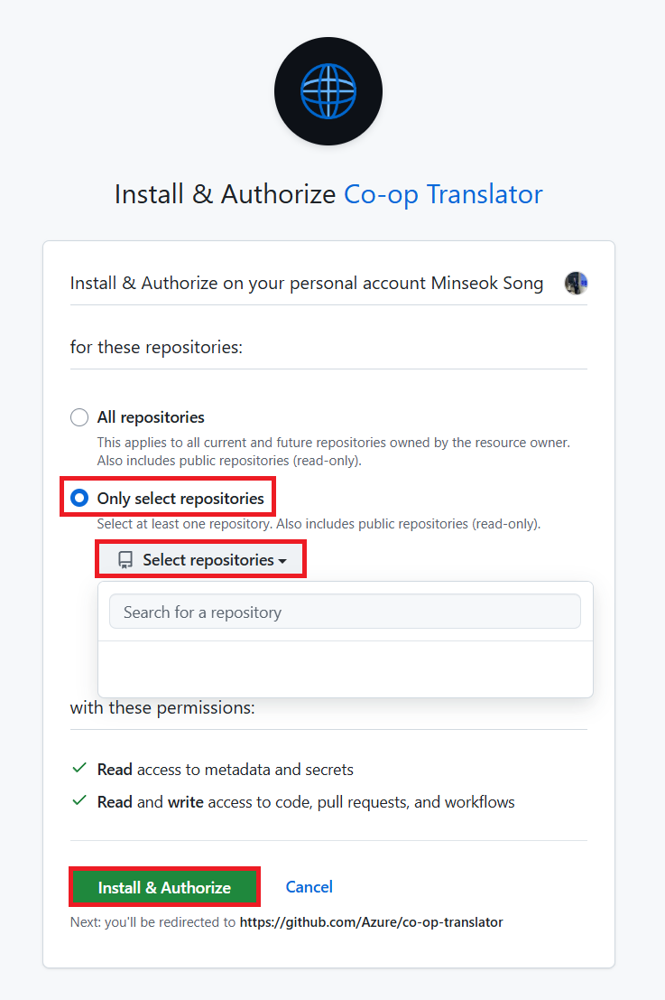
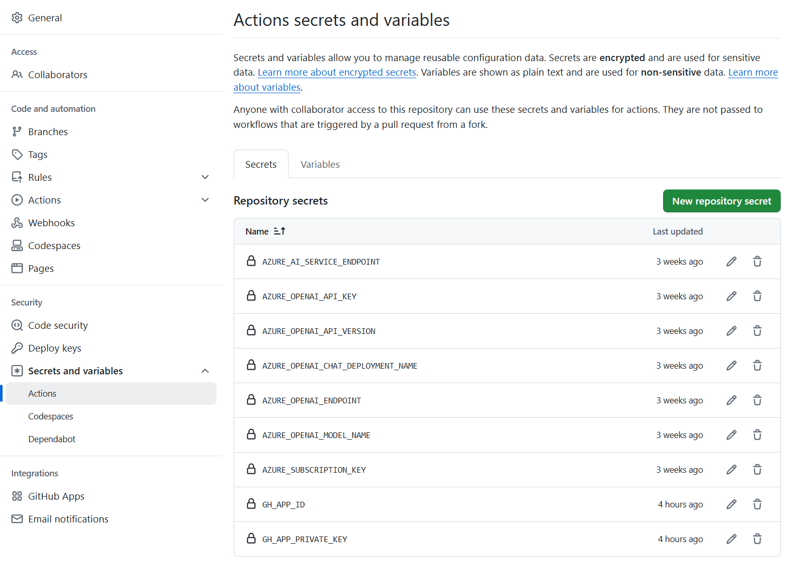

<!--
CO_OP_TRANSLATOR_METADATA:
{
  "original_hash": "c437820027c197f25fb2cbee95bae28c",
  "translation_date": "2025-05-06T18:04:06+00:00",
  "source_file": "getting_started/github-actions-guide/github-actions-guide-org.md",
  "language_code": "de"
}
-->
# Verwendung der Co-op Translator GitHub Action (Organisationsanleitung)

**Zielgruppe:** Diese Anleitung richtet sich an **interne Microsoft-Nutzer** oder **Teams, die Zugriff auf die erforderlichen Anmeldeinformationen für die vorgefertigte Co-op Translator GitHub App haben** oder die eigene benutzerdefinierte GitHub App erstellen können.

Automatisieren Sie die Übersetzung der Dokumentation Ihres Repositories mühelos mit der Co-op Translator GitHub Action. Diese Anleitung zeigt Ihnen, wie Sie die Action so einrichten, dass bei Änderungen an Ihren Quell-Markdown-Dateien oder Bildern automatisch Pull Requests mit aktualisierten Übersetzungen erstellt werden.

> [!IMPORTANT]
> 
> **Die richtige Anleitung wählen:**
>
> Diese Anleitung beschreibt die Einrichtung mit einer **GitHub App ID und einem Private Key**. Diese Methode „Organisationsanleitung“ benötigen Sie in der Regel, wenn: **`GITHUB_TOKEN` Berechtigungen eingeschränkt sind:** Ihre Organisations- oder Repository-Einstellungen schränken die Standardberechtigungen der normalen `GITHUB_TOKEN` ein. Insbesondere wenn der `GITHUB_TOKEN` nicht die notwendigen `write`-Berechtigungen (wie `contents: write` oder `pull-requests: write`) erhält, schlägt der Workflow in der [Public Setup Guide](./github-actions-guide-public.md) aufgrund fehlender Berechtigungen fehl. Die Verwendung einer dedizierten GitHub App mit explizit gewährten Berechtigungen umgeht diese Einschränkung.
>
> **Falls das oben nicht auf Sie zutrifft:**
>
> Wenn der Standard-`GITHUB_TOKEN` in Ihrem Repository über ausreichende Berechtigungen verfügt (also keine organisatorischen Einschränkungen vorliegen), verwenden Sie bitte die **[Public Setup Guide using GITHUB_TOKEN](./github-actions-guide-public.md)**. Die öffentliche Anleitung erfordert keine App IDs oder Private Keys und nutzt ausschließlich den Standard-`GITHUB_TOKEN` und Repository-Berechtigungen.

## Voraussetzungen

Bevor Sie die GitHub Action konfigurieren, stellen Sie sicher, dass Sie die erforderlichen Anmeldeinformationen für den KI-Dienst bereit haben.

**1. Erforderlich: Anmeldeinformationen für das KI-Sprachmodell**  
Sie benötigen Anmeldeinformationen für mindestens ein unterstütztes Sprachmodell:

- **Azure OpenAI**: Benötigt Endpoint, API-Schlüssel, Modell-/Deployment-Namen, API-Version.  
- **OpenAI**: Benötigt API-Schlüssel, (optional: Org ID, Basis-URL, Modell-ID).  
- Details siehe [Supported Models and Services](../../../../README.md).  
- Einrichtung: [Azure OpenAI einrichten](../set-up-resources/set-up-azure-openai.md).

**2. Optional: Anmeldeinformationen für Computer Vision (für Bildübersetzung)**

- Nur erforderlich, wenn Sie Text in Bildern übersetzen möchten.  
- **Azure Computer Vision**: Benötigt Endpoint und Subscription Key.  
- Ohne diese Angaben läuft die Action im [Markdown-only-Modus](../markdown-only-mode.md).  
- Einrichtung: [Azure Computer Vision einrichten](../set-up-resources/set-up-azure-computer-vision.md).

## Einrichtung und Konfiguration

Folgen Sie diesen Schritten, um die Co-op Translator GitHub Action in Ihrem Repository zu konfigurieren:

### Schritt 1: GitHub App-Authentifizierung installieren und konfigurieren

Der Workflow verwendet die Authentifizierung über GitHub Apps, um sicher mit Ihrem Repository zu interagieren (z. B. Pull Requests zu erstellen). Wählen Sie eine der folgenden Optionen:

#### **Option A: Vorinstallierte Co-op Translator GitHub App installieren (nur für Microsoft interne Nutzung)**

1. Gehen Sie zur [Co-op Translator GitHub App](https://github.com/apps/co-op-translator).

1. Wählen Sie **Installieren** und wählen Sie das Konto oder die Organisation, in der sich Ihr Ziel-Repository befindet.

    

1. Wählen Sie **Nur ausgewählte Repositories** und markieren Sie Ihr Ziel-Repository (z. B. `PhiCookBook`). Klicken Sie auf **Installieren**. Möglicherweise werden Sie zur Authentifizierung aufgefordert.

    

1. **App-Anmeldeinformationen erhalten (interner Prozess erforderlich):** Damit der Workflow sich als App authentifizieren kann, benötigen Sie zwei Informationen vom Co-op Translator Team:  
  - **App ID:** Die eindeutige Kennung der Co-op Translator App. Die App ID lautet: `1164076`.  
  - **Private Key:** Sie müssen den **gesamten Inhalt** der `.pem` Private Key-Datei vom Maintainer erhalten. **Behandeln Sie diesen Schlüssel wie ein Passwort und bewahren Sie ihn sicher auf.**

1. Fahren Sie mit Schritt 2 fort.

#### **Option B: Eigene benutzerdefinierte GitHub App verwenden**

- Sie können auch eine eigene GitHub App erstellen und konfigurieren. Stellen Sie sicher, dass sie Lese- und Schreibzugriff auf Contents und Pull Requests hat. Sie benötigen die App ID und einen generierten Private Key.

### Schritt 2: Repository-Geheimnisse konfigurieren

Fügen Sie die GitHub App-Anmeldeinformationen sowie Ihre KI-Dienst-Anmeldeinformationen als verschlüsselte Secrets in den Repository-Einstellungen hinzu.

1. Gehen Sie zu Ihrem Ziel-GitHub-Repository (z. B. `PhiCookBook`).

1. Navigieren Sie zu **Einstellungen** > **Geheimnisse und Variablen** > **Actions**.

1. Klicken Sie unter **Repository-Geheimnisse** für jedes der folgenden Secrets auf **Neues Repository-Geheimnis**.

   

**Erforderliche Secrets (für GitHub App-Authentifizierung):**

| Geheimnisname          | Beschreibung                                   | Quelle                                         |
| :--------------------- | :--------------------------------------------- | :--------------------------------------------- |
| `GH_APP_ID`          | Die App ID der GitHub App (aus Schritt 1).     | GitHub App Einstellungen                       |
| `GH_APP_PRIVATE_KEY` | Der **gesamte Inhalt** der heruntergeladenen `.pem` Datei. | `.pem` Datei (aus Schritt 1)       |

**KI-Dienst-Secrets (fügen Sie ALLE hinzu, die auf Ihre Voraussetzungen zutreffen):**

| Geheimnisname                         | Beschreibung                                | Quelle                          |
| :----------------------------------- | :------------------------------------------ | :------------------------------ |
| `AZURE_SUBSCRIPTION_KEY`            | Schlüssel für Azure AI Service (Computer Vision) | Azure AI Foundry                |
| `AZURE_AI_SERVICE_ENDPOINT`         | Endpoint für Azure AI Service (Computer Vision)   | Azure AI Foundry                |
| `AZURE_OPENAI_API_KEY`              | Schlüssel für Azure OpenAI Service                 | Azure AI Foundry                |
| `AZURE_OPENAI_ENDPOINT`             | Endpoint für Azure OpenAI Service                   | Azure AI Foundry                |
| `AZURE_OPENAI_MODEL_NAME`           | Ihr Azure OpenAI Modellname                          | Azure AI Foundry                |
| `AZURE_OPENAI_CHAT_DEPLOYMENT_NAME` | Ihr Azure OpenAI Deployment-Name                      | Azure AI Foundry                |
| `AZURE_OPENAI_API_VERSION`          | API-Version für Azure OpenAI                          | Azure AI Foundry                |
| `OPENAI_API_KEY`                    | API-Schlüssel für OpenAI                              | OpenAI Platform                |
| `OPENAI_ORG_ID`                     | OpenAI Organisations-ID                               | OpenAI Platform                |
| `OPENAI_CHAT_MODEL_ID`              | Spezifische OpenAI Modell-ID                           | OpenAI Platform                |
| `OPENAI_BASE_URL`                   | Benutzerdefinierte OpenAI API Basis-URL               | OpenAI Platform                |



### Schritt 3: Workflow-Datei erstellen

Erstellen Sie abschließend die YAML-Datei, die den automatisierten Workflow definiert.

1. Erstellen Sie im Stammverzeichnis Ihres Repositories den Ordner `.github/workflows/`, falls dieser noch nicht existiert.

1. Erstellen Sie darin eine Datei namens `co-op-translator.yml`.

1. Fügen Sie den folgenden Inhalt in co-op-translator.yml ein.

```
name: Co-op Translator

on:
  push:
    branches:
      - main

jobs:
  co-op-translator:
    runs-on: ubuntu-latest

    permissions:
      contents: write
      pull-requests: write

    steps:
      - name: Checkout repository
        uses: actions/checkout@v4
        with:
          fetch-depth: 0

      - name: Set up Python
        uses: actions/setup-python@v4
        with:
          python-version: '3.10'

      - name: Install Co-op Translator
        run: |
          python -m pip install --upgrade pip
          pip install co-op-translator

      - name: Run Co-op Translator
        env:
          PYTHONIOENCODING: utf-8
          # Azure AI Service Credentials
          AZURE_SUBSCRIPTION_KEY: ${{ secrets.AZURE_SUBSCRIPTION_KEY }}
          AZURE_AI_SERVICE_ENDPOINT: ${{ secrets.AZURE_AI_SERVICE_ENDPOINT }}

          # Azure OpenAI Credentials
          AZURE_OPENAI_API_KEY: ${{ secrets.AZURE_OPENAI_API_KEY }}
          AZURE_OPENAI_ENDPOINT: ${{ secrets.AZURE_OPENAI_ENDPOINT }}
          AZURE_OPENAI_MODEL_NAME: ${{ secrets.AZURE_OPENAI_MODEL_NAME }}
          AZURE_OPENAI_CHAT_DEPLOYMENT_NAME: ${{ secrets.AZURE_OPENAI_CHAT_DEPLOYMENT_NAME }}
          AZURE_OPENAI_API_VERSION: ${{ secrets.AZURE_OPENAI_API_VERSION }}

          # OpenAI Credentials
          OPENAI_API_KEY: ${{ secrets.OPENAI_API_KEY }}
          OPENAI_ORG_ID: ${{ secrets.OPENAI_ORG_ID }}
          OPENAI_CHAT_MODEL_ID: ${{ secrets.OPENAI_CHAT_MODEL_ID }}
          OPENAI_BASE_URL: ${{ secrets.OPENAI_BASE_URL }}
        run: |
          # =====================================================================
          # IMPORTANT: Set your target languages here (REQUIRED CONFIGURATION)
          # =====================================================================
          # Example: Translate to Spanish, French, German. Add -y to auto-confirm.
          translate -l "es fr de" -y  # <--- MODIFY THIS LINE with your desired languages

      - name: Authenticate GitHub App
        id: generate_token
        uses: tibdex/github-app-token@v1
        with:
          app_id: ${{ secrets.GH_APP_ID }}
          private_key: ${{ secrets.GH_APP_PRIVATE_KEY }}

      - name: Create Pull Request with translations
        uses: peter-evans/create-pull-request@v5
        with:
          token: ${{ steps.generate_token.outputs.token }}
          commit-message: "🌐 Update translations via Co-op Translator"
          title: "🌐 Update translations via Co-op Translator"
          body: |
            This PR updates translations for recent changes to the main branch.

            ### 📋 Changes included
            - Translated contents are available in the `translations/` directory
            - Translated images are available in the `translated_images/` directory

            ---
            🌐 Automatically generated by the [Co-op Translator](https://github.com/Azure/co-op-translator) GitHub Action.
          branch: update-translations
          base: main
          labels: translation, automated-pr
          delete-branch: true
          add-paths: |
            translations/
            translated_images/

```

4.  **Workflow anpassen:**  
  - **[!IMPORTANT] Zielsprachen:** Passen Sie in `Run Co-op Translator` step, you **MUST review and modify the list of language codes** within the `translate -l "..." -y` command to match your project's requirements. The example list (`ar de es...`) needs to be replaced or adjusted.
  - **Trigger (`on:`):** The current trigger runs on every push to `main`. For large repositories, consider adding a `paths:` filter (see commented example in the YAML) to run the workflow only when relevant files (e.g., source documentation) change, saving runner minutes.
  - **PR Details:** Customize the `commit-message`, `title`, `body`, `branch` name, and `labels` in the `Create Pull Request` step if needed.

## Credential Management and Renewal

- **Security:** Always store sensitive credentials (API keys, private keys) as GitHub Actions secrets. Never expose them in your workflow file or repository code.
- **[!IMPORTANT] Key Renewal (Internal Microsoft Users):** Be aware that Azure OpenAI key used within Microsoft might have a mandatory renewal policy (e.g., every 5 months). Ensure you update the corresponding GitHub secrets (`AZURE_OPENAI_...` die Schlüssel an, **bevor diese ablaufen**, um Workflow-Fehler zu vermeiden.

## Workflow ausführen

Sobald die `co-op-translator.yml`-Datei in Ihren Hauptbranch (oder den im `on:` trigger), the workflow will automatically run whenever changes are pushed to that branch (and match the `paths`-Filter angegebenen Branch) gemerged wurde,

erstellt die Action automatisch einen Pull Request mit den Änderungen, sobald Übersetzungen generiert oder aktualisiert werden. Dieser steht zur Überprüfung und zum Mergen bereit.

**Haftungsausschluss**:  
Dieses Dokument wurde mit dem KI-Übersetzungsdienst [Co-op Translator](https://github.com/Azure/co-op-translator) übersetzt. Obwohl wir auf Genauigkeit achten, bitten wir zu beachten, dass automatisierte Übersetzungen Fehler oder Ungenauigkeiten enthalten können. Das Originaldokument in seiner Ausgangssprache gilt als maßgebliche Quelle. Für wichtige Informationen wird eine professionelle menschliche Übersetzung empfohlen. Wir übernehmen keine Haftung für Missverständnisse oder Fehlinterpretationen, die durch die Verwendung dieser Übersetzung entstehen.