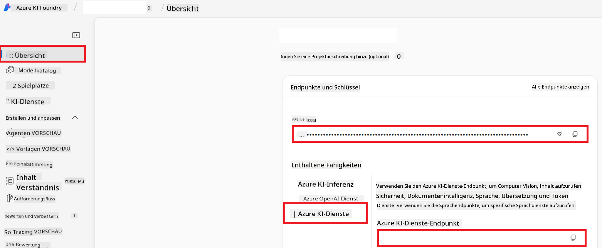

<!--
CO_OP_TRANSLATOR_METADATA:
{
  "original_hash": "b58d7c3cb4210697a073d20eb3064945",
  "translation_date": "2025-06-12T11:45:31+00:00",
  "source_file": "getting_started/set-up-azure-ai.md",
  "language_code": "de"
}
-->
# Azure AI für Co-op Translator einrichten (Azure OpenAI & Azure AI Vision)

Diese Anleitung führt Sie durch die Einrichtung von Azure OpenAI für Sprachübersetzung und Azure Computer Vision zur Analyse von Bildinhalten (die anschließend für bildbasierte Übersetzungen genutzt werden können) innerhalb von Azure AI Foundry.

**Voraussetzungen:**
- Ein Azure-Konto mit aktivem Abonnement.
- Ausreichende Berechtigungen zum Erstellen von Ressourcen und Bereitstellungen in Ihrem Azure-Abonnement.

## Erstellen eines Azure AI-Projekts

Sie beginnen mit der Erstellung eines Azure AI-Projekts, das als zentraler Ort zur Verwaltung Ihrer KI-Ressourcen dient.

1. Navigieren Sie zu [https://ai.azure.com](https://ai.azure.com) und melden Sie sich mit Ihrem Azure-Konto an.

1. Wählen Sie **+Create**, um ein neues Projekt zu erstellen.

1. Führen Sie folgende Schritte aus:
   - Geben Sie einen **Projektname** ein (z. B. `CoopTranslator-Project`).
   - Wählen Sie den **AI hub** aus (z. B. `CoopTranslator-Hub`) (Erstellen Sie bei Bedarf einen neuen).

1. Klicken Sie auf "**Review and Create**", um Ihr Projekt einzurichten. Sie gelangen zur Übersichtsseite Ihres Projekts.

## Azure OpenAI für Sprachübersetzung einrichten

Innerhalb Ihres Projekts stellen Sie ein Azure OpenAI-Modell bereit, das als Backend für die Textübersetzung dient.

### Navigieren zu Ihrem Projekt

Falls noch nicht geschehen, öffnen Sie Ihr neu erstelltes Projekt (z. B. `CoopTranslator-Project`) in Azure AI Foundry.

### Bereitstellen eines OpenAI-Modells

1. Wählen Sie im linken Menü Ihres Projekts unter „My assets“ den Punkt "**Models + endpoints**".

1. Wählen Sie **+ Deploy model**.

1. Wählen Sie **Deploy Base Model**.

1. Es wird eine Liste verfügbarer Modelle angezeigt. Filtern oder suchen Sie nach einem passenden GPT-Modell. Wir empfehlen `gpt-4o`.

1. Wählen Sie das gewünschte Modell aus und klicken Sie auf **Confirm**.

1. Klicken Sie auf **Deploy**.

### Azure OpenAI-Konfiguration

Nach der Bereitstellung können Sie die Bereitstellung auf der Seite "**Models + endpoints**" auswählen, um die **REST endpoint URL**, den **Key**, den **Deployment name**, den **Model name** und die **API version** zu finden. Diese werden benötigt, um das Übersetzungsmodell in Ihre Anwendung zu integrieren.

> [!NOTE]
> Sie können API-Versionen auf der Seite [API version deprecation](https://learn.microsoft.com/azure/ai-services/openai/api-version-deprecation) je nach Bedarf auswählen. Beachten Sie, dass sich die **API version** von der **Model version** unterscheidet, die auf der Seite **Models + endpoints** in Azure AI Foundry angezeigt wird.

## Azure Computer Vision für Bildübersetzung einrichten

Um die Übersetzung von Text in Bildern zu ermöglichen, benötigen Sie den Azure AI Service API-Schlüssel und den Endpunkt.

1. Navigieren Sie zu Ihrem Azure AI-Projekt (z. B. `CoopTranslator-Project`). Stellen Sie sicher, dass Sie sich auf der Übersichtsseite des Projekts befinden.

### Azure AI Service-Konfiguration

Finden Sie den API-Schlüssel und den Endpunkt im Azure AI Service.

1. Navigieren Sie zu Ihrem Azure AI-Projekt (z. B. `CoopTranslator-Project`). Stellen Sie sicher, dass Sie sich auf der Übersichtsseite des Projekts befinden.

1. Finden Sie den **API Key** und den **Endpoint** im Tab Azure AI Service.

    

Diese Verbindung macht die Funktionen der verknüpften Azure AI Services-Ressource (einschließlich Bildanalyse) für Ihr AI Foundry-Projekt verfügbar. Sie können diese Verbindung dann in Ihren Notebooks oder Anwendungen verwenden, um Text aus Bildern zu extrahieren, der anschließend an das Azure OpenAI-Modell zur Übersetzung gesendet werden kann.

## Zusammenführung Ihrer Zugangsdaten

Bis jetzt sollten Sie folgende Daten gesammelt haben:

**Für Azure OpenAI (Textübersetzung):**
- Azure OpenAI Endpoint
- Azure OpenAI API Key
- Azure OpenAI Model Name (z. B. `gpt-4o`)
- Azure OpenAI Deployment Name (z. B. `cooptranslator-gpt4o`)
- Azure OpenAI API Version

**Für Azure AI Services (Textextraktion aus Bildern via Vision):**
- Azure AI Service Endpoint
- Azure AI Service API Key

### Beispiel: Konfiguration von Umgebungsvariablen (Vorschau)

Später, beim Erstellen Ihrer Anwendung, konfigurieren Sie diese wahrscheinlich mit den gesammelten Zugangsdaten. Zum Beispiel könnten Sie sie als Umgebungsvariablen wie folgt festlegen:

```bash
# Azure AI Service Credentials (Required for image translation)
AZURE_AI_SERVICE_API_KEY="your_azure_ai_service_api_key" # e.g., 21xasd...
AZURE_AI_SERVICE_ENDPOINT="https://your_azure_ai_service_endpoint.cognitiveservices.azure.com/"

# Azure OpenAI Credentials (Required for text translation)
AZURE_OPENAI_API_KEY="your_azure_openai_api_key" # e.g., 21xasd...
AZURE_OPENAI_ENDPOINT="https://your_azure_openai_endpoint.openai.azure.com/"
AZURE_OPENAI_MODEL_NAME="your_model_name" # e.g., gpt-4o
AZURE_OPENAI_CHAT_DEPLOYMENT_NAME="your_deployment_name" # e.g., cooptranslator-gpt4o
AZURE_OPENAI_API_VERSION="your_api_version" # e.g., 2024-12-01-preview
```

---

### Weiterführende Informationen

- [How to Create a project in Azure AI Foundry](https://learn.microsoft.com/azure/ai-foundry/how-to/create-projects?tabs=ai-studio)
- [How to Create Azure AI resources](https://learn.microsoft.com/azure/ai-foundry/how-to/create-azure-ai-resource?tabs=portal)
- [How to Deploy OpenAI models in Azure AI Foundry](https://learn.microsoft.com/en-us/azure/ai-foundry/how-to/deploy-models-openai)

**Haftungsausschluss**:  
Dieses Dokument wurde mit dem KI-Übersetzungsdienst [Co-op Translator](https://github.com/Azure/co-op-translator) übersetzt. Obwohl wir uns um Genauigkeit bemühen, beachten Sie bitte, dass automatisierte Übersetzungen Fehler oder Ungenauigkeiten enthalten können. Das Originaldokument in seiner Ursprungssprache gilt als maßgebliche Quelle. Für wichtige Informationen wird eine professionelle menschliche Übersetzung empfohlen. Wir übernehmen keine Haftung für Missverständnisse oder Fehlinterpretationen, die durch die Verwendung dieser Übersetzung entstehen.