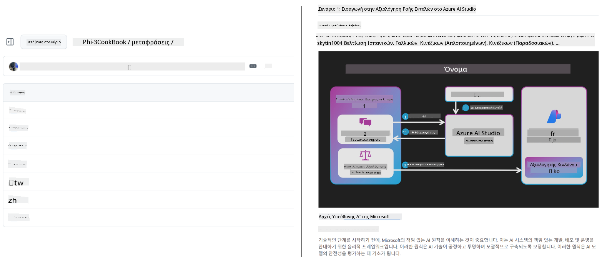
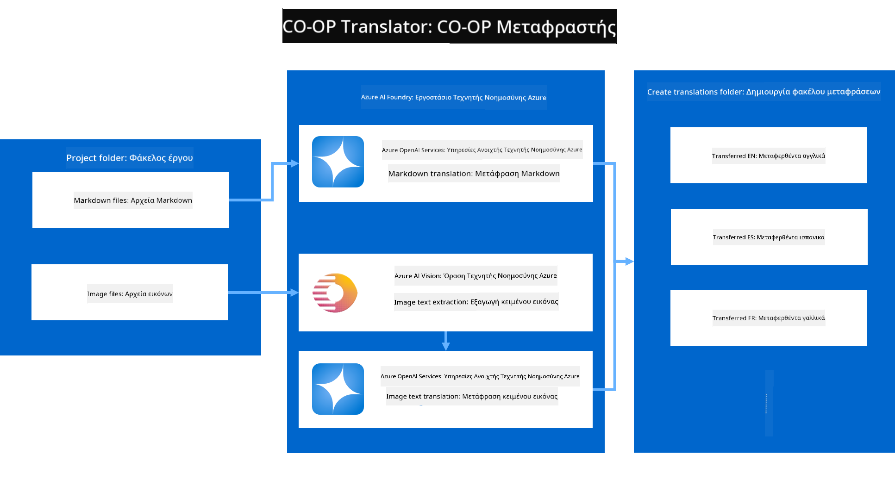
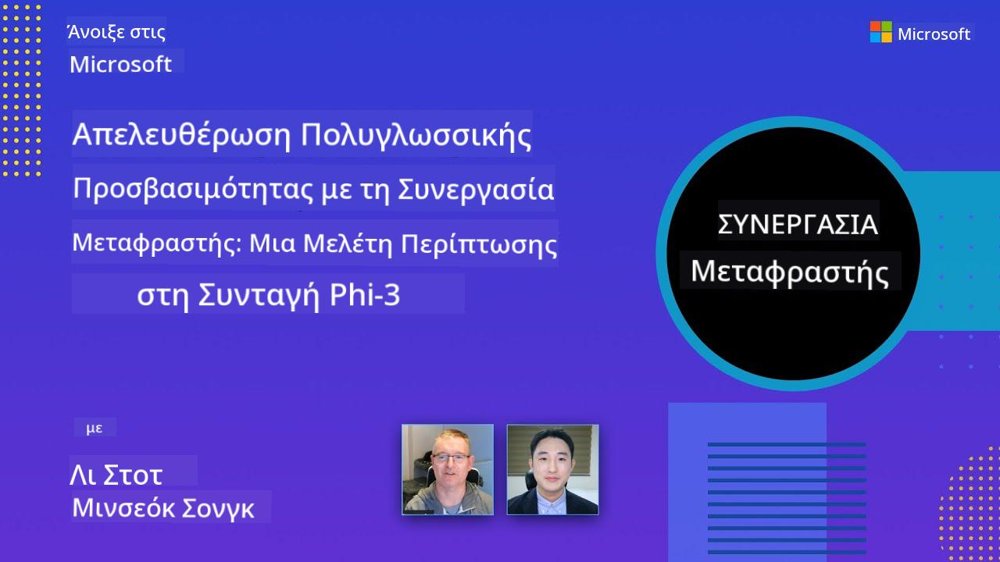

<!--
CO_OP_TRANSLATOR_METADATA:
{
  "original_hash": "044724537b57868117aadae8e7728c7c",
  "translation_date": "2025-06-12T10:25:45+00:00",
  "source_file": "README.md",
  "language_code": "el"
}
-->


# Μεταφραστής Co-op: Αυτοματοποιήστε την Μετάφραση Εκπαιδευτικής Τεκμηρίωσης Απρόσκοπτα

_Αυτοματοποιήστε εύκολα τη μετάφραση της τεκμηρίωσής σας σε πολλές γλώσσες για να φτάσετε σε παγκόσμιο κοινό._

[](https://pypi.org/project/co-op-translator/)
[](https://github.com/azure/co-op-translator/blob/main/LICENSE)
[](https://pepy.tech/project/co-op-translator)
[](https://pepy.tech/project/co-op-translator)
[](https://github.com/psf/black)

[](https://GitHub.com/azure/co-op-translator/graphs/contributors/)
[](https://GitHub.com/azure/co-op-translator/issues/)
[](https://GitHub.com/azure/co-op-translator/pulls/)
[](http://makeapullrequest.com)

### Υποστήριξη Γλωσσών με την Ισχύ του Co-op Translator

> [!NOTE]
> Αυτές είναι οι τρέχουσες μεταφράσεις του περιεχομένου αυτού του αποθετηρίου. Για πλήρη λίστα γλωσσών που υποστηρίζονται από το Co-op Translator, δείτε την ενότητα [Language Support](../..).

[](https://GitHub.com/azure/co-op-translator/watchers/)
[](https://GitHub.com/azure/co-op-translator/network/)
[](https://GitHub.com/azure/co-op-translator/stargazers/)

[](https://discord.com/invite/ByRwuEEgH4)

[](https://codespaces.new/azure/co-op-translator)
[](https://vscode.dev/redirect?url=vscode://ms-vscode-remote.remote-containers/cloneInVolume?url=https://github.com/azure/co-op-translator)

## Επισκόπηση: Απλοποιήστε τη Μετάφραση Εκπαιδευτικού Περιεχομένου

Τα γλωσσικά εμπόδια περιορίζουν σημαντικά την πρόσβαση σε πολύτιμους εκπαιδευτικούς πόρους και τεχνικές γνώσεις για μαθητές και προγραμματιστές παγκοσμίως. Αυτό μειώνει τη συμμετοχή και επιβραδύνει τον ρυθμό της παγκόσμιας καινοτομίας και μάθησης.

**Co-op Translator** δημιουργήθηκε για να αντιμετωπίσει τη μη αποδοτική χειροκίνητη διαδικασία μετάφρασης για τις μεγάλες εκπαιδευτικές σειρές της Microsoft (όπως οι οδηγοί "For Beginners"). Έχει εξελιχθεί σε ένα εύχρηστο, ισχυρό εργαλείο που σπάει αυτά τα εμπόδια για όλους. Παρέχοντας αυτόματες μεταφράσεις υψηλής ποιότητας μέσω CLI και GitHub Actions, το Co-op Translator δίνει τη δυνατότητα σε εκπαιδευτικούς, φοιτητές, ερευνητές και προγραμματιστές παγκοσμίως να μοιράζονται και να έχουν πρόσβαση στη γνώση χωρίς γλωσσικούς περιορισμούς.

Δείτε πώς οργανώνει το Co-op Translator το μεταφρασμένο εκπαιδευτικό περιεχόμενο:



Τα αρχεία Markdown και το κείμενο στις εικόνες μεταφράζονται αυτόματα και οργανώνονται προσεκτικά σε φακέλους ανά γλώσσα.

**Ξεκλειδώστε σήμερα την παγκόσμια πρόσβαση στο εκπαιδευτικό σας περιεχόμενο με το Co-op Translator!**

## Υποστήριξη Παγκόσμιας Πρόσβασης για τους Εκπαιδευτικούς Πόρους της Microsoft

Το Co-op Translator γεφυρώνει το γλωσσικό χάσμα για βασικές εκπαιδευτικές πρωτοβουλίες της Microsoft, αυτοματοποιώντας τη διαδικασία μετάφρασης για αποθετήρια που εξυπηρετούν μια παγκόσμια κοινότητα προγραμματιστών. Παραδείγματα που χρησιμοποιούν ήδη το Co-op Translator περιλαμβάνουν:

[](https://github.com/microsoft/Generative-AI-for-beginners)
[](https://github.com/microsoft/ML-For-Beginners)
[](https://github.com/microsoft/AI-For-Beginners)
[](https://github.com/microsoft/ai-agents-for-beginners)
[](https://github.com/microsoft/PhiCookBook)
[](https://github.com/microsoft/Generative-AI-for-beginners-dotnet)

## Βασικά Χαρακτηριστικά

- **Αυτοματοποιημένες Μεταφράσεις**: Μεταφράστε κείμενο σε πολλές γλώσσες εύκολα.
- **Ενσωμάτωση με GitHub Actions**: Αυτοματοποιήστε τις μεταφράσεις ως μέρος του CI/CD pipeline σας.
- **Διατήρηση Markdown**: Διατηρείται η σωστή σύνταξη Markdown κατά τη μετάφραση.
- **Μετάφραση Κειμένου σε Εικόνες**: Εξαγωγή και μετάφραση κειμένου μέσα σε εικόνες.
- **Προηγμένη Τεχνολογία LLM**: Χρησιμοποιεί σύγχρονα γλωσσικά μοντέλα για μεταφράσεις υψηλής ποιότητας.
- **Εύκολη Ενσωμάτωση**: Ενσωματώνεται άψογα στο υπάρχον έργο σας.
- **Απλοποίηση Εντοπισμού**: Απλοποιεί τη διαδικασία τοπικοποίησης του έργου σας για διεθνείς αγορές.

## Πώς Λειτουργεί



Το Co-op Translator παίρνει αρχεία Markdown και εικόνες από το φάκελο του έργου σας και τα επεξεργάζεται ως εξής:

1. **Εξαγωγή Κειμένου**: Εξάγει κείμενο από αρχεία Markdown και, αν έχει ρυθμιστεί (π.χ. με Azure AI Vision), κείμενο μέσα από τις εικόνες.
1. **Μετάφραση με AI**: Στέλνει το εξαγόμενο κείμενο στο ρυθμισμένο LLM (Azure OpenAI, OpenAI, κ.ά.) για μετάφραση.
1. **Αποθήκευση Αποτελεσμάτων**: Αποθηκεύει τα μεταφρασμένα αρχεία Markdown και εικόνες (με μεταφρασμένο κείμενο) σε φακέλους ανά γλώσσα, διατηρώντας την αρχική μορφοποίηση.

## Ξεκινήστε

Ξεκινήστε γρήγορα με το CLI ή ρυθμίστε πλήρη αυτοματοποίηση με GitHub Actions. Επιλέξτε την προσέγγιση που ταιριάζει καλύτερα στη ροή εργασίας σας:

1. **Γραμμή Εντολών (CLI)** - Για μεταφράσεις μιας χρήσης ή χειροκίνητο έλεγχο
2. **GitHub Actions** - Για αυτόματες μεταφράσεις σε κάθε push

> [!NOTE]
> Παρόλο που αυτό το σεμινάριο εστιάζει σε πόρους Azure, μπορείτε να χρησιμοποιήσετε οποιοδήποτε υποστηριζόμενο γλωσσικό μοντέλο.

### Υποστήριξη Γλωσσών

Το Co-op Translator υποστηρίζει μεγάλο εύρος γλωσσών για να σας βοηθήσει να φτάσετε σε παγκόσμιο κοινό. Να τι πρέπει να γνωρίζετε:

#### Γρήγορη Αναφορά

| Γλώσσα | Κωδικός | Γλώσσα | Κωδικός | Γλώσσα | Κωδικός |
|----------|------|----------|------|----------|------|
| Arabic | ar | Bengali | bn | Bulgarian | bg |
| Burmese (Myanmar) | my | Chinese (Simplified) | zh | Chinese (Traditional, HK) | hk |
| Chinese (Traditional, Macau) | mo | Chinese (Traditional, TW) | tw | Croatian | hr |
| Czech | cs | Danish | da | Dutch | nl |
| Finnish | fi | French | fr | German | de |
| Greek | el | Hebrew | he | Hindi | hi |
| Hungarian | hu | Indonesian | id | Italian | it |
| Japanese | ja | Korean | ko | Malay | ms |
| Marathi | mr | Nepali | ne | Norwegian | no |
| Persian (Farsi) | fa | Polish | pl | Portuguese (Brazil) | br |
| Portuguese (Portugal) | pt | Punjabi (Gurmukhi) | pa | Romanian | ro |
| Russian | ru | Serbian (Cyrillic) | sr | Slovak | sk |
| Slovenian | sl | Spanish | es | Swahili | sw |
| Swedish | sv | Tagalog (Filipino) | tl | Thai | th |
| Turkish | tr | Ukrainian | uk | Urdu | ur |
| Vietnamese | vi | — | — | — | — |

#### Χρήση Κωδικών Γλωσσών

Όταν χρησιμοποιείτε το Co-op Translator, πρέπει να καθορίζετε τις γλώσσες με τους αντίστοιχους κωδικούς τους. Για παράδειγμα:

```bash
# Translate to French, Spanish, and German
translate -l "fr es de"

# Translate to Chinese (Simplified) and Japanese
translate -l "zh ja"
```

> [!NOTE]
> Για λεπτομερείς τεχνικές πληροφορίες σχετικά με την υποστήριξη γλωσσών, όπως:
>
> - Προδιαγραφές γραμματοσειρών για κάθε γλώσσα
> - Γνωστά προβλήματα
> - Πώς να προσθέσετε νέες γλώσσες
>
> Δείτε το [Supported Languages Documentation](./getting_started/supported-languages.md).

### Υποστηριζόμενα Μοντέλα και Υπηρεσίες

| Τύπος                 | Όνομα                          |
|-----------------------|--------------------------------|
| Language Model        |   |
| AI Vision             |  |

> [!NOTE]
> Αν δεν υπάρχει διαθέσιμη υπηρεσία AI vision, το co-op translator θα μεταβεί σε [Markdown-only mode](./getting_started/markdown-only-mode.md).

### Αρχική Ρύθμιση

Πριν ξεκινήσετε, πρέπει να ρυθμίσετε τους παρακάτω πόρους:

1. Πόρος Γλωσσικού Μοντέλου (Απαραίτητο):
   - Azure OpenAI (Συνιστάται) - Παρέχει μεταφράσεις υψηλής ποιότητας με αξιοπιστία επιπέδου επιχείρησης
   - OpenAI - Εναλλακτική επιλογή αν δεν έχετε πρόσβαση στο Azure
   - Για λεπτομέρειες σχετικά με τα υποστηριζόμενα μοντέλα, δείτε [Supported Models and Services](../..)

1. Πόρος AI Vision (Προαιρετικό):
   - Azure AI Vision - Επιτρέπει τη μετάφραση κειμένου μέσα σε εικόνες
   - Αν δεν ρυθμιστεί, ο μεταφραστής θα χρησιμοποιήσει αυτόματα [Markdown-only mode](./getting_started/markdown-only-mode.md)
   - Συνιστάται για έργα με εικόνες που περιέχουν κείμενο προς μετάφραση

1. Βήματα Ρύθμισης:
   - Ακολουθήστε τον [οδηγό ρύθμισης Azure AI](./getting_started/set-up-azure-ai.md) για λεπτομερείς οδηγίες
   - Δημιουργήστε ένα αρχείο `.env` με τα κλειδιά API και τα endpoints σας (δείτε την ενότητα [Quick Start](../..))
   - Βεβαιωθείτε ότι έχετε τα απαραίτητα δικαιώματα και ποσοστώσεις για τις υπηρεσίες που επιλέξατε

### Ρύθμιση Έργου Πριν τη Μετάφραση

Πριν ξεκινήσετε τη διαδικασία μετάφρασης, ακολουθήστε αυτά τα βήματα για να προετοιμάσετε το έργο σας:

1. Προετοιμάστε το README σας:
   - Προσθέστε έναν πίνακα μεταφράσεων στο README.md σας για να συνδέετε τις μεταφρασμένες εκδόσεις
   - Παράδειγμα μορφής:

     ```markdown

     ### 🌐 Multi-Language Support
     
     [French](../fr/README.md) | [Spanish](../es/README.md) | [German](../de/README.md) | [Russian](../ru/README.md) | [Arabic](../ar/README.md) | [Persian (Farsi)](../fa/README.md) | [Urdu](../ur/README.md) | [Chinese (Simplified)](../zh/README.md) | [Chinese (Traditional, Macau)](../mo/README.md) | [Chinese (Traditional, Hong Kong)](../hk/README.md) | [Chinese (Traditional, Taiwan)](../tw/README.md) | [Japanese](../ja/README.md) | [Korean](../ko/README.md) | [Hindi](../hi/README.md) | [Bengali](../bn/README.md) | [Marathi](../mr/README.md) | [Nepali](../ne/README.md) | [Punjabi (Gurmukhi)](../pa/README.md) | [Portuguese (Portugal)](../pt/README.md) | [Portuguese (Brazil)](../br/README.md) | [Italian](../it/README.md) | [Polish](../pl/README.md) | [Turkish](../tr/README.md) | [Greek](./README.md) | [Thai](../th/README.md) | [Swedish](../sv/README.md) | [Danish](../da/README.md) | [Norwegian](../no/README.md) | [Finnish](../fi/README.md) | [Dutch](../nl/README.md) | [Hebrew](../he/README.md) | [Vietnamese](../vi/README.md) | [Indonesian](../id/README.md) | [Malay](../ms/README.md) | [Tagalog (Filipino)](../tl/README.md) | [Swahili](../sw/README.md) | [Hungarian](../hu/README.md) | [Czech](../cs/README.md) | [Slovak](../sk/README.md) | [Romanian](../ro/README.md) | [Bulgarian](../bg/README.md) | [Serbian (Cyrillic)](../sr/README.md) | [Croatian](../hr/README.md) | [Slovenian](../sl/README.md) | [Ukrainian](../uk/README.md) | [Burmese (Myanmar)](../my/README.md) 
    
     ```

1. Καθαρίστε υπάρχουσες μεταφράσεις (αν χρειάζεται):
   - Αφαιρέστε τυχόν υπάρχοντες φακέλους μεταφράσεων (π.χ. `translations/`)
   - Διαγράψτε παλιά αρχεία μετάφρασης για να ξεκινήσετε καθαρά
   - Αυτό εξασφαλίζει ότι δεν θα υπάρξουν συγκρούσεις με τη νέα διαδικασία μετάφρασης

### Γρήγορη Εκκίνηση: Γραμμή Εντολών

Για γρήγορη εκκίνηση με τη γραμμή εντολών:

1. Δημιουργήστε ένα εικονικό περιβάλλον:

    ```bash
    python -m venv .venv
    ```

1. Ενεργοποιήστε το εικονικό περιβάλλον:

    - Σε Windows:

    ```bash
    .venv\scripts\activate
    ```

    - Σε Linux/macOS:

    ```bash
    source .venv/bin/activate
    ```

1. Εγκαταστήστε το πακέτο:

    ```bash
    pip install co-op-translator
    ```

1. Ρυθμίστε τα διαπιστευτήρια:

    - Δημιουργήστε ένα αρχείο `.env` file in your project's root directory.
    - Copy the contents from the [.env.template](../../.env.template) file into your new `.env` file.
    - Fill in the required API keys and endpoint information in your `.env` file.

1. Run Translation:
    - Navigate to your project's root directory in your terminal.
    - Execute the translate command, specifying target languages with the `-l` flag:

    ```bash
    translate -l "ko ja fr"
    ```

_(Αντικαταστήστε `"ko ja fr"` with your desired space-separated language codes)_

### Detailed Usage Guides

Choose the approach that best fits your workflow:

#### 1. Using the Command Line (CLI)

- Best for: One-time translations, manual control, or integration into custom scripts.
- Requires: Local installation of Python and the `co-op-translator` package.
- Guide: [Command Line Guide](./getting_started/command-line-guide/command-line-guide.md)

#### 2. Using GitHub Actions (Automation)

- Best for: Automatically translating content whenever changes are pushed to your repository. Keeps translations consistently up-to-date.
- Requires: Setting up a workflow file (`.github/workflows`) στο αποθετήριό σας. Δεν απαιτείται τοπική εγκατάσταση.
- Οδηγοί:
  - [GitHub Actions Guide (Public Repositories & Standard Secrets)](./getting_started/github-actions-guide/github-actions-guide-public.md) - Χρησιμοποιήστε το για τα περισσότερα δημόσια ή προσωπικά αποθετήρια που βασίζονται σε τυπικά μυστικά αποθετηρίου.
  - [GitHub Actions Guide (Microsoft Organization Repos & Org-Level Setups)](./getting_started/github-actions-guide/github-actions-guide-org.md) - Χρησιμοποιήστε αυτόν τον οδηγό αν εργάζεστε στο Microsoft GitHub οργανισμό ή χρειάζεστε οργάνωση επιπέδου μυστικών ή runners.

### Αντιμετώπιση Προβλημάτων και Συμβουλές

- [Troubleshooting Guide](./getting_started/troubleshooting.md)

### Πρόσθετοι Πόροι

- [Command Reference](./getting_started/command-reference.md): Αναλυτικός οδηγός για όλες τις διαθέσιμες εντολές και επιλογές.
- [Supported Languages](./getting_started/supported-languages.md): Δείτε τη λίστα με τις υποστηριζόμενες γλώσσες και οδηγίες για προσθήκη νέων.
- [Markdown-Only Mode](./getting_started/markdown-only-mode.md): Πώς να μεταφράζετε μόνο κείμενο, χωρίς μετάφραση εικόνων.

## Βίντεο Παρουσιάσεις

Μάθετε περισσότερα για το Co-op Translator μέσα από τις παρουσιάσεις μας _(Κάντε κλικ στην εικόνα παρακάτω για να δείτε στο YouTube.)_:

- **Open at Microsoft**: Μια σύντομη εισαγωγή 18 λεπτών και γρήγορος οδηγός για το πώς να χρησιμοποιήσετε το Co-op Translator.
[](https://www.youtube.com/watch?v=jX_swfH_KNU)

## Υποστηρίξτε μας και προωθήστε τη διεθνή μάθηση

Ελάτε μαζί μας στην επανάσταση του τρόπου με τον οποίο διαμοιράζεται το εκπαιδευτικό περιεχόμενο παγκοσμίως! Βαθμολογήστε με ⭐ το [Co-op Translator](https://github.com/azure/co-op-translator) στο GitHub και στηρίξτε την αποστολή μας να ξεπεράσουμε τα γλωσσικά εμπόδια στη μάθηση και την τεχνολογία. Το ενδιαφέρον και οι συνεισφορές σας κάνουν σημαντική διαφορά! Οι συνεισφορές κώδικα και οι προτάσεις για νέες λειτουργίες είναι πάντα ευπρόσδεκτες.

## Συμμετοχή

Αυτό το έργο καλωσορίζει συνεισφορές και προτάσεις. Ενδιαφέρεστε να συμβάλετε στο Azure Co-op Translator; Παρακαλούμε δείτε το [CONTRIBUTING.md](./CONTRIBUTING.md) για οδηγίες σχετικά με το πώς μπορείτε να βοηθήσετε να γίνει το Co-op Translator πιο προσβάσιμο.

## Συνεισφέροντες

[](https://github.com/Azure/co-op-translator/graphs/contributors)

## Κώδικας Συμπεριφοράς

Αυτό το έργο έχει υιοθετήσει τον [Microsoft Open Source Code of Conduct](https://opensource.microsoft.com/codeofconduct/).
Για περισσότερες πληροφορίες δείτε το [Code of Conduct FAQ](https://opensource.microsoft.com/codeofconduct/faq/) ή επικοινωνήστε με [opencode@microsoft.com](mailto:opencode@microsoft.com) για οποιεσδήποτε επιπλέον ερωτήσεις ή σχόλια.

## Υπεύθυνη Τεχνητή Νοημοσύνη

Η Microsoft δεσμεύεται να βοηθά τους πελάτες της να χρησιμοποιούν υπεύθυνα τα προϊόντα τεχνητής νοημοσύνης, μοιράζοντας τις εμπειρίες μας και δημιουργώντας σχέσεις εμπιστοσύνης μέσω εργαλείων όπως οι Σημειώσεις Διαφάνειας και οι Αξιολογήσεις Επιπτώσεων. Πολλοί από αυτούς τους πόρους είναι διαθέσιμοι στη διεύθυνση [https://aka.ms/RAI](https://aka.ms/RAI).
Η προσέγγιση της Microsoft για την υπεύθυνη τεχνητή νοημοσύνη βασίζεται στις αρχές της δικαιοσύνης, αξιοπιστίας και ασφάλειας, προστασίας προσωπικών δεδομένων και ασφάλειας, συμπερίληψης, διαφάνειας και λογοδοσίας.

Μεγάλα μοντέλα φυσικής γλώσσας, εικόνας και ομιλίας - όπως αυτά που χρησιμοποιούνται σε αυτό το παράδειγμα - ενδέχεται να συμπεριφέρονται με τρόπους που θεωρούνται άδικοι, αναξιόπιστοι ή προσβλητικοί, προκαλώντας ζημίες. Παρακαλούμε συμβουλευτείτε τη [Σημείωση Διαφάνειας της υπηρεσίας Azure OpenAI](https://learn.microsoft.com/legal/cognitive-services/openai/transparency-note?tabs=text) για να ενημερωθείτε σχετικά με τους κινδύνους και τους περιορισμούς.

Η προτεινόμενη προσέγγιση για την αντιμετώπιση αυτών των κινδύνων είναι η ενσωμάτωση ενός συστήματος ασφαλείας στην αρχιτεκτονική σας που μπορεί να ανιχνεύει και να αποτρέπει επιβλαβείς συμπεριφορές. Το [Azure AI Content Safety](https://learn.microsoft.com/azure/ai-services/content-safety/overview) παρέχει ένα ανεξάρτητο επίπεδο προστασίας, ικανό να εντοπίζει επιβλαβές περιεχόμενο που δημιουργείται από χρήστες ή AI σε εφαρμογές και υπηρεσίες. Το Azure AI Content Safety περιλαμβάνει APIs για κείμενο και εικόνα που σας επιτρέπουν να ανιχνεύετε επιβλαβές υλικό. Διαθέτουμε επίσης ένα διαδραστικό Content Safety Studio που σας επιτρέπει να δείτε, να εξερευνήσετε και να δοκιμάσετε δείγματα κώδικα για την ανίχνευση επιβλαβούς περιεχομένου σε διάφορες μορφές. Η ακόλουθη [τεκμηρίωση quickstart](https://learn.microsoft.com/azure/ai-services/content-safety/quickstart-text?tabs=visual-studio%2Clinux&pivots=programming-language-rest) σας καθοδηγεί στο πώς να κάνετε αιτήματα στην υπηρεσία.

Ένα ακόμη ζήτημα που πρέπει να ληφθεί υπόψη είναι η συνολική απόδοση της εφαρμογής. Σε εφαρμογές με πολλαπλές μορφές και μοντέλα, η απόδοση σημαίνει ότι το σύστημα λειτουργεί όπως εσείς και οι χρήστες σας περιμένετε, συμπεριλαμβανομένου του να μην παράγει επιβλαβή αποτελέσματα. Είναι σημαντικό να αξιολογείτε την απόδοση της εφαρμογής σας χρησιμοποιώντας [μετρικές ποιότητας παραγωγής και κινδύνου και ασφάλειας](https://learn.microsoft.com/azure/ai-studio/concepts/evaluation-metrics-built-in).

Μπορείτε να αξιολογήσετε την εφαρμογή AI σας στο περιβάλλον ανάπτυξής σας χρησιμοποιώντας το [prompt flow SDK](https://microsoft.github.io/promptflow/index.html). Με βάση είτε ένα σύνολο δοκιμαστικών δεδομένων είτε έναν στόχο, οι γεννήσεις της γενετικής AI εφαρμογής σας μετρώνται ποσοτικά με ενσωματωμένους ή προσαρμοσμένους αξιολογητές της επιλογής σας. Για να ξεκινήσετε με το prompt flow sdk για να αξιολογήσετε το σύστημά σας, μπορείτε να ακολουθήσετε τον [οδηγό quickstart](https://learn.microsoft.com/azure/ai-studio/how-to/develop/flow-evaluate-sdk). Μόλις εκτελέσετε μια αξιολόγηση, μπορείτε να [οπτικοποιήσετε τα αποτελέσματα στο Azure AI Studio](https://learn.microsoft.com/azure/ai-studio/how-to/evaluate-flow-results).

## Εμπορικά Σήματα

Αυτό το έργο μπορεί να περιέχει εμπορικά σήματα ή λογότυπα για έργα, προϊόντα ή υπηρεσίες. Η εξουσιοδοτημένη χρήση των εμπορικών σημάτων ή λογότυπων της Microsoft υπόκειται και πρέπει να ακολουθεί τις [Microsoft's Trademark & Brand Guidelines](https://www.microsoft.com/en-us/legal/intellectualproperty/trademarks/usage/general).
Η χρήση των εμπορικών σημάτων ή λογότυπων της Microsoft σε τροποποιημένες εκδόσεις αυτού του έργου δεν πρέπει να προκαλεί σύγχυση ή να υπονοεί χορηγία από τη Microsoft.
Οποιαδήποτε χρήση εμπορικών σημάτων ή λογότυπων τρίτων υπόκειται στις πολιτικές αυτών των τρίτων.

**Αποποίηση ευθυνών**:  
Αυτό το έγγραφο έχει μεταφραστεί χρησιμοποιώντας την υπηρεσία αυτόματης μετάφρασης AI [Co-op Translator](https://github.com/Azure/co-op-translator). Παρόλο που προσπαθούμε για ακρίβεια, παρακαλούμε να έχετε υπόψη ότι οι αυτόματες μεταφράσεις ενδέχεται να περιέχουν λάθη ή ανακρίβειες. Το πρωτότυπο έγγραφο στη μητρική του γλώσσα πρέπει να θεωρείται η επίσημη πηγή. Για κρίσιμες πληροφορίες, συνιστάται επαγγελματική μετάφραση από ανθρώπους. Δεν φέρουμε ευθύνη για οποιεσδήποτε παρεξηγήσεις ή λανθασμένες ερμηνείες που προκύπτουν από τη χρήση αυτής της μετάφρασης.