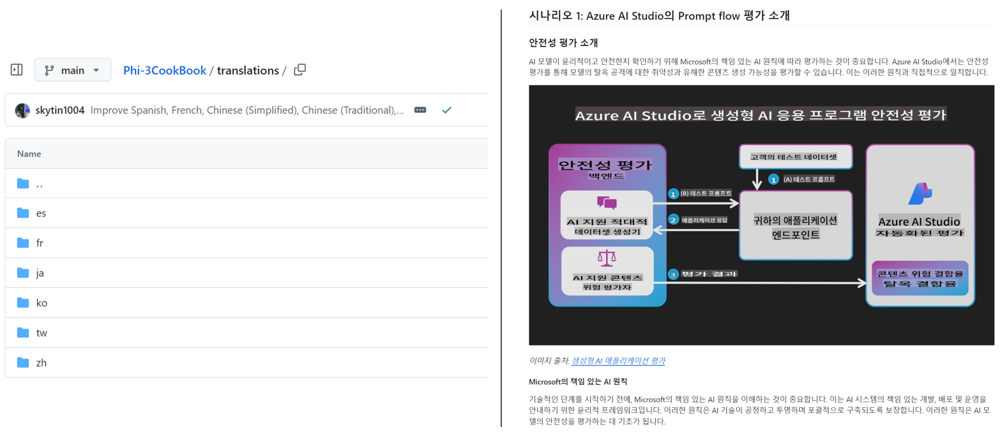

<!--
CO_OP_TRANSLATOR_METADATA:
{
  "original_hash": "dac6bc281667816537df51f724a0ff2c",
  "translation_date": "2025-11-30T11:11:39+00:00",
  "source_file": "README.md",
  "language_code": "el"
}
-->
# Μεταφραστής Co-op

_Αυτοματοποιήστε εύκολα τη μετάφραση του εκπαιδευτικού περιεχομένου σας στο GitHub σε πολλές γλώσσες για να φτάσετε σε παγκόσμιο κοινό._

[](https://pypi.org/project/co-op-translator/)
[](https://github.com/azure/co-op-translator/blob/main/LICENSE)
[](https://pepy.tech/project/co-op-translator)
[](https://pepy.tech/project/co-op-translator)
[](https://github.com/azure/co-op-translator/pkgs/container/co-op-translator)
[](https://github.com/psf/black)

[](https://GitHub.com/azure/co-op-translator/graphs/contributors/)
[](https://GitHub.com/azure/co-op-translator/issues/)
[](https://GitHub.com/azure/co-op-translator/pulls/)
[](http://makeapullrequest.com)

### 🌐 Υποστήριξη πολλαπλών γλωσσών

#### Υποστηρίζεται από τον [Co-op Translator](https://github.com/Azure/Co-op-Translator)

<!-- CO-OP TRANSLATOR LANGUAGES TABLE START -->
[Αραβικά](../ar/README.md) | [Μπενγκάλι](../bn/README.md) | [Βουλγαρικά](../bg/README.md) | [Βιρμανικά (Μιανμάρ)](../my/README.md) | [Κινέζικα (Απλοποιημένα)](../zh/README.md) | [Κινέζικα (Παραδοσιακά, Χονγκ Κονγκ)](../hk/README.md) | [Κινέζικα (Παραδοσιακά, Μακάο)](../mo/README.md) | [Κινέζικα (Παραδοσιακά, Ταϊβάν)](../tw/README.md) | [Κροατικά](../hr/README.md) | [Τσέχικα](../cs/README.md) | [Δανέζικα](../da/README.md) | [Ολλανδικά](../nl/README.md) | [Εσθονικά](../et/README.md) | [Φινλανδικά](../fi/README.md) | [Γαλλικά](../fr/README.md) | [Γερμανικά](../de/README.md) | [Ελληνικά](./README.md) | [Εβραϊκά](../he/README.md) | [Χίντι](../hi/README.md) | [Ουγγρικά](../hu/README.md) | [Ινδονησιακά](../id/README.md) | [Ιταλικά](../it/README.md) | [Ιαπωνικά](../ja/README.md) | [Κανάντα](../kn/README.md) | [Κορεατικά](../ko/README.md) | [Λιθουανικά](../lt/README.md) | [Μαλαισιανά](../ms/README.md) | [Μαλαγιαλάμ](../ml/README.md) | [Μαράθι](../mr/README.md) | [Νεπάλ](../ne/README.md) | [Νιγηριανή Πίνγκιν](../pcm/README.md) | [Νορβηγικά](../no/README.md) | [Περσικά (Φαρσί)](../fa/README.md) | [Πολωνικά](../pl/README.md) | [Πορτογαλικά (Βραζιλία)](../br/README.md) | [Πορτογαλικά (Πορτογαλία)](../pt/README.md) | [Πουντζάμπι (Γκουρμούκι)](../pa/README.md) | [Ρουμανικά](../ro/README.md) | [Ρωσικά](../ru/README.md) | [Σερβικά (Κυριλλικά)](../sr/README.md) | [Σλοβακικά](../sk/README.md) | [Σλοβενικά](../sl/README.md) | [Ισπανικά](../es/README.md) | [Σουαχίλι](../sw/README.md) | [Σουηδικά](../sv/README.md) | [Ταγκάλογκ (Φιλιππινέζικα)](../tl/README.md) | [Ταμίλ](../ta/README.md) | [Τελούγκου](../te/README.md) | [Ταϊλανδικά](../th/README.md) | [Τουρκικά](../tr/README.md) | [Ουκρανικά](../uk/README.md) | [Ουρντού](../ur/README.md) | [Βιετναμέζικα](../vi/README.md)
<!-- CO-OP TRANSLATOR LANGUAGES TABLE END -->

[](https://GitHub.com/azure/co-op-translator/watchers/)
[](https://GitHub.com/azure/co-op-translator/network/)
[](https://GitHub.com/azure/co-op-translator/stargazers/)

[](https://discord.gg/nTYy5BXMWG)

[](https://codespaces.new/azure/co-op-translator)

## Επισκόπηση

**Ο Μεταφραστής Co-op** σας βοηθά να τοπικοποιήσετε το εκπαιδευτικό περιεχόμενο του GitHub σας σε πολλές γλώσσες χωρίς κόπο.
Όταν ενημερώνετε τα αρχεία Markdown, τις εικόνες ή τα τετράδια σας, οι μεταφράσεις παραμένουν αυτόματα συγχρονισμένες, εξασφαλίζοντας ότι το περιεχόμενό σας παραμένει ακριβές και ενημερωμένο για μαθητές σε όλο τον κόσμο.

Παράδειγμα οργάνωσης μεταφρασμένου περιεχομένου:



## Γρήγορη εκκίνηση

```bash
# Δημιουργήστε και ενεργοποιήστε ένα εικονικό περιβάλλον (συνιστάται)
python -m venv .venv
# Windows
.venv\Scripts\activate
# macOS/Linux
source .venv/bin/activate
# Εγκαταστήστε το πακέτο
pip install co-op-translator
# Μεταφράστε
translate -l "ko ja fr" -md
```

Docker:

```bash
# Τραβήξτε την δημόσια εικόνα από το GHCR
docker pull ghcr.io/azure/co-op-translator:latest
# Εκτελέστε με τον τρέχοντα φάκελο προσαρτημένο και το .env παρεχόμενο (Bash/Zsh)
docker run --rm -it --env-file .env -v "${PWD}:/work" ghcr.io/azure/co-op-translator:latest -l "ko ja fr" -md
```

## Ελάχιστη ρύθμιση

1. Δημιουργήστε ένα αρχείο `.env` χρησιμοποιώντας το πρότυπο: [.env.template](../../.env.template)
2. Ρυθμίστε έναν πάροχο LLM (Azure OpenAI ή OpenAI)
3. (Προαιρετικό) Για μετάφραση εικόνων (`-img`), ρυθμίστε το Azure AI Vision
4. (Συνιστάται) Καθαρίστε τυχόν προηγούμενες μεταφράσεις για να αποφύγετε συγκρούσεις (π.χ., `translations/`)
5. (Συνιστάται) Προσθέστε μια ενότητα μετάφρασης στο README σας χρησιμοποιώντας το [πρότυπο γλωσσών README](./getting_started/README_languages_template.md)
6. Δείτε: [Ρύθμιση Azure AI](./getting_started/set-up-azure-ai.md)

## Χρήση

Μεταφράστε όλους τους υποστηριζόμενους τύπους:

```bash
translate -l "ko ja"
```

Μόνο Markdown:

```bash
translate -l "de" -md
```

Markdown + εικόνες:

```bash
translate -l "pt" -md -img
```

Μόνο τετράδια:

```bash
translate -l "zh" -nb
```

Περισσότερες επιλογές: [Αναφορά εντολών](./getting_started/command-reference.md)

## Χαρακτηριστικά

- Αυτόματη μετάφραση για Markdown, τετράδια και εικόνες
- Διατηρεί τις μεταφράσεις συγχρονισμένες με τις αλλαγές στην πηγή
- Λειτουργεί τοπικά (CLI) ή σε CI (GitHub Actions)
- Χρησιμοποιεί Azure OpenAI ή OpenAI· προαιρετικά Azure AI Vision για εικόνες
- Διατηρεί τη μορφοποίηση και τη δομή του Markdown

## Τεκμηρίωση

- [Οδηγός γραμμής εντολών](./getting_started/command-line-guide/command-line-guide.md)
- [Οδηγός GitHub Actions (Δημόσια αποθετήρια & τυπικά μυστικά)](./getting_started/github-actions-guide/github-actions-guide-public.md)
- [Οδηγός GitHub Actions (Αποθετήρια οργανισμού Microsoft & ρυθμίσεις σε επίπεδο οργανισμού)](./getting_started/github-actions-guide/github-actions-guide-org.md)
- [Πρότυπο γλωσσών README](./getting_started/README_languages_template.md)
- [Υποστηριζόμενες γλώσσες](./getting_started/supported-languages.md)
- [Συμμετοχή](./CONTRIBUTING.md)
- [Αντιμετώπιση προβλημάτων](./getting_started/troubleshooting.md)

### Οδηγός ειδικά για τη Microsoft
> [!NOTE]
> Μόνο για διαχειριστές των αποθετηρίων “For Beginners” της Microsoft.

- [Ενημέρωση της λίστας “άλλων μαθημάτων” (μόνο για αποθετήρια MS Beginners)](./getting_started/update-other-courses.md)

## Υποστηρίξτε μας και προωθήστε τη μάθηση παγκοσμίως

Ελάτε μαζί μας στην επανάσταση του τρόπου με τον οποίο μοιράζεται το εκπαιδευτικό περιεχόμενο παγκοσμίως! Δώστε ⭐ στο [Co-op Translator](https://github.com/azure/co-op-translator) στο GitHub και υποστηρίξτε την αποστολή μας να σπάσουμε τα γλωσσικά εμπόδια στη μάθηση και την τεχνολογία. Το ενδιαφέρον και οι συνεισφορές σας έχουν σημαντικό αντίκτυπο! Οι συνεισφορές κώδικα και οι προτάσεις χαρακτηριστικών είναι πάντα ευπρόσδεκτες.

### Εξερευνήστε το εκπαιδευτικό περιεχόμενο της Microsoft στη γλώσσα σας

- [AZD για Αρχάριους](https://github.com/microsoft/AZD-for-beginners)
- [Edge AI για Αρχάριους](https://github.com/microsoft/edgeai-for-beginners)
- [Πρωτόκολλο Πλαισίου Μοντέλου (MCP) για Αρχάριους](https://github.com/microsoft/mcp-for-beginners)
- [AI Agents για Αρχάριους](https://github.com/microsoft/ai-agents-for-beginners)
- [Γενετική AI για Αρχάριους με .NET](https://github.com/microsoft/Generative-AI-for-beginners-dotnet)
- [Γενετική AI για Αρχάριους](https://github.com/microsoft/generative-ai-for-beginners)
- [Γενετική AI για Αρχάριους με Java](https://github.com/microsoft/generative-ai-for-beginners-java)
- [ML για Αρχάριους](https://aka.ms/ml-beginners)
- [Επιστήμη Δεδομένων για Αρχάριους](https://aka.ms/datascience-beginners)
- [AI για Αρχάριους](https://aka.ms/ai-beginners)
- [Κυβερνοασφάλεια για Αρχάριους](https://github.com/microsoft/Security-101)
- [Web Dev για Αρχάριους](https://aka.ms/webdev-beginners)
- [IoT για Αρχάριους](https://aka.ms/iot-beginners)
- [PhiCookBook](https://github.com/microsoft/PhiCookBook)

## Βίντεο παρουσιάσεις

👉 Κάντε κλικ στην εικόνα παρακάτω για να δείτε στο YouTube.

- **Open at Microsoft**: Μια σύντομη εισαγωγή 18 λεπτών και γρήγορος οδηγός για το πώς να χρησιμοποιήσετε τον Μεταφραστή Co-op.

  [](https://www.youtube.com/watch?v=jX_swfH_KNU)

## Συμμετοχή

Αυτό το έργο καλωσορίζει συνεισφορές και προτάσεις. Ενδιαφέρεστε να συμβάλετε στον Azure Co-op Translator; Παρακαλούμε δείτε το [CONTRIBUTING.md](./CONTRIBUTING.md) για οδηγίες σχετικά με το πώς μπορείτε να βοηθήσετε να γίνει ο Μεταφραστής Co-op πιο προσβάσιμος.

## Συνεισφέροντες

[](https://github.com/Azure/co-op-translator/graphs/contributors)

## Κώδικας Συμπεριφοράς

Αυτό το έργο έχει υιοθετήσει τον [Κώδικα Συμπεριφοράς Ανοιχτού Κώδικα της Microsoft](https://opensource.microsoft.com/codeofconduct/).
Για περισσότερες πληροφορίες δείτε τις [Συχνές Ερωτήσεις για τον Κώδικα Συμπεριφοράς](https://opensource.microsoft.com/codeofconduct/faq/) ή
επικοινωνήστε με [opencode@microsoft.com](mailto:opencode@microsoft.com) για επιπλέον ερωτήσεις ή σχόλια.

## Υπεύθυνη Τεχνητή Νοημοσύνη

Η Microsoft δεσμεύεται να βοηθά τους πελάτες της να χρησιμοποιούν τα προϊόντα AI υπεύθυνα, μοιράζοντας τις γνώσεις μας και χτίζοντας σχέσεις εμπιστοσύνης μέσω εργαλείων όπως οι Σημειώσεις Διαφάνειας και οι Αξιολογήσεις Επιπτώσεων. Πολλοί από αυτούς τους πόρους βρίσκονται στο [https://aka.ms/RAI](https://aka.ms/RAI).
Η προσέγγιση της Microsoft για την υπεύθυνη AI βασίζεται στις αρχές μας για δικαιοσύνη, αξιοπιστία και ασφάλεια, ιδιωτικότητα και ασφάλεια, συμπερίληψη, διαφάνεια και λογοδοσία.

Τα μεγάλης κλίμακας μοντέλα φυσικής γλώσσας, εικόνας και ομιλίας - όπως αυτά που χρησιμοποιούνται σε αυτό το δείγμα - ενδέχεται να συμπεριφέρονται με τρόπους που είναι άδικοι, αναξιόπιστοι ή προσβλητικοί, προκαλώντας βλάβες. Παρακαλούμε συμβουλευτείτε τη [Σημείωση Διαφάνειας της υπηρεσίας Azure OpenAI](https://learn.microsoft.com/legal/cognitive-services/openai/transparency-note?tabs=text) για να ενημερωθείτε σχετικά με τους κινδύνους και τους περιορισμούς.
Η προτεινόμενη προσέγγιση για τη μείωση αυτών των κινδύνων είναι να ενσωματώσετε ένα σύστημα ασφαλείας στην αρχιτεκτονική σας που μπορεί να ανιχνεύει και να αποτρέπει επιβλαβείς συμπεριφορές. Το [Azure AI Content Safety](https://learn.microsoft.com/azure/ai-services/content-safety/overview) παρέχει ένα ανεξάρτητο επίπεδο προστασίας, ικανό να ανιχνεύει επιβλαβές περιεχόμενο που δημιουργείται από χρήστες και από AI σε εφαρμογές και υπηρεσίες. Το Azure AI Content Safety περιλαμβάνει APIs για κείμενο και εικόνες που σας επιτρέπουν να εντοπίζετε υλικό που είναι επιβλαβές. Διαθέτουμε επίσης ένα διαδραστικό Content Safety Studio που σας επιτρέπει να δείτε, να εξερευνήσετε και να δοκιμάσετε δείγματα κώδικα για την ανίχνευση επιβλαβούς περιεχομένου σε διάφορες μορφές. Η ακόλουθη [τεκμηρίωση γρήγορης εκκίνησης](https://learn.microsoft.com/azure/ai-services/content-safety/quickstart-text?tabs=visual-studio%2Clinux&pivots=programming-language-rest) σας καθοδηγεί στο πώς να κάνετε αιτήματα στην υπηρεσία.

Ένα ακόμη στοιχείο που πρέπει να λάβετε υπόψη είναι η συνολική απόδοση της εφαρμογής. Σε εφαρμογές με πολλαπλές μορφές και πολλαπλά μοντέλα, θεωρούμε ότι η απόδοση σημαίνει ότι το σύστημα λειτουργεί όπως εσείς και οι χρήστες σας περιμένετε, συμπεριλαμβανομένου του να μην παράγει επιβλαβή αποτελέσματα. Είναι σημαντικό να αξιολογήσετε την απόδοση της συνολικής εφαρμογής σας χρησιμοποιώντας [μετρικές ποιότητας παραγωγής και κινδύνου και ασφάλειας](https://learn.microsoft.com/azure/ai-studio/concepts/evaluation-metrics-built-in).

Μπορείτε να αξιολογήσετε την AI εφαρμογή σας στο περιβάλλον ανάπτυξής σας χρησιμοποιώντας το [prompt flow SDK](https://microsoft.github.io/promptflow/index.html). Δίνοντας είτε ένα σύνολο δοκιμαστικών δεδομένων είτε έναν στόχο, οι γεννήσεις της γενετικής AI εφαρμογής σας μετρώνται ποσοτικά με ενσωματωμένους αξιολογητές ή προσαρμοσμένους αξιολογητές της επιλογής σας. Για να ξεκινήσετε με το prompt flow sdk για να αξιολογήσετε το σύστημά σας, μπορείτε να ακολουθήσετε τον [οδηγό γρήγορης εκκίνησης](https://learn.microsoft.com/azure/ai-studio/how-to/develop/flow-evaluate-sdk). Μόλις εκτελέσετε μια αξιολόγηση, μπορείτε να [οπτικοποιήσετε τα αποτελέσματα στο Azure AI Studio](https://learn.microsoft.com/azure/ai-studio/how-to/evaluate-flow-results).

## Εμπορικά Σήματα

Αυτό το έργο μπορεί να περιέχει εμπορικά σήματα ή λογότυπα για έργα, προϊόντα ή υπηρεσίες. Η εξουσιοδοτημένη χρήση των εμπορικών σημάτων ή λογότυπων της Microsoft υπόκειται και πρέπει να ακολουθεί τις [Οδηγίες Εμπορικών Σημάτων & Μάρκας της Microsoft](https://www.microsoft.com/en-us/legal/intellectualproperty/trademarks/usage/general). Η χρήση των εμπορικών σημάτων ή λογότυπων της Microsoft σε τροποποιημένες εκδόσεις αυτού του έργου δεν πρέπει να προκαλεί σύγχυση ή να υπονοεί χορηγία από τη Microsoft. Οποιαδήποτε χρήση εμπορικών σημάτων ή λογότυπων τρίτων υπόκειται στις πολιτικές αυτών των τρίτων.

## Λήψη Βοήθειας

Αν κολλήσετε ή έχετε ερωτήσεις σχετικά με την κατασκευή εφαρμογών AI, συμμετάσχετε στο:

[](https://discord.gg/nTYy5BXMWG)

Αν έχετε σχόλια για το προϊόν ή σφάλματα κατά την κατασκευή, επισκεφθείτε:

[](https://aka.ms/foundry/forum)

---

<!-- CO-OP TRANSLATOR DISCLAIMER START -->
**Αποποίηση ευθυνών**:  
Αυτό το έγγραφο έχει μεταφραστεί χρησιμοποιώντας την υπηρεσία αυτόματης μετάφρασης AI [Co-op Translator](https://github.com/Azure/co-op-translator). Παρόλο που επιδιώκουμε την ακρίβεια, παρακαλούμε να λάβετε υπόψη ότι οι αυτόματες μεταφράσεις ενδέχεται να περιέχουν λάθη ή ανακρίβειες. Το πρωτότυπο έγγραφο στη μητρική του γλώσσα πρέπει να θεωρείται η αυθεντική πηγή. Για κρίσιμες πληροφορίες, συνιστάται επαγγελματική ανθρώπινη μετάφραση. Δεν φέρουμε ευθύνη για τυχόν παρεξηγήσεις ή λανθασμένες ερμηνείες που προκύπτουν από τη χρήση αυτής της μετάφρασης.
<!-- CO-OP TRANSLATOR DISCLAIMER END -->