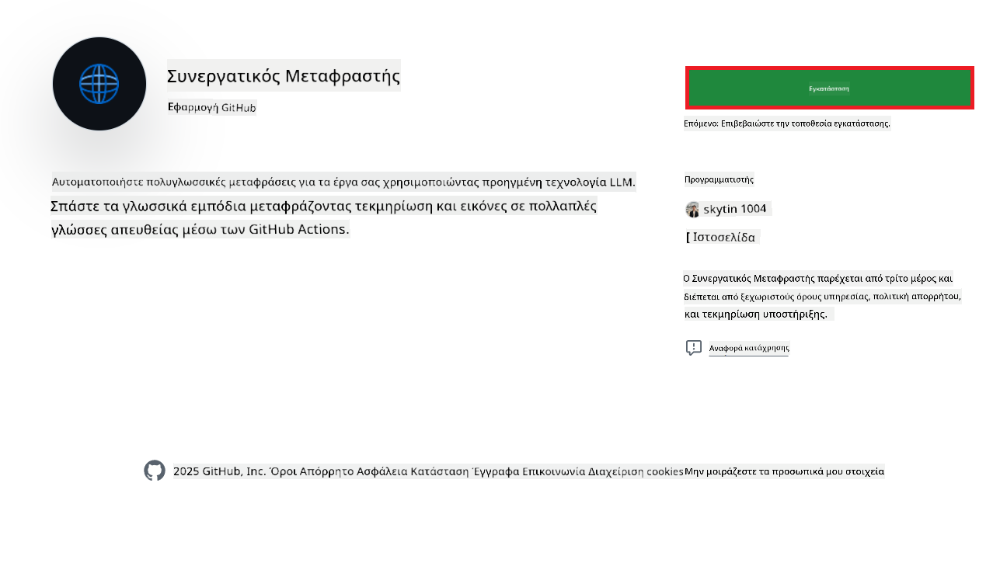
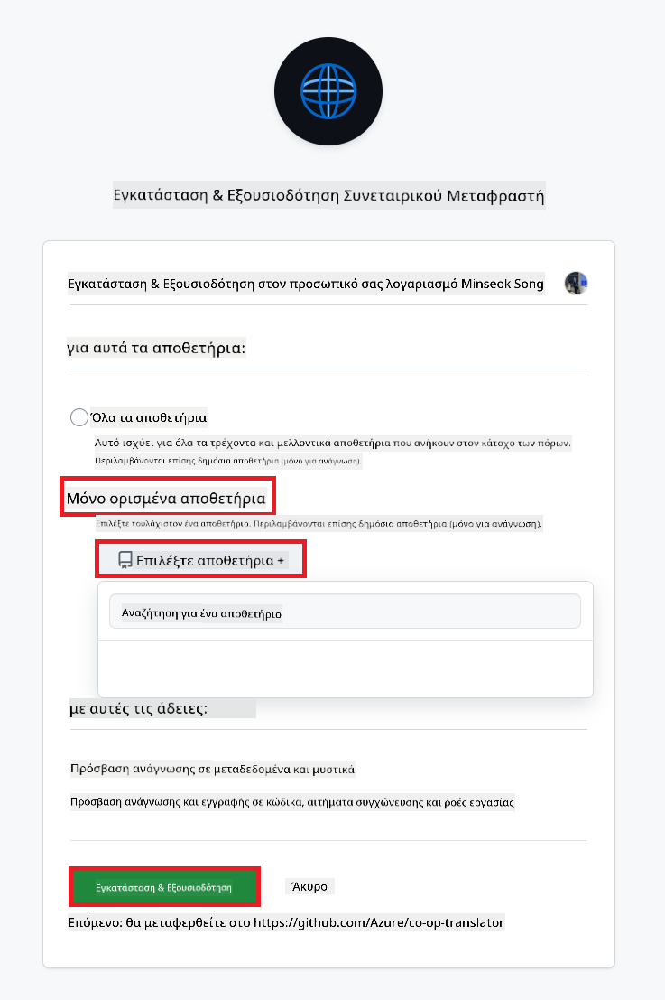
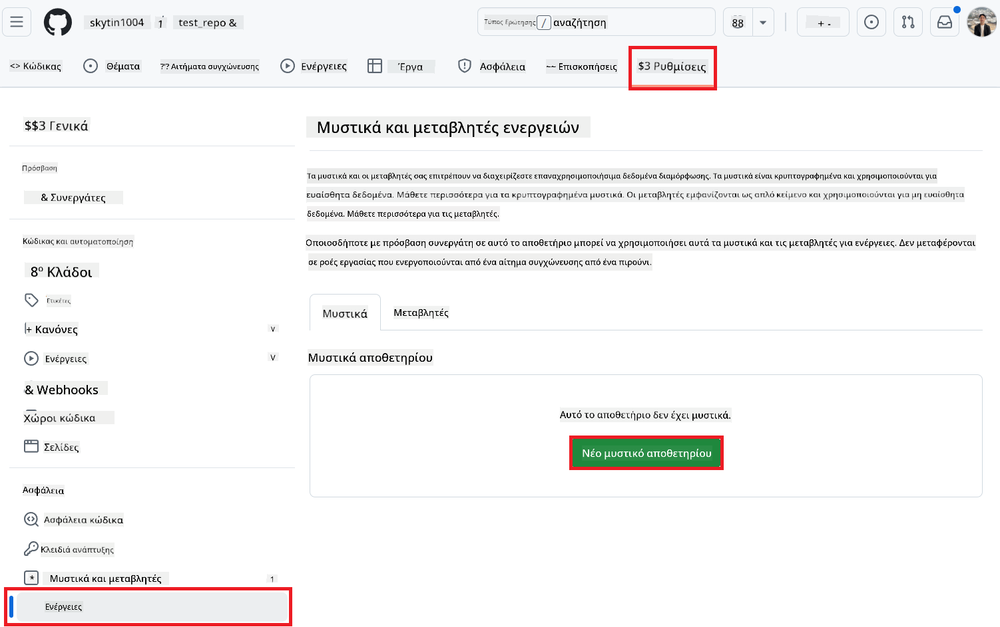
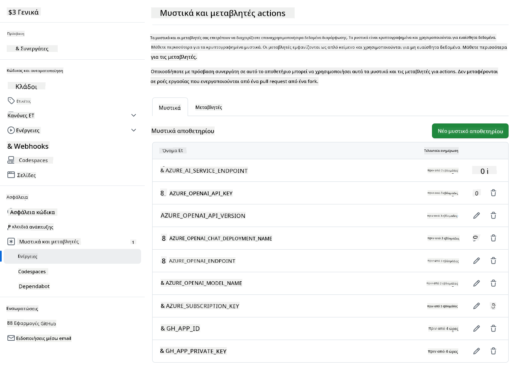

<!--
CO_OP_TRANSLATOR_METADATA:
{
  "original_hash": "c437820027c197f25fb2cbee95bae28c",
  "translation_date": "2025-06-12T19:10:03+00:00",
  "source_file": "getting_started/github-actions-guide/github-actions-guide-org.md",
  "language_code": "el"
}
-->
# Χρήση του Co-op Translator GitHub Action (Οδηγός Οργάνωσης)

**Προοριζόμενο κοινό:** Αυτός ο οδηγός απευθύνεται σε **εσωτερικούς χρήστες της Microsoft** ή **ομάδες που έχουν πρόσβαση στα απαραίτητα διαπιστευτήρια για την προεγκατεστημένη εφαρμογή Co-op Translator GitHub App** ή μπορούν να δημιουργήσουν τη δική τους προσαρμοσμένη εφαρμογή GitHub.

Αυτοματοποιήστε εύκολα τη μετάφραση της τεκμηρίωσης του αποθετηρίου σας χρησιμοποιώντας το Co-op Translator GitHub Action. Αυτός ο οδηγός σας καθοδηγεί στη ρύθμιση του action ώστε να δημιουργεί αυτόματα pull requests με ενημερωμένες μεταφράσεις κάθε φορά που αλλάζουν τα αρχικά αρχεία Markdown ή οι εικόνες σας.

> [!IMPORTANT]
> 
> **Επιλογή του κατάλληλου οδηγού:**
>
> Αυτός ο οδηγός περιγράφει τη ρύθμιση χρησιμοποιώντας **GitHub App ID και Ιδιωτικό Κλειδί**. Συνήθως χρειάζεστε αυτή τη μέθοδο "Οδηγός Οργάνωσης" αν: **`GITHUB_TOKEN` Οι Άδειες είναι Περιορισμένες:** Οι ρυθμίσεις του οργανισμού ή του αποθετηρίου σας περιορίζουν τις προεπιλεγμένες άδειες που δίνονται στο τυπικό `GITHUB_TOKEN`. Συγκεκριμένα, αν το `GITHUB_TOKEN` δεν έχει τις απαραίτητες άδειες `write` (όπως `contents: write` ή `pull-requests: write`), η ροή εργασίας στον [Δημόσιο Οδηγό Ρύθμισης](./github-actions-guide-public.md) θα αποτύχει λόγω ανεπαρκών αδειών. Η χρήση μιας ειδικής εφαρμογής GitHub με ρητά παραχωρημένες άδειες παρακάμπτει αυτόν τον περιορισμό.
>
> **Αν τα παραπάνω δεν ισχύουν για εσάς:**
>
> Αν το τυπικό `GITHUB_TOKEN` έχει επαρκείς άδειες στο αποθετήριό σας (δηλαδή δεν εμποδίζεστε από περιορισμούς οργανισμού), παρακαλούμε χρησιμοποιήστε τον **[Δημόσιο Οδηγό Ρύθμισης με χρήση GITHUB_TOKEN](./github-actions-guide-public.md)**. Ο δημόσιος οδηγός δεν απαιτεί απόκτηση ή διαχείριση App IDs ή Ιδιωτικών Κλειδιών και βασίζεται αποκλειστικά στο τυπικό `GITHUB_TOKEN` και τις άδειες του αποθετηρίου.

## Προαπαιτούμενα

Πριν ρυθμίσετε το GitHub Action, βεβαιωθείτε ότι έχετε έτοιμα τα απαραίτητα διαπιστευτήρια υπηρεσιών AI.

**1. Απαιτούμενο: Διαπιστευτήρια Μοντέλου Γλώσσας AI**  
Χρειάζεστε διαπιστευτήρια για τουλάχιστον ένα υποστηριζόμενο Μοντέλο Γλώσσας:

- **Azure OpenAI**: Απαιτούνται Endpoint, API Key, Ονόματα Μοντέλου/Ανάπτυξης, Έκδοση API.  
- **OpenAI**: Απαιτείται API Key, (Προαιρετικά: Org ID, Βασικό URL, Model ID).  
- Δείτε [Υποστηριζόμενα Μοντέλα και Υπηρεσίες](../../../../README.md) για λεπτομέρειες.  
- Οδηγός Ρύθμισης: [Ρύθμιση Azure OpenAI](../set-up-resources/set-up-azure-openai.md).

**2. Προαιρετικό: Διαπιστευτήρια Computer Vision (για μετάφραση εικόνων)**

- Απαιτείται μόνο αν θέλετε να μεταφράσετε κείμενο μέσα σε εικόνες.  
- **Azure Computer Vision**: Απαιτούνται Endpoint και Subscription Key.  
- Αν δεν δοθούν, το action θα λειτουργήσει σε [μόνο Markdown mode](../markdown-only-mode.md).  
- Οδηγός Ρύθμισης: [Ρύθμιση Azure Computer Vision](../set-up-resources/set-up-azure-computer-vision.md).

## Ρύθμιση και Παραμετροποίηση

Ακολουθήστε τα βήματα για να ρυθμίσετε το Co-op Translator GitHub Action στο αποθετήριό σας:

### Βήμα 1: Εγκατάσταση και Ρύθμιση Πιστοποίησης GitHub App

Η ροή εργασίας χρησιμοποιεί πιστοποίηση GitHub App για ασφαλή αλληλεπίδραση με το αποθετήριό σας (π.χ., δημιουργία pull requests) εκ μέρους σας. Επιλέξτε μία από τις επιλογές:

#### **Επιλογή Α: Εγκατάσταση της Προεγκατεστημένης Εφαρμογής Co-op Translator GitHub App (για εσωτερική χρήση Microsoft)**

1. Μεταβείτε στη σελίδα [Co-op Translator GitHub App](https://github.com/apps/co-op-translator).

1. Επιλέξτε **Install** και επιλέξτε τον λογαριασμό ή την οργάνωση όπου βρίσκεται το αποθετήριο στόχος σας.

    

1. Επιλέξτε **Only select repositories** και επιλέξτε το αποθετήριο στόχος (π.χ. `PhiCookBook`). Πατήστε **Install**. Ενδέχεται να σας ζητηθεί να πιστοποιηθείτε.

    

1. **Απόκτηση Διαπιστευτηρίων Εφαρμογής (Απαιτείται εσωτερική διαδικασία):** Για να επιτρέψετε στη ροή εργασίας να πιστοποιηθεί ως η εφαρμογή, χρειάζεστε δύο στοιχεία που παρέχονται από την ομάδα Co-op Translator:  
  - **App ID:** Το μοναδικό αναγνωριστικό της εφαρμογής Co-op Translator. Το App ID είναι: `1164076`.  
  - **Ιδιωτικό Κλειδί:** Πρέπει να λάβετε **όλο το περιεχόμενο** του αρχείου ιδιωτικού κλειδιού `.pem` από τον υπεύθυνο συντήρησης. **Φυλάξτε αυτό το κλειδί σαν κωδικό πρόσβασης και κρατήστε το ασφαλές.**

1. Συνεχίστε στο Βήμα 2.

#### **Επιλογή Β: Χρήση της δικής σας Προσαρμοσμένης Εφαρμογής GitHub**

- Αν προτιμάτε, μπορείτε να δημιουργήσετε και να ρυθμίσετε τη δική σας εφαρμογή GitHub. Βεβαιωθείτε ότι έχει δικαιώματα Ανάγνωσης & Εγγραφής σε Περιεχόμενο και Pull requests. Θα χρειαστείτε το App ID και ένα παραγόμενο Ιδιωτικό Κλειδί.

### Βήμα 2: Ρύθμιση Μυστικών του Αποθετηρίου

Πρέπει να προσθέσετε τα διαπιστευτήρια της εφαρμογής GitHub και τα διαπιστευτήρια της υπηρεσίας AI ως κρυπτογραφημένα μυστικά στις ρυθμίσεις του αποθετηρίου σας.

1. Μεταβείτε στο αποθετήριο στόχο σας (π.χ. `PhiCookBook`).

1. Πλοηγηθείτε στο **Settings** > **Secrets and variables** > **Actions**.

1. Στην ενότητα **Repository secrets**, κάντε κλικ στο **New repository secret** για κάθε μυστικό που αναφέρεται παρακάτω.

   

**Απαιτούμενα Μυστικά (για Πιστοποίηση GitHub App):**

| Όνομα Μυστικού         | Περιγραφή                                    | Πηγή Τιμής                                      |
| :--------------------- | :------------------------------------------- | :----------------------------------------------- |
| `GH_APP_ID`          | Το App ID της εφαρμογής GitHub (από Βήμα 1). | Ρυθμίσεις Εφαρμογής GitHub                      |
| `GH_APP_PRIVATE_KEY` | Το **ολόκληρο περιεχόμενο** του κατεβασμένου αρχείου `.pem`. | Αρχείο `.pem` (από Βήμα 1)          |

**Μυστικά Υπηρεσίας AI (Προσθέστε ΟΛΑ που ισχύουν ανάλογα με τα Προαπαιτούμενα):**

| Όνομα Μυστικού                         | Περιγραφή                              | Πηγή Τιμής                     |
| :------------------------------------ | :------------------------------------ | :------------------------------ |
| `AZURE_SUBSCRIPTION_KEY`            | Κλειδί για Azure AI Service (Computer Vision) | Azure AI Foundry                |
| `AZURE_AI_SERVICE_ENDPOINT`         | Endpoint για Azure AI Service (Computer Vision) | Azure AI Foundry                |
| `AZURE_OPENAI_API_KEY`              | Κλειδί για Azure OpenAI υπηρεσία         | Azure AI Foundry                |
| `AZURE_OPENAI_ENDPOINT`             | Endpoint για Azure OpenAI υπηρεσία        | Azure AI Foundry                |
| `AZURE_OPENAI_MODEL_NAME`           | Το όνομα του Azure OpenAI μοντέλου σας     | Azure AI Foundry                |
| `AZURE_OPENAI_CHAT_DEPLOYMENT_NAME` | Το όνομα ανάπτυξης Azure OpenAI σας         | Azure AI Foundry                |
| `AZURE_OPENAI_API_VERSION`          | Έκδοση API για Azure OpenAI               | Azure AI Foundry                |
| `OPENAI_API_KEY`                    | API Key για OpenAI                        | OpenAI Platform                |
| `OPENAI_ORG_ID`                     | OpenAI Organization ID                    | OpenAI Platform                |
| `OPENAI_CHAT_MODEL_ID`              | Συγκεκριμένο OpenAI model ID               | OpenAI Platform                |
| `OPENAI_BASE_URL`                   | Προσαρμοσμένο OpenAI API Base URL           | OpenAI Platform                |



### Βήμα 3: Δημιουργία του Αρχείου Ροής Εργασίας

Τέλος, δημιουργήστε το αρχείο YAML που ορίζει τη ροή εργασίας αυτοματοποίησης.

1. Στον ριζικό φάκελο του αποθετηρίου σας, δημιουργήστε τον φάκελο `.github/workflows/` αν δεν υπάρχει ήδη.

1. Μέσα στον `.github/workflows/`, δημιουργήστε ένα αρχείο με όνομα `co-op-translator.yml`.

1. Επικολλήστε το ακόλουθο περιεχόμενο στο co-op-translator.yml.

```
name: Co-op Translator

on:
  push:
    branches:
      - main

jobs:
  co-op-translator:
    runs-on: ubuntu-latest

    permissions:
      contents: write
      pull-requests: write

    steps:
      - name: Checkout repository
        uses: actions/checkout@v4
        with:
          fetch-depth: 0

      - name: Set up Python
        uses: actions/setup-python@v4
        with:
          python-version: '3.10'

      - name: Install Co-op Translator
        run: |
          python -m pip install --upgrade pip
          pip install co-op-translator

      - name: Run Co-op Translator
        env:
          PYTHONIOENCODING: utf-8
          # Azure AI Service Credentials
          AZURE_SUBSCRIPTION_KEY: ${{ secrets.AZURE_SUBSCRIPTION_KEY }}
          AZURE_AI_SERVICE_ENDPOINT: ${{ secrets.AZURE_AI_SERVICE_ENDPOINT }}

          # Azure OpenAI Credentials
          AZURE_OPENAI_API_KEY: ${{ secrets.AZURE_OPENAI_API_KEY }}
          AZURE_OPENAI_ENDPOINT: ${{ secrets.AZURE_OPENAI_ENDPOINT }}
          AZURE_OPENAI_MODEL_NAME: ${{ secrets.AZURE_OPENAI_MODEL_NAME }}
          AZURE_OPENAI_CHAT_DEPLOYMENT_NAME: ${{ secrets.AZURE_OPENAI_CHAT_DEPLOYMENT_NAME }}
          AZURE_OPENAI_API_VERSION: ${{ secrets.AZURE_OPENAI_API_VERSION }}

          # OpenAI Credentials
          OPENAI_API_KEY: ${{ secrets.OPENAI_API_KEY }}
          OPENAI_ORG_ID: ${{ secrets.OPENAI_ORG_ID }}
          OPENAI_CHAT_MODEL_ID: ${{ secrets.OPENAI_CHAT_MODEL_ID }}
          OPENAI_BASE_URL: ${{ secrets.OPENAI_BASE_URL }}
        run: |
          # =====================================================================
          # IMPORTANT: Set your target languages here (REQUIRED CONFIGURATION)
          # =====================================================================
          # Example: Translate to Spanish, French, German. Add -y to auto-confirm.
          translate -l "es fr de" -y  # <--- MODIFY THIS LINE with your desired languages

      - name: Authenticate GitHub App
        id: generate_token
        uses: tibdex/github-app-token@v1
        with:
          app_id: ${{ secrets.GH_APP_ID }}
          private_key: ${{ secrets.GH_APP_PRIVATE_KEY }}

      - name: Create Pull Request with translations
        uses: peter-evans/create-pull-request@v5
        with:
          token: ${{ steps.generate_token.outputs.token }}
          commit-message: "🌐 Update translations via Co-op Translator"
          title: "🌐 Update translations via Co-op Translator"
          body: |
            This PR updates translations for recent changes to the main branch.

            ### 📋 Changes included
            - Translated contents are available in the `translations/` directory
            - Translated images are available in the `translated_images/` directory

            ---
            🌐 Automatically generated by the [Co-op Translator](https://github.com/Azure/co-op-translator) GitHub Action.
          branch: update-translations
          base: main
          labels: translation, automated-pr
          delete-branch: true
          add-paths: |
            translations/
            translated_images/

```

4.  **Προσαρμογή της Ροής Εργασίας:**  
  - **[!IMPORTANT] Γλώσσες-στόχοι:** Στην εντολή `Run Co-op Translator` step, you **MUST review and modify the list of language codes** within the `translate -l "..." -y` command to match your project's requirements. The example list (`ar de es...`) needs to be replaced or adjusted.
  - **Trigger (`on:`):** The current trigger runs on every push to `main`. For large repositories, consider adding a `paths:` filter (see commented example in the YAML) to run the workflow only when relevant files (e.g., source documentation) change, saving runner minutes.
  - **PR Details:** Customize the `commit-message`, `title`, `body`, `branch` name, and `labels` in the `Create Pull Request` step if needed.

## Credential Management and Renewal

- **Security:** Always store sensitive credentials (API keys, private keys) as GitHub Actions secrets. Never expose them in your workflow file or repository code.
- **[!IMPORTANT] Key Renewal (Internal Microsoft Users):** Be aware that Azure OpenAI key used within Microsoft might have a mandatory renewal policy (e.g., every 5 months). Ensure you update the corresponding GitHub secrets (`AZURE_OPENAI_...` προσθέστε τις γλώσσες που θέλετε **πριν λήξουν** για να αποφύγετε αποτυχίες της ροής εργασίας.

## Εκτέλεση της Ροής Εργασίας

Μόλις το αρχείο `co-op-translator.yml` συγχωνευτεί στο κύριο branch σας (ή στο branch που ορίζεται στο φίλτρο `on:` trigger), the workflow will automatically run whenever changes are pushed to that branch (and match the `paths`, αν έχει ρυθμιστεί).

Εάν δημιουργηθούν ή ενημερωθούν μεταφράσεις, το action θα δημιουργήσει αυτόματα ένα Pull Request με τις αλλαγές, έτοιμο για την ανασκόπηση και τη συγχώνευσή σας.

**Αποποίηση ευθυνών**:  
Αυτό το έγγραφο έχει μεταφραστεί χρησιμοποιώντας την υπηρεσία αυτόματης μετάφρασης AI [Co-op Translator](https://github.com/Azure/co-op-translator). Παρόλο που προσπαθούμε για ακρίβεια, παρακαλούμε να γνωρίζετε ότι οι αυτόματες μεταφράσεις ενδέχεται να περιέχουν σφάλματα ή ανακρίβειες. Το πρωτότυπο έγγραφο στη γλώσσα του θεωρείται η επίσημη πηγή. Για κρίσιμες πληροφορίες, συνιστάται η επαγγελματική ανθρώπινη μετάφραση. Δεν φέρουμε ευθύνη για τυχόν παρεξηγήσεις ή λανθασμένες ερμηνείες που προκύπτουν από τη χρήση αυτής της μετάφρασης.