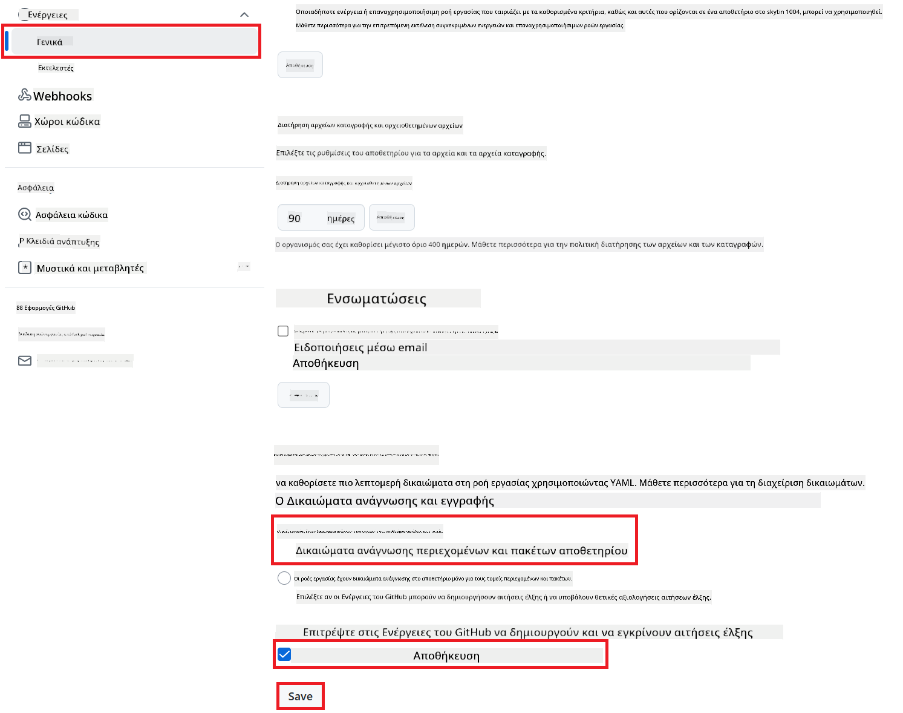

<!--
CO_OP_TRANSLATOR_METADATA:
{
  "original_hash": "a52587a512e667f70d92db853d3c61d5",
  "translation_date": "2025-06-12T19:28:46+00:00",
  "source_file": "getting_started/github-actions-guide/github-actions-guide-public.md",
  "language_code": "el"
}
-->
# Χρήση του Co-op Translator GitHub Action (Δημόσια Ρύθμιση)

**Προοριζόμενο Κοινό:** Ο οδηγός αυτός απευθύνεται σε χρήστες των περισσότερων δημόσιων ή ιδιωτικών αποθετηρίων όπου τα τυπικά δικαιώματα του GitHub Actions είναι επαρκή. Χρησιμοποιεί το ενσωματωμένο `GITHUB_TOKEN`.

Αυτοματοποιήστε τη μετάφραση της τεκμηρίωσης του αποθετηρίου σας εύκολα χρησιμοποιώντας το Co-op Translator GitHub Action. Αυτός ο οδηγός σας καθοδηγεί στη ρύθμιση του action ώστε να δημιουργεί αυτόματα pull requests με ενημερωμένες μεταφράσεις κάθε φορά που αλλάζουν τα αρχικά αρχεία Markdown ή οι εικόνες σας.

> [!IMPORTANT]
>
> **Επιλογή του Κατάλληλου Οδηγού:**
>
> Ο οδηγός αυτός περιγράφει τη **απλούστερη ρύθμιση με χρήση του τυπικού `GITHUB_TOKEN`**. Αυτή είναι η συνιστώμενη μέθοδος για τους περισσότερους χρήστες καθώς δεν απαιτεί διαχείριση ευαίσθητων ιδιωτικών κλειδιών GitHub App.
>

## Προαπαιτούμενα

Πριν ρυθμίσετε το GitHub Action, βεβαιωθείτε ότι έχετε έτοιμα τα απαραίτητα διαπιστευτήρια υπηρεσιών AI.

**1. Απαραίτητα: Διαπιστευτήρια Γλωσσικού Μοντέλου AI**  
Χρειάζεστε διαπιστευτήρια για τουλάχιστον ένα υποστηριζόμενο Γλωσσικό Μοντέλο:

- **Azure OpenAI**: Απαιτούνται Endpoint, API Key, Ονόματα Μοντέλου/Ανάπτυξης, Έκδοση API.  
- **OpenAI**: Απαιτείται API Key, (Προαιρετικά: Org ID, Base URL, Model ID).  
- Δείτε [Supported Models and Services](../../../../README.md) για λεπτομέρειες.

**2. Προαιρετικά: Διαπιστευτήρια AI Vision (για Μετάφραση Εικόνων)**

- Απαιτείται μόνο αν θέλετε να μεταφράσετε κείμενο μέσα σε εικόνες.  
- **Azure AI Vision**: Απαιτούνται Endpoint και Subscription Key.  
- Αν δεν δοθούν, το action θα λειτουργεί σε [Markdown-only mode](../markdown-only-mode.md).

## Ρύθμιση και Διαμόρφωση

Ακολουθήστε αυτά τα βήματα για να ρυθμίσετε το Co-op Translator GitHub Action στο αποθετήριό σας χρησιμοποιώντας το τυπικό `GITHUB_TOKEN`.

### Βήμα 1: Κατανόηση της Πιστοποίησης (Χρήση `GITHUB_TOKEN`)

Αυτή η ροή εργασίας χρησιμοποιεί το ενσωματωμένο `GITHUB_TOKEN` που παρέχεται από τα GitHub Actions. Αυτό το token παρέχει αυτόματα δικαιώματα στη ροή εργασίας για αλληλεπίδραση με το αποθετήριό σας βάσει των ρυθμίσεων που ορίζονται στο **Βήμα 3**.

### Βήμα 2: Διαμόρφωση Μυστικών Αποθετηρίου

Πρέπει μόνο να προσθέσετε τα **διαπιστευτήρια υπηρεσιών AI** ως κρυπτογραφημένα μυστικά στις ρυθμίσεις του αποθετηρίου σας.

1. Μεταβείτε στο επιθυμητό αποθετήριο στο GitHub.  
2. Πηγαίνετε στις **Settings** > **Secrets and variables** > **Actions**.  
3. Κάτω από **Repository secrets**, κάντε κλικ στο **New repository secret** για κάθε απαιτούμενο μυστικό AI υπηρεσίας που αναφέρεται παρακάτω.

     *(Αναφορά εικόνας: Δείχνει πού προσθέτετε τα μυστικά)*

**Απαιτούμενα Μυστικά AI Υπηρεσιών (Προσθέστε ΟΛΑ όσα ισχύουν σύμφωνα με τα Προαπαιτούμενα):**

| Όνομα Μυστικού                      | Περιγραφή                                 | Πηγή Τιμής                       |
| :--------------------------------- | :--------------------------------------- | :------------------------------ |
| `AZURE_SUBSCRIPTION_KEY`                  | Κλειδί για Azure AI Service (Computer Vision) | Το Azure AI Foundry σας          |
| `AZURE_AI_SERVICE_ENDPOINT`                  | Endpoint για Azure AI Service (Computer Vision) | Το Azure AI Foundry σας          |
| `AZURE_OPENAI_API_KEY`                  | Κλειδί για Azure OpenAI υπηρεσία          | Το Azure AI Foundry σας          |
| `AZURE_OPENAI_ENDPOINT`                  | Endpoint για Azure OpenAI υπηρεσία         | Το Azure AI Foundry σας          |
| `AZURE_OPENAI_MODEL_NAME`                  | Όνομα Μοντέλου Azure OpenAI                 | Το Azure AI Foundry σας          |
| `AZURE_OPENAI_CHAT_DEPLOYMENT_NAME`                 | Όνομα Ανάπτυξης Azure OpenAI                 | Το Azure AI Foundry σας          |
| `AZURE_OPENAI_API_VERSION`                 | Έκδοση API για Azure OpenAI                  | Το Azure AI Foundry σας          |
| `OPENAI_API_KEY`                 | API Key για OpenAI                           | Η πλατφόρμα OpenAI σας          |
| `OPENAI_ORG_ID`                 | OpenAI Organization ID (Προαιρετικό)          | Η πλατφόρμα OpenAI σας          |
| `OPENAI_CHAT_MODEL_ID`                 | Συγκεκριμένο ID μοντέλου OpenAI (Προαιρετικό) | Η πλατφόρμα OpenAI σας          |
| `OPENAI_BASE_URL`                 | Προσαρμοσμένο OpenAI API Base URL (Προαιρετικό) | Η πλατφόρμα OpenAI σας          |

### Βήμα 3: Ρύθμιση Δικαιωμάτων Ροής Εργασίας

Το GitHub Action χρειάζεται δικαιώματα που παρέχονται μέσω του `GITHUB_TOKEN` για να κάνει checkout κώδικα και να δημιουργεί pull requests.

1. Στο αποθετήριό σας, μεταβείτε στις **Settings** > **Actions** > **General**.  
2. Κάντε κύλιση στην ενότητα **Workflow permissions**.  
3. Επιλέξτε **Read and write permissions**. Αυτό παρέχει στο `GITHUB_TOKEN` τα απαραίτητα `contents: write` και `pull-requests: write` δικαιώματα για αυτή τη ροή εργασίας.  
4. Βεβαιωθείτε ότι είναι επιλεγμένο το κουτάκι **Allow GitHub Actions to create and approve pull requests**.  
5. Επιλέξτε **Save**.



### Βήμα 4: Δημιουργία του Αρχείου Ροής Εργασίας

Τέλος, δημιουργήστε το αρχείο YAML που ορίζει τη ροή εργασίας αυτοματοποίησης χρησιμοποιώντας το `GITHUB_TOKEN`.

1. Στον ριζικό φάκελο του αποθετηρίου σας, δημιουργήστε τον φάκελο `.github/workflows/` αν δεν υπάρχει ήδη.  
2. Μέσα στον `.github/workflows/`, δημιουργήστε ένα αρχείο με όνομα `co-op-translator.yml`.  
3. Επικολλήστε το ακόλουθο περιεχόμενο μέσα στο `co-op-translator.yml`.

```yaml
name: Co-op Translator

on:
  push:
    branches:
      - main

jobs:
  co-op-translator:
    runs-on: ubuntu-latest

    permissions:
      contents: write
      pull-requests: write

    steps:
      - name: Checkout repository
        uses: actions/checkout@v4
        with:
          fetch-depth: 0

      - name: Set up Python
        uses: actions/setup-python@v4
        with:
          python-version: '3.10'

      - name: Install Co-op Translator
        run: |
          python -m pip install --upgrade pip
          pip install co-op-translator

      - name: Run Co-op Translator
        env:
          PYTHONIOENCODING: utf-8
          # === AI Service Credentials ===
          AZURE_SUBSCRIPTION_KEY: ${{ secrets.AZURE_SUBSCRIPTION_KEY }}
          AZURE_AI_SERVICE_ENDPOINT: ${{ secrets.AZURE_AI_SERVICE_ENDPOINT }}
          AZURE_OPENAI_API_KEY: ${{ secrets.AZURE_OPENAI_API_KEY }}
          AZURE_OPENAI_ENDPOINT: ${{ secrets.AZURE_OPENAI_ENDPOINT }}
          AZURE_OPENAI_MODEL_NAME: ${{ secrets.AZURE_OPENAI_MODEL_NAME }}
          AZURE_OPENAI_CHAT_DEPLOYMENT_NAME: ${{ secrets.AZURE_OPENAI_CHAT_DEPLOYMENT_NAME }}
          AZURE_OPENAI_API_VERSION: ${{ secrets.AZURE_OPENAI_API_VERSION }}
          OPENAI_API_KEY: ${{ secrets.OPENAI_API_KEY }}
          OPENAI_ORG_ID: ${{ secrets.OPENAI_ORG_ID }}
          OPENAI_CHAT_MODEL_ID: ${{ secrets.OPENAI_CHAT_MODEL_ID }}
          OPENAI_BASE_URL: ${{ secrets.OPENAI_BASE_URL }}
        run: |
          # =====================================================================
          # IMPORTANT: Set your target languages here (REQUIRED CONFIGURATION)
          # =====================================================================
          # Example: Translate to Spanish, French, German. Add -y to auto-confirm.
          translate -l "es fr de" -y  # <--- MODIFY THIS LINE with your desired languages

      - name: Create Pull Request with translations
        uses: peter-evans/create-pull-request@v5
        with:
          token: ${{ secrets.GITHUB_TOKEN }}
          commit-message: "🌐 Update translations via Co-op Translator"
          title: "🌐 Update translations via Co-op Translator"
          body: |
            This PR updates translations for recent changes to the main branch.

            ### 📋 Changes included
            - Translated contents are available in the `translations/` directory
            - Translated images are available in the `translated_images/` directory

            ---
            🌐 Automatically generated by the [Co-op Translator](https://github.com/Azure/co-op-translator) GitHub Action.
          branch: update-translations
          base: main
          labels: translation, automated-pr
          delete-branch: true
          add-paths: |
            translations/
            translated_images/
```  
4. **Προσαρμογή της Ροής Εργασίας:**  
  - **[!IMPORTANT] Γλώσσες Στόχου:** Στο βήμα `Run Co-op Translator` step, you **MUST review and modify the list of language codes** within the `translate -l "..." -y` command to match your project's requirements. The example list (`ar de es...`) needs to be replaced or adjusted.
  - **Trigger (`on:`):** The current trigger runs on every push to `main`. For large repositories, consider adding a `paths:` filter (see commented example in the YAML) to run the workflow only when relevant files (e.g., source documentation) change, saving runner minutes.
  - **PR Details:** Customize the `commit-message`, `title`, `body`, `branch` name, and `labels` in the `Create Pull Request`, αν χρειάζεται.

**Αποποίηση ευθυνών**:  
Αυτό το έγγραφο έχει μεταφραστεί χρησιμοποιώντας την υπηρεσία αυτόματης μετάφρασης AI [Co-op Translator](https://github.com/Azure/co-op-translator). Παρόλο που προσπαθούμε για ακρίβεια, παρακαλούμε να έχετε υπόψη ότι οι αυτόματες μεταφράσεις μπορεί να περιέχουν λάθη ή ανακρίβειες. Το πρωτότυπο έγγραφο στη γλώσσα του θεωρείται η αυθεντική πηγή. Για κρίσιμες πληροφορίες, συνιστάται επαγγελματική ανθρώπινη μετάφραση. Δεν φέρουμε ευθύνη για τυχόν παρεξηγήσεις ή λανθασμένες ερμηνείες που προκύπτουν από τη χρήση αυτής της μετάφρασης.