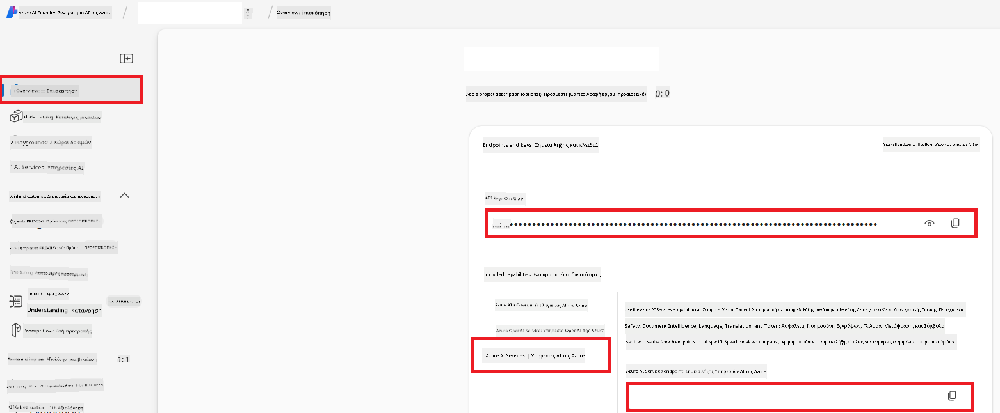

<!--
CO_OP_TRANSLATOR_METADATA:
{
  "original_hash": "b58d7c3cb4210697a073d20eb3064945",
  "translation_date": "2025-06-12T11:52:54+00:00",
  "source_file": "getting_started/set-up-azure-ai.md",
  "language_code": "el"
}
-->
# Ρύθμιση του Azure AI για Co-op Translator (Azure OpenAI & Azure AI Vision)

Αυτός ο οδηγός σας καθοδηγεί στη ρύθμιση του Azure OpenAI για μετάφραση γλωσσών και του Azure Computer Vision για ανάλυση περιεχομένου εικόνας (το οποίο μπορεί να χρησιμοποιηθεί για μετάφραση βασισμένη σε εικόνες) μέσα στο Azure AI Foundry.

**Προαπαιτούμενα:**
- Λογαριασμός Azure με ενεργή συνδρομή.
- Επαρκή δικαιώματα για τη δημιουργία πόρων και αναπτύξεων στη συνδρομή σας στο Azure.

## Δημιουργία ενός έργου Azure AI

Ξεκινάτε δημιουργώντας ένα έργο Azure AI, το οποίο λειτουργεί ως κεντρικό σημείο διαχείρισης των πόρων AI σας.

1. Μεταβείτε στη διεύθυνση [https://ai.azure.com](https://ai.azure.com) και συνδεθείτε με τον λογαριασμό σας Azure.

1. Επιλέξτε **+Create** για να δημιουργήσετε ένα νέο έργο.

1. Εκτελέστε τις παρακάτω ενέργειες:
   - Εισάγετε ένα **Όνομα έργου** (π.χ. `CoopTranslator-Project`).
   - Επιλέξτε το **AI hub** (π.χ. `CoopTranslator-Hub`) (δημιουργήστε νέο αν χρειάζεται).

1. Κάντε κλικ στο "**Review and Create**" για να ρυθμίσετε το έργο σας. Θα μεταφερθείτε στη σελίδα επισκόπησης του έργου σας.

## Ρύθμιση Azure OpenAI για μετάφραση γλώσσας

Μέσα στο έργο σας, θα αναπτύξετε ένα μοντέλο Azure OpenAI που θα λειτουργεί ως backend για τη μετάφραση κειμένου.

### Μεταβείτε στο έργο σας

Αν δεν βρίσκεστε ήδη εκεί, ανοίξτε το πρόσφατα δημιουργημένο έργο σας (π.χ. `CoopTranslator-Project`) στο Azure AI Foundry.

### Ανάπτυξη μοντέλου OpenAI

1. Από το αριστερό μενού του έργου σας, κάτω από "My assets", επιλέξτε "**Models + endpoints**".

1. Επιλέξτε **+ Deploy model**.

1. Επιλέξτε **Deploy Base Model**.

1. Θα εμφανιστεί λίστα με διαθέσιμα μοντέλα. Φιλτράρετε ή αναζητήστε ένα κατάλληλο μοντέλο GPT. Προτείνουμε το `gpt-4o`.

1. Επιλέξτε το μοντέλο που επιθυμείτε και κάντε κλικ στο **Confirm**.

1. Επιλέξτε **Deploy**.

### Ρυθμίσεις Azure OpenAI

Αφού ολοκληρωθεί η ανάπτυξη, μπορείτε να επιλέξετε την ανάπτυξη από τη σελίδα "**Models + endpoints**" για να βρείτε το **REST endpoint URL**, το **Key**, το **Deployment name**, το **Model name** και την **API version**. Αυτά θα χρειαστούν για να ενσωματώσετε το μοντέλο μετάφρασης στην εφαρμογή σας.

> [!NOTE]
> Μπορείτε να επιλέξετε εκδόσεις API από τη σελίδα [API version deprecation](https://learn.microsoft.com/azure/ai-services/openai/api-version-deprecation) ανάλογα με τις ανάγκες σας. Να θυμάστε ότι η **API version** διαφέρει από την **Model version** που εμφανίζεται στη σελίδα **Models + endpoints** στο Azure AI Foundry.

## Ρύθμιση Azure Computer Vision για μετάφραση εικόνας

Για να ενεργοποιήσετε τη μετάφραση κειμένου μέσα σε εικόνες, πρέπει να βρείτε το API Key και το Endpoint της υπηρεσίας Azure AI.

1. Μεταβείτε στο έργο Azure AI σας (π.χ. `CoopTranslator-Project`). Βεβαιωθείτε ότι βρίσκεστε στη σελίδα επισκόπησης του έργου.

### Ρυθμίσεις υπηρεσίας Azure AI

Βρείτε το API Key και το Endpoint από την υπηρεσία Azure AI.

1. Μεταβείτε στο έργο Azure AI σας (π.χ. `CoopTranslator-Project`). Βεβαιωθείτε ότι βρίσκεστε στη σελίδα επισκόπησης του έργου.

1. Βρείτε το **API Key** και το **Endpoint** στην καρτέλα Azure AI Service.

    

Αυτή η σύνδεση καθιστά διαθέσιμες τις δυνατότητες του συνδεδεμένου πόρου Azure AI Services (συμπεριλαμβανομένης της ανάλυσης εικόνας) στο έργο σας στο AI Foundry. Στη συνέχεια, μπορείτε να χρησιμοποιήσετε αυτή τη σύνδεση στα notebooks ή τις εφαρμογές σας για να εξάγετε κείμενο από εικόνες, το οποίο μπορεί να αποσταλεί στο μοντέλο Azure OpenAI για μετάφραση.

## Συγκέντρωση των διαπιστευτηρίων σας

Μέχρι τώρα, θα πρέπει να έχετε συγκεντρώσει τα εξής:

**Για Azure OpenAI (Μετάφραση κειμένου):**
- Azure OpenAI Endpoint
- Azure OpenAI API Key
- Όνομα μοντέλου Azure OpenAI (π.χ. `gpt-4o`)
- Όνομα ανάπτυξης Azure OpenAI (π.χ. `cooptranslator-gpt4o`)
- Έκδοση API Azure OpenAI

**Για Azure AI Services (Εξαγωγή κειμένου εικόνας μέσω Vision):**
- Endpoint υπηρεσίας Azure AI
- API Key υπηρεσίας Azure AI

### Παράδειγμα: Ρύθμιση μεταβλητών περιβάλλοντος (Προεπισκόπηση)

Αργότερα, κατά την ανάπτυξη της εφαρμογής σας, πιθανότατα θα τη ρυθμίσετε χρησιμοποιώντας αυτά τα διαπιστευτήρια. Για παράδειγμα, μπορεί να τα ορίσετε ως μεταβλητές περιβάλλοντος ως εξής:

```bash
# Azure AI Service Credentials (Required for image translation)
AZURE_AI_SERVICE_API_KEY="your_azure_ai_service_api_key" # e.g., 21xasd...
AZURE_AI_SERVICE_ENDPOINT="https://your_azure_ai_service_endpoint.cognitiveservices.azure.com/"

# Azure OpenAI Credentials (Required for text translation)
AZURE_OPENAI_API_KEY="your_azure_openai_api_key" # e.g., 21xasd...
AZURE_OPENAI_ENDPOINT="https://your_azure_openai_endpoint.openai.azure.com/"
AZURE_OPENAI_MODEL_NAME="your_model_name" # e.g., gpt-4o
AZURE_OPENAI_CHAT_DEPLOYMENT_NAME="your_deployment_name" # e.g., cooptranslator-gpt4o
AZURE_OPENAI_API_VERSION="your_api_version" # e.g., 2024-12-01-preview
```

---

### Περισσότερη ανάγνωση

- [How to Create a project in Azure AI Foundry](https://learn.microsoft.com/azure/ai-foundry/how-to/create-projects?tabs=ai-studio)
- [How to Create Azure AI resources](https://learn.microsoft.com/azure/ai-foundry/how-to/create-azure-ai-resource?tabs=portal)
- [How to Deploy OpenAI models in Azure AI Foundry](https://learn.microsoft.com/en-us/azure/ai-foundry/how-to/deploy-models-openai)

**Αποποίηση ευθυνών**:  
Αυτό το έγγραφο έχει μεταφραστεί χρησιμοποιώντας την υπηρεσία αυτόματης μετάφρασης AI [Co-op Translator](https://github.com/Azure/co-op-translator). Παρόλο που επιδιώκουμε ακρίβεια, παρακαλούμε να έχετε υπόψη ότι οι αυτόματες μεταφράσεις ενδέχεται να περιέχουν σφάλματα ή ανακρίβειες. Το πρωτότυπο έγγραφο στη μητρική του γλώσσα πρέπει να θεωρείται η αυθεντική πηγή. Για κρίσιμες πληροφορίες, συνιστάται επαγγελματική ανθρώπινη μετάφραση. Δεν φέρουμε ευθύνη για τυχόν παρεξηγήσεις ή λανθασμένες ερμηνείες που προκύπτουν από τη χρήση αυτής της μετάφρασης.