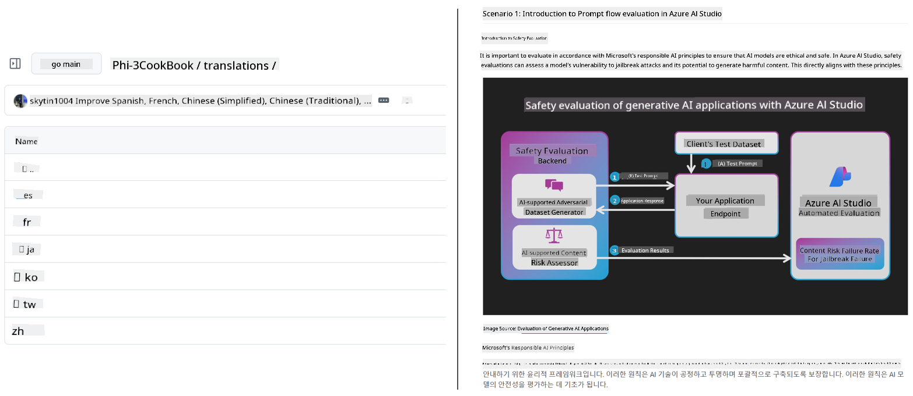
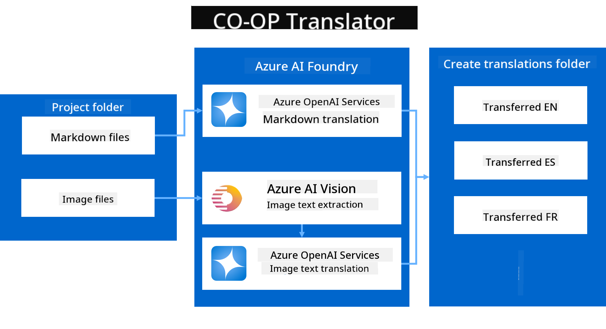

<!--
CO_OP_TRANSLATOR_METADATA:
{
  "original_hash": "044724537b57868117aadae8e7728c7c",
  "translation_date": "2025-06-12T09:46:10+00:00",
  "source_file": "README.md",
  "language_code": "en"
}
-->


# Co-op Translator: Automate the Translation of Educational Documentation Effortlessly

_Easily automate the translation of your documentation into multiple languages to reach a global audience._

[](https://pypi.org/project/co-op-translator/)
[](https://github.com/azure/co-op-translator/blob/main/LICENSE)
[](https://pepy.tech/project/co-op-translator)
[](https://pepy.tech/project/co-op-translator)
[](https://github.com/psf/black)

[](https://GitHub.com/azure/co-op-translator/graphs/contributors/)
[](https://GitHub.com/azure/co-op-translator/issues/)
[](https://GitHub.com/azure/co-op-translator/pulls/)
[](http://makeapullrequest.com)

### Language Support Powered by Co-op Translator
[French](../fr/README.md) | [Spanish](../es/README.md) | [German](../de/README.md) | [Russian](../ru/README.md) | [Arabic](../ar/README.md) | [Persian (Farsi)](../fa/README.md) | [Urdu](../ur/README.md) | [Chinese (Simplified)](../zh/README.md) | [Chinese (Traditional, Macau)](../mo/README.md) | [Chinese (Traditional, Hong Kong)](../hk/README.md) | [Chinese (Traditional, Taiwan)](../tw/README.md) | [Japanese](../ja/README.md) | [Korean](../ko/README.md) | [Hindi](../hi/README.md) | [Bengali](../bn/README.md) | [Marathi](../mr/README.md) | [Nepali](../ne/README.md) | [Punjabi (Gurmukhi)](../pa/README.md) | [Portuguese (Portugal)](../pt/README.md) | [Portuguese (Brazil)](../br/README.md) | [Italian](../it/README.md) | [Polish](../pl/README.md) | [Turkish](../tr/README.md) | [Greek](../el/README.md) | [Thai](../th/README.md) | [Swedish](../sv/README.md) | [Danish](../da/README.md) | [Norwegian](../no/README.md) | [Finnish](../fi/README.md) | [Dutch](../nl/README.md) | [Hebrew](../he/README.md) | [Vietnamese](../vi/README.md) | [Indonesian](../id/README.md) | [Malay](../ms/README.md) | [Tagalog (Filipino)](../tl/README.md) | [Swahili](../sw/README.md) | [Hungarian](../hu/README.md) | [Czech](../cs/README.md) | [Slovak](../sk/README.md) | [Romanian](../ro/README.md) | [Bulgarian](../bg/README.md) | [Serbian (Cyrillic)](../sr/README.md) | [Croatian](../hr/README.md) | [Slovenian](../sl/README.md) | [Ukrainian](../uk/README.md) | [Burmese (Myanmar)](../my/README.md)
> [!NOTE]
> These are the current translations of this repository's content. For a complete list of languages supported by Co-op Translator, please see the [Language Support](../..) section.

[](https://GitHub.com/azure/co-op-translator/watchers/)
[](https://GitHub.com/azure/co-op-translator/network/)
[](https://GitHub.com/azure/co-op-translator/stargazers/)

[](https://discord.com/invite/ByRwuEEgH4)

[](https://codespaces.new/azure/co-op-translator)
[](https://vscode.dev/redirect?url=vscode://ms-vscode-remote.remote-containers/cloneInVolume?url=https://github.com/azure/co-op-translator)

## Overview: Streamline Your Educational Content Translation

Language barriers significantly limit access to valuable educational resources and technical knowledge for learners and developers worldwide. This restricts participation and slows the pace of global innovation and learning.

**Co-op Translator** was created to solve the inefficient manual translation process for Microsoft's large educational series (such as the "For Beginners" guides). It has grown into an easy-to-use, powerful tool designed to break down these barriers for everyone. By providing high-quality automated translations via CLI and GitHub Actions, Co-op Translator enables educators, students, researchers, and developers around the world to share and access knowledge without language restrictions.

See how Co-op Translator organizes translated educational content:



Markdown files and image text are automatically translated and neatly organized into language-specific folders.

**Unlock global access to your educational content with Co-op Translator today!**

## Supporting Global Access for Microsoft's Learning Resources

Co-op Translator helps close the language gap for key Microsoft educational initiatives by automating translation for repositories serving a global developer community. Current projects using Co-op Translator include:

[](https://github.com/microsoft/Generative-AI-for-beginners)
[](https://github.com/microsoft/ML-For-Beginners)
[](https://github.com/microsoft/AI-For-Beginners)
[](https://github.com/microsoft/ai-agents-for-beginners)
[](https://github.com/microsoft/PhiCookBook)
[](https://github.com/microsoft/Generative-AI-for-beginners-dotnet)

## Key Features

- **Automated Translations**: Easily translate text into multiple languages.
- **GitHub Actions Integration**: Automate translations as part of your CI/CD workflow.
- **Markdown Preservation**: Keep correct Markdown formatting during translation.
- **Image Text Translation**: Extract and translate text inside images.
- **Advanced LLM Technology**: Leverage state-of-the-art language models for high-quality translations.
- **Easy Integration**: Seamlessly add to your existing project setup.
- **Simplify Localization**: Streamline the process of localizing your project for international audiences.

## How It Works



Co-op Translator processes Markdown files and images from your project folder as follows:

1. **Text Extraction**: Extracts text from Markdown files and, if configured (e.g., with Azure AI Vision), text embedded in images.
1. **AI Translation**: Sends the extracted text to the configured LLM (Azure OpenAI, OpenAI, etc.) for translation.
1. **Result Saving**: Saves translated Markdown files and images (with translated text) into language-specific folders, preserving the original formatting.

## Getting Started

Start quickly with the CLI or set up full automation with GitHub Actions. Choose the method that fits your workflow best:

1. **Command Line (CLI)** - For one-time translations or manual control
2. **GitHub Actions** - For automated translations on every push

> [!NOTE]
> Although this tutorial focuses on Azure resources, you can use any supported language model.

### Language Support

Co-op Translator supports a wide variety of languages to help you reach a global audience. Here’s what you need to know:

#### Quick Reference

| Language | Code | Language | Code | Language | Code |
|----------|------|----------|------|----------|------|
| Arabic | ar | Bengali | bn | Bulgarian | bg |
| Burmese (Myanmar) | my | Chinese (Simplified) | zh | Chinese (Traditional, HK) | hk |
| Chinese (Traditional, Macau) | mo | Chinese (Traditional, TW) | tw | Croatian | hr |
| Czech | cs | Danish | da | Dutch | nl |
| Finnish | fi | French | fr | German | de |
| Greek | el | Hebrew | he | Hindi | hi |
| Hungarian | hu | Indonesian | id | Italian | it |
| Japanese | ja | Korean | ko | Malay | ms |
| Marathi | mr | Nepali | ne | Norwegian | no |
| Persian (Farsi) | fa | Polish | pl | Portuguese (Brazil) | br |
| Portuguese (Portugal) | pt | Punjabi (Gurmukhi) | pa | Romanian | ro |
| Russian | ru | Serbian (Cyrillic) | sr | Slovak | sk |
| Slovenian | sl | Spanish | es | Swahili | sw |
| Swedish | sv | Tagalog (Filipino) | tl | Thai | th |
| Turkish | tr | Ukrainian | uk | Urdu | ur |
| Vietnamese | vi | — | — | — | — |

#### Using Language Codes

When using Co-op Translator, specify languages using their codes. For example:

```bash
# Translate to French, Spanish, and German
translate -l "fr es de"

# Translate to Chinese (Simplified) and Japanese
translate -l "zh ja"
```

> [!NOTE]
> For detailed technical info about language support, including:
>
> - Font specifications for each language
> - Known issues
> - How to add new languages
>
> See our [Supported Languages Documentation](./getting_started/supported-languages.md).

### Supported Models and Services

| Type                  | Name                           |
|-----------------------|--------------------------------|
| Language Model        |   |
| AI Vision       |  |

> [!NOTE]
> If an AI vision service is unavailable, Co-op Translator will switch to [Markdown-only mode](./getting_started/markdown-only-mode.md).

### Initial Setup

Before starting, set up the following resources:

1. Language Model Resource (Required):
   - Azure OpenAI (Recommended) - Offers high-quality translations with enterprise-grade reliability
   - OpenAI - Alternative if you don’t have Azure access
   - For detailed info on supported models, see [Supported Models and Services](../..)

1. AI Vision Resource (Optional):
   - Azure AI Vision - Enables translation of text inside images
   - If not set up, the translator will automatically use [Markdown-only mode](./getting_started/markdown-only-mode.md)
   - Recommended for projects with images containing text that needs translating

1. Configuration Steps:
   - Follow our [Azure AI setup guide](./getting_started/set-up-azure-ai.md) for detailed instructions
   - Create a `.env` file with your API keys and endpoints (see [Quick Start](../..) section)
   - Make sure you have the required permissions and quotas for your services

### Project Setup Before Translation

Before starting translation, prepare your project as follows:

1. Prepare Your README:
   - Add a translations table to your README.md linking to translated versions
   - Example format:

     ```markdown

     ### 🌐 Multi-Language Support
     
     [French](../fr/README.md) | [Spanish](../es/README.md) | [German](../de/README.md) | [Russian](../ru/README.md) | [Arabic](../ar/README.md) | [Persian (Farsi)](../fa/README.md) | [Urdu](../ur/README.md) | [Chinese (Simplified)](../zh/README.md) | [Chinese (Traditional, Macau)](../mo/README.md) | [Chinese (Traditional, Hong Kong)](../hk/README.md) | [Chinese (Traditional, Taiwan)](../tw/README.md) | [Japanese](../ja/README.md) | [Korean](../ko/README.md) | [Hindi](../hi/README.md) | [Bengali](../bn/README.md) | [Marathi](../mr/README.md) | [Nepali](../ne/README.md) | [Punjabi (Gurmukhi)](../pa/README.md) | [Portuguese (Portugal)](../pt/README.md) | [Portuguese (Brazil)](../br/README.md) | [Italian](../it/README.md) | [Polish](../pl/README.md) | [Turkish](../tr/README.md) | [Greek](../el/README.md) | [Thai](../th/README.md) | [Swedish](../sv/README.md) | [Danish](../da/README.md) | [Norwegian](../no/README.md) | [Finnish](../fi/README.md) | [Dutch](../nl/README.md) | [Hebrew](../he/README.md) | [Vietnamese](../vi/README.md) | [Indonesian](../id/README.md) | [Malay](../ms/README.md) | [Tagalog (Filipino)](../tl/README.md) | [Swahili](../sw/README.md) | [Hungarian](../hu/README.md) | [Czech](../cs/README.md) | [Slovak](../sk/README.md) | [Romanian](../ro/README.md) | [Bulgarian](../bg/README.md) | [Serbian (Cyrillic)](../sr/README.md) | [Croatian](../hr/README.md) | [Slovenian](../sl/README.md) | [Ukrainian](../uk/README.md) | [Burmese (Myanmar)](../my/README.md) 
    
     ```

1. Clean Up Existing Translations (if necessary):
   - Remove any existing translation folders (e.g., `translations/`)
   - Delete any old translation files to start fresh
   - This avoids conflicts with the new translation process

### Quick Start: Command Line

To get started quickly using the command line:

1. Create a virtual environment:

    ```bash
    python -m venv .venv
    ```

1. Activate the virtual environment:

    - On Windows:

    ```bash
    .venv\scripts\activate
    ```

    - On Linux/macOS:

    ```bash
    source .venv/bin/activate
    ```

1. Install the package:

    ```bash
    pip install co-op-translator
    ```

1. Configure Credentials:

    - Create a `.env` file with your API keys and endpoints

    ```bash
    translate -l "ko ja fr"
    ```

_(Replace `"ko ja fr"` with the language codes you want.)_

### GitHub Actions Setup

For automated translations triggered on repository pushes, configure GitHub Actions:

- Place your workflow file in `.github/workflows` in your repository. No local installation is required.
- Guides:
  - [GitHub Actions Guide (Public Repositories & Standard Secrets)](./getting_started/github-actions-guide/github-actions-guide-public.md) - For most public or personal repositories using standard repository secrets.
  - [GitHub Actions Guide (Microsoft Organization Repos & Org-Level Setups)](./getting_started/github-actions-guide/github-actions-guide-org.md) - For use within the Microsoft GitHub organization or when leveraging organization-level secrets or runners.

### Troubleshooting and Tips

- [Troubleshooting Guide](./getting_started/troubleshooting.md)

### Additional Resources

- [Command Reference](./getting_started/command-reference.md): Detailed guide to all commands and options.
- [Supported Languages](./getting_started/supported-languages.md): List of supported languages and how to add new ones.
- [Markdown-Only Mode](./getting_started/markdown-only-mode.md): How to translate text only, without image translation.

## Video Presentations

Learn more about Co-op Translator through our presentations _(Click the image below to watch on YouTube.)_:

- **Open at Microsoft**: A concise 18-minute introduction and quick guide on using Co-op Translator.
[](https://www.youtube.com/watch?v=jX_swfH_KNU)

## Support Us and Promote Global Learning

Join us in transforming the way educational content is shared worldwide! Give [Co-op Translator](https://github.com/azure/co-op-translator) a ⭐ on GitHub and help us break down language barriers in education and technology. Your interest and contributions make a real difference! Code contributions and feature ideas are always appreciated.

## Contributing

We welcome contributions and suggestions to this project. Interested in helping with Azure Co-op Translator? Please check our [CONTRIBUTING.md](./CONTRIBUTING.md) for details on how you can help make Co-op Translator more accessible.

## Contributors

[](https://github.com/Azure/co-op-translator/graphs/contributors)

## Code of Conduct

This project follows the [Microsoft Open Source Code of Conduct](https://opensource.microsoft.com/codeofconduct/).  
For more details, see the [Code of Conduct FAQ](https://opensource.microsoft.com/codeofconduct/faq/) or  
contact [opencode@microsoft.com](mailto:opencode@microsoft.com) with any questions or feedback.

## Responsible AI

Microsoft is dedicated to helping customers use our AI products responsibly, sharing what we’ve learned, and building trust through tools like Transparency Notes and Impact Assessments. Many of these resources are available at [https://aka.ms/RAI](https://aka.ms/RAI).  
Microsoft’s approach to responsible AI is based on principles of fairness, reliability and safety, privacy and security, inclusiveness, transparency, and accountability.

Large-scale natural language, image, and speech models—like those used in this example—may sometimes behave in ways that are unfair, unreliable, or offensive, potentially causing harm. Please review the [Azure OpenAI service Transparency note](https://learn.microsoft.com/legal/cognitive-services/openai/transparency-note?tabs=text) to understand the risks and limitations.

The best way to reduce these risks is to include a safety system in your architecture that can identify and block harmful behavior. [Azure AI Content Safety](https://learn.microsoft.com/azure/ai-services/content-safety/overview) offers an independent protection layer to detect harmful user-generated and AI-generated content in your apps and services. Azure AI Content Safety provides text and image APIs to identify harmful material. We also offer an interactive Content Safety Studio where you can explore and test sample code for detecting harmful content across different formats. The following [quickstart guide](https://learn.microsoft.com/azure/ai-services/content-safety/quickstart-text?tabs=visual-studio%2Clinux&pivots=programming-language-rest) will help you get started with making requests to the service.

Another important factor is overall application performance. For multi-modal and multi-model applications, performance means the system behaves as you and your users expect, including avoiding harmful outputs. It’s important to evaluate your application’s performance using [generation quality and risk and safety metrics](https://learn.microsoft.com/azure/ai-studio/concepts/evaluation-metrics-built-in).

You can assess your AI application in your development environment using the [prompt flow SDK](https://microsoft.github.io/promptflow/index.html). Whether you have a test dataset or a specific goal, your generative AI outputs are quantitatively measured with built-in or custom evaluators. To start using the prompt flow SDK to evaluate your system, follow the [quickstart guide](https://learn.microsoft.com/azure/ai-studio/how-to/develop/flow-evaluate-sdk). After running an evaluation, you can [view the results in Azure AI Studio](https://learn.microsoft.com/azure/ai-studio/how-to/evaluate-flow-results).

## Trademarks

This project may include trademarks or logos for various projects, products, or services. Use of Microsoft trademarks or logos must comply with [Microsoft’s Trademark & Brand Guidelines](https://www.microsoft.com/en-us/legal/intellectualproperty/trademarks/usage/general).  
Using Microsoft trademarks or logos in modified versions of this project must not cause confusion or suggest Microsoft sponsorship.  
Use of third-party trademarks or logos is subject to the respective third party’s policies.

**Disclaimer**:  
This document has been translated using the AI translation service [Co-op Translator](https://github.com/Azure/co-op-translator). While we strive for accuracy, please be aware that automated translations may contain errors or inaccuracies. The original document in its native language should be considered the authoritative source. For critical information, professional human translation is recommended. We are not liable for any misunderstandings or misinterpretations arising from the use of this translation.